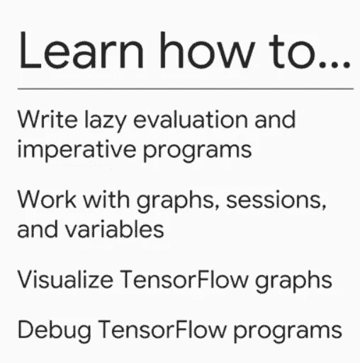
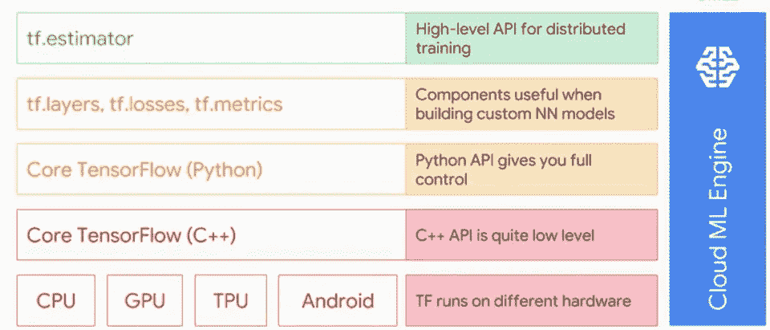
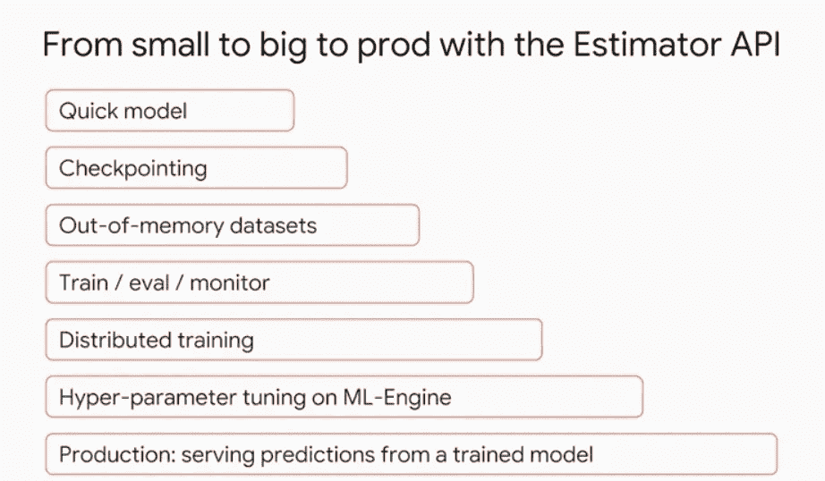
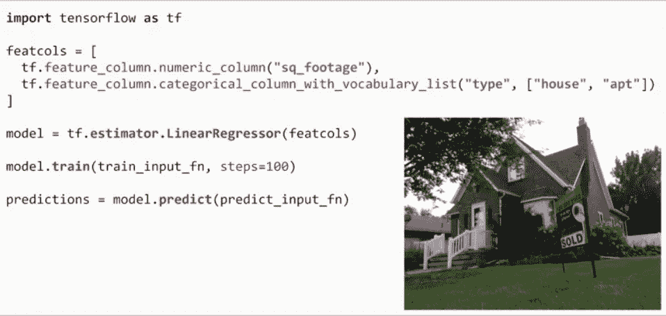

# GCP 特殊化张量流的无代码指南

> 原文：<https://towardsdatascience.com/a-codeless-guide-to-tensorflow-with-the-gcp-specialization-bca5215c606b?source=collection_archive---------4----------------------->

> 边做边学。

我写这篇文章是为了让你理解 tensorflow 的细微差别，它是无代码的，通过这篇文章，你会对 tensorflow 实际上是如何工作的以及它的不同组件有一个概念。到目前为止，Google 的专长是检查实际代码和编码，以便你学得更好。这里提到的课程是 coursera 上 Google cloud 的“Tensorflow 简介”,包括向您介绍 tensor flow——Google 最著名的开源项目之一，也是 ML 行业的事实标准。学习 tensorflow 不仅可以帮助您创建模型，还可以理解和欣赏基于它构建的其他框架(如 keras 和 pytorch)的细微差别。这是一门信息量很大的课程，在三个模块中有很多东西要学。

Tensorflow，用于数值计算而不仅仅是机器学习的开源平台。写出用有向无环图表示的复杂数学函数。你可以借助 python 这样的高级编程语言来编写。名字从何而来？一维数列称为数组，而二维数组称为矩阵。现在三维数组被称为张量。张量是数据的 n 维数组(通常是 3 维或更多维)。Tensorflow 使用图是因为语言和硬件的可移植性(cpu 或 gpu)。这些图形计算模型是跨平台的，你可以用一种语言编写它们，但是使用计算模型，然后用不同的语言执行它们以提高速度。关于这一点最有趣的事实是在强大的机器上训练高度密集的模型，如云，然后使用训练好的模型，并将其部署在较小的硬件上，如手机，树莓派等。

有一个 tensorflow api 层次结构。它从用 c++编写自定义代码和制作自己的模块开始，这是非常低级的，涉及很多技术细节。tensorflow 的 python 级别为您提供了添加、子代理、创建张量等功能。tf.layers 的下一个级别，tf.losses 和 tf.metrics 帮助您进行更高的抽象，这是为了构建定制的神经网络模型而创建的。tf.estimator 的最高级别是 tf.estimator。用这种方式很容易理解层次结构。最后，google 云引擎使用 cmle 来运行 Tensorflow，而不管您使用的是什么抽象级别。

Tensorflow API Hierarchy

Tensorflow 的 python 级抽象让您可以构建我们之前讨论过的 DAG。要理解的最基本的事情是，最终在构建任何 DAG 之后，它只是一个模型。你可以把它想象成一个函数，函数运行于自身之中吗？他们没有我们需要打电话给他们。因此，在我们的例子中，我们首先需要创建一个会话来运行我们的模型，之后我们就像输入函数值一样输入模型值。所以本质上有两个步骤，创建图(DAG ),然后在会话中运行图。这被称为懒惰评估。

图表是你试图建立的计算模型。这些都是在 python api 的帮助下构建的。节点代表数学计算，而边代表节点之间传递的数据。最终，由于图表就像一个模型，它需要在会话的帮助下运行。所有需要的值都由 feed-dict 提供。张量是向量的推广，它们是数据的 n 维数组。简单地说，一个向量可以被认为是一系列的数字。当向量是二维的(即有行和列)时，它们被称为矩阵，三维或三维以上的向量通常被称为张量。这些是非常强大的数字仪器。在各种函数的帮助下，张量可以被制作、切片或整形。最后，我们在 tensorflow 中有变量，大多数变量是可训练的，神经网络的权重向量是可训练的变量，创建变量的最重要部分是考虑如何初始化它们。最后，如果你不想要变量，而只想有一个形式参数，并在运行时给它们输入值，那该怎么办？这是通过占位符解决的，占位符只是定义的变量，需要借助 tf.run()中的 feed-dict 参数进行初始化。

由于懒惰的评估，调试是棘手的。在调试的第一部分，您需要查找堆栈跟踪，然后是实际的错误消息。这通常非常简单，但是您可能会被错误消息的大小所困扰。然后用一些数据调用这个方法，检查哪里可能出错，然后改正。一些常见的问题是形状和数据类型问题。使用 tf.print、tfdbg 或 tensorboard 调试完整的程序。

估算器用于以简单的方式创建生产就绪模型。它们内嵌了许多样板代码，因此您不必再编写相同的代码。估算器是高级 tensorflow api 的一部分。估计器允许快速建模、检查点、内存不足的数据集、分布式训练等等。tf.estimator 具有所有这些功能。有许多预制的估算器，因为有一个通用的基础 api，你可以很快地把它换成其他预制的估算器，从而实现快速原型制作。

What Estimator API helps with

您可以按如下方式运行估算器，要素列类似于 api 的输入，您需要将数据集中的所有列插入到这些要素列中，例如，在房价预测的情况下，您的列可能是平方英尺和房屋类型，还可能有其他列，如带家具或不带家具等，有许多不同的数据类型来适应这些要素/属性..之后，通过使用预先制作的估计量(在这种情况下是线性回归量)来创建模型。train_input_fn 用于将训练数据集输入到模型中。predict_input_fn 用于将测试数据输入到模型中。

Using the estimator api

检查点就像游戏中的保存点，它们是成功运行后保存在某个位置的重量和其他参数。如果你认为一个模型没有达到标准，那么训练就从这个检查点开始，它们被内置在估计器中。estimator api 还具有从 numpy 数组或 pandas 数据帧馈送数据的功能。estimator api 还可以在 tf.dataset 的帮助下帮助您处理大型数据集。关于数据集，您需要了解的一件事是，ML 模型通常是通过批处理来训练的，每个批处理都有一个有限的大小，这表明无论整个数据集大小有多大，它最终都会被分解成多个批处理。这是由张量流促成的。随着并行而不是单机计算思想的进步，我们正在走向并行。数据并行性是当今训练 ML 模型的核心，Tensorflow 通过 train_and_evaluate 函数使这一点变得更容易，您需要使用该函数来提及训练和评估规范。为了评估你的训练，通常使用 tensorboard。

Cloud ML 引擎与您之前看到的整个 tensorflow 堆栈是正交的，它可以与堆栈中的任何抽象层进行交互并使用它。为什么是 CMLE？用于在多台机器上分配培训。向外扩展而不是向上扩展是关键。ML 算法计划收集比现有数据多 10 倍的数据，并将其整合到他们的系统中，这就是为什么他们比简单的数据系统好得多。另一件需要考虑的事情是，可以从分析原始数据中发现许多见解，并将这些见解作为特征进行整合会有很大帮助。

The Processing Cycle

你如何使用 CMLE？您需要使用 Tensorflow 创建您的计算图，然后打包您的 trainer 应用程序，最后配置并启动 CMLE 作业。在使用 CMLE 之前，您需要保留一个包结构，您可以使用 gcloud 命令来检查正确的包结构。最后，您可以通过获取作业的当前状态来监控作业，这可以通过 gcp web 控制台来完成。

CMLE 模块为本课程画上了一个句号，即 GCP 特殊化的 Tensorflow 简介。为了熟悉本文中谈到的 tensorflow 的各种组件，您可以查看可在此处找到的实验材料。完成本实验的最佳方式是通过查看 tensorflow 文档，同时尝试理解这些函数的细微差别。