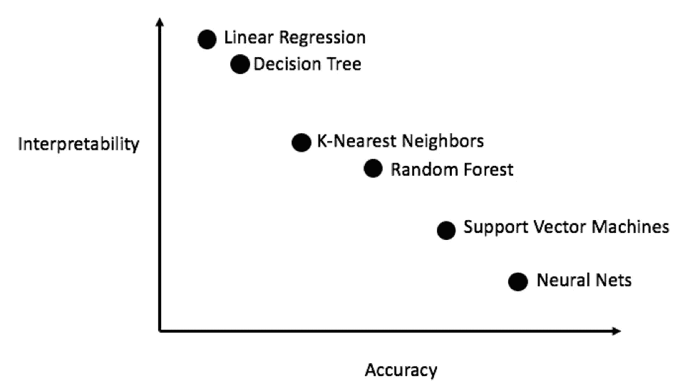
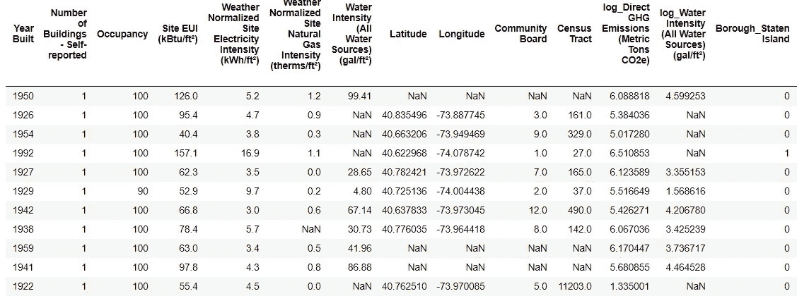
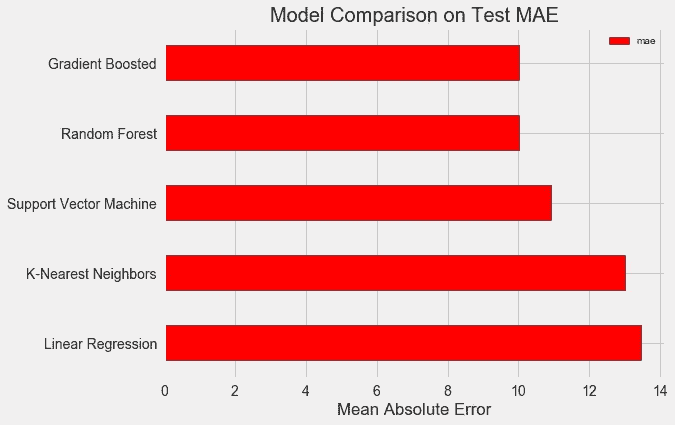
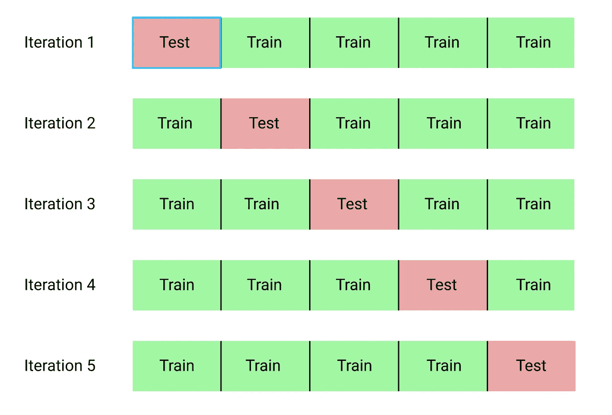
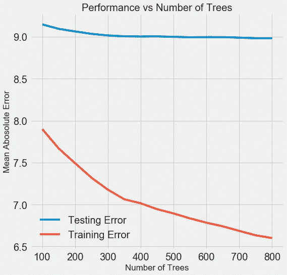
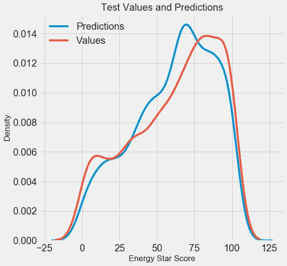

# Python 中完整的机器学习演练:第二部分

> 原文：<https://towardsdatascience.com/a-complete-machine-learning-project-walk-through-in-python-part-two-300f1f8147e2?source=collection_archive---------3----------------------->


## 模型选择、超参数调整和评估

组装解决问题所需的所有机器学习部件可能是一项艰巨的任务。在这一系列文章中，我们将使用真实世界的数据集来实现机器学习工作流，以了解各种技术是如何结合在一起的。

[在第一篇文章](/a-complete-machine-learning-walk-through-in-python-part-one-c62152f39420)中，我们清理并结构化了数据，进行了探索性的数据分析，开发了一组在我们的模型中使用的特性，并建立了一个我们可以用来衡量性能的基线。在本文中，我们将了解如何在 Python 中实现和比较几个机器学习模型，执行超参数调整以优化最佳模型，并在测试集上评估最终模型。

这个项目的完整代码是 GitHub 上的[，与本文对应的](https://github.com/WillKoehrsen/machine-learning-project-walkthrough)[第二本笔记本在这里](https://github.com/WillKoehrsen/machine-learning-project-walkthrough/blob/master/Machine%20Learning%20Project%20Part%202.ipynb)。您可以随意使用、共享和修改代码！

# 模型评估和选择

提醒一下，我们正在进行一项监督回归任务:[使用纽约市建筑能源数据](http://www.nyc.gov/html/gbee/html/plan/ll84_scores.shtml)，我们希望开发一个模型，可以预测建筑的[能源之星得分](https://www.energystar.gov/buildings/facility-owners-and-managers/existing-buildings/use-portfolio-manager/interpret-your-results/what)。我们的重点是预测的准确性和模型的可解释性。

有[吨的机器学习模型](http://scikit-learn.org/stable/supervised_learning.html)可供选择，决定从哪里开始可能是令人生畏的。虽然[有一些图表](https://docs.microsoft.com/en-us/azure/machine-learning/studio/algorithm-cheat-sheet)试图告诉你使用哪种算法，但我更喜欢尝试几种，看看哪种效果最好！机器学习仍然是一个主要由[经验(实验)而不是理论结果](https://www.quora.com/How-much-of-deep-learning-research-is-empirical-versus-theoretical)驱动的领域，并且几乎不可能[提前知道哪个模型会做得最好](http://www.statsblogs.com/2014/01/25/machine-learning-lesson-of-the-day-the-no-free-lunch-theorem/)。

一般来说，从简单、可解释的模型(如线性回归)开始是一个好主意，如果性能不够好，就转向更复杂但通常更精确的方法。下图显示了准确性与可解释性权衡的(极不科学的)版本:



Interpretability vs. Accuracy ([Source](http://blog.fastforwardlabs.com/2017/09/01/LIME-for-couples.html))

我们将评估涵盖复杂性范围的五种不同模型:

*   **线性回归**
*   **K-最近邻回归**
*   **随机森林回归**
*   **梯度推进回归**
*   **支持向量机回归**

在这篇文章中，我们将着重于实现这些方法，而不是它们背后的理论。对于任何对学习背景感兴趣的人，我强烈推荐[统计学习入门](http://www-bcf.usc.edu/~gareth/ISL/)(网上免费提供)或[使用 Scikit-Learn 和 TensorFlow](http://shop.oreilly.com/product/0636920052289.do) 进行机器学习。这两本教科书都很好地解释了理论，并分别展示了如何有效地使用 R 和 Python 中的方法。

## 输入缺失值

虽然我们在清理数据时删除了丢失值超过 50%的列，但仍然有相当多的观察值丢失。机器学习模型无法处理任何缺失的值，所以我们必须填充它们，这是一个被称为插补的[过程。](https://en.wikipedia.org/wiki/Imputation_(statistics))

首先，我们将读入所有数据，并提醒自己它看起来像什么:

```
import pandas as pd
import numpy as np# Read in data into dataframes 
train_features = pd.read_csv('data/training_features.csv')
test_features = pd.read_csv('data/testing_features.csv')
train_labels = pd.read_csv('data/training_labels.csv')
test_labels = pd.read_csv('data/testing_labels.csv')**Training Feature Size:  (6622, 64)
Testing Feature Size:   (2839, 64)
Training Labels Size:   (6622, 1)
Testing Labels Size:    (2839, 1)**
```



每个值`NaN`代表一个缺失的观察值。虽然有多种[方法来填充缺失数据](https://www.omicsonline.org/open-access/a-comparison-of-six-methods-for-missing-data-imputation-2155-6180-1000224.php?aid=54590)，但我们将使用一种相对简单的方法，即中位数插补。这会用列的中值替换列中所有缺失的值。

在下面的代码中，我们创建了一个策略设置为 median 的 [Scikit-Learn](http://scikit-learn.org/stable/) `Imputer`对象。然后我们在训练数据上训练这个对象(使用`imputer.fit`，并用它来填充训练和测试数据中缺失的值(使用`imputer.transform`)。这意味着用来自*训练数据*的相应中值来填充*测试数据*中的缺失值。

(我们必须以这种方式进行插补，而不是对所有数据进行训练，以避免[测试数据泄漏](https://www.kaggle.com/dansbecker/data-leakage)的问题，即来自测试数据集的信息溢出到训练数据中。)

```
# Create an imputer object with a median filling strategy
imputer = Imputer(strategy='median')# Train on the training features
imputer.fit(train_features)# Transform both training data and testing data
X = imputer.transform(train_features)
X_test = imputer.transform(test_features)**Missing values in training features:  0
Missing values in testing features:   0**
```

所有的特征现在都有真实的有限值，没有遗漏的例子。

## 特征缩放

[缩放](https://en.wikipedia.org/wiki/Feature_scaling)是指改变特征范围的一般过程。[这是必要的](https://stats.stackexchange.com/questions/121886/when-should-i-apply-feature-scaling-for-my-data)，因为特征以不同的单位测量，因此涵盖不同的范围。诸如[支持向量机](https://stats.stackexchange.com/questions/305906/feature-scaling-in-svm-does-it-depend-on-the-kernel)和 K-最近邻之类的方法考虑了观测值之间的距离度量，这些方法受到特征范围的显著影响，并且缩放允许它们学习。虽然像[线性回归和随机森林](https://stats.stackexchange.com/questions/121886/when-should-i-apply-feature-scaling-for-my-data)这样的方法实际上并不需要特性缩放，但是当我们比较多个算法时，采取这一步骤仍然是最佳实践。

我们将通过将每个特征放在 0 到 1 的范围内来缩放特征。这是通过取特性的每个值，减去特性的最小值，然后除以最大值减去最小值(范围)来完成的。这种特定版本的缩放通常被称为[标准化，另一个主要版本被称为标准化](https://machinelearningmastery.com/normalize-standardize-machine-learning-data-weka/)。

虽然这个过程很容易手工实现，但是我们可以使用 Scikit-Learn 中的`MinMaxScaler`对象来实现。这种方法的代码与插补的代码相同，只是用了一个定标器而不是插补器！同样，我们确保仅使用训练数据进行训练，然后转换所有数据。

```
# Create the scaler object with a range of 0-1
scaler = MinMaxScaler(feature_range=(0, 1))# Fit on the training data
scaler.fit(X)# Transform both the training and testing data
X = scaler.transform(X)
X_test = scaler.transform(X_test)
```

现在，每个要素的最小值为 0，最大值为 1。缺失值插补和特征缩放是几乎任何机器学习管道中都需要的两个步骤，因此了解它们是如何工作的是一个好主意！

## 在 Scikit-Learn 中实现机器学习模型

在我们清理和格式化数据的所有工作之后，实际上用模型创建、训练和预测是相对简单的。我们将使用 Python 中的 [Scikit-Learn 库](http://scikit-learn.org/stable/documentation.html)，它有很好的文档和一致的模型构建语法。一旦您知道如何在 Scikit-Learn 中制作一个模型，您就可以快速实现各种算法。

我们可以用梯度推进回归器来说明模型创建、训练(使用`.fit`)和测试(使用`.predict`)的一个例子:

```
**Gradient Boosted Performance on the test set: MAE = 10.0132**
```

模型创建、训练和测试都是一行！为了构建其他模型，我们使用相同的语法，只是改变了算法的名称。结果如下所示:



为了客观地看待这些数字，使用目标的中值计算的原始基线是 24.5。显然，机器学习适用于我们的问题，因为在基线上有显著的改进！

[梯度提升回归量](https://machinelearningmastery.com/gentle-introduction-gradient-boosting-algorithm-machine-learning/) (MAE = 10.013)略胜随机森林(10.014 MAE)。这些结果并不完全公平，因为我们主要使用超参数的默认值。[特别是在支持向量机](http://pyml.sourceforge.net/doc/howto.pdf)等模型中，性能高度依赖于这些设置。尽管如此，我们将从这些结果中选择梯度推进回归变量进行模型优化。

# 用于模型优化的超参数调整

在机器学习中，在我们选择了一个模型之后，我们可以通过调整模型超参数来优化它。

首先，什么是[超参数，它们与参数](https://machinelearningmastery.com/difference-between-a-parameter-and-a-hyperparameter/)有何不同？

*   模型**超参数**最好被认为是数据科学家在训练前设置的机器学习算法的设置。例如随机森林中的树木数量或 K-最近邻算法中使用的邻居数量。
*   模型**参数**是模型在训练期间学习的内容，例如线性回归中的权重。

控制超参数通过改变模型中[欠拟合和过拟合](/overfitting-vs-underfitting-a-conceptual-explanation-d94ee20ca7f9)之间的平衡来影响模型性能。欠拟合是指我们的模型不够复杂(它没有足够的自由度)来学习从特征到目标的映射。一个欠拟合模型有[高偏差](https://en.wikipedia.org/wiki/Bias%E2%80%93variance_tradeoff)，我们可以通过使我们的模型更复杂来纠正它。

过度拟合是指我们的模型基本上记住了训练数据。过度拟合模型具有[高方差](https://en.wikipedia.org/wiki/Bias%E2%80%93variance_tradeoff)，我们可以通过正则化来限制模型的复杂度，从而对其进行校正。欠拟合和过拟合模型都不能很好地概括测试数据。

选择正确的超参数的问题是，对于每个机器学习问题，最佳集合都是不同的！因此，找到最佳设置的唯一方法是在每个新数据集上尝试多种设置。幸运的是，Scikit-Learn 有许多方法可以让我们有效地评估超参数。此外，像 [TPOT 上位实验室](https://epistasislab.github.io/tpot/)这样的项目正在尝试使用[遗传编程](https://en.wikipedia.org/wiki/Genetic_programming)这样的方法来优化超参数搜索。在这个项目中，我们将坚持用 Scikit-Learn 来做这件事，但是请继续关注 auto-ML 场景的更多工作！

## 交叉验证随机搜索

我们将实施的特定超参数调整方法称为交叉验证随机搜索:

*   [**随机搜索**](https://en.wikipedia.org/wiki/Hyperparameter_optimization#Random_search) 指的是我们将用来选择超参数的技术。我们定义一个网格，然后随机抽样不同的组合，而不是网格搜索，我们穷尽地尝试每一个组合。(令人惊讶的是，[随机搜索的表现几乎和网格搜索一样好](http://www.jmlr.org/papers/volume13/bergstra12a/bergstra12a.pdf)，运行时间大幅减少。)
*   [**交叉验证**](https://www.openml.org/a/estimation-procedures/1) 是我们用来评估超参数选定组合的技术。我们使用 K-Fold 交叉验证，而不是将训练集分成单独的训练集和验证集，这减少了我们可以使用的训练数据量。这包括将训练数据分成 K 个折叠，然后经历一个迭代过程，其中我们首先在 K-1 个折叠上训练，然后在第 K 个折叠上评估性能。我们重复这个过程 K 次，在 K 重交叉验证结束时，我们取 K 次迭代中每一次的平均误差作为最终的性能测量。

K = 5 的 K 倍交叉验证的思想如下所示:



K-Fold Cross Validation with K = 5 ([Source](https://my.oschina.net/Bettyty/blog/751627))

使用交叉验证执行随机搜索的整个过程是:

1.  建立一个超参数网格来评估
2.  随机抽样超参数组合
3.  使用所选组合创建模型
4.  使用 K-fold 交叉验证评估模型
5.  确定哪些超参数效果最好

当然，我们实际上并不手动完成这项工作，而是让 Scikit-Learn 的`RandomizedSearchCV`来处理所有的工作！

## 轻微分流:[梯度升压法](https://en.wikipedia.org/wiki/Gradient_boosting)

由于我们将使用梯度推进回归模型，我至少应该给一点背景知识！该模型是一种集成方法，这意味着它是由许多弱学习者构建而成的，在这种情况下是个体决策树。一种 [bagging 算法，如随机森林](https://machinelearningmastery.com/bagging-and-random-forest-ensemble-algorithms-for-machine-learning/)并行训练弱学习者，并让他们投票做出预测，而一种[增强方法](https://machinelearningmastery.com/gentle-introduction-gradient-boosting-algorithm-machine-learning/)如梯度增强，依次训练学习者，每个学习者“专注于”前一个学习者所犯的错误。

助推方法近年来变得流行，并经常赢得机器学习比赛。[梯度提升方法](http://blog.kaggle.com/2017/01/23/a-kaggle-master-explains-gradient-boosting/)是一种特殊的实现方式，它使用梯度下降，通过在先前学习者的残差上顺序训练学习者来最小化成本函数。梯度增强的 Scikit-Learn 实现通常被认为不如其他库(如 [XGBoost](http://xgboost.readthedocs.io/en/latest/model.html) )有效，但它对于我们的小数据集来说足够好，并且相当准确。

## 返回超参数调谐

在梯度增强回归器中有许多超参数需要调整，您可以查看 [Scikit-Learn 文档](http://scikit-learn.org/stable/modules/generated/sklearn.ensemble.GradientBoostingRegressor.html#sklearn.ensemble.GradientBoostingRegressor)了解详情。我们将优化以下超参数:

*   `loss`:最小化损失函数
*   `n_estimators`:要使用的弱学习器(决策树)的数量
*   `max_depth`:每个决策树的最大深度
*   `min_samples_leaf`:决策树的一个叶节点所需的最小样本数
*   `min_samples_split`:拆分决策树节点所需的最小样本数
*   `max_features`:用于分割节点的最大特征数

我不确定是否有人真正理解所有这些是如何相互作用的，找到最佳组合的唯一方法是尝试它们！

在下面的代码中，我们构建了一个超参数网格，创建了一个`RandomizedSearchCV`对象，并对 25 个不同的超参数组合使用 4 重交叉验证来执行超参数搜索:

执行搜索后，我们可以检查`RandomizedSearchCV`对象以找到最佳模型:

```
# Find the best combination of settings
random_cv.best_estimator_**GradientBoostingRegressor(loss='lad', max_depth=5,
                          max_features=None,
                          min_samples_leaf=6,
                          min_samples_split=6,
                          n_estimators=500)**
```

然后，我们可以使用这些结果，通过为网格选择接近这些最佳值的参数来执行网格搜索。然而，进一步的调整不太可能显著改进我们的模型。一般来说，适当的特征工程对模型性能的影响要比最广泛的超参数调整大得多。这是应用于机器学习的[收益递减定律](http://www.picnet.com.au/blogs/guido/2018/04/13/diminishing-returns-machine-learning-projects/):特征工程让你走了大部分路，而超参数调整通常只提供很小的好处。

我们可以尝试的一个实验是改变估计器(决策树)的数量，同时保持其余的超参数不变。这直接让我们观察这个特定设置的效果。参见[笔记本了解](https://github.com/WillKoehrsen/machine-learning-project-walkthrough/blob/master/Machine%20Learning%20Project%20Part%202.ipynb)的实现，但以下是结果:



随着模型使用的树的数量增加，训练和测试误差都减小。然而，训练误差比测试误差下降得更快，我们可以看到我们的模型过度拟合:它在训练数据上表现非常好，但在测试集上不能达到同样的性能。

我们总是预计测试集的性能至少会有所下降(毕竟，模型可以看到训练集的真实答案)，但是显著的差距[表明过度拟合](https://www.kdnuggets.com/2015/01/clever-methods-overfitting-avoid.html)。我们可以通过获取更多的训练数据来解决过度拟合问题，或者通过 hyerparameters 来降低我们模型的[复杂性。在这种情况下，我们将把超参数留在原处，但我鼓励任何人尝试减少过度拟合。](https://www.analyticsvidhya.com/blog/2016/02/complete-guide-parameter-tuning-gradient-boosting-gbm-python/)

对于最终的模型，我们将使用 800 个估计量，因为这在交叉验证中产生了最低的误差。现在，是时候测试这个模型了！

# 对测试集进行评估

作为负责任的机器学习工程师，我们确保不让我们的模型在任何训练点看到测试集。因此，我们可以使用[测试集性能作为我们的模型在现实世界中部署时的性能指标](https://www.coursera.org/learn/deep-neural-network/lecture/cxG1s/train-dev-test-sets)。

对测试集进行预测并计算性能相对简单。这里，我们将默认梯度推进回归器的性能与调整后的模型进行比较:

```
# Make predictions on the test set using default and final model
default_pred = default_model.predict(X_test)
final_pred = final_model.predict(X_test)**Default model performance on the test set: MAE = 10.0118.
Final model performance on the test set:   MAE = 9.0446.**
```

超参数调整将模型的精度提高了约 10%。根据不同的用例，10%可能是一个巨大的改进，但这需要大量的时间投入！

我们还可以使用 Jupyter 笔记本中的`%timeit` magic 命令来计时训练这两个模型需要多长时间。首先是默认模型:

```
%%timeit -n 1 -r 5
default_model.fit(X, y)**1.09 s ± 153 ms per loop (mean ± std. dev. of 5 runs, 1 loop each)**
```

1 秒训练似乎很合理。最终调优的模型没有这么快:

```
%%timeit -n 1 -r 5
final_model.fit(X, y)**12.1 s ± 1.33 s per loop (mean ± std. dev. of 5 runs, 1 loop each)**
```

这展示了机器学习的一个基本方面:它总是一个权衡取舍的游戏。我们必须不断地平衡准确性和可解释性，[偏差和方差](https://machinelearningmastery.com/gentle-introduction-to-the-bias-variance-trade-off-in-machine-learning/)，准确性和运行时间，等等。正确的混合最终取决于问题。在我们的例子中，相对而言，运行时间增加 12 倍是很大的，但从绝对意义上来说，并不显著。

一旦我们有了最终的预测，我们就可以研究它们，看看它们是否表现出任何明显的偏差。左侧是预测值和实际值的密度图，右侧是残差直方图:



Density Plot of Predicted and Actual Values (left) and Histogram of Residuals (right)

模型预测似乎遵循实际值的分布，尽管密度峰值更接近于训练集的中值(66)，而不是真正的密度峰值(接近 100)。残差接近正态分布，尽管我们看到一些大的负值，其中模型预测远低于真实值。在下一篇文章中，我们将更深入地解读这个模型的结果。

# 结论

在本文中，我们介绍了机器学习工作流程中的几个步骤:

*   缺失值的插补和特征的缩放
*   几种机器学习模型的评估和比较
*   使用随机网格搜索和交叉验证的超参数调谐
*   评估测试集上的最佳模型

这项工作的结果表明，机器学习适用于使用可用数据预测建筑物能源之星得分的任务。使用梯度增强回归器，我们能够预测测试集上的分数在真实值的 9.1 分之内。此外，我们看到超参数调优可以提高模型的性能，但在时间投入方面要付出很大的代价。这是我们在开发机器学习解决方案时必须考虑的众多权衡之一。

在第三篇文章中([此处](/a-complete-machine-learning-walk-through-in-python-part-three-388834e8804b))，我们将深入观察我们创造的黑箱，并试图理解我们的模型是如何做出预测的。我们还将确定影响能源之星评分的最大因素。虽然我们知道我们的模型是准确的，但我们想知道**为什么**会做出这样的预测，这告诉了我们什么问题！

一如既往，我欢迎反馈和建设性的批评，可以通过 Twitter [@koehrsen_will](https://twitter.com/koehrsen_will) 联系。