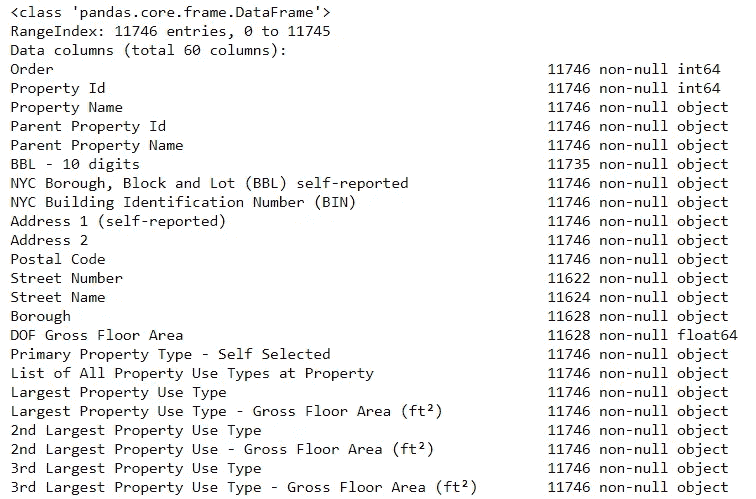
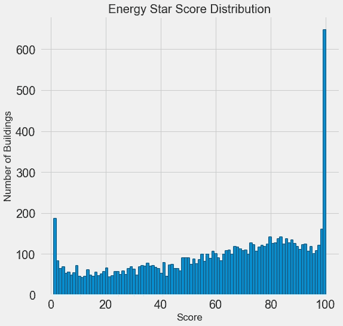
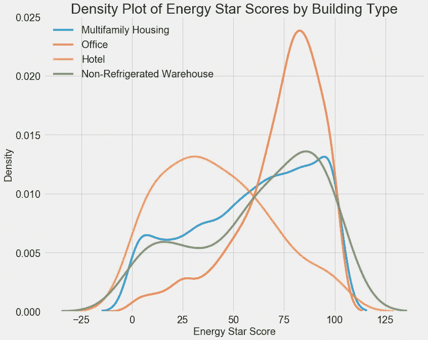
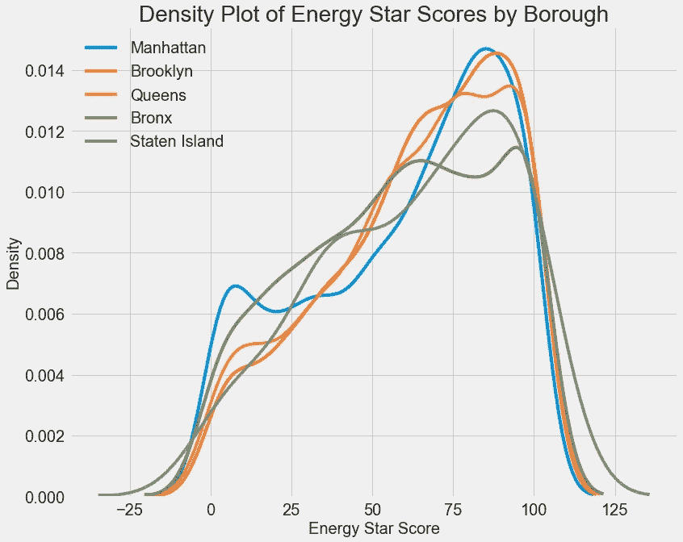
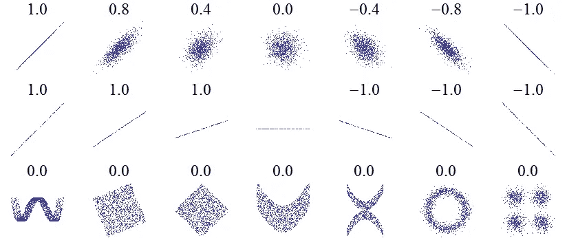
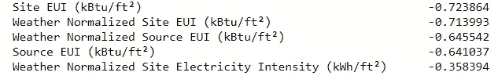
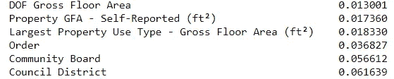
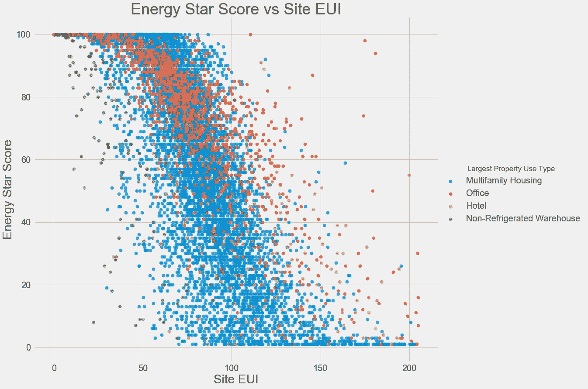
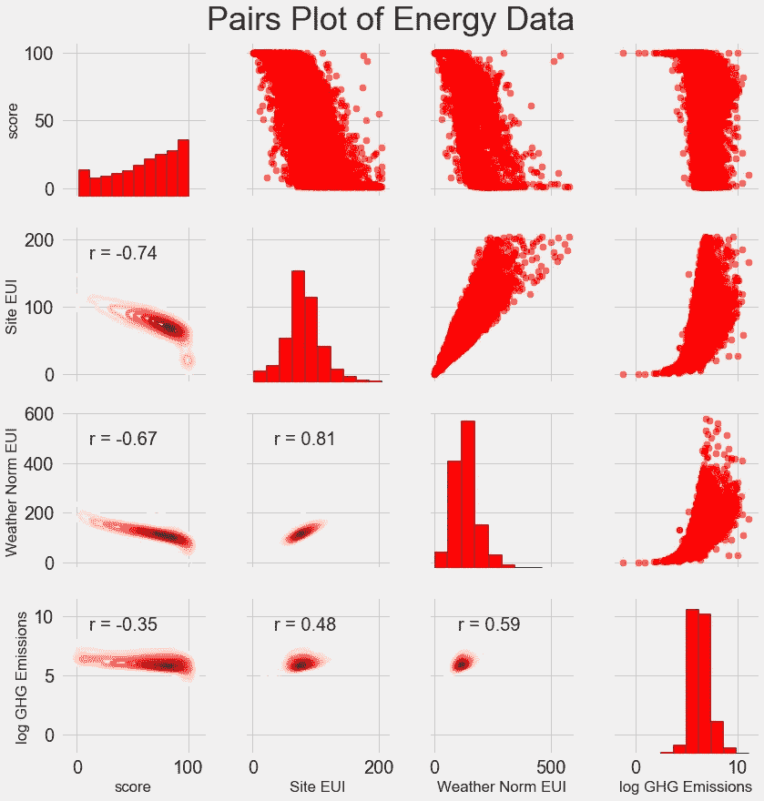
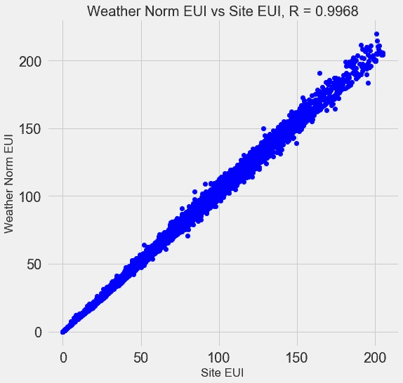

# Python 中完整的机器学习项目演练:第一部分

> 原文：<https://towardsdatascience.com/a-complete-machine-learning-walk-through-in-python-part-one-c62152f39420?source=collection_archive---------0----------------------->


Photo by [Ross Sneddon](https://unsplash.com/@rosssneddon?utm_source=medium&utm_medium=referral) on [Unsplash](https://unsplash.com?utm_source=medium&utm_medium=referral)

## 把机器学习的碎片放在一起

通读一本数据科学书籍或参加一门课程，感觉就像你掌握了各个部分，但不太知道如何将它们组合在一起。采取下一步措施并解决一个完整的机器学习问题可能会令人生畏，但保留并完成第一个项目将让你有信心解决任何数据科学问题。这一系列文章将通过一个真实世界的数据集来介绍一个完整的机器学习解决方案，让您了解所有这些部分是如何组合在一起的。

我们将逐步遵循一般的机器学习工作流程:

1.  数据清理和格式化
2.  探索性数据分析
3.  特征工程和选择
4.  在性能指标上比较几种机器学习模型
5.  对最佳模型执行超参数调整
6.  评估测试集上的最佳模型
7.  解释模型结果
8.  得出结论并记录工作

在这个过程中，我们将看到每个步骤如何流入下一个步骤，以及如何用 Python 具体实现每个部分。完整的[项目](https://github.com/WillKoehrsen/machine-learning-project-walkthrough)可以在 GitHub 上找到，这里有[的第一个笔记本。](https://github.com/WillKoehrsen/machine-learning-project-walkthrough/blob/master/Machine%20Learning%20Project%20Part%201.ipynb)第一篇文章将涵盖第 1-3 步，其余部分将在后续文章中讨论。

(注意，这个问题最初是在一家初创公司的工作筛选中作为“任务”交给我的。完成工作后，我得到了这份工作，但后来公司的首席技术官辞职了，他们无法再招聘新员工。我猜这就是创业现场的情况吧！)

# 问题定义

在我们开始编码之前，第一步是理解我们试图解决的问题和可用的数据。在这个项目中，我们将使用来自纽约市的[公开建筑能源数据](http://www.nyc.gov/html/gbee/html/plan/ll84_scores.shtml)。

**目标是使用能源数据建立一个模型，该模型可以预测建筑物的能源之星得分，并解释结果以找到影响得分的因素。**

这些数据包括能源之星得分，这使得这成为一个受监督的回归机器学习任务:

*   监督:我们可以访问特征和目标，我们的目标是训练一个模型，它可以学习两者之间的映射
*   **回归:**能源之星得分是一个连续变量

我们希望开发一个既**准确**——它可以预测接近真实值的能源之星分数——又**可解释** —我们可以理解模型预测的模型。一旦我们知道了目标，我们就可以在挖掘数据和构建模型时用它来指导我们的决策。

# 数据清理

与大多数数据科学课程让你相信的相反，并不是每个数据集都是一组完美的观察值，没有缺失值或异常(看看你的 [mtcars](http://stat.ethz.ch/R-manual/R-devel/library/datasets/html/mtcars.html) 和 [iris](https://archive.ics.uci.edu/ml/datasets/iris) 数据集)。现实世界的数据是杂乱的，这意味着我们需要在开始分析之前将数据清理并转换成可接受的格式。数据清理是大多数实际数据科学问题中不光彩但必要的一部分。

首先，我们可以像熊猫`DataFrame`一样加载数据，然后看一看:

```
import pandas as pd
import numpy as np# Read in data into a dataframe 
data = pd.read_csv('data/Energy_and_Water_Data_Disclosure_for_Local_Law_84_2017__Data_for_Calendar_Year_2016_.csv')# Display top of dataframe
data.head()
```


What Actual Data Looks Like!

这是包含 60 列的完整数据的子集。我们已经可以看到一些问题:首先，我们知道我们想要预测`ENERGY STAR Score`,但是我们不知道任何列是什么意思。虽然这不一定是一个问题——我们经常可以在没有任何变量知识的情况下建立准确的模型——但我们希望关注可解释性，并且至少理解一些列可能是重要的。

当我最初从初创公司获得任务时，我不想问所有列名的含义，所以我查看了文件的名称，


并决定搜索“土法 84”。这让我看到了这个页面，它解释说这是纽约市的一项法律，要求所有一定规模的建筑报告它们的能源使用情况。更多的搜索把我带到了[所有列的定义。也许查看文件名是一个显而易见的开始，但对我来说，这是一个提醒，要慢慢来，这样你就不会错过任何重要的东西！](http://www.nyc.gov/html/gbee/downloads/misc/nyc_benchmarking_disclosure_data_definitions_2017.pdf)

我们不需要研究所有的栏目，但我们至少应该了解能源之星评分，它被描述为:

基于报告年份自我报告的能源使用情况的 1 到 100%的排名。[能源之星评分](https://www.energystar.gov/buildings/facility-owners-and-managers/existing-buildings/use-portfolio-manager/interpret-your-results/what)是用于比较建筑物能源效率的相对指标。

这解决了第一个问题，但是第二个问题是丢失的值被编码为“不可用”。这是 Python 中的一个字符串，这意味着即使包含数字的列也将被存储为`object`数据类型，因为 Pandas 将包含任何字符串的列转换为包含所有字符串的列。我们可以使用`dataframe.info()`方法查看列的数据类型:

```
# See the column data types and non-missing values
data.info()
```



果然，一些明显包含数字的列(如 ft)被存储为对象。我们不能对字符串进行数值分析，所以这些必须被转换成数字(特别是`float`)数据类型！

下面是一小段 Python 代码，它将所有“不可用”的条目替换为非数字(`np.nan`)，这可以解释为数字，然后将相关列转换为`float`数据类型:

一旦正确的列是数字，我们就可以开始研究数据了。

## 缺失数据和异常值

除了不正确的数据类型之外，处理真实世界数据时的另一个常见问题是缺少值。这些可能由于许多原因而出现，并且必须在我们训练机器学习模型之前填充或移除。首先，让我们大致了解一下每一列中有多少缺失值(代码见[笔记本)。](https://github.com/WillKoehrsen/machine-learning-project-walkthrough/blob/master/Machine%20Learning%20Project%20Part%201.ipynb)


(为了创建这个表，我使用了这个[堆栈溢出论坛](https://stackoverflow.com/questions/26266362/how-to-count-the-nan-values-in-a-column-in-pandas-dataframe/39734251#39734251)中的一个函数)。

虽然我们总是希望小心地删除信息，但是如果一个列有很高百分比的缺失值，那么它可能对我们的模型没有用。移除列的阈值应该取决于问题([这里有一个讨论](https://discuss.analyticsvidhya.com/t/what-should-be-the-allowed-percentage-of-missing-values/2456))，对于这个项目，我们将移除任何缺失值超过 50%的列。

在这一点上，我们可能还想删除离群值。这些可能是由于数据输入中的打字错误、单位错误，或者它们可能是合法但极端的值。对于这个项目，我们将根据极端异常值的[定义移除异常值:](https://www.itl.nist.gov/div898/handbook/prc/section1/prc16.htm)

*   低于第一个四分位数 3÷四分位数间距
*   高于第三个四分位数+3÷四分位数间距

(有关删除列和异常的代码，请参见笔记本)。在数据清理和异常移除过程结束时，我们留下了超过 11，000 个建筑物和 49 个特征。

# 探索性数据分析

既然繁琐但必要的数据清理步骤已经完成，我们可以继续探索我们的数据了！[探索性数据分析](https://en.wikipedia.org/wiki/Exploratory_data_analysis) (EDA)是一个开放式的过程，我们通过计算统计数据并制作图表来发现数据中的趋势、异常、模式或关系。

简而言之，EDA 的目标是学习我们的数据能告诉我们什么。它通常从高层次的概述开始，然后随着我们发现数据中感兴趣的部分，缩小到特定的领域。这些发现本身可能是有趣的，或者它们可以用于通知我们的建模选择，例如通过帮助我们决定使用哪些功能。

## 单变量图

我们的目标是预测能源之星得分(在我们的数据中被重命名为`score`),因此一个合理的起点是检查这个变量的分布。直方图是可视化单个变量分布的一种简单而有效的方法，使用`matplotlib`很容易制作。

```
import matplotlib.pyplot as plt# Histogram of the Energy Star Score
plt.style.use('fivethirtyeight')
plt.hist(data['score'].dropna(), bins = 100, edgecolor = 'k');
plt.xlabel('Score'); plt.ylabel('Number of Buildings'); 
plt.title('Energy Star Score Distribution');
```



这个看起来挺可疑的！能源之星得分是一个百分位数排名，这意味着我们希望看到一个统一的分布，每个分数分配给相同数量的建筑。然而，大量的建筑要么得分最高(100 分)，要么得分最低(1 分)(能源之星得分越高越好)。

如果我们回到分数的定义，我们会看到它是基于“自我报告的能源使用情况”，这可能解释了非常高的分数。要求建筑业主报告他们自己的能源使用情况就像要求学生报告他们自己的考试成绩一样！因此，这可能不是衡量建筑能效的最客观的标准。

如果我们有无限的时间，我们可能想要调查为什么这么多的建筑有非常高和非常低的分数，我们可以通过选择这些建筑并查看它们的共同点。然而，我们的目标只是预测分数，而不是设计一个更好的建筑评分方法！我们可以在报告中注明分数的分布是可疑的，但我们主要关注的是预测分数。

## 寻找关系

EDA 的主要部分是搜索特征和目标之间的关系。与目标相关的变量对模型是有用的，因为它们可用于预测目标。检查分类变量(仅取有限的一组值)对目标的影响的一种方法是通过使用`seaborn`库的密度图。

一个[密度图可以被认为是一个平滑的直方图](/histograms-and-density-plots-in-python-f6bda88f5ac0)，因为它显示了单个变量的分布。我们可以按类别给密度图着色，看看分类变量如何改变分布。以下代码根据建筑类型(仅限于超过 100 个数据点的建筑类型)绘制了能源之星得分的密度图:



我们可以看到，建筑类型对能源之星得分有显著影响。办公楼往往得分较高，而酒店得分较低。这告诉我们，我们应该在建模中包括建筑类型，因为它确实对目标有影响。作为分类变量，我们必须对建筑类型进行一次性编码。

类似的图表可用于显示各区的能源之星得分:



行政区对得分的影响似乎没有建筑类型大。尽管如此，我们可能希望将它包含在我们的模型中，因为各行政区之间存在细微的差异。

为了量化变量之间的关系，我们可以使用[皮尔逊相关系数](http://www.statisticshowto.com/probability-and-statistics/correlation-coefficient-formula/)。这是对两个变量之间线性关系的强度和方向的度量。得分+1 是完美的线性正关系，得分-1 是完美的负线性关系。相关系数的几个值如下所示:



Values of the Pearson Correlation Coefficient ([Source](https://en.wikipedia.org/wiki/Pearson_correlation_coefficient))

虽然相关系数不能捕捉非线性关系，但它是开始弄清楚变量如何相关的好方法。在 Pandas 中，我们可以很容易地计算数据帧中任何列之间的相关性:

```
# Find all correlations with the score and sort 
correlations_data = data.corr()['score'].sort_values()
```

与目标的最负(左)和正(右)相关性:



在特征和目标之间有几个很强的负相关，最负的是不同类别的 EUI(这些度量在它们的计算方式上略有不同)。[EUI——能源使用强度](https://www.energystar.gov/buildings/facility-owners-and-managers/existing-buildings/use-portfolio-manager/understand-metrics/what-energy) —是一栋建筑使用的能源量除以建筑的平方英尺。它旨在衡量建筑的效率，分数越低越好。直观地说，这些相关性是有意义的:随着 EUI 的增加，能源之星得分往往会降低。

## 双变量图

为了可视化两个连续变量之间的关系，我们使用散点图。我们可以在点的颜色中包含附加信息，例如分类变量。例如，下图显示了能源之星得分与按建筑类型着色的站点 EUI 的关系:



这个图让我们想象相关系数为-0.7 是什么样子。随着现场 EUI 降低，能源之星得分增加，这种关系在各种建筑类型中保持稳定。

我们将制作的最后一个探索图被称为 [Pairs 图。这是一个伟大的探索工具](/visualizing-data-with-pair-plots-in-python-f228cf529166)，因为它让我们看到多对变量之间的关系以及单个变量的分布。这里我们使用 seaborn 可视化库和`PairGrid`函数创建一个 Pairs 图，上面的三角形是散点图，对角线是直方图，下面的三角形是 2D 核密度图和相关系数。



为了看到变量之间的相互作用，我们寻找行和列的交叉点。例如，要查看`Weather Norm EUI`与`score`的相关性，我们查看`Weather Norm EUI`行和`score`列，看到相关系数为-0.67。除了看起来很酷之外，这样的图可以帮助我们决定在建模中包含哪些变量。

# 特征工程和选择

[特征工程和选择](https://elitedatascience.com/feature-engineering-best-practices)通常为机器学习问题提供最大的时间回报。首先，我们来定义一下这两个任务是什么:

*   [特征工程:](https://machinelearningmastery.com/discover-feature-engineering-how-to-engineer-features-and-how-to-get-good-at-it/)获取原始数据并提取或创建新特征的过程。这可能意味着对变量进行转换，例如自然对数和平方根，或者对分类变量进行一次性编码，以便它们可以在模型中使用。一般来说，我认为特征工程就是从原始数据中创建额外的特征。
*   [特征选择:](https://machinelearningmastery.com/an-introduction-to-feature-selection/)在数据中选择最相关特征的过程。在特征选择中，我们移除特征以帮助模型更好地概括新数据并创建更易解释的模型。一般来说，我认为特征选择就是减去特征，所以我们只剩下那些最重要的。

机器学习模型只能从我们提供的数据中学习，因此确保数据包含我们任务的所有相关信息至关重要。如果我们不给一个模型输入正确的数据，那么我们就是在让它失败，我们不应该期望它学习！

对于本项目，我们将采取以下特征工程步骤:

*   一键编码分类变量(区和物业使用类型)
*   加入数值变量的自然对数变换

[一键编码](https://hackernoon.com/what-is-one-hot-encoding-why-and-when-do-you-have-to-use-it-e3c6186d008f)是在模型中包含分类变量所必需的。机器学习算法无法理解“办公室”的建筑类型，所以如果建筑是办公室，我们必须将其记录为 1，否则记录为 0。

添加变换后的要素可以帮助我们的模型了解数据中的非线性关系。[采用平方根、自然对数或各种幂的特征](https://datascience.stackexchange.com/questions/21650/feature-transformation-on-input-data)是数据科学中的常见做法，可以基于领域知识或实践中最有效的方法。这里我们将包括所有数字特征的自然对数。

以下代码选择数字特征，对这些特征进行对数变换，选择两个分类特征，对这些特征进行一次性编码，并将这两个集合连接在一起。这看起来工作量很大，但在熊猫中却相对简单！

在这个过程之后，我们有超过 11，000 个观察值(建筑物)和 110 个列(特征)。并非所有这些特征都可能对预测能源之星得分有用，因此现在我们将转向特征选择以移除一些变量。

## 特征选择

我们数据中的 110 个特征中有许多是多余的，因为它们彼此高度相关。例如，这是一个站点 EUI 与天气标准化站点 EUI 的关系图，其相关系数为 0.997。



彼此高度相关的特征被称为[共线](https://en.wikipedia.org/wiki/Multicollinearity)，移除这些特征对中的一个变量通常可以帮助[机器学习模型进行概括，并更具可解释性](https://www.quora.com/Why-is-multicollinearity-bad-in-laymans-terms-In-feature-selection-for-a-regression-model-intended-for-use-in-prediction-why-is-it-a-bad-thing-to-have-multicollinearity-or-highly-correlated-independent-variables)。(我应该指出，我们讨论的是功能与其他功能的相关性，而不是与目标的相关性，这有助于我们的模型！)

有多种方法可以计算要素之间的共线性，其中最常用的一种方法是[方差膨胀因子](http://www.statisticshowto.com/variance-inflation-factor/)。在这个项目中，我们将使用相关系数来识别和移除共线特征。如果一对特征之间的相关系数大于 0.6，我们将丢弃其中一个特征。对于实现，看一下笔记本(和[这个栈溢出答案](https://stackoverflow.com/a/43104383))

虽然这个值看起来有些武断，但我尝试了几种不同的阈值，这个选择产生了最佳模型。机器学习是一个[经验领域](http://www.dictionary.com/browse/empirical)，通常是关于实验和发现什么表现最好！在特征选择之后，我们剩下总共 64 个特征和 1 个目标。

```
# Remove any columns with all na values
features  = features.dropna(axis=1, how = 'all')
print(features.shape)**(11319, 65)**
```

# 建立基线

我们现在已经完成了数据清理、探索性数据分析和功能工程。开始建模前的最后一步是建立一个简单的基线。这基本上是一个猜测，我们可以根据它来比较我们的结果。如果机器学习模型没有击败这个猜测，那么我们可能不得不得出结论，机器学习对于这项任务来说是不可接受的，或者我们可能需要尝试一种不同的方法。

对于回归问题，合理的原始基线是猜测测试集中所有示例的训练集目标的中值。这为任何车型设定了相对较低的超越门槛。

我们将使用的指标是 [**平均绝对误差** (mae)](https://en.wikipedia.org/wiki/Mean_absolute_error) ，它测量预测的平均绝对误差。回归有许多度量标准，但我喜欢[吴恩达的建议](https://www.coursera.org/learn/machine-learning-projects/lecture/wIKkC/single-number-evaluation-metric)选择一个单一的度量标准，然后在评估模型时坚持使用它。平均绝对误差易于计算和解释。

在计算基线之前，我们需要将数据分为训练集和测试集:

1.  特征的**训练集**是我们在训练期间连同答案一起提供给我们的模型的。目标是让模型学习特征和目标之间的映射。
2.  特征的**测试集**用于评估训练好的模型。模型不允许看到测试集的答案，并且必须仅使用特征进行预测。我们知道测试集的答案，因此我们可以将测试预测与答案进行比较。

我们将使用 70%的数据进行培训，30%的数据进行测试:

```
# Split into 70% training and 30% testing set
X, X_test, y, y_test = train_test_split(features, targets, 
                                        test_size = 0.3, 
                                        random_state = 42)
```

现在我们可以计算原始基线性能:

```
**The baseline guess is a score of 66.00
Baseline Performance on the test set: MAE = 24.5164**
```

在测试集上，天真的估计大约有 25 点的误差。分数范围从 1 到 100，所以这代表了 25%的误差，这是一个很低的超越标准！

# 结论

在本文中，我们走过了机器学习问题的前三个步骤。定义问题后，我们:

1.  清理并格式化原始数据
2.  执行探索性数据分析以了解数据集
3.  开发了一套将用于我们的模型的功能

最后，我们还完成了建立基线的关键步骤，我们可以根据基线来判断我们的机器学习算法。

第二篇文章([此处可用](/a-complete-machine-learning-project-walk-through-in-python-part-two-300f1f8147e2))将展示如何使用 [Scikit-Learn](http://scikit-learn.org/stable/) 评估机器学习模型，选择最佳模型，并执行超参数调整以优化模型。第三个岗位，处理模型解释和报告结果，[在这里](/a-complete-machine-learning-walk-through-in-python-part-three-388834e8804b)。

一如既往，我欢迎反馈和建设性的批评，可以通过 Twitter [@koehrsen_will](https://twitter.com/koehrsen_will) 联系。