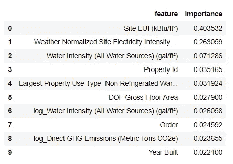
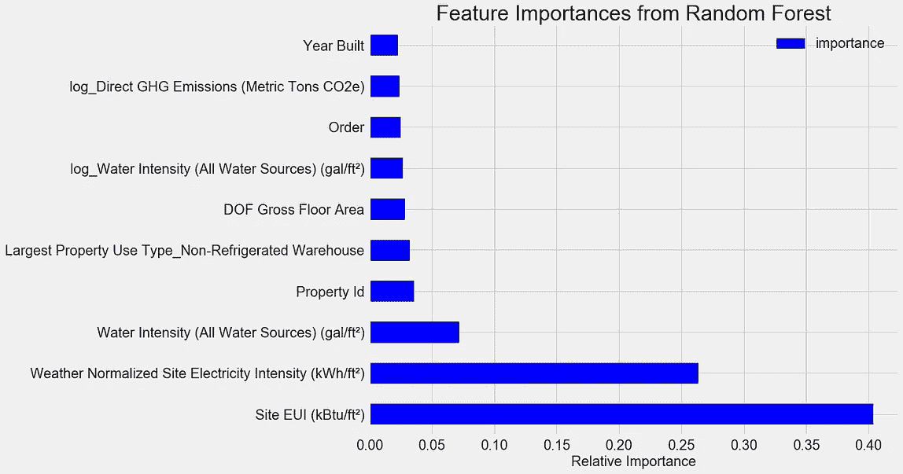
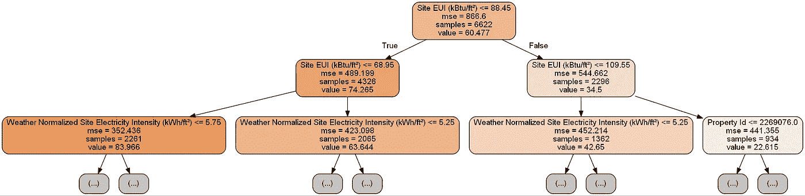
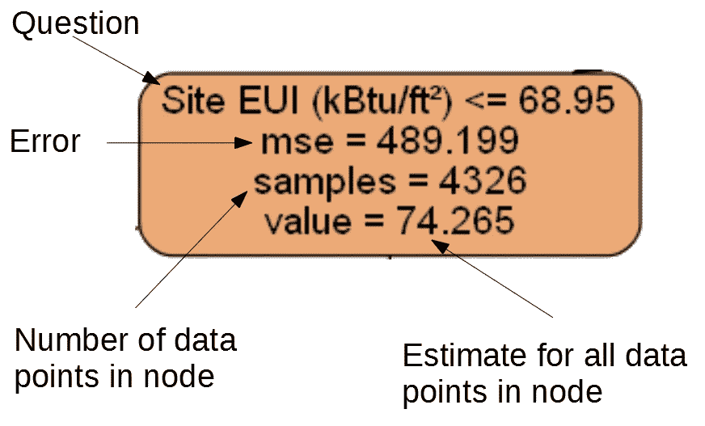
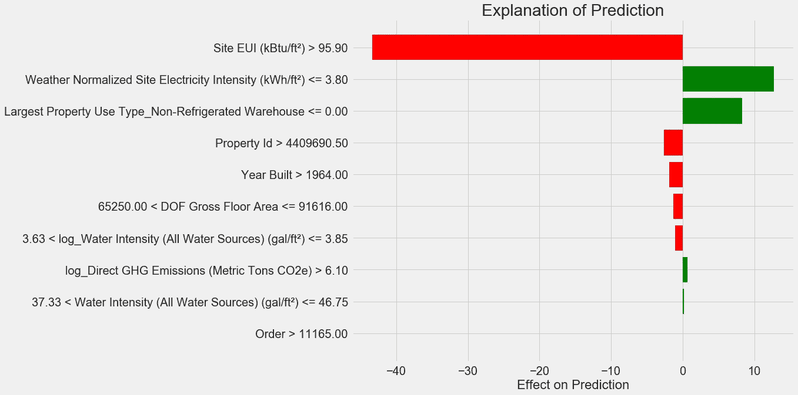
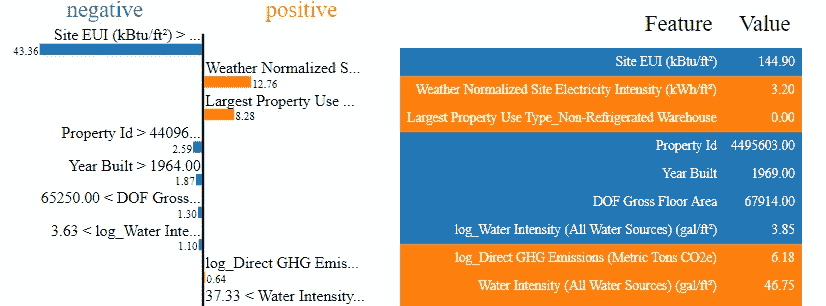

# Python 中完整的机器学习演练:第三部分

> 原文：<https://towardsdatascience.com/a-complete-machine-learning-walk-through-in-python-part-three-388834e8804b?source=collection_archive---------3----------------------->


## 解释机器学习模型并呈现结果

机器学习模型经常被批评为[黑箱](https://datascience.stackexchange.com/questions/22335/why-are-machine-learning-models-called-black-boxes):我们把数据放在一边，得到答案——通常是非常准确的答案——另一边没有解释。在展示完整的机器学习解决方案的本系列的第三部分中，我们将深入研究我们开发的模型，以尝试并理解它如何进行预测，以及它可以教给我们关于该问题的什么。我们将通过讨论机器学习项目中最重要的部分来结束:记录我们的工作并展示结果。

[本系列的第一部分](/a-complete-machine-learning-walk-through-in-python-part-one-c62152f39420)涵盖了数据清理、探索性数据分析、特性工程和特性选择。[第二部分](/a-complete-machine-learning-project-walk-through-in-python-part-two-300f1f8147e2)涵盖了输入缺失值、实现和比较机器学习模型、使用交叉验证的随机搜索进行超参数调整，以及评估模型。

这个项目的所有[代码都在 GitHub 上。](https://github.com/WillKoehrsen/machine-learning-project-walkthrough)[第三本 Jupyter 笔记本，对应本帖，在此](https://github.com/WillKoehrsen/machine-learning-project-walkthrough/blob/master/Machine%20Learning%20Project%20Part%203.ipynb)。我鼓励任何人分享、使用和构建这些代码！

提醒一下，我们正在解决一个监督回归机器学习问题。使用[纽约市建筑能源数据](http://www.nyc.gov/html/gbee/html/plan/ll84_scores.shtml)，我们开发了一个可以预测建筑能源之星得分的模型。我们构建的最终模型是一个[梯度推进回归器](http://blog.kaggle.com/2017/01/23/a-kaggle-master-explains-gradient-boosting/)，它能够将测试数据的能源之星得分预测到 9.1 分以内(1-100 分)。

# 模型解释

梯度推进回归变量位于模型可解释性的[尺度的中间:整个模型很复杂，但它是由数百个](https://2.bp.blogspot.com/-AL1LsaTHVNQ/Wh589GDwkaI/AAAAAAAAaxc/nwpqKEUIgXokRxt75nzgzQz00IRqH68PACLcBGAs/s1600/B2G1g0UIMAEieiR.png)[决策树](https://en.wikipedia.org/wiki/Decision_tree_learning)组成的，它们本身是很容易理解的。我们将从三个方面来理解我们的模型是如何进行预测的:

1.  [特征重要性](http://scikit-learn.org/stable/auto_examples/ensemble/plot_forest_importances.html)
2.  可视化单个决策树
3.  [LIME:局部可解释的模型不可知解释](https://github.com/marcotcr/lime)

前两种方法专门针对树的集合，而第三种方法——正如你可能从名称中猜到的那样——可以应用于任何机器学习模型。LIME 是一个相对较新的包，代表了正在进行的解释机器学习预测的努力中令人兴奋的一步。

## 特征重要性

特征重要性试图显示每个特征与预测目标任务的相关性。特征重要性的技术细节很复杂(它们[测量平均杂质减少量](https://papers.nips.cc/paper/4928-understanding-variable-importances-in-forests-of-randomized-trees.pdf)，或[因包含特征](https://stackoverflow.com/questions/15810339/how-are-feature-importances-in-randomforestclassifier-determined)而减少的误差)，但我们可以使用相对值来比较哪些特征最相关。在 Scikit-Learn 中，我们可以从任何基于树的学习者集合中提取特征重要性。

使用`model`作为我们的训练模型，我们可以使用`model.feature_importances_` 找到特征重要性。然后，我们可以将它们放入熊猫数据框架中，并显示或绘制前十个最重要的:



`Site EUI` ( [)能源使用强度](https://www.energystar.gov/buildings/facility-owners-and-managers/existing-buildings/use-portfolio-manager/understand-metrics/what-energy))和`Weather Normalized Site Electricity Intensity`是最重要的特征，占总重要性的 66%以上。在前两个特征之后，重要性显著下降，这表明我们可能不需要保留数据中的所有 64 个特征来实现高性能。(在[Jupyter 笔记本](https://github.com/WillKoehrsen/machine-learning-project-walkthrough/blob/master/Machine%20Learning%20Project%20Part%203.ipynb)中，我看了一下仅使用前 10 个功能的情况，发现该模型并不十分准确。)

基于这些结果，我们终于可以回答我们最初的一个问题:建筑物能源之星得分的最重要指标是站点 EUI 和天气标准化站点电力强度。虽然我们确实希望[小心不要过度解读特征重要性](http://parrt.cs.usfca.edu/doc/rf-importance/index.html)，但它们是开始理解模型如何做出预测的有用方式。

## 可视化单个决策树

虽然整个梯度推进回归可能难以理解，但任何一个单独的决策树都是非常直观的。我们可以使用 [Scikit-Learn 函数](http://scikit-learn.org/stable/modules/generated/sklearn.tree.export_graphviz.html) `[export_graphviz](http://scikit-learn.org/stable/modules/generated/sklearn.tree.export_graphviz.html)`来想象森林中的任何一棵树。我们首先从系综中提取一棵树，然后将其保存为点文件:

使用 [Graphviz 可视化软件](https://www.graphviz.org/)我们可以从命令行将点文件转换成 png 文件:

```
dot -Tpng images/tree.dot -o images/tree.png
```

结果是一个完整的决策树:


Full Decision Tree in the Model

这有点让人不知所措！尽管这棵树的深度只有 6(层数)，但还是很难理解。我们可以修改对`export_graphviz`的调用，并将我们的树限制在更合理的深度 2:



Decision Tree Limited to a Depth of 2

树中的每个节点(框)有四条信息:

1.  这个问题问的是数据点的一个特性的值:这决定了我们是向右还是向左离开节点
2.  `mse`是节点误差的度量
3.  `samples`是节点中实例(数据点)的数量
4.  `value`是节点中所有样本的目标估计值



Individual Node in Decision Tree

(叶节点只有 2 个。–4.因为它们代表最终估计值，并且没有任何子代)。

决策树通过从称为根的顶部节点开始，沿着树向下工作来预测数据点。在每一个节点，数据点会被问一个是或否的问题。例如，上面节点的问题是:建筑物的场地 EUI 是否小于或等于 68.95？如果答案是肯定的，那么该建筑被放置在右边的子节点中，如果答案是否定的，那么该建筑被放置在左边的子节点中。

在树的每一层重复该过程，直到数据点被放置在树的底部的叶节点中(叶节点从小树图像中被裁剪)。对叶节点中所有数据点的预测是`value`。如果在一个叶节点中有多个数据点(`samples`)，它们都得到相同的预测。随着树的深度增加，训练集上的误差将减少，因为有更多的叶节点，并且示例可以被更精细地划分。然而，太深的树将[过度适应训练数据](/overfitting-vs-underfitting-a-conceptual-explanation-d94ee20ca7f9)，并且将不能推广到新的测试数据。

在第二篇文章的[中，我们调整了许多模型超参数，它们控制着每棵树的各个方面，比如树的最大深度和一个叶节点所需的最小样本数。这两者对欠拟合和过拟合的平衡都有重大影响，可视化单个决策树允许我们看到这些设置如何工作。](/a-complete-machine-learning-project-walk-through-in-python-part-two-300f1f8147e2)

虽然我们不能检查模型中的每一棵树，但是查看一棵树可以让我们了解每个学习者如何做出预测。这种基于流程图的方法看起来很像人类做决策的方式，一次回答一个关于单个值的问题。[基于决策树的集成](http://scikit-learn.org/stable/modules/ensemble.html)将许多单个决策树的预测结合起来，以创建一个更准确、方差更小的模型。[树的集合往往非常准确](https://blog.statsbot.co/ensemble-learning-d1dcd548e936)，并且解释起来也很直观。

## 局部可解释的模型不可知解释(LIME)

我们将探索的试图理解我们的模型如何“思考”的最后一个工具是模型解释领域的一个新入口。 [LIME 旨在通过使用线性回归等简单模型在数据点附近局部创建模型的近似来解释来自任何机器学习模型](https://www.oreilly.com/learning/introduction-to-local-interpretable-model-agnostic-explanations-lime)的单个预测。[完整细节可在论文](https://arxiv.org/pdf/1602.04938.pdf)中找到。

在这里，我们将使用 LIME 来检查模型完全错误的预测，以了解它可能会告诉我们关于模型为什么会出错的信息。

首先，我们需要找到我们的模型最容易出错的观察结果。我们通过使用模型进行训练和预测，并提取模型误差最大的示例来实现这一点:

```
**Prediction: 12.8615
Actual Value: 100.0000**
```

接下来，我们创建 LIME explainer 对象，向它传递我们的训练数据、模式、训练标签和数据中的特性名称。最后，我们要求解释者对象解释错误的预测，传递给它观察和预测函数。

解释这一预测的图表如下:



以下是解释该图的方法:y 轴上的每个条目表示一个变量的一个值，红色和绿色条显示该值对预测的影响。例如，顶部条目显示站点 EUI 大于 95.90，这从预测中减去了大约 40 个点。第二个条目说天气标准化的站点电力强度小于 3.80，这为预测增加了大约 10 分。最终预测是截距项加上这些单独贡献的总和。

我们可以通过调用 explainer `.show_in_notebook()`方法来查看相同的信息:

```
# Show the explanation in the Jupyter Notebook
exp.show_in_notebook()
```



Output from LIME Explainer Object

这通过显示每个变量对预测的贡献，在左侧显示了模型的推理过程。右边的表格显示了数据点变量的实际值。

对于本例，模型预测值约为 12，而实际值为 100！虽然最初这一预测可能令人费解，但通过查看解释，我们可以看到这不是一个极端的猜测，而是给定数据点值的合理估计。该站点 EUI 相对较高，我们预计能源之星得分较低(因为 EUI 与得分高度负相关)，这是我们的模型得出的结论。在这种情况下，逻辑是错误的，因为该建筑的满分是 100 分。

当一个模型是错误的时候，它可能是令人沮丧的，但是诸如此类的解释帮助我们理解为什么模型是不正确的。此外，基于这一解释，我们可能想要调查为什么该建筑尽管有如此高的场地 EUI 却得到了满分。也许我们可以了解到一些新的问题，如果不研究这个模型，我们可能会忽略这些问题。诸如此类的工具并不完美，但它们对帮助我们理解模型大有帮助，这反过来可以让我们做出更好的决策。

# 记录工作和报告结果

任何技术项目中经常被忽视的部分是文档和报告。我们可以做世界上最好的分析，但是如果我们不与[清楚地交流结果](http://blog.kaggle.com/2016/06/29/communicating-data-science-a-guide-to-presenting-your-work/)，那么他们将不会有任何影响！

当我们记录一个数据科学项目时，我们会将所有版本的数据和代码打包，以便其他数据科学家可以复制或构建我们的项目。重要的是要记住，代码被阅读的次数比它被编写的次数要多，我们要确保我们的工作是可以理解的**对他人和我们自己**如果我们几个月后再回来看的话。这意味着在代码中加入有用的注释，并解释你的推理。我发现 Jupyter 笔记本是一个很好的文档工具，因为它们允许一个接一个的解释和编码。

Jupyter 笔记本也是一个很好的与他人交流发现的平台。使用[笔记本扩展](https://github.com/ipython-contrib/jupyter_contrib_nbextensions)，我们可以[在我们的最终报告](https://github.com/kirbs-/hide_code)中隐藏代码，因为虽然这很难相信，但并不是每个人都想在一个文档中看到一堆 Python 代码！

就我个人而言，我很难简明扼要地总结我的工作，因为我喜欢浏览所有的细节。然而，重要的是[在你演讲的时候理解你的听众](http://sites.ieee.org/pcs/communication-resources-for-engineers/audience-purpose-and-context/understand-your-audience/)并且[相应地调整信息](https://hbr.org/2015/04/the-best-presentations-are-tailored-to-the-audience)。考虑到这一点，以下是我对这个项目的 30 秒总结:

1.  使用纽约市的能源数据，可以建立一个模型，将建筑物的能源之星得分预测到 9.1 分以内。
2.  站点 EUI 和天气标准化电力强度是预测能源之星得分的最相关因素。

最初，我被一家初创公司作为筛选工作的“任务”给了这个项目。为了期末报告，他们想看我的工作和结论，所以我做了一个 Jupyter 笔记本上交。然而，我没有在 Jupyter 中直接转换为 PDF，而是将其转换为一个 [Latex](https://www.latex-project.org/) `.tex`文件，然后在 [texStudio](https://www.texstudio.org/) 中编辑，然后渲染为用于[最终版本](https://github.com/WillKoehrsen/machine-learning-project-walkthrough/blob/master/Building%20Data%20Report.pdf)的 PDF。Jupyter 的默认 PDF 输出有一个体面的外观，但它可以通过几分钟的编辑得到显著改善。此外，Latex 是一个强大的文档准备系统，了解基础知识很有好处。

一天结束时，我们的工作的价值取决于它所促成的决策，而能够展示结果是一项至关重要的技能。此外，通过正确记录工作，我们允许其他人复制我们的结果，给我们反馈，以便我们可以成为更好的数据科学家，并为未来建立我们的工作。

# 结论

在这一系列的帖子中，我们已经走过了一个完整的端到端机器学习项目。我们从清理数据开始，进入模型构建，最后看如何解释机器学习模型。提醒一下，机器学习项目的一般结构如下:

1.  数据清理和格式化
2.  探索性数据分析
3.  特征工程和选择
4.  在性能指标上比较几种机器学习模型
5.  对最佳模型执行超参数调整
6.  评估测试集上的最佳模型
7.  尽可能解释模型结果
8.  得出结论，写一份证据充分的报告

虽然具体步骤因项目而异，并且机器学习通常是一个[迭代而不是线性过程](https://en.wikipedia.org/wiki/Iteration)，但本指南应该在您处理未来的机器学习项目时很好地为您服务。我希望这个系列已经给了你信心，让你能够实现你自己的机器学习解决方案，但是记住，**我们没有一个人自己做到这一点**！如果你需要任何帮助，有许多令人难以置信的支持社区，你可以在那里寻求建议。

在我的学习过程中，我发现了一些有用的资源:

*   [用 Scikit-Learn 和 Tensorflow 进行动手机器学习](http://shop.oreilly.com/product/0636920052289.do) ( [这本书的 Jupyter 笔记本](https://github.com/ageron/handson-ml)在线免费提供)！
*   [统计学习入门](http://www-bcf.usc.edu/~gareth/ISL/)
*   [Kaggle:数据科学和机器学习之家](https://www.kaggle.com/)
*   [Datacamp](https://www.datacamp.com/) :练习数据科学编码的入门教程
*   Coursera :许多学科的免费和付费课程
*   [Udacity](https://www.udacity.com/) :付费编程和数据科学课程

一如既往，我欢迎反馈和讨论，可以通过 Twitter [@koehrsen_will](https://twitter.com/koehrsen_will) 联系。