# 关于如何在 Google Colab(免费 GPU)上使用 Keras 微调深度神经网络的全面指南

> 原文：<https://towardsdatascience.com/a-comprehensive-guide-on-how-to-fine-tune-deep-neural-networks-using-keras-on-google-colab-free-daaaa0aced8f?source=collection_archive---------7----------------------->

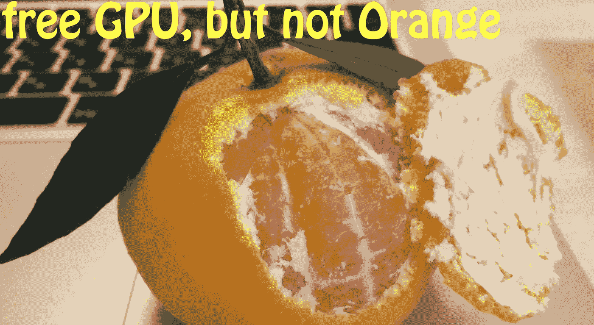

I like sweet oranges.

*在 CPU 上训练深度神经网络比较困难。本教程将指导你如何使用谷歌协作实验室上的 Keras 对 VGG-16 网络进行微调，谷歌协作实验室是一个免费的 GPU 云平台。如果你是谷歌实验室的新手，这是一个适合你的地方，你会学到:*

*   *如何在 Colab 上创建您的第一个 Jupyter 笔记本，并使用免费的 GPU。*
*   *如何在 Colab 上上传和使用您的自定义数据集。*
*   *如何在前景分割领域对 Keras 预训练模型(VGG-16)进行微调。*

现在，让我们开始吧…

# 1.创建您的第一个 Jupyter 笔记本

假设您已经登录了您的 Google 帐户。请遵循以下步骤:

**一)。**导航至[http://drive.google.com](http://drive.google.com.)。
**b)。**您将在左侧窗格中看到**我的驱动器**选项卡。现在，在里面创建一个文件夹，比如说 **Colab 笔记本**。
**c)。**在已创建的文件夹内的右窗格的其他地方单击右键，选择**更多** > **协同实验室**。另一个窗口会弹出来，你可以给你的笔记本起个别的名字，比如说 **myNotebook.ipynb** 。加油！！！您已经在 Colab 上创建了您的第一个笔记本😄

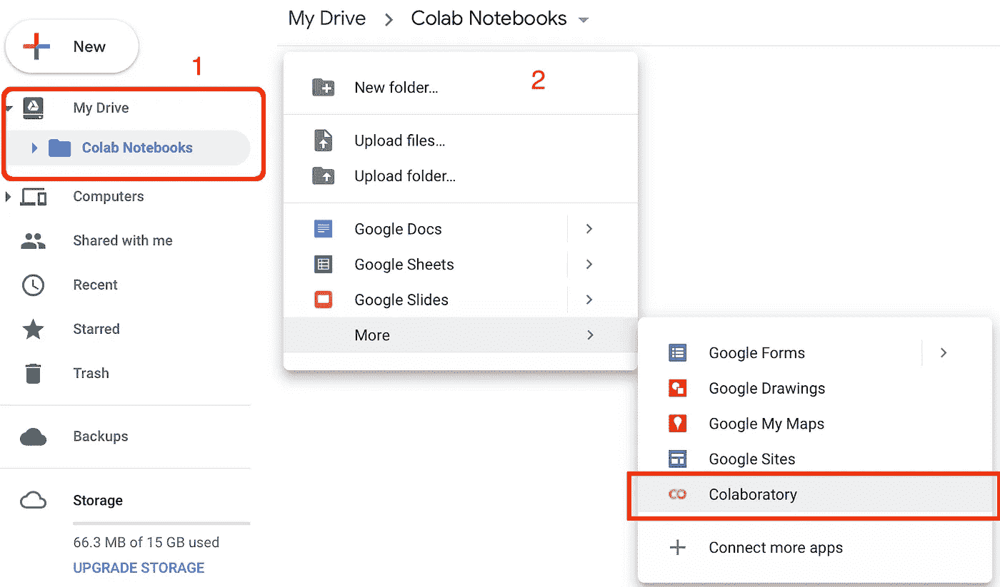

# 2.为笔记本电脑设置 GPU 加速器

在笔记本中，选择**运行时** > **改变运行时类型**。将弹出一个窗口。然后，选择您的运行时类型，从*硬件加速器*下拉菜单中选择 **GPU** 并保存您的设置(如下图)。

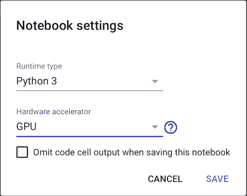

# 3.将您的自定义数据集上传到 Colab

您已经完成了在 GPU 上运行笔记本的设置。现在，让我们把你的数据集上传到 Colab。在本教程中，我们工作在[前景分割](https://en.wikipedia.org/wiki/Foreground_detection)，从背景中提取前景物体(下图)。

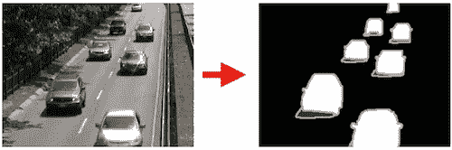

images are taken from changedetection.net

将数据集上传到 Colab 有几个选项，但是，在本教程中我们考虑两个选项；首先，我们上传到 GitHub 并从它克隆到 Colab，其次，我们上传到 Google Drive 并直接在我们的笔记本上使用。你可以选择任何一个选项。或 **b)。**下图:

## a)。从 GitHub 克隆

让我们将上述数据集克隆到创建的笔记本中。在你笔记本的单元格中，运行`!git clone [https://github.com/lim-eren/CDnet2014.git](https://github.com/lim-eren/CDnet2014.git).`你会看到这样的东西:

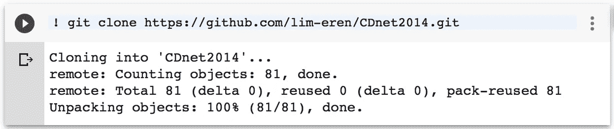

搞定了。让我们列出训练集，看看它是否有效:

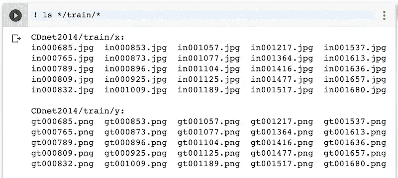

开始了。训练集包含 25 个输入帧和 25 个真实帧。跳过**部分 b)。**并跳转到**第 4 节。**如果你做到了这一步。

## b)。从 Google Drive 下载

另一个选择是将你的数据集上传到 Google Drive，然后从中克隆。假设你已经压缩了上面的训练集，比如说 **CDnet2014.zip** ，上传到 Google Drive 和 **myNotebook.ipynb** 在同一个目录下。现在，右键点击**cdnet 2014 net . zip**>**获取可共享链接**。复制文件的 **id** 并将其存储在某个地方(我们稍后会用到)。

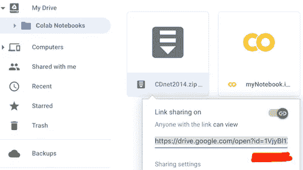

然后，通过运行以下代码验证 Colab 以访问 Google Drive。按照链接获取验证码并粘贴到下面的文本框中，然后按 Enter 键。

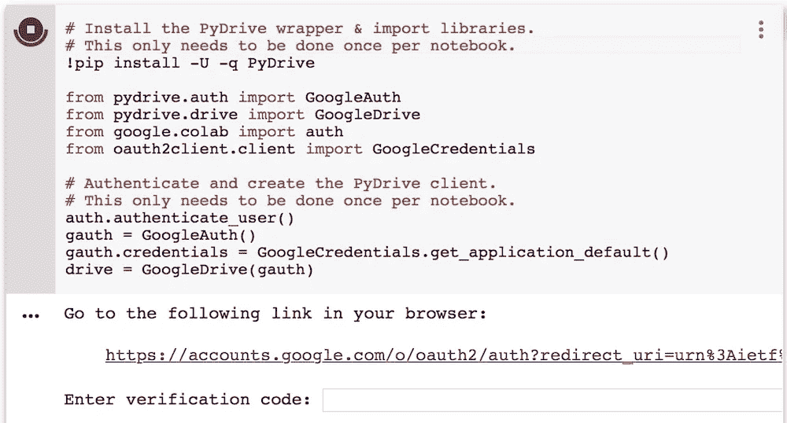

然后，让我们将 **CDnet2014net.zip** 文件内容下载到我们的 Jupyter 笔记本中(用上一步获得的 **id** 替换`YOUR_FILE_ID`),并通过运行以下代码将其解压缩:

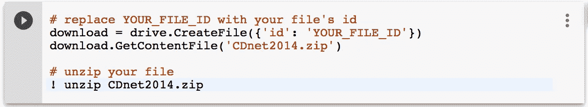

搞定了。您已经将数据集从 Google Drive 下载到 Colab。让我们继续**第 4 节**使用这个数据集建立一个简单的神经网络。

# 4.微调你的神经网络

在您的数据集下载到 Colab 后，现在让我们在前景分割域中微调 Keras 预训练模型。请遵循以下步骤:

**一)。**首先，将该代码片段添加到您的笔记本上，以获得跨机器的可再现结果(*请在您笔记本的单元格中运行该代码片段*):

**b)。**创建一个从 Colab 加载数据的函数。该函数返回输入图像(X)和相应的基本事实(Y):

**c)。初始一个普通的编码器-解码器模型。我们采用 [VGG-16 预训练模型](https://github.com/keras-team/keras-applications/blob/master/keras_applications/vgg16.py)作为编码器，其中所有全连接层都被移除，只有最后一个卷积层(`block5_conv3`)被微调，其余层被冻结。我们使用转置卷积层来恢复解码器部分的特征分辨率。**

因为这是一个二元分类问题，所以使用了`binary_crossentropy`，网络的输出将是 0 和 1 之间的概率值。这些概率值需要被阈值化，以便获得二进制标签 0 或 1，其中标签 0 表示背景，标签 1 表示前景。

**维。**我们设定学习率为 5e-4，batch_size 为 1，validation_split 为 0.2，max-epochs 为 100，当验证损失在 5 个时期内停止改善时，将学习率降低 10 倍，当验证损失在 10 个时期内停止改善时，提前停止训练。现在，让我们训练模型。

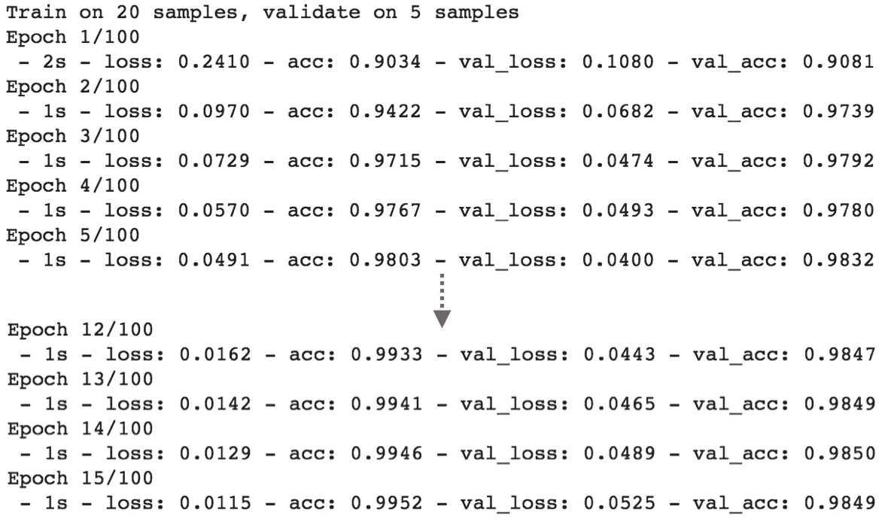

Training with GPU

一个纪元大约需要 **1 秒，太快了！！！在验证集上，最高准确率达到 98%以上。不错吧？现在，让我们暂停一下。我们来对比一下训练**有 GPU** 和没有 GPU**的速度吧(*如果你愿意*可以跳过这个对比直接跳到测试部分)。要在没有 GPU 的情况下进行训练，请将**硬件加速器**设置为**无**(参见第 2 节。以上)。这是训练日志。在没有 GPU 的情况下，一个历元需要大约 **30 秒，**而使用 GPU 训练时只需要 **1 秒**(大约快 30 倍👏).

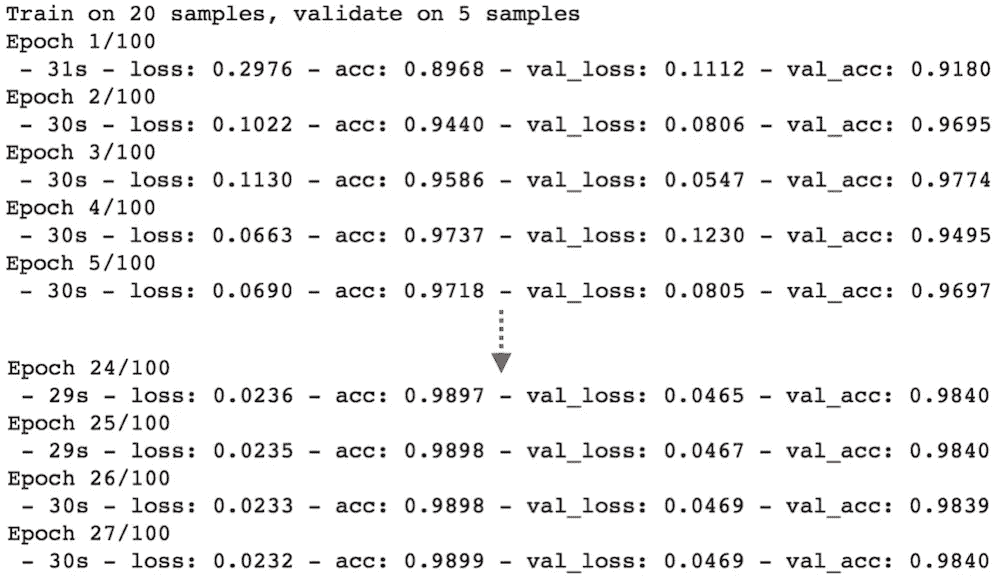

Training without GPU

现在，让我们用 Colab GPU 在**测试集**上测试训练好的模型(*你可以运行* `*!ls */test/**` *来查看带有相应地面实况*的测试帧)。

加油！！！对于一个普通的网络，我们只需要使用 25 个`training+validation`例子就可以达到 98.94% 的测试精度😄。注意，由于训练样本的随机性，你可能会得到和我相似的结果(不完全相同但只有很小的精度差异)。

**注意一个问题**:我们的模型过度拟合训练数据，解决这个问题是你的工作。**提示**:使用正规化技术，如[辍学](https://keras.io/layers/core/#dropout)、 [L2](https://keras.io/regularizers/) 、[批量正规化](https://keras.io/layers/normalization/)。

**e)。**让我们通过运行以下代码来绘制分段掩码:

开始了。分割结果一点都不差！大多数对象边界被错误分类，这个问题主要是由于在训练期间的损失计算中考虑了空标签(对象边界周围的模糊像素)的情况。我们可以通过在损耗中省略这些 void 标签来进一步提高性能。你可以参考[这里的](https://github.com/lim-anggun/FgSegNet)或者[这里的](https://github.com/lim-anggun/FgSegNet_v2)关于如何做。

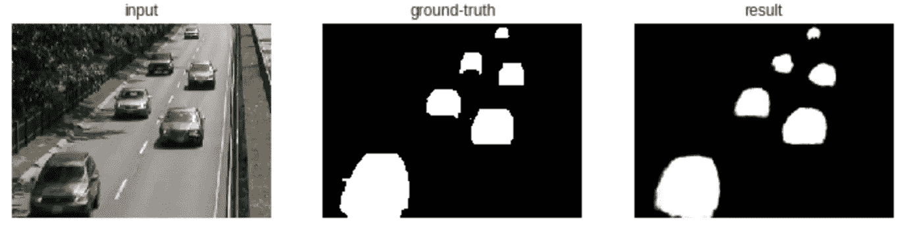

test result on CDnet2014 dataset (changedetection.net)

本教程的完整源代码可在 [GitHub](https://github.com/lim-anggun/tutorials/blob/master/myNotebook.ipynb) 中获得。

# 摘要

在本教程中，您已经学习了如何使用 Google Colab GPU，并以快速的方式训练了网络。您还学习了如何在前景分割领域中微调 Keras 预训练模型，您可能会在未来的研究中发现这一点。

如果你喜欢这个帖子，请随意分享或鼓掌。请过得愉快！🎊😁