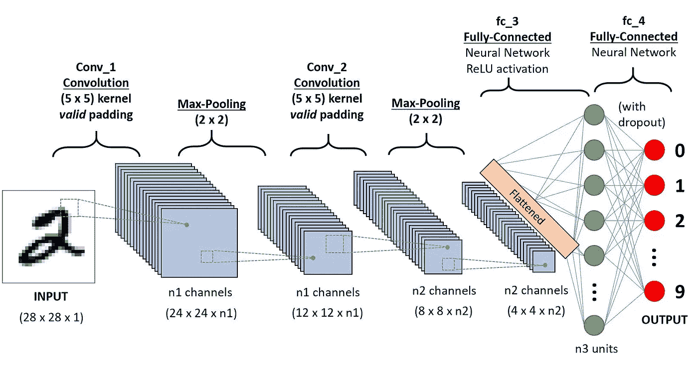
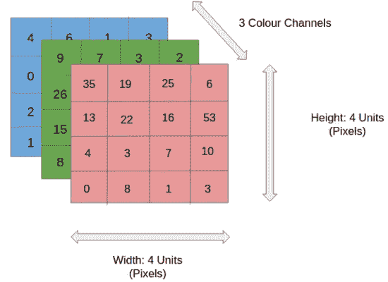
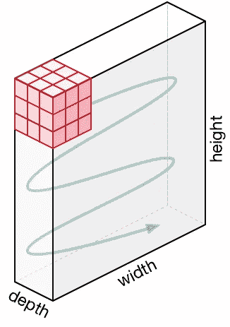
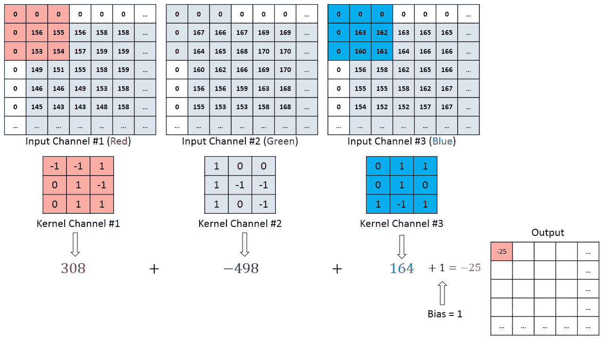
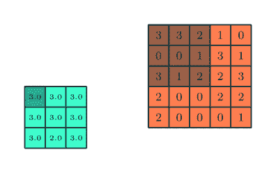

# 卷积神经网络综合指南 ELI5 方法

> 原文：<https://towardsdatascience.com/a-comprehensive-guide-to-convolutional-neural-networks-the-eli5-way-3bd2b1164a53?source=collection_archive---------0----------------------->


人工智能见证了在弥合人类和机器能力之间的差距方面的巨大发展。研究人员和爱好者一样，致力于该领域的许多方面，使惊人的事情发生。许多这样的领域之一是计算机视觉领域。

该领域的目标是使机器能够像人类一样看待世界，以类似的方式感知世界，甚至将这些知识用于多种任务，如图像和视频识别、图像分析和分类、媒体娱乐、推荐系统、自然语言处理等。具有深度学习的计算机视觉的进步已经随着时间的推移而构建和完善，主要是在一种特定的算法上——一种**卷积神经网络**。

> 准备好尝试自己的卷积神经网络了吗？查看[土星云](https://saturncloud.io/?utm_source=Medium+&utm_medium=Medium&utm_campaign=SumitSaha&utm_term=ConvolutionalNeuralNets)免费计算(包括免费 GPU)。

## 介绍



A CNN sequence to classify handwritten digits

**卷积神经网络(ConvNet/CNN)** 是一种深度学习算法，可以接受输入图像，为图像中的各个方面/对象分配重要性(可学习的权重和偏差)，并能够区分彼此。与其他分类算法相比，ConvNet 中所需的预处理要低得多。在原始方法中，滤波器是手工设计的，经过足够的训练，ConvNets 有能力学习这些滤波器/特性。

ConvNet 的架构类似于人脑中神经元的连接模式，其灵感来自视觉皮层的组织。单个神经元只在视野中被称为感受野的有限区域内对刺激做出反应。这些区域的集合重叠覆盖了整个可视区域。

## 为什么 ConvNets 优于前馈神经网络？


Flattening of a 3x3 image matrix into a 9x1 vector

图像不过是像素值的矩阵，对吗？那么，为什么不干脆将图像扁平化(例如，将 3×3 的图像矩阵转化为 9×1 的向量)并将其输入到多级感知器中进行分类呢？哦..不完全是。

在极其基本的二进制图像的情况下，该方法在执行类别预测时可能显示平均精度分数，但是当涉及到整体上具有像素依赖性的复杂图像时，该方法将几乎没有精度。

通过应用相关过滤器，ConvNet 能够**成功捕捉图像中的空间和时间相关性**。由于所涉及的参数数量的减少和权重的可重用性，该架构对图像数据集执行更好的拟合。换句话说，可以训练网络更好地理解图像的复杂程度。

## 输入图像



4x4x3 RGB Image

在图中，我们有一个 RGB 图像，它由三个颜色平面(红色、绿色和蓝色)分开。图像存在于许多这样的色彩空间中——灰度、RGB、HSV、CMYK 等。

你可以想象一旦图像达到 8K (7680×4320)的尺寸，计算量会有多大。ConvNet 的作用是将图像简化为一种更容易处理的形式，而不会丢失对获得良好预测至关重要的特征。当我们要设计一个不仅擅长学习特征，而且可扩展到大规模数据集的架构时，这一点很重要。

## 卷积层—内核


Convoluting a 5x5x1 image with a 3x3x1 kernel to get a 3x3x1 convolved feature

图像尺寸= 5(高)x 5(宽)x 1(通道数，如 RGB)

在上面的演示中，绿色部分类似于我们的 **5x5x1 输入图像，I** 。卷积层第一部分的卷积运算中涉及的元素称为**内核/滤波器，K** ，用黄色表示。我们选择了 **K 作为一个 3x3x1 的矩阵。**

```
Kernel/Filter, K = 1  0  1
0  1  0
1  0  1
```

由于**步长= 1(非步长)**，内核移位 9 次，每次在 K 和内核所悬停的图像部分 P 之间执行**逐元素** **乘法运算(** [**哈达玛乘积**](https://en.wikipedia.org/wiki/Hadamard_product_(matrices)#:~:text=In%20mathematics%2C%20the%20Hadamard%20product,elements%20i%2C%20j%20of%20the) **)。**



Movement of the Kernel

过滤器以一定的步幅值向右移动，直到解析完整的宽度。继续前进，它向下跳到具有相同步幅值的图像的开头(左侧),并重复该过程，直到遍历整个图像。



Convolution operation on a MxNx3 image matrix with a 3x3x3 Kernel

在具有多个通道(例如 RGB)的图像的情况下，内核具有与输入图像相同的深度。在 Kn 和 In 栈之间进行矩阵乘法([K1，I1]；[K2，I2]；[K3，I3])，所有结果与偏差相加，得到一个压缩的单深度通道卷积特征输出。


Convolution Operation with Stride Length = 2

卷积操作的目的是**从输入图像中提取高级特征**，如边缘。ConvNets 不必仅限于一个卷积层。按照惯例，第一个 ConvLayer 负责捕获边缘、颜色、渐变方向等低级特征。随着图层的增加，该架构也适应了高级功能，为我们提供了一个对数据集中的图像有全面了解的网络，就像我们会做的那样。

该操作有两种类型的结果-一种是与输入相比，卷积特征的维数减少，另一种是维数增加或保持不变。这是通过在前一种情况下应用**有效填充**，或者在后一种情况下应用**相同填充**来完成的。


**SAME padding:** 5x5x1 image is padded with 0s to create a 6x6x1 image

当我们将 5x5x1 图像放大为 6x6x1 图像，然后对其应用 3x3x1 内核时，我们发现卷积矩阵的维数为 5x5x1。因此得名——**同垫**。

另一方面，如果我们在没有填充的情况下执行相同的操作，我们会看到一个矩阵，它具有内核(3x3x1)本身的维度— **有效填充**。

下面的存储库包含了许多这样的 gif，它们将帮助你更好地理解垫高和步幅长度是如何协同工作以达到我们需要的结果的。

[](https://github.com/vdumoulin/conv_arithmetic) [## vdumoulin/conv 算术

### 深度学习背景下的卷积算法技术报告——VDU moulin/conv 算法

github.com](https://github.com/vdumoulin/conv_arithmetic) 

## 汇集层



3x3 pooling over 5x5 convolved feature

与卷积层类似，汇集层负责减小卷积要素的空间大小。这是为了**通过降维来降低处理数据**所需的计算能力。此外，它对于**提取旋转和位置不变的主导特征**是有用的，从而保持有效训练模型的过程。

有两种类型的池:最大池和平均池。**最大池**从内核覆盖的图像部分返回**最大值**。另一方面，**平均池**返回内核覆盖的图像部分的所有值的**平均值。**

最大池也表现为**噪音抑制**。它完全丢弃有噪声的激活，并且在降维的同时执行去噪。另一方面，平均池只是作为一种噪声抑制机制来执行降维。因此，我们可以说**最大池比平均池**性能好得多。


Types of Pooling

卷积层和汇集层一起形成卷积神经网络的第 I 层。根据图像的复杂性，这种层的数量可以增加，以捕捉更低层次的细节，但代价是更多的计算能力。

在经历了上述过程之后，我们已经成功地使模型理解了特征。接下来，我们将使最终输出变平，并将其输入常规神经网络进行分类。

## 分类—全连接层(FC 层)


添加全连接层是学习由卷积层的输出表示的高级特征的非线性组合的(通常)廉价方式。全连接层正在学习该空间中可能的非线性函数。

既然我们已经将输入图像转换成适合多层感知器的形式，我们应该将图像展平成一个列向量。平坦化的输出被馈送到前馈神经网络，并且反向传播被应用于训练的每次迭代。在一系列时期内，该模型能够区分图像中的主要特征和某些低级特征，并使用 **Softmax 分类**技术对其进行分类。

有各种可用的 CNN 架构，它们是构建算法的关键，在可预见的未来，这些算法将作为一个整体为 AI 提供动力。其中一些列举如下:

1.  LeNet
2.  AlexNet
3.  VGGNet
4.  谷歌网
5.  雷斯内特
6.  ZFNet

**GitHub 笔记本——使用 TensorFlow 的 MNIST 数据集识别手写数字**

[](https://github.com/ss-is-master-chief/MNIST-Digit.Recognizer-CNNs) [## ss-is-master-chief/MNIST 数字。识别器-CNN

### CNN 识别运行 10 个时期的手写数字(MNIST)的实现。准确率:98.99% …

github.com](https://github.com/ss-is-master-chief/MNIST-Digit.Recognizer-CNNs) 

> 准备好尝试自己的卷积神经网络了吗？查看[土星云](https://saturncloud.io/?utm_source=Medium+&utm_medium=Medium&utm_campaign=SumitSaha&utm_term=ConvolutionalNeuralNets)免费计算(包括免费 GPU)。