# 多维数据有效可视化的图形语法综合指南

> 原文：<https://towardsdatascience.com/a-comprehensive-guide-to-the-grammar-of-graphics-for-effective-visualization-of-multi-dimensional-1f92b4ed4149?source=collection_archive---------3----------------------->

## 了解利用图形框架的分层语法实现有效数据可视化的有效策略

# 介绍

可视化多维数据是一门艺术，也是一门科学。由于我们的二维(2-D)渲染设备的限制，随着维度数量的增加，在两个以上的数据维度(属性或特征)上构建有效的可视化变得具有挑战性。在我之前的一篇文章 [***【多维数据有效可视化的艺术】***](/the-art-of-effective-visualization-of-multi-dimensional-data-6c7202990c57) 中，我们已经广泛地介绍了有效的多维数据可视化的一些策略，并提供了实际操作的例子。在本文中，我们将介绍我们用来构建这些可视化的分层框架，称为***‘图形的语法’***。我们还将探索图形框架分层语法背后的基本概念，并讨论我们如何使用每个特定的分层组件在多维数据上构建有效的可视化。示例将用 Python 展示，但是，如果您感兴趣，您可以轻松地用 R 复制相同的内容。

# 动机

数据可视化和讲故事一直是任何数据科学管道中最重要的阶段之一，涉及到从数据中提取有意义的见解，不管数据或项目有多复杂。举个简单的例子 [***【十几只雷龙】***](https://www.autodeskresearch.com/publications/samestats)——下图描绘了十二个不同的数据集。

> 你能猜出这些看起来非常不同的数据集之间的共同点吗？

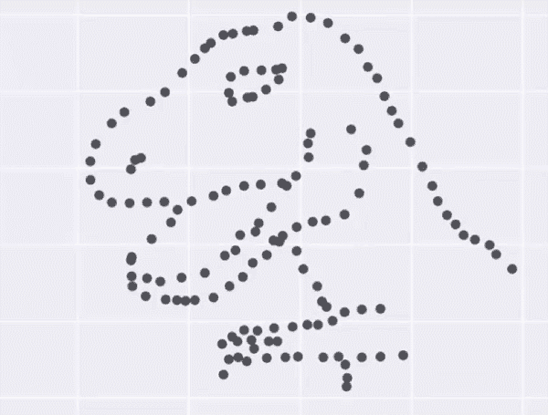

The Datasaurus Dozen — What is common among these diverse datasets?

> 答:所有数据集的汇总统计数据完全相同！

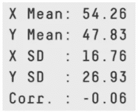

这是著名的安斯科姆四重奏的有趣变体，你们很多人可能都很熟悉，如下图所示。

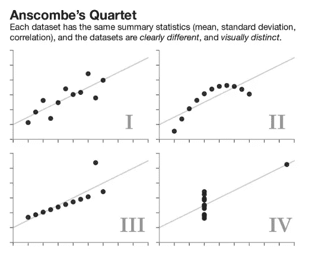

Anscombe’s quartet — Different datasets with same summary statistics

这些演示的关键要点是，*“不要盲目相信你的数据，开始根据你的数据建模”*。汇总统计数据总是具有欺骗性。在继续进行特征工程和构建统计、机器学习和深度学习模型之前，请始终可视化和理解您的数据属性。

另一个非常重要的动机来源，特别是对于有效的数据可视化，可以从几个世纪前的一些优秀案例研究中获得，当时我们甚至没有计算机，更不用说 Python 或 R！第一幅是约翰·斯诺著名的可视化作品，描绘了 1854 年英国伦敦爆发的宽街霍乱！

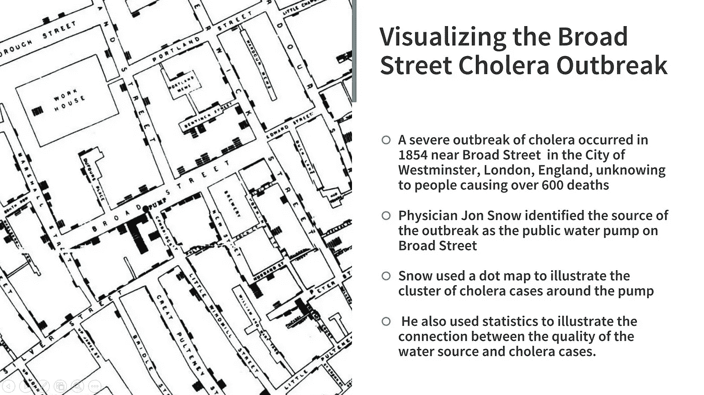

Visualizing the Broad Street Cholera outbreak which helped find the root cause of the disease outbreak!

你可以看到一个简单的手绘可视化是如何帮助找到 19 世纪 50 年代宽街霍乱爆发的根本原因的。另一个有趣的可视化是由现代护理实践之母佛罗伦萨南丁格尔建立的，她对护理和统计有着根深蒂固的兴趣。

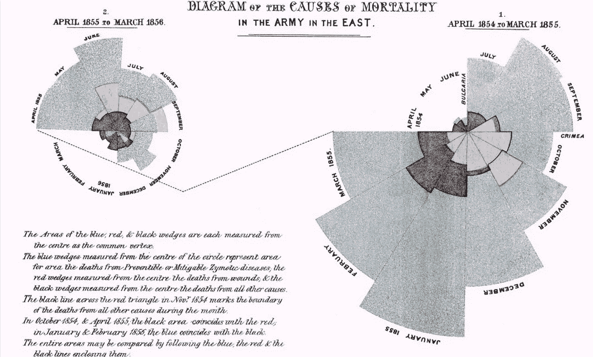

Causes of Mortality in the Army of the East — Florence Nightingale

上图描绘了一个极区图，描述了 19 世纪 50 年代军队中的死亡原因。我们可以看到，这一可视化绝对不是简单化的，但它传达了正确的见解——清楚地显示了士兵死于可预防疾病的比例，这些疾病基于伤口或其他原因。这应该为有效的数据可视化提供足够的动力！

# 理解图形的语法

为了理解图形的语法，我们需要理解语法是什么意思。下图简要总结了这两个方面。

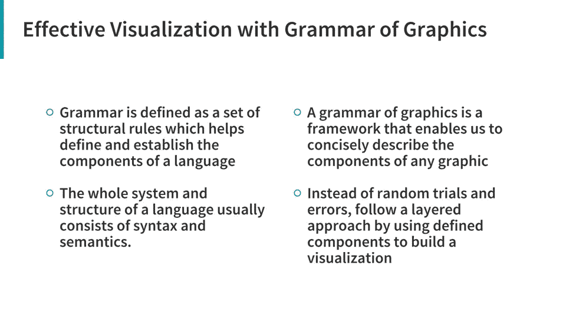

基本上，图形语法是一个框架，它遵循分层的方法，以结构化的方式描述和构建可视化或图形。涉及多维数据的可视化通常有多个组件或方面，利用这种分层的图形语法有助于我们描述和理解可视化中涉及的每个组件——在数据、美学、比例、对象等方面。

图形框架的原始语法是由 Leland Wilkinson 提出的，它详细地涵盖了与有效数据可视化相关的所有主要方面。我肯定会推荐感兴趣的读者去看看这本书，只要他们有机会！

 [## 图形的语法|利兰·威尔金森|斯普林格

### 第一版序言在 1980 年代为 SYSTAT 编写图形之前，我首先讲授了一个关于…

www.springer.com](https://www.springer.com/in/book/9780387245447) 

然而，我们将使用它的一个变体——称为图形框架的分层语法，它是由著名的数据科学家 Hadley Wickham 提出的，他也是著名的 R visualization 软件包`[**ggplot2**](https://ggplot2.tidyverse.org/)`的创建者。读者应该看看他的论文，标题是 [*【图形的分层语法】*](http://vita.had.co.nz/papers/layered-grammar.html) ，其中详细介绍了他提出的图形分层语法，还谈到了他为 R 编程语言构建的开源实现框架`**ggplot2**`

 [## 图形的分层语法

### 图形语法是一种工具，它使我们能够简明地描述图形的组成部分。这样的语法…

vita.had.co.nz](http://vita.had.co.nz/papers/layered-grammar.html) 

哈德利的图形分层语法使用几个分层组件来描述任何图形或可视化。最值得注意的是，它与威尔金森提出的原始图形语法有一些不同，如下图所示。

Mapping between components of Wilkinson’s grammar (left) and the layered grammar (right)

你可以看到语法中有各种各样的成分，可以用来建立和描述可视化。我已经确定了 ***七个*** 这样的主要组件，它们通常帮助我在多维数据上建立有效的可视化。下图显示了语法中每个特定组件的一些细节。

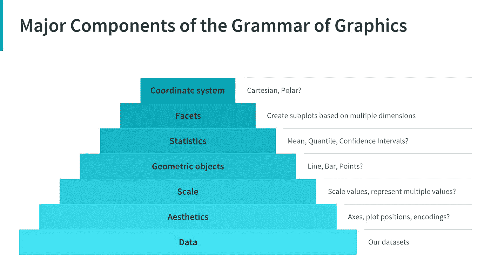

Major components of the Grammar of Graphics

我们用一个金字塔架构来展示组件的内在分层结构。通常，为了用一个或多个维度构建或描述任何可视化，我们可以使用如下组件。

1.  **数据**:始终从数据开始，确定你想要可视化的维度。
2.  **美观**:根据数据尺寸，图中各数据点的位置确定轴。还要检查是否需要任何形式的编码，包括大小、形状、颜色等等，这些对于绘制多个数据维度都很有用。
3.  **标度:**我们是否需要对潜在值进行标度，用一个特定的标度来表示多个值或一个范围？
4.  **几何对象:**这些通常被称为“几何对象”。这将涵盖我们在可视化上描绘数据点的方式。应该是点，条，线之类的？
5.  **统计:**我们是否需要在可视化中显示一些统计度量，如集中趋势、扩散、置信区间的度量？
6.  **Facets:** 我们需要根据特定的数据维度创建支线剧情吗？
7.  **坐标系:**可视化应该基于哪种坐标系——是笛卡尔坐标系还是极坐标坐标系？

现在，我们将通过一些实际操作的例子来看看如何利用这个分层框架来为多维数据构建有效的数据可视化。

# 动作图形的语法

现在，我们将把我们在上一节中学到的概念应用到一些实际数据上。我们将使用 Python 来构建我们所有的可视化，但是我也推荐人们查看 R 中的`**ggplot2**` 包，这是迄今为止最鼓舞人心的框架之一，用于构建漂亮和干净的出版物质量的可视化。我们确实有一个用 Python 编写的`[**ggplot**](http://ggplot.yhathq.com)` 框架，它是由 [Yhat，Inc.](https://twitter.com/YhatHQ) 构建的。但是，如果你检查一下存储库，在过去的两年里没有提交或更新，不幸的是，这导致了一些错误，特别是由于与`**pandas**`的新版本的向后不兼容问题。因此，为了模拟 Python 中图形语法的真正分层语法，我们将使用另一个有趣的框架`[**plotnine**](https://plotnine.readthedocs.io/en/stable/)`。

 [## Python - plotnine 0.4.0 文档的图形语法

### plotnine 是 Python 中图形语法的一个实现，它基于 ggplot2。该语法允许用户…

plotnine.readthedocs.io](https://plotnine.readthedocs.io/en/stable/) 

Plotnine 是基于`**ggplot2**`的图形框架分层语法的开源 Python 实现。因此，使用这个分层语法中先前指定的组件，我们可以构建有效的可视化。

## 从数据开始

我们总是从加载并查看我们想要分析和可视化的数据集开始。我们将使用著名的`[**mtcar**](https://stat.ethz.ch/R-manual/R-devel/library/datasets/html/mtcars.html)**s**` 数据集作为`**plotnine**`中预加载的数据集之一。

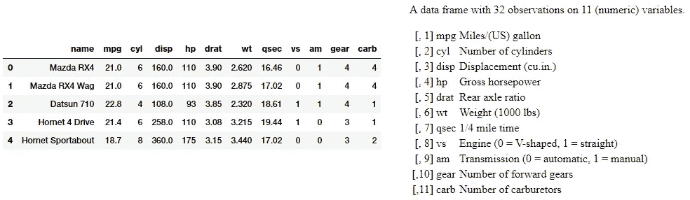

mtcars 数据集由从 1974 年*美国杂志《汽车趋势*中提取的数据组成，描述了 32 款汽车(1973-74 款)的油耗和汽车设计及性能的 10 个其他属性。上图中描述了每个属性的详细信息。让我们现在建立一些可视化。

## 可视化二维(2d)

我们现在可以使用图形框架的分层语法中的一些组件(包括数据、比例、美学和几何图形)来可视化高达二维的数据。在这种情况下，我们为几何对象选择一个点或散点图来表示每个数据点。

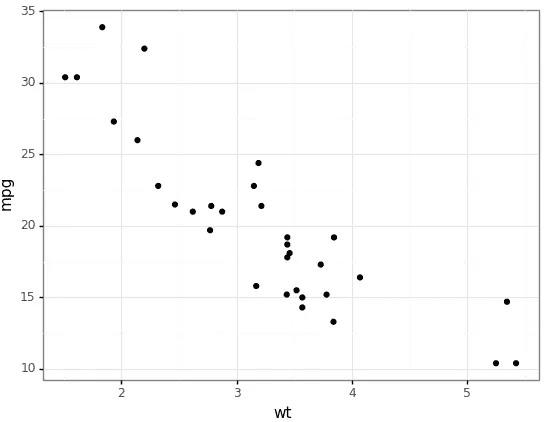

从上面的可视化中我们可以清楚的看到`**mpg**` 和猫`**wt**`是负相关的。

## 三维可视化

为了从我们的数据集中可视化三维，我们可以利用颜色作为我们的美学组件之一，来可视化除了其他两个维度之外的一个额外的维度，如下例所示。

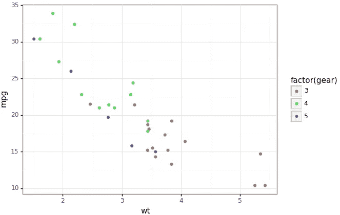

在上面的可视化中，我们使用颜色美学以及其他两个数据维度(变量)将具有不同数量档位的汽车描述为单独的类别。很明显，平均而言，`**gears**` 数较少的汽车往往`**wt**` 较高，而`**mpg**`较低。

## 可视化四维(四维)

为了从我们的数据集中可视化四维，除了包括几何图形、数据和比例在内的其他常规组件之外，我们还可以利用颜色和大小作为我们的两个美学要素。

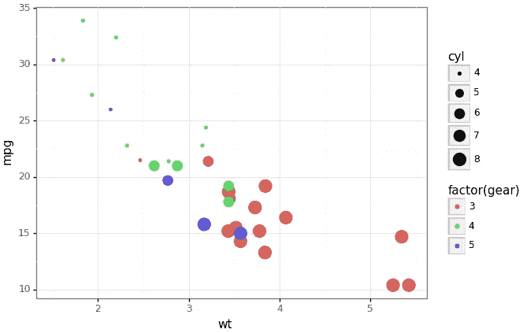

可视化向我们展示了美学在帮助我们在单个绘图中可视化多个数据维度方面有多么强大。很明显，`**cyl**`(气缸)数量较高的汽车的`**gears**`数量较低，反过来，它们的`**wt**`较高而`**mpg**`较低。

或者，我们也可以使用颜色和刻面来描述四维数据，而不是大小，如下例所示。

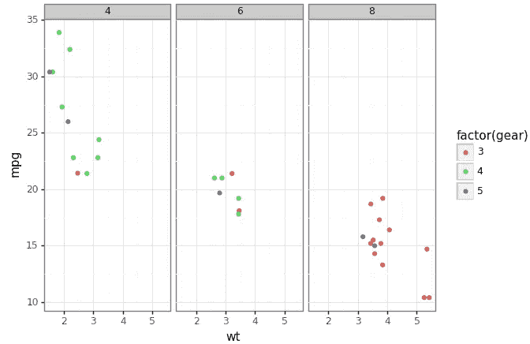

刻面无疑是构建有效数据可视化的最强大的组件之一，如上面的可视化所示，我们可以清楚地看到具有较高`**cyl**`计数的汽车具有较低的`**gear**`计数，并且趋势与之前的颜色和尺寸可视化相似。

## 可视化数据维度和统计数据

为了可视化数据维度和一些相关的统计数据(比如拟合线性模型)，我们可以在分层语法中利用统计数据和其他组件。

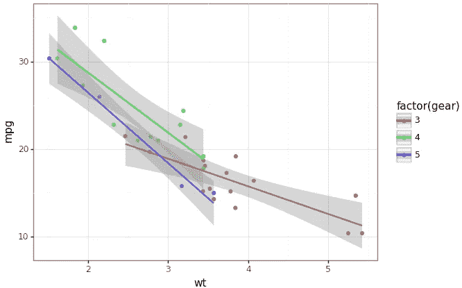

这使我们能够看到基于`**wt**`的`**mpg**`的线性模型趋势。

## 可视化五维空间

要在五维空间中可视化数据，您现在已经知道该如何操作了！我们将利用美学的力量，包括颜色、尺寸和小平面。

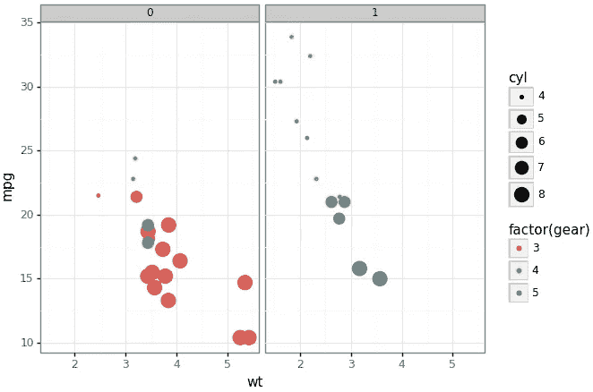

这里我们用`**am**`作为刻面，其中 0 表示自动挡的车，1 表示手动挡的车。该图显示，与自动变速器的汽车相比，手动变速器的汽车具有更高的档位数量。此外，大多数气缸数量较多的汽车(`**cyl**`)都配有自动变速器。其他见解与我们在前面的情节中观察到的相似。

## 可视化六维(6-D)

为了在六个维度上可视化数据，我们可以在 y 轴*上添加一个额外的面*，在 x 轴*上添加一个面*，并添加颜色和大小作为美观。

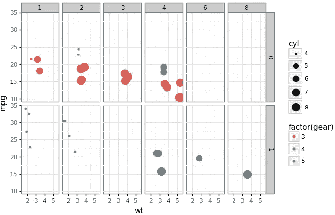

我们将变速器(`**am**`)表示为 0(自动)和 1(手动)，作为在 *y 轴*上的一个小平面，将化油器数量(`**carb**`)表示为在 *x 轴*上的一个小平面，此外，使用与我们之前的绘图类似的其他美学来表示其他尺寸。从上面的图像中可以看出一个有趣的现象，档位较多的汽车有手动变速器(`**am**`)和较多的化油器(`**carb**`)。你注意到其他有趣的见解了吗？

## 我们能再高点吗？

紧迫的问题是，我们能超越六维吗？当然，突破二维渲染设备的限制来可视化更多的数据维度肯定会变得越来越困难。

一种方法是使用更多的面和支线剧情。除此之外，如果数据集具有时间方面，也可以使用时间的概念，如下例所示。

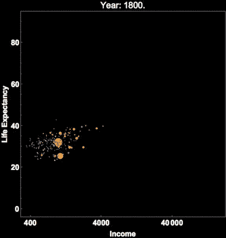

Hans Rosling’s famous visualization of global population, health and economic indicators

这描绘了 [***汉斯·罗斯林的***](https://www.ted.com/speakers/hans_rosling?language=en) 著名的描绘全球各国人口、健康和各种经济指标的可视化作品。这也在 [**官方 ted 大会**](https://www.ted.com/talks/hans_rosling_shows_the_best_stats_you_ve_ever_seen) 上展示过，如果大家还没做过，我推荐大家去看看！

这将为您提供一个很好的视角，让您了解如何利用图形的分层语法来可视化多维数据。

# 结论

正如我一再提到的，数据可视化既是一门科学，也是一门艺术。本文将为您提供足够的动力和示例，让您开始理解和利用图形框架的分层语法，在多维数据上构建自己的有效可视化。

本文中使用的所有代码都可以作为 [**Jupyter 笔记本**](https://github.com/dipanjanS/art_of_data_visualization/blob/master/Understanding%20Grammar%20of%20Graphics%20-%20Python.ipynb) 以及其他内容和幻灯片在 [**my GitHub 资源库**](https://github.com/dipanjanS/art_of_data_visualization) 中获得。

 [## 数据可视化艺术

### 多维数据的有效可视化艺术

github.com](https://github.com/dipanjanS/art_of_data_visualization) 

我确实讲述了如何在稍微复杂一些的数据上使用 Python 中最先进的数据可视化框架(如`**seaborn**`和`**matplotlib**`)来可视化多维数据。如果你有兴趣，下面的文章 中的 [***应该可以帮你入门。***](/the-art-of-effective-visualization-of-multi-dimensional-data-6c7202990c57)

 [## 多维数据的有效可视化艺术

### 有效数据可视化的策略

towardsdatascience.com](/the-art-of-effective-visualization-of-multi-dimensional-data-6c7202990c57) 

我最近在 2018 年 ODSC[**的一次会议上谈到了这些文章的主要部分。你可以在这里查看**](https://india.odsc.com/) **[**完整的演讲议程和幻灯片**](https://confengine.com/odsc-india-2018/proposal/6846/the-art-of-effective-visualization-of-multi-dimensional-data-a-hands-on-approach) 。一旦发布，我会在 YouTube 上发布这次会议的演讲！**

 [## 多维数据的有效可视化艺术-实践方法- ODSC 印度…

### 描述性分析是与数据科学项目或…相关的任何分析生命周期的核心组成部分之一

confengine.com](https://confengine.com/odsc-india-2018/proposal/6846/the-art-of-effective-visualization-of-multi-dimensional-data-a-hands-on-approach) 

有反馈给我吗？或者有兴趣与我一起从事研究、数据科学、人工智能，甚至发表一篇关于 TDS 的文章？可以在[**LinkedIn**](https://www.linkedin.com/in/dipanzan/)**上联系我。**

 [## Dipanjan Sarkar -数据科学家-英特尔公司| LinkedIn

### 查看 Dipanjan Sarkar 在世界最大的职业社区 LinkedIn 上的个人资料。Dipanjan 有 6 份工作列在…

www.linkedin.com](https://www.linkedin.com/in/dipanzan/) 

感谢 [*杜巴*](https://www.linkedin.com/in/durba-dutta-bhaumik-44532ab1/) 编辑本文。