# 一个全面的机器学习工作流程，使用 R

> 原文：<https://towardsdatascience.com/a-comprehensive-machine-learning-workflow-with-multiple-modelling-using-caret-and-caretensemble-in-fcbf6d80b5f2?source=collection_archive---------6----------------------->


# 介绍

我将使用一个非常有趣的数据集，该数据集出现在布雷特·兰茨(Brett Lantz)写的《带 R 的机器学习》(R[*Packt Publishing*](https://www.packtpub.com/))一书中。我的意图是通过执行一个完全监督的机器学习工作流来扩展对这个数据集的分析，这个工作流我已经设计了一段时间，以便帮助我用一种系统的、有条不紊的方法来解决任何类似的问题。

如果你认为这不是什么新鲜事，那么你绝对是对的！我在这里没有提出任何新的东西，只是确保我有所有必要的工具来遵循一个完整的过程，而不会留下任何大的细节。希望你们中的一些人也会发现它很有用，并确信你们会从我的部分和/或你们会以不同方式做的事情中发现一些判断错误。欢迎给我留言，帮助我改进！

让我们向前一跳，开始了解我们将处理哪些信息:

# 混凝土强度建模

从书中:

*“在工程领域，准确估计建筑材料的性能至关重要。为了制定建筑、桥梁和道路施工中所用材料的安全指南，需要进行这些评估。
估算混凝土的强度是一项特别有趣的挑战。尽管混凝土几乎用于每一个建筑项目，但由于各种成分以复杂的方式相互作用，混凝土的性能差异很大。因此，很难准确预测最终产品的强度。给定输入材料的成分列表，可以可靠地预测混凝土强度的模型可以产生更安全的施工实践。*

*为了进行这一分析，我们将利用由叶一诚捐赠给 UCI 机器学习数据仓库(* [*、http://archive.ics.uci.edu/ml*](http://archive.ics.uci.edu/ml)*)的混凝土抗压强度数据。*

*根据该网站，混凝土数据集包含 1030 个混凝土实例，具有描述混合物中使用的成分的八个特征。这些特征被认为与最终抗压强度有关，它们包括产品中使用的水泥、矿渣、灰、水、超塑化剂、粗骨料和细骨料的量(以千克/立方米计)以及老化时间(以天计)。”*

# 机器学习工作流程

我发现将工作流程分成 6 个阶段最适合我。在这个意义上，我将把这个实例描述为:
1)设置
2)探索性数据分析
3)特征工程
4)数据准备
5)建模
6)结论

在实践中，我从一个跳到另一个，很多时候不考虑顺序，而且经常是循环的。因此，请将此视为一个初始结构，更像是一份清单，而不是一步一步的指南。

这份清单相当全面，涵盖了你在[](https://en.wikipedia.org/wiki/Supervised_learning)*监督学习 [*分类*](https://en.wikipedia.org/wiki/Statistical_classification) 和 [*回归*](https://en.wikipedia.org/wiki/Regression_analysis) 问题中要遵循的大部分内容。在实践中，你很可能会跳过列表中的一些要点，因为有些事情是你为分类问题所做的，而不是为回归问题所做的，反之亦然。甚至有些有时候还有点多余(虽然在我看来双重检查总是有用的)。我相信随着更多的实践和经验，这个列表会得到调整，我希望我也能在未来再次分享。*

*我将把自己限制在简短直接的回答上，并在必要时扩展。否则我担心我会让任何人逗留太久！*

*你会看到，即使我包括了完整的清单，在许多情况下，我们并不一定要做什么。这是因为这个数据集非常简单。这感觉有点像作弊，但是，我会确保提到为什么我们不必做任何事情，以及检查点背后的想法。*

*我想提到的最后一件事是，当我到达*建模*阶段时，我将改变我的方法，展示一些有用的建模工具，包括 R 包 *caret* 和 *caretEnsemble* 。因此，我不是一步一步地尝试一些基线模型，然后尝试一些更高级的模型，通过超参数调整和正则化来减少过度拟合，而是一次训练一堆模型，因为这使我能够使最后一个阶段更加简洁明了，便于解释。还因为*建模*阶段是一个人喜欢做自己的事情并通过使用不同的方法获得创造力的阶段。在我看来，这个*清单*对于阶段 1 至 4 非常重要，但从阶段 5 开始，它可能会变得不那么严格。*

*说够了，我们开始吧:*

*在这里找到工作文件和代码:[https://github.com/gabrielpierobon/ML-workflow-caret](https://github.com/gabrielpierobon/ML-workflow-caret)*

## *1)设置*

> *1.1)我们试图预测什么？*

*我们需要为工程领域准确地估计建筑材料的性能。*

> *1.2)这是什么类型的问题？监督学习还是非监督学习？分类还是回归？二元还是多类？单变量还是多变量？*

*这是一个[多元](https://en.wikipedia.org/wiki/Multivariate_analysis)监督机器学习问题，我们必须预测数字结果，因此我们将使用回归技术。*

> *1.3)我们有什么类型的数据？*

*我们的数据是“csv”格式。它显示了带有列名的标题行。它似乎只包含数字信息。*

> *1.4)导入数据集*

*我们可以简单地用下面的代码加载它:*

```
*concrete <- read.csv(“/Users/Gabriel Pierobon/Desktop/Datasets para cargar/concrete.csv”)#use your own directory!*
```

*这是我们数据集的大小:*

```
*dim(concrete)
[1] 1030    9*
```

*1，030 行 9 列，其中一列是我们的响应/目标变量。*

*我们可以看到它是作为数据框导入的，这是我们处理这些数据所需的格式:*

```
*class(concrete)
[1] "data.frame"*
```

*我们还可以检查我们的列名是否被正确导入。*

```
*names(concrete)*
```

*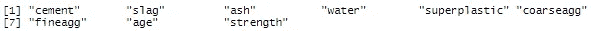*

*从该列表中，我们将`strength`确定为我们的*响应/目标变量*。*

*我们可以得出结论，我们的数据被正确地导入，从而结束我们的 s*setting*阶段。*

*在此之前，我想要求我们所有的图书馆。为了提高这本书的可读性，在乞讨的时候一次完成是很有用的:*

```
*library(dplyr)
library(ggplot2)
library(PerformanceAnalytics)
library(ggthemes)
library(corrplot)
library(car)
library(psych)
library(caret)
library(caretEnsemble)
library(doParallel)*
```

*考虑到这一点，让我们继续探索性的数据分析:*

## *2) [探索性数据分析](https://en.wikipedia.org/wiki/Exploratory_data_analysis) (EDA)*

> *2.1)查看数据(str 或 dplyr 的一瞥)。第一眼。有什么奇怪的吗？*

*我们想要再次检查我们在*设置*阶段所做的事情的第一个方法是快速查看我们的完整数据集。我们这样做:*

```
*View(concrete)*
```

*这将显示一个包含数据集的窗口。我喜欢从上到下、从左到右快速查看，以确保数据加载正确。这也是一种快速而肮脏的方式来检测一眼就能发现的问题。对于非常大的数据集，您不希望这样做。*

*接下来，我们将对我们的数据进行*浏览*并观察数据帧的前几行:*

```
*glimpse(concrete)*
```

**

```
*head(concrete)*
```

*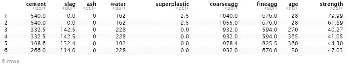*

> *2.2)它是一个“整洁”的数据集吗？需要“聚集”还是“分散”呢？它是以一种我们可以合作的方式呈现的吗？*

*我们需要我们的数据以行的形式呈现，以列的形式呈现特征。幸运的是，这是数据集的情况，所以我们不必转换它。否则，我们将不得不使用某种功能来*旋转*数据框以适应我们的需要([参考该网站了解更多关于那个](https://tidyr.tidyverse.org/))*

> *2.3)行名和列名可以吗？我们应该改变他们吗？*

*我们已经检查过这些是如何装载的。我们需要更新/改变什么来更清楚地了解我们的变量吗？我觉得不是这样的，我们可以继续。这里的想法是确保我们舒适地使用我们的特性名称，避免不必要的长名称或任何其他令人困惑的情况。*

> *2.4)检查数据类型。他们还好吗？如果没有，转换*

*正如我们所看到的，我们所有的变量都是双*类型，除了变量`age`是整数*。好在我们什么都不用换算！为了避免加载数据时出现某种类型的错误，我们检查这一点非常重要。有时数字列中的单个字符会导致整个列作为*字符*被加载。*

> *2.5)我们的响应/目标变量是什么？阶层失衡？研究一下*

*我们的响应变量是`strength`。让我们来看看一些有用的统计数据:*

```
*summary(concrete$strength)*
```

*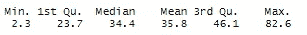*

*我们可以看到它从 2.3 到 82.6 不等。*中值*和*平均值*非常接近，但是由于*中值*实际上更小，这导致变量分布的[稍微向右倾斜](https://en.wikipedia.org/wiki/Skewness)。*

*我们可以观察到，使用 *ggplot2* 的绘图:*

*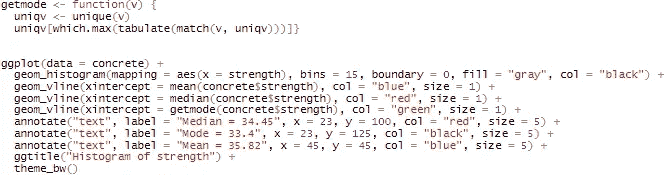**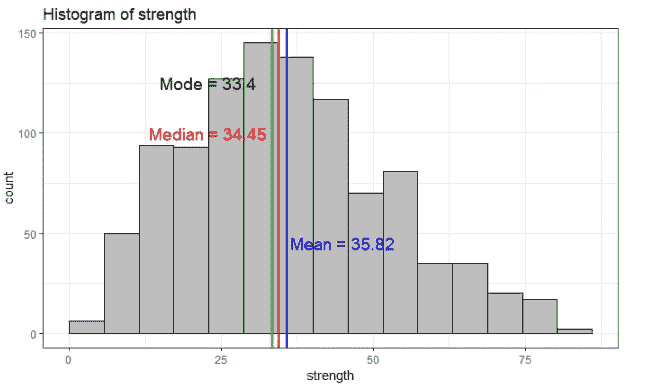*

*正如我们所看到的，`strength`变量的分布并不完全符合[正态分布](https://en.wikipedia.org/wiki/Normal_distribution)，但是我们还是要继续下去。这应该不成问题，因为很近。QQ 图也有助于常态的视觉分析(我把这个留给你)*

*最后，由于这是一个回归问题，我们不必担心阶级不平衡。在分类中，你希望在你的响应变量中有平衡的类([这里有一个关于类不平衡的好帖子](/dealing-with-imbalanced-classes-in-machine-learning-d43d6fa19d2))*

> *2.6)其余功能。汇总统计数据。了解您的数据*

*这里，我们将统计分析扩展到我们的其他变量/特征。我们希望关注最小*值*和最大*值*(这是对潜在异常值的第一次检查)。同样，*意味着*和*的中位数*的差异是值得关注的。我们希望所有变量尽可能遵循正态分布。*

```
*summary(concrete)*
```

**

*我们可以根据我们的分析绘制相关图。这将为我们提供一个图表，显示所有变量之间的相关性。这也让我们第一次思考，我们是否需要模型中的所有变量。我们不希望我们的特征变量之间呈现高相关性。我们稍后会处理这件事。*

```
*corrplot(cor(concrete), method = “square”)*
```

*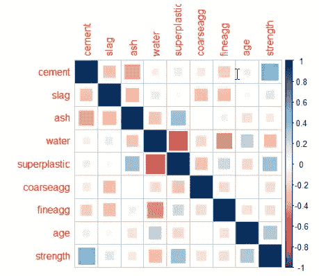*

*另一种看待所有这些的好方法是用这个相关图:*

```
*chart.Correlation(concrete)*
```

*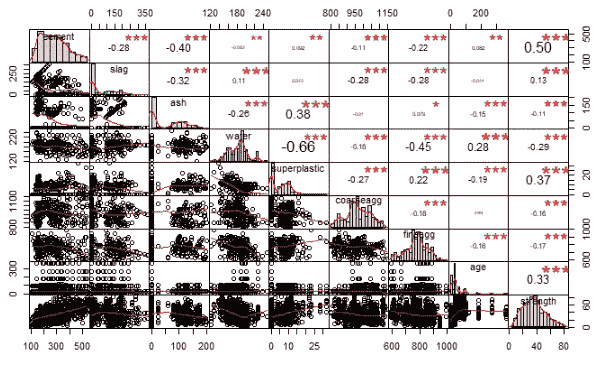*

*在其中一条对角线上，我们可以看到每个特征的分布。并不是所有的都类似于常态，所以我们将在后面处理这个问题。*

*在这一点上，我的第一个结论是，变量`ash`与我们的响应变量`strength`具有低相关性，而与八个其他特征中的四个具有高相关性。因此，它是一个很有可能被删除的对象，我们稍后也会谈到这一点。*

> *2.7)分类数据/因素:创建计数表以了解不同的类别。全部检查一下。*

*在这种情况下，我们不使用分类特征。你要确保你理解你的类别，有时拼写错误会给*因子*变量带来问题。*

*我们可以继续前进。*

> *2.8)不必要的列？我们可以很快理解我们不需要的列。放下它们*

*这里我们想寻找完全无用的列。数据集中出现的任何信息都是毫无意义的，我们可以决定是否应该删除。附加索引列、无信息字符串列等。对于该数据集，情况并非如此。只要导入数据集，就可以很好地做到这一点，此时不需要特别做。*

> *2.9)检查是否有缺失值。多少？在哪里？删除它们？归咎于他们？*

*让我们首先对 NAs 做一个全面的检查:*

```
*anyNA(concrete)
[1] FALSE*
```

*精彩！整个集合中没有缺失值！让我向您展示一种方法，我们可以为每一列检测到这一点:*

```
*sapply(concrete, {function(x) any(is.na(x))})*
```

*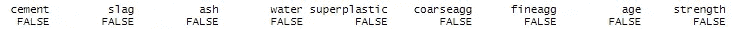*

*([一些处理缺失值的工具](https://www.statmethods.net/input/missingdata.html)*

> *2.10)检查异常值和其他不一致的数据点。箱线图。用于异常值检测的 DBSCAN？*

*在我看来，离群点检测更像是一门手艺。我真的很喜欢使用 DBSCAN 聚类进行异常值检测的方法，但我不打算继续这样做，所以我不会过度扩展这个分析。DBSCAN 是一种聚类算法，可以检测数据中的*噪声*点，并且不会将它们分配给任何聚类。我发现异常值检测非常有吸引力(更多关于 DBSCAN 的信息，请点击*

*相反，我将继续绘制一个箱线图，并尝试处理我认为与视觉相关的点:*

```
*boxplot(concrete[-9], col = “orange”, main = “Features Boxplot”)*
```

*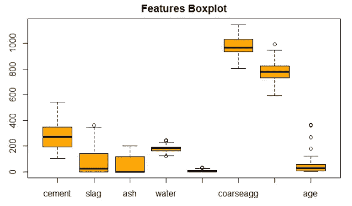*

*我们看到有几个潜在的异常值，但是我认为`age`特性可能是最有问题的。让我们孤立地来看:*

```
*boxplot(concrete$age, col = “red”)*
```

*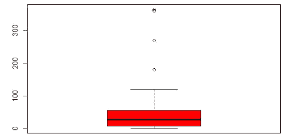*

*这仅仅是 4 个异常值吗？如果是这样，我们可以摆脱他们。还是不应该？我们来看看这些值是什么，有多少个。*

```
*age_outliers <- which(concrete$age > 100)
concrete[age_outliers, “age”]*
```

*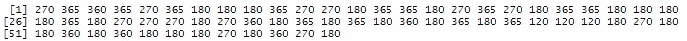*

*我的天啊。所以他们有 62 个，而不是只有 4 个！显然，这只是因为相同的数字重复了几次。这让我觉得这个`age`点其实是有关联的，我们不想去掉。我们的 1，030 个数据集中的 62 个数据点似乎太高，不能简单地删除(我们会丢失大量信息)。*

> *2.11)检查数字数据中的多重共线性。差异通货膨胀系数(VIF)*

*我们已经在之前展示的相关图中看到，某些特征之间似乎存在显著的相关性。我们希望确保[多重共线性](https://en.wikipedia.org/wiki/Multicollinearity)不会成为阻碍我们前进的问题。为此，我们将计算一个名为[方差膨胀因子(VIF)](https://en.wikipedia.org/wiki/Variance_inflation_factor) 的分数，该分数测量回归系数的方差因模型中的多重共线性而膨胀的程度。如果 VIF 得分大于 10，则强烈建议使用多重共线性，我们应该尝试去除导致多重共线性的要素。*

*首先，我们为我们的目标变量生成一个简单的[线性回归模型](http://r-statistics.co/Linear-Regression.html),用相互特征来解释。之后，我们在模型对象上调用函数`vif()`,并查看命名列表输出:*

```
*simple_lm <- lm(strength ~ ., data = concrete)
vif(simple_lm)*
```

*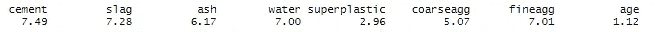*

*尽管有许多变量得分为 5 或更高，但没有一个变量超过阈值*10，因此我们认为多重共线性不是一个大问题。然而，有些人会争辩说，拥有这么多分数为 7 的特性确实是个问题。我们现在不会担心这个。**

*至此，我们认为*探索性数据分析(EDA)* 阶段已经结束，我们继续进行特性工程。你可以不同意这件事结束了！我相信还有很多探索要做。*

## *3)特征工程*

*对于数据科学家来说，特征工程也被认为是一项非常重要的技能。它包括从数据集中的现有要素生成新要素。这可以简单到从*字符串*列中提取一些*日期*信息，或者产生 [*交互术语*](https://en.wikipedia.org/wiki/Interaction_(statistics)) 。此外，它肯定需要一定程度的主题专业知识和领域知识，因为提出新的信息特征是数据和整个应用领域的本质所固有的。*

*在这里，我们将超快，因为我们的数据似乎已经非常翔实和完整(工程师可能不同意！).*

*我想说的是，设计新要素很可能需要我们重复之前已经完成的一些分析，因为我们不想引入给数据集增加噪声的新要素。所以请记住，我们必须总是回头再看一遍我们的清单，并确定我们是否需要再分析一次。*

> *3 .1)创建新的有用特征。互动术语。基础数学和统计学。使用 if-else 结构创建类别*

*因为我不是工程领域的主题专家，所以我不会从交互术语中创建新特性。我只限于验证是否有任何变量需要任何类型的转换。*

*我想做的第一件事是检查两个变量，它们似乎有不寻常的分布。就是`age`和`superplastic`的情况。让我们绘制它们的原始形式，并在下面记录(红色)。*

```
*par(mfrow = c(2,2))hist(concrete$age)
hist(concrete$superplastic)
hist(log(concrete$age), col = “red”)
hist(log(concrete$superplastic), col = “red”)*
```

*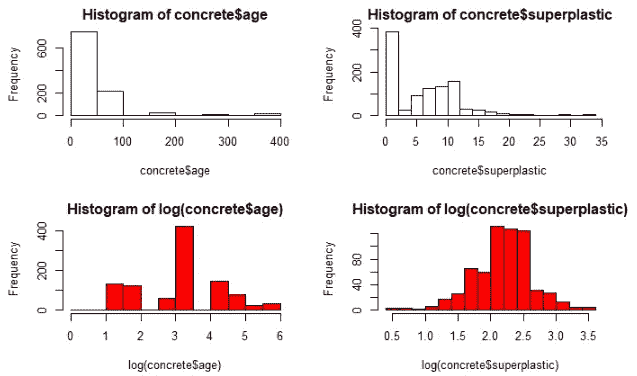*

*虽然我觉得将`age`转换成对数形式很舒服，但是在`superplastic,`的观察值为 0 的情况下，当取 0 的[对数时，我会有一些问题，所以我会取对数，然后手动将它们设置为 0。](https://www.rapidtables.com/math/algebra/logarithm/Logarithm_of_0.html)*

*下面是转换这两种功能的代码:*

```
*concrete$age <- log(concrete$age)concrete$superplastic <- log(concrete$superplastic)
concrete$superplastic <- ifelse(concrete$superplastic == -Inf, 0,  
                                concrete$superplastic)head(concrete)*
```

*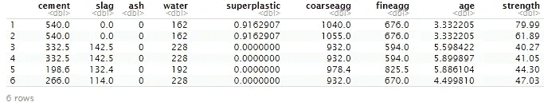*

*注:我花了相当多的时间在这一点上试图创建一个新的宁滨的`superplastic`功能，原来的`superplastic`功能分为 3 个数字类别。然而，就解释目标变量的重要性而言，我没有取得多大成功。我不会展示这些尝试，但只知道我确实尝试了一段时间，但没有成功。失败也是学习的一部分！*

> *3.2)为分类特征创建虚拟模型。优选地使用一位热编码*

*我们目前不使用分类特征，因此将跳过这一部分。然而，如果你看到了一些因子列，你必须确保你的算法能够处理它们，否则就对它们进行[一次热编码](https://medium.com/@michaeldelsole/what-is-one-hot-encoding-and-how-to-do-it-f0ae272f1179)。*

> *3.3)我们可以使用正则表达式从字符串列中提取一些重要的文本吗？*

*我们目前不处理 sting 数据，因此将跳过这一部分。这应该是一个非常有用的工具，当你有一些字符类型的相关信息，你可以从中创建新的有用的类别。*

*谢天谢地，我们不必经历这一切！但是，如果我们要处理这类信息，最后三个部分是必须的。我将确保分析一个数据集，在其中我可以展示一些内容。*

*让我们进入数据准备阶段:*

## *4)数据准备*

> *4.1)手动特征选择。移除有噪声、无信息、高度相关或重复的要素。*

*这是我们在此工作流中第二次花时间查看我们的要素，并检测是否有任何要素信息不够丰富，或者由于引入了多重共线性等问题而应被删除。*

*正如我已经决定的那样，我将首先放弃`ash`功能(在尝试了一些基线模型后，你可能想要放弃它并删除它，如果它对性能没有帮助，我已经这样做了，所以我现在将放弃它，正如我最初的评估一样)*

```
*concrete$ash <- NULLhead(concrete)*
```

*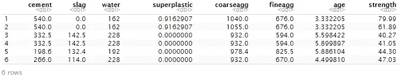*

*除此之外，其他的我就不拆了。*

> *4.2)如果需要，转换数据。如果需要，缩放或规格化。*

*我们将使用的大多数算法要求我们的数字特征被缩放或归一化([原因如下](https://medium.com/greyatom/why-how-and-when-to-scale-your-features-4b30ab09db5e)*

*我们不会在这个精确的部分这样做，但留待以后，因为*脱字符*允许我们在它的*训练*功能内做一些*预处理*。这特别有用，因为当向我们展示预测和结果时，该算法会自动转换回其原始比例。如果我在这里手动归一化数据集，那么我必须手动转换回预测。*

> *4.3)自动特征提取。降维(主成分分析，NMF，t-SNE)*

*如果手动移除特征不够简单，但我们仍然认为数据集包含太多特征或太多相关特征，我们可以应用[维度缩减](https://en.wikipedia.org/wiki/Dimensionality_reduction)技术。[主成分分析](https://en.wikipedia.org/wiki/Principal_component_analysis)就是其中的一种技术，这种技术非常有用，既可以简化我们的数据集，也可以永久消除多重共线性的问题。*

*[非负矩阵分解(NMF)](https://en.wikipedia.org/wiki/Non-negative_matrix_factorization) 和 [t-SNE](https://en.wikipedia.org/wiki/T-distributed_stochastic_neighbor_embedding) 是另外两种有用的降维技术。*

*我们的数据集中只有 8 个特征，1 个已经被手动删除，我不认为我们需要进一步降低维数。*

> *4.4)我们的数据集是随机的吗？*

*我们不确定它是随机的，所以我们将随机播放以防万一:*

```
*set.seed(123)
concrete_rand <- concrete[sample(1:nrow(concrete)), ]
dim(concrete_rand)*
```

> *4.5)定义评估方案:我们有多少样本？坚持方法。需要交叉验证吗？*

*我们有 1030 个样本，所以这绝对是一个小数据集。我们将数据集分为训练集和测试集，并确保在训练模型时使用[交叉验证](https://en.wikipedia.org/wiki/Cross-validation_(statistics))。通过这种方式，我们可以确保尽可能好地利用我们的少量观察数据。*

> *4.6)将数据集分成训练和测试集(为可复制性设置种子)*

*我们首先创建一组预测值和一组目标变量*

```
*X = concrete_rand[, -8]
y = concrete_rand[, 8]*
```

*我们检查一切正常:*

```
*str(X)*
```

*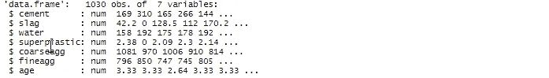*

```
*str(y)*
```

**

*然后，我们继续将新的`X`(预测值)和`y`(目标值)集分成训练集和测试集。*

*注意:您不必将集合分开，并且可以使用*公式*方法完美地进行。我只是更喜欢这样做，因为这样我确信我的过程与我如何使用 Python 的 scikit-learn 是一致的。*

*我们将使用 *caret* 的`createDataPartition()`函数，它为我们生成分区索引，我们将使用它们来执行分割:*

```
*set.seed(123)part.index <- createDataPartition(concrete_rand$strength, 
                                  p = 0.75,                         
                                  list = FALSE)X_train <- X[part.index, ]
X_test <- X[-part.index, ]
y_train <- y[part.index]
y_test <- y[-part.index]*
```

*所以现在我们有 4 套。两个*预测器*集合拆分为*序列*和*测试*，两个*目标*集合也拆分为*序列*和*测试*。它们都使用相同的索引进行分区。*

*再一次，让我们检查一切工作正常:*

```
*str(X_train)
str(X_test)
str(y_train)
str(y_test)*
```

*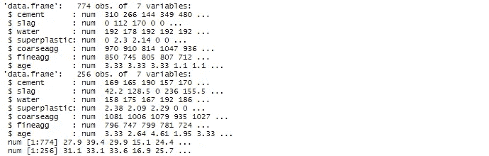*

*好吧！我们可以走了！现在到建模阶段！*

## *5)建模*

*正如我在导言中提到的那样，在这一阶段，我将改变我的方法，不再一一列举要做的事情，而是总结我们将如何进行。*

*   *我们将使用包[](https://cran.r-project.org/web/packages/caretEnsemble/caretEnsemble.pdf)**以便同时训练一系列模型***
*   ***由于 [*caret*](https://cran.r-project.org/web/packages/caret/caret.pdf) 的功能，这将允许我们对每个模型使用相同的 5 折交叉验证***
*   **我们将允许*并行处理*来提高速度**
*   **我们不会关注算法的本质。我们只是使用它们并对结果进行评论**
*   **我们将使用一个[线性模型](https://en.wikipedia.org/wiki/Linear_regression)，一个[具有径向核的支持向量机](https://en.wikipedia.org/wiki/Support_vector_machine)，一个[随机森林](https://en.wikipedia.org/wiki/Random_forest)，一个[梯度推进](https://en.wikipedia.org/wiki/Gradient_boosting)基于树的模型和一个[梯度推进](https://en.wikipedia.org/wiki/Gradient_boosting)基于线性的模型**
*   **我们不会进行手动[超参数调整](https://en.wikipedia.org/wiki/Hyperparameter_optimization)，相反，我们将允许*插入符号*在每个模型中进行一些默认调整**
*   **我们将通过训练集和测试集来比较性能，重点关注作为我们度量标准的 [RMSE](https://en.wikipedia.org/wiki/Root-mean-square_deviation) (均方根误差)**
*   **我们将使用来自 *caretEnsemble* 包的一个非常酷的功能，将集合模型列表，然后将它们堆叠起来，以尝试产生模型的最终组合，希望能进一步提高性能**

**所以我们继续吧。**

**我们首先在`trainControl()`中设置并行处理和交叉验证**

```
**registerDoParallel(4)
getDoParWorkers()set.seed(123)my_control <- trainControl(method = “cv”, *# for “cross-validation”*
                           number = 5, *# number of k-folds*
                           savePredictions = “final”,
                           allowParallel = TRUE)**
```

**然后，我们通过调用我们的`X_train`和`y_train`集合，使用`caretList()`函数训练我们的模型列表。我们用上面创建的`trainControl`对象指定`trControl`，并将`methodList`设置为算法列表(检查[脱字符包信息](https://cran.r-project.org/web/packages/caret/caret.pdf)以了解哪些模型可用以及如何使用它们)。**

```
**set.seed(222)model_list <- caretList(X_train,
                        y_train,
                        trControl = my_control,
                        methodList = c(“lm”, “svmRadial”, “rf”, 
                                       “xgbTree”, “xgbLinear”),
                        tuneList = NULL,
                        continue_on_fail = FALSE, 
                        preProcess = c(“center”,”scale”))**
```

*   **我用的是`X_train`和`y_train`，但是你完全可以用`y ~ x1 + x2 + … + xn`公式来代替**
*   **`my_control`指定 5 重交叉验证并激活平行处理**
*   **`tuneList`为假，因为我们没有指定手动超参数调整**
*   **`continue_on_fail`设置为 FALSE，因此如果出现问题，它将停止**
*   **在`preProcessing`中是我们缩放数据集的地方。我们选择“*中心*和“*刻度***

**现在我们的`caretList`已经训练好了，我们可以看看结果了。我们可以访问每个单独的模型。这是 SVM 的结果:**

```
**model_list$svmRadial**
```

**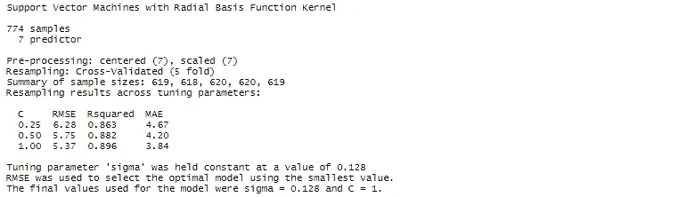**

**请注意，caret 尝试对模型的可用参数进行一些自动调整，并使用 RMSE 作为性能度量来选择最佳模型。**

**这对于我们的型号列表中的其他型号都是一样的。我们不会逐一介绍。那是给你检查的！**

**让我们直接进入我们的目标，即找到具有最低 RMSE 的模型。我们首先对训练数据进行评估。**

```
**options(digits = 3)model_results <- data.frame(
 LM = min(model_list$lm$results$RMSE),
 SVM = min(model_list$svmRadial$results$RMSE),
 RF = min(model_list$rf$results$RMSE),
 XGBT = min(model_list$xgbTree$results$RMSE),
 XGBL = min(model_list$xgbLinear$results$RMSE)
 )print(model_results)**
```

**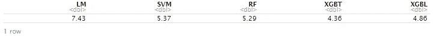**

**就 RMSE 而言， *xgbTree* 模型提供了最好的结果，得分为 4.36(记住平均强度为 35.8)。**

***caretEnsemble* 提供了对该模型列表的性能进行重新采样并绘制的功能:**

```
**resamples <- resamples(model_list)dotplot(resamples, metric = “RMSE”)**
```

**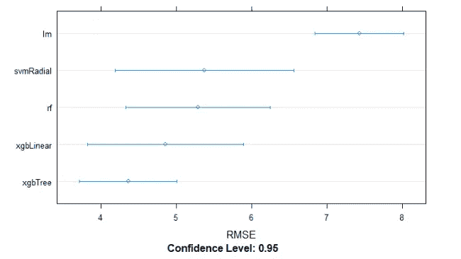**

**我们还可以看到，`xgbTree`与其他型号相比，差异也更小。**

**接下来，我们将尝试通过组合我们的`model_list`来创建一个新模型，以便找到可能的最佳模型，希望这是一个采用我们已经训练的 5 个模型中的最佳模型并优化性能的模型。**

**理想情况下，我们将集成彼此相关性较低的模型。在这种情况下，我们将看到存在一些高度相关性，但我们将选择继续，只是为了展示这一特征:**

```
**modelCor(resamples)**
```

**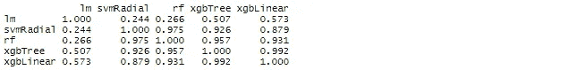**

**首先，我们使用`caretEnsemble()`训练我们的模型集合，这将与所有模型执行线性组合。**

```
**set.seed(222)
ensemble_1 <- caretEnsemble(model_list, 
                            metric = “RMSE”, 
                            trControl = my_control)
summary(ensemble_1)**
```

**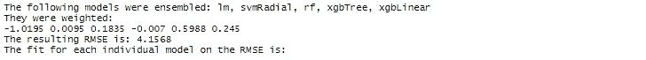****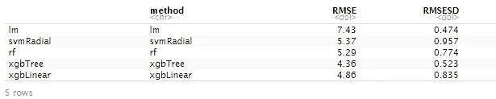**

**如我们所见，我们设法将训练集的 RMSE 减少到 4.156**

**这是我们合奏的一张图表**

```
**plot(ensemble_1)**
```

**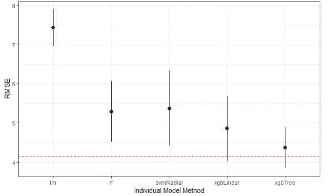**

**红色虚线是该乐团的 RMSE 演出。**

**接下来，我们可以更具体地尝试使用其他算法与`caretStack()`进行集成。**

**注:我尝试了一些型号，但无法提高性能。我将展示其中一个在训练数据上产生相同性能的例子。无论如何，我们都将使用这两个集合，以便检查哪一个在处理看不见的数据时做得更好。**

```
**set.seed(222)ensemble_2 <- caretStack(model_list, 
                         method = “glmnet”, 
                         metric = “RMSE”, 
                         trControl = my_control)print(ensemble_2)**
```

**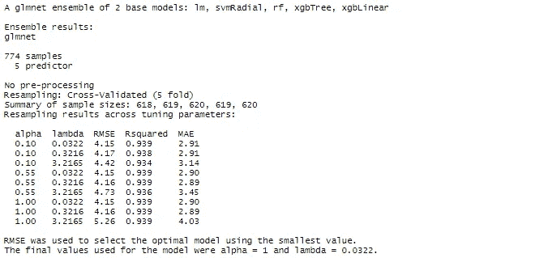**

**注意使用 *glmnet* 的最佳模型的 RMSE 是 4.15，与我们的第一个集合相同。**

**最后，是时候评估我们的模型在看不见的数据上的性能了，这些数据在我们的测试集中。**

**我们首先预测每个模型的测试集，然后计算 RMSE:**

```
**# PREDICTIONS
pred_lm <- predict.train(model_list$lm, newdata = X_test)
pred_svm <- predict.train(model_list$svmRadial, newdata = X_test)
pred_rf <- predict.train(model_list$rf, newdata = X_test)
pred_xgbT <- predict.train(model_list$xgbTree, newdata = X_test)
pred_xgbL <- predict.train(model_list$xgbLinear, newdata = X_test)
predict_ens1 <- predict(ensemble_1, newdata = X_test)
predict_ens2 <- predict(ensemble_2, newdata = X_test)# RMSE
pred_RMSE <- data.frame(ensemble_1 = RMSE(predict_ens1, y_test),
                        ensemble_2 = RMSE(predict_ens2, y_test),
                        LM = RMSE(pred_lm, y_test),
                        SVM = RMSE(pred_svm, y_test),
                        RF = RMSE(pred_rf, y_test),
                        XGBT = RMSE(pred_xgbT, y_test),
                        XGBL = RMSE(pred_xgbL, y_test))print(pred_RMSE)**
```

****

**令人惊讶的是，`xgbLinear`模型在测试集上的表现优于所有其他模型，包括我们的`ensemble_1`和匹配`ensemble_2`的性能**

**我们还观察到，一般来说，与训练集相比，在性能上存在差异。这是可以预料的。我们仍然可以尝试手动调整超参数，以减少一些过度拟合，但在这一点上，我相信我们已经在看不见的数据上实现了非常强大的性能，我将在未来的出版物中进一步优化。**

**我想展示的最后一件事是*可变重要性*。为了做到这一点，我将单独计算我们的`xgbLinear`模型，表明我想保留变量重要性，然后绘制它:**

```
**set.seed(123)xgbTree_model <- train(X_train,
                       y_train,
                       trControl = my_control,
                       method = “xgbLinear”,
                       metric = “RMSE”,
                       preProcess = c(“center”,”scale”),
                       **importance = TRUE)**plot(varImp(xgbTree_model))**
```

**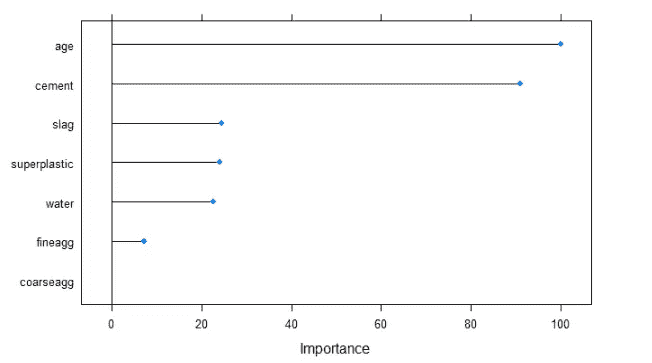**

**这里我们可以看到变量`age`和`cement`对混凝土的`strength`预测的高度重要性。这是意料之中的，因为我们已经在最初的相关图中观察到它们之间的高度相关性。**

**使用`age`的日志也让我们提高了可预测性(单独验证)。**

**注意图表中出现的一些“不重要”的特征。我们应该放弃他们吗？我们能否在不影响性能的情况下简化模型？如果我们出于任何原因需要一个更简单的模型，我们当然可以继续努力。**

## **6)结论**

**这是一段不寻常的旅程！我们进行了大多数必要的步骤，以便执行一个完整而仔细的机器学习工作流程。尽管我们不必对从 *csv* 导入的原始数据进行大量的更改和转换，但我们确保理解了为什么以及我们应该做些什么。**

**此外，我能够展示一个人可以用 *caret* 和 *caretEnsemble* 做的有趣的工作，在做多种建模方面，快速和肮脏，并且能够快速比较模型性能。更高级的数据科学家和机器学习爱好者可能会将此作为第一稿，然后继续进行更高级的算法和精细的超参数调整，以获得额外的性能。为了这部作品，即使是基本配置，它也被证明是非常强大的。**

**在介绍中提到的书中，作者计算了预测值(使用具有 5 个隐含层的神经网络)和真实值之间的相关性，得到了 0.924 的分数。它还提到，与原始出版物(他的工作所基于的出版物)相比，这是一个重大的改进(原始出版物使用类似的神经网络获得了 0.885)**

**那么，我们是如何计算出与该书作者相同的相关分数的呢？**

```
**pred_cor <- data.frame(ensemble_1 = cor(predict_ens1, y_test),
                       ensemble_2 = cor(predict_ens2, y_test),
                       LM = cor(pred_lm, y_test),
                       SVM = cor(pred_svm, y_test),
                       RF = cor(pred_rf, y_test),
                       XGBT = cor(pred_xgbT, y_test),
                       XGBL = cor(pred_xgbL, y_test))print(pred_cor)**
```

**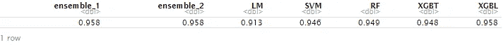**

**相当强劲的表现！**