# 机器学习的贝叶斯超参数优化的概念解释

> 原文：<https://towardsdatascience.com/a-conceptual-explanation-of-bayesian-model-based-hyperparameter-optimization-for-machine-learning-b8172278050f?source=collection_archive---------0----------------------->

## 使用贝叶斯优化的高效超参数调整背后的概念

以下是机器学习超参数优化的四种常用方法，按效率递增的顺序排列:

1.  **手动**
2.  **网格搜索**
3.  **随机搜索**
4.  **基于贝叶斯模型的优化**

(也有其他方法如[进化](https://en.wikipedia.org/wiki/Hyperparameter_optimization#Evolutionary_optimization)和[基于梯度的](https://en.wikipedia.org/wiki/Hyperparameter_optimization#Gradient-based_optimization)。)

我很自豪我最近从手工搜索上升到了随机搜索，直到我在 Bergstra 等人的[论文中发现了这张图片](http://proceedings.mlr.press/v28/bergstra13.pdf):

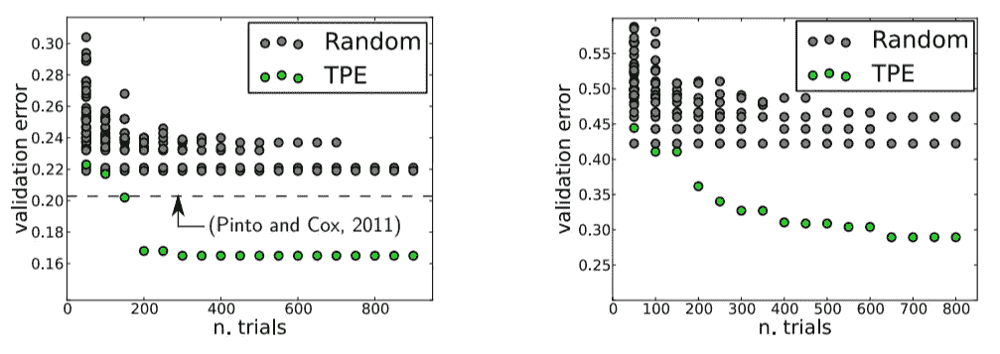

Validation Errors comparing random search and a model based approach on LFW (left) and PubFig83 (right)

这些图比较了图像分类神经网络的超参数优化的验证误差，灰色为随机搜索，绿色为贝叶斯优化(使用 Tree Parzen 估计器或 TPE)。越低越好:验证集误差越小通常意味着测试集性能越好，试验次数越少意味着投入的时间越少。显然，贝叶斯方法有显著的优势，这些图表，以及[其他令人印象深刻的结果，](https://papers.nips.cc/paper/4443-algorithms-for-hyper-parameter-optimization.pdf)让我相信是时候采取下一步，学习基于模型的超参数优化了。

[贝叶斯超参数优化](https://sigopt.com/static/pdf/SigOpt_Bayesian_Optimization_Primer.pdf)的一句话总结就是:建立目标函数的概率模型，用它来选择真实目标函数中最有希望评估的超参数。

如果你喜欢在很高的层次上操作，那么这句话可能就是你需要的全部。然而，如果你想了解细节，这篇文章是我试图概述贝叶斯优化背后的概念，特别是基于序列模型的优化(SMBO)与树 Parzen 估计(TPE)。抱着这样一种心态，你不知道一个概念，除非你能向别人解释它，我查阅了[几篇学术论文](https://papers.nips.cc/paper/4443-algorithms-for-hyper-parameter-optimization.pdf) [论文](https://sigopt.com/static/pdf/SigOpt_Bayesian_Optimization_Primer.pdf)，并将尝试以一种(相对)容易理解的格式交流结果。

虽然我们经常可以在不了解机器学习方法如何工作的情况下实现它们，但我喜欢尝试并了解正在发生的事情，这样我就可以尽可能有效地使用这项技术。在后面的文章中，我将通过使用诸如 [Hyperopt](https://github.com/hyperopt/hyperopt) 之类的库在 Python 中使用这些方法，因此本文将为即将到来的实现奠定概念基础！

更新:[这是一个简短的 Jupyter 笔记本](https://github.com/WillKoehrsen/hyperparameter-optimization/blob/master/Introduction%20to%20Bayesian%20Optimization%20with%20Hyperopt.ipynb)，展示了在 Hyperopt Python 库中使用基于贝叶斯模型的优化的基础。

# 超参数优化

机器学习中超参数优化的目的是找到给定机器学习算法的超参数，这些超参数返回在验证集上测量的最佳性能。(与模型参数相反，超参数是由机器学习工程师在训练之前设置的。随机森林中的树的数量是超参数，而神经网络中的权重是在训练期间学习的模型参数。我喜欢把超参数看作是要调整的模型设置。)

超参数优化以等式形式表示为:

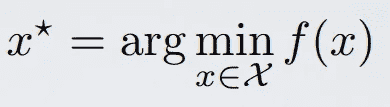

这里 f(x)表示在验证集上评估的要最小化的客观分数，例如 RMSE 或错误率；x*是产生最低分值的超参数集，x 可以取域 x 中的任何值。简单地说，我们希望**找到在验证集指标**上产生最佳分值的模型超参数。

超参数优化的问题在于，评估目标函数以找到分数是极其昂贵的。每次我们尝试不同的超参数时，我们都必须根据训练数据训练一个模型，根据验证数据进行预测，然后计算验证度量。由于大量的超参数和复杂的模型，如需要数天时间训练的集成或深度神经网络，这一过程很快就变得难以手动完成！

网格搜索和[随机搜索比手动调整略好](http://www.jmlr.org/papers/volume13/bergstra12a/bergstra12a.pdf)，因为我们建立了模型超参数网格，并在循环中自动运行训练-预测-评估循环，同时我们做更有成效的事情(如[特征工程](https://www.featuretools.com/))。然而，即使这些方法也是相对低效的，因为它们不基于先前的结果选择下一个超参数来评估。**网格和随机搜索完全*不了解*过去的评估，**因此，经常花费大量时间评估“坏的”超参数。

例如，如果我们有下面的图表，分数越低越好，那么我们应该在哪里集中搜索呢？如果你说低于 200 个估计量，那么你已经有了贝叶斯优化的想法！我们希望关注最有希望的超参数，如果我们有评估记录，那么使用这些信息进行下一步选择是有意义的。

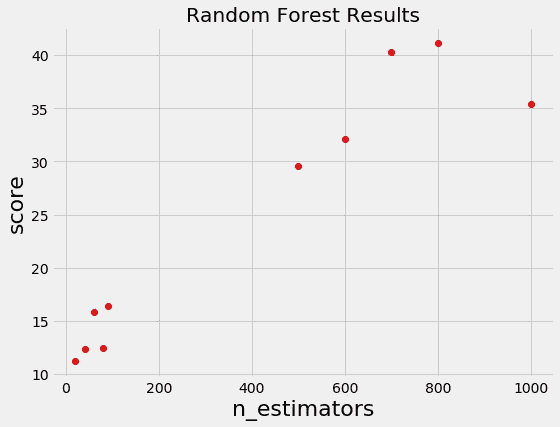

随机和网格搜索根本不关注过去的结果，而是在估计量的整个范围内继续搜索，即使很明显最优答案(可能)在一个小区域内！

# 贝叶斯优化

[贝叶斯方法](https://www.iro.umontreal.ca/~bengioy/cifar/NCAP2014-summerschool/slides/Ryan_adams_140814_bayesopt_ncap.pdf)，与随机或网格搜索相反，跟踪过去的评估结果，它们使用这些结果来形成概率模型，将超参数映射到目标函数得分的概率:

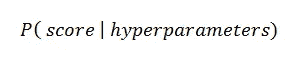

[在文献](https://sigopt.com/static/pdf/SigOpt_Bayesian_Optimization_Primer.pdf)中，这个模型被称为目标函数的“代理”，用 p(y | x)表示。替代函数比目标函数更容易优化，贝叶斯方法通过选择在替代函数上表现最佳的超参数来寻找下一组超参数以在实际目标函数上进行评估。换句话说:

1.  **建立目标函数的代理概率模型**
2.  **找到在代理上表现最好的超参数**
3.  **将这些超参数应用于真正的目标函数**
4.  **更新包含新结果的代理模型**
5.  **重复步骤 2-4，直到达到最大迭代次数或时间**

贝叶斯推理的[目标是用更多的数据“减少错误”](/bayes-rule-applied-75965e4482ff),这些方法通过在每次评估目标函数后不断更新替代概率模型来做到这一点。

在高层次上，贝叶斯优化方法是有效的，因为它们以*知情的方式* **选择下一个超参数。**基本思路是:**多花一点时间选择下一个超参数，以便少调用目标函数。**实际上，选择下一个超参数所花费的时间与目标函数所花费的时间相比是无关紧要的。通过评估从过去的结果看起来更有希望的超参数，贝叶斯方法可以在更少的迭代中找到比随机搜索更好的模型设置。

如果从这篇文章中有什么可以借鉴的话，那就是[基于贝叶斯模型的方法](https://en.wikipedia.org/wiki/Hyperparameter_optimization#Bayesian_optimization)可以在更短的时间内找到更好的超参数，因为它们可以根据过去的试验推理出要评估的最佳超参数集。

作为对贝叶斯优化中发生的事情的一个很好的可视化描述，请看下面的图片([来源](https://www.iro.umontreal.ca/~bengioy/cifar/NCAP2014-summerschool/slides/Ryan_adams_140814_bayesopt_ncap.pdf))。第一幅图显示了两次评估后对代理模型的初步估计——黑色表示相关的不确定性，灰色表示。显然，代理模型是对红色实际目标函数的一个很差的近似:

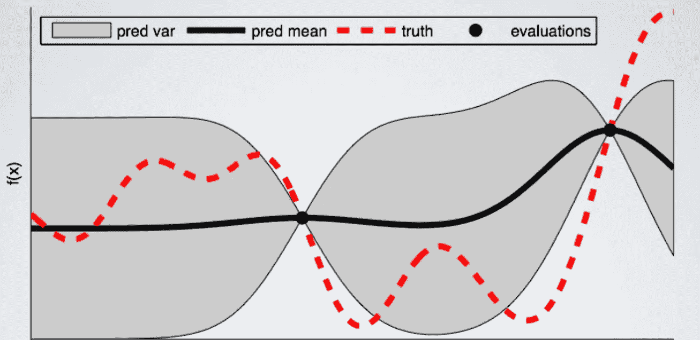

下图显示了 8 次评估后的代理函数。现在代理几乎完全匹配真正的函数。因此，如果算法选择最大化代理的超参数，它们将可能在真实评估函数上产生非常好的结果。

贝叶斯方法对我来说总是有意义的，因为它们的运作方式与我们非常相似:我们形成对世界的初始看法(称为先验)，然后我们根据新的经验更新我们的模型(更新后的模型称为后验)。贝叶斯超参数优化采用该框架，并将其应用于寻找模型设置的最佳值！

## 基于序列模型的优化

[基于序列模型的优化(SMBO)方法(SMBO)](https://papers.nips.cc/paper/4443-algorithms-for-hyper-parameter-optimization.pdf) 是贝叶斯优化的形式化。序列是指一个接一个地运行试验，每次都通过应用贝叶斯推理和更新概率模型(替代)来尝试更好的超参数。

基于模型的超参数优化有五个方面:

1.  **要搜索的超参数域**
2.  **一个目标函数，接受超参数并输出我们想要最小化(或最大化)的分数**
3.  **目标函数的代理模型**
4.  **称为选择函数的标准，用于评估接下来从替代模型中选择哪个超参数**
5.  **由算法用来更新代理模型的(分数，超参数)对组成的历史**

[SMBO 方法有几种变体，在步骤 3-4 中与](https://sigopt.com/static/pdf/SigOpt_Bayesian_Optimization_Primer.pdf)有所不同，即它们如何构建目标函数的替代函数以及用于选择下一个超参数的标准。替代模型的几种常见选择是[高斯过程](https://en.wikipedia.org/wiki/Gaussian_process)、[随机森林回归](http://aad.informatik.uni-freiburg.de/papers/13-GECCO-BBOB_SMAC.pdf)和 Tree Parzen 估计量(TPE)，而第 4 步最常见的选择是预期改进。在本帖中，我们将重点关注 TPE 和预期的改进。

## 领域

在随机搜索和网格搜索的情况下，我们搜索的超参数的域是一个网格。随机森林的示例如下所示:

对于基于模型的方法，域由*概率分布*组成。与网格一样，这使我们能够通过在我们认为真正的最佳超参数所在的区域放置更大的概率来将领域知识编码到搜索过程中。如果我们想将上面的网格表示为概率分布，它可能看起来像这样:

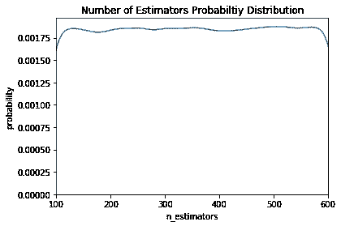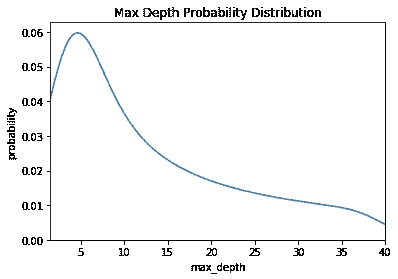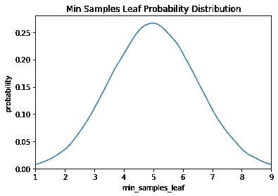

这里我们有一个均匀的，对数正态的，正态分布。这些由先前的实践/知识提供(例如[学习率域通常是几个数量级的对数正态分布](https://www.kdnuggets.com/2017/11/estimating-optimal-learning-rate-deep-neural-network.html))。

## 目标函数

目标函数接受超参数并输出我们想要最小化(或最大化)的单个实值分数。作为示例，让我们考虑为回归问题构建随机森林的情况。我们想要优化的超参数显示在上面的超参数网格中，最小化的分数是均方根误差。我们的目标函数看起来会像(用 Python 写的):

虽然目标函数看起来很简单，但是计算起来非常昂贵！如果可以快速计算目标函数，那么我们可以尝试每一个可能的超参数组合(就像网格搜索一样)。如果我们使用一个简单的模型，一个小的超参数网格和一个小的数据集，那么这可能是最好的方法。然而，在目标函数可能需要几个小时甚至几天来评估的情况下，我们希望限制对它的调用。

基于贝叶斯模型的优化的整个概念是通过基于对评估函数的先前调用仅选择最有希望的一组超参数进行评估来减少目标函数需要运行的次数。基于称为代理的目标函数的模型选择下一组超参数。

## 代理函数(概率模型)

代理函数也称为响应面，是使用以前的评估构建的目标函数的概率表示。这有时被称为响应面，因为它是超参数到目标函数得分概率的高维映射。下面是一个只有两个超参数的简单示例:

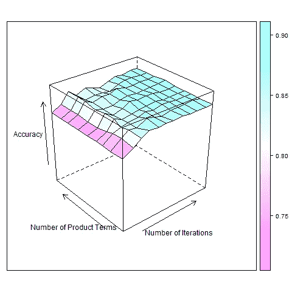

Response surface for AdaBoost algorithm ([Source](http://www.hylap.org/meta_data/adaboost/))

有几种不同形式的替代函数，包括高斯过程和随机森林回归。然而，在本帖中，我们将重点关注树形结构的 Parzen 估计量，如 Bergstra 等人在论文“超参数优化算法”中提出的[。这些方法的不同之处在于它们如何构造代理函数，我们稍后会解释。首先我们需要谈谈选择函数。](https://papers.nips.cc/paper/4443-algorithms-for-hyper-parameter-optimization.pdf)

## 选择功能

选择函数是从替代函数中选择下一组超参数的标准。最常见的标准选择是预期改进:

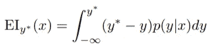

这里，y*是目标函数的阈值，x 是建议的超参数集，y 是使用超参数 x 的目标函数的实际值，p (y | x)是表示给定 x 时 y 的概率的代理概率模型。如果这都有点多，简单地说，**目标是最大化相对于 x 的预期改进。**这意味着在代理函数 p(y | x)下找到最佳超参数。

如果 p (y | x)处处为零，则 y < y*, then the hyperparameters x are not expected to yield any improvement. If the integral is positive, then it means that the hyperparameters x are expected to yield a better result than the threshold value.

**树形结构 Parzen 估计器(TPE)**

现在让我们回到代理函数。SMBO 的方法不同之处在于它们如何构造代理模型 p(y | x)。树形结构的 Parzen 估计器通过应用 Bayes 规则建立模型。它不是直接表示 p( y | x ),而是使用:

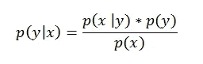

Bayes Rule in Action!

p (x | y)是给定目标函数分数的超参数的概率，其依次被表示为:

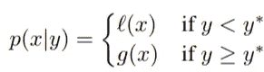

其中 y < y* represents a lower value of the objective function than the threshold. The explanation of this equation is that we make *超参数*的两种不同分布:一种是目标函数值小于阈值*l(x)*，另一种是目标函数值大于阈值 *g(x)* 。

让我们更新我们的随机森林图，以包括一个阈值:

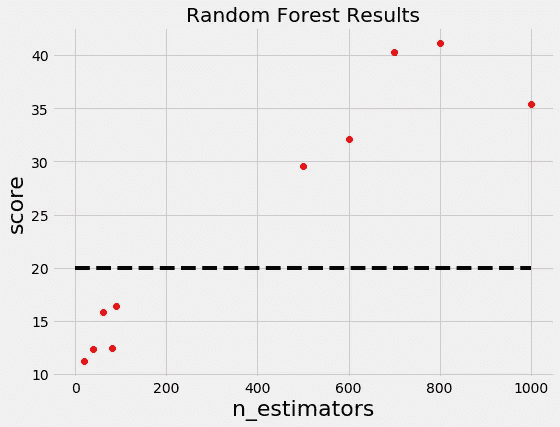

现在我们为估计量的数量构造两个概率分布，一个使用产生低于阈值的值的估计量，另一个使用产生高于阈值的值的估计量。

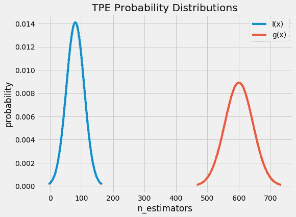

直觉上，我们似乎想从 *l(x)* 而不是从 *g(x)* 中得出 x 的值，因为这种分布仅基于产生低于阈值的分数的 x 的值。事实证明，这正是数学上所说的！通过贝叶斯法则和一些替换，期望改善方程(我们试图最大化)变成:

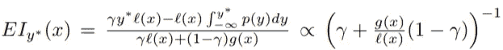

最右边的术语是最重要的部分。这意味着[预期改善](https://www.cse.wustl.edu/~garnett/cse515t/spring_2015/files/lecture_notes/12.pdf)与比率 *l(x) / g(x)* 成比例，因此，为了最大化预期改善，我们应该最大化该比率。我们的直觉是正确的:我们应该画出在 *l(x)* 下比在 *g(x)* 下更可能出现的超参数值！

树形结构的 Parzen 估计器的工作原理是从 *l(x)* 中抽取样本超参数，根据 *l(x) / g(x)* 对它们进行评估，并返回在 *l(x) / g(x)* 下产生最高值的集合，该集合对应于最大的预期改进*。*然后根据目标函数评估这些超参数。如果代理函数是正确的，那么这些超参数应该在评估时产生更好的值！

预期改进标准允许模型平衡[勘探和](https://en.wikipedia.org/wiki/Multi-armed_bandit)开采。 *l(x)* 是一个分布，而不是一个单一的值，这意味着绘制的超参数可能很接近，但不完全是预期改善的最大值。此外，因为代理只是目标函数的估计，所以当评估时，所选择的超参数可能实际上不会产生改进，并且代理模型将必须被更新。这种更新是基于当前代理模型和目标函数评估的历史来完成的。

## 历史

每当该算法提出一组新的候选超参数时，它用实际的目标函数对它们进行评估，并将结果记录在一对(得分、超参数)中。这些记录构成了**的历史**。该算法使用历史来构建 *l(x)* 和 *g(x)* 以得出随着每次迭代而改进的目标函数的概率模型。

[这是贝叶斯法则在起作用](/introduction-to-bayesian-linear-regression-e66e60791ea7):我们对目标函数的代理有一个初始估计，当我们收集到更多的证据时，我们会更新这个估计。最终，通过对目标函数进行足够的评估，我们希望我们的模型准确地反映目标函数，并且产生最大预期改进的超参数对应于最大化目标函数的超参数。

# **综合考虑**

基于序列模型的方法如何帮助我们更有效地搜索超参数空间？因为该算法提出了用于评估的更好的候选超参数，所以目标函数的分数比随机或网格搜索提高得更快，从而导致目标函数的整体评估更少。

即使该算法通过最大化期望的改进花费更多的时间来选择下一个超参数，这在计算成本方面比评估目标函数便宜得多。[在一篇关于使用 SMBO 和 TPE](http://proceedings.mlr.press/v28/bergstra13.pdf) 的论文中，作者报告了寻找下一组候选超参数需要几秒钟，而评估实际目标函数需要几个小时。

如果我们使用更明智的方法来选择下一个超参数，这意味着我们可以花更少的时间来评估糟糕的超参数选择。此外，使用树形结构 Parzen 估计器的基于序列模型的优化能够在相同次数的试验中找到比随机搜索更好的超参数。换句话说，我们得到

*   减少超参数调整的运行时间
*   测试集上更好的分数

希望这能让你相信基于贝叶斯模型的优化是一项值得尝试的技术！

## 履行

幸运的是，现在有很多库可以用 Python 来做 SMBO。 [Spearmint](https://github.com/JasperSnoek/spearmint) 和 [MOE](https://github.com/Yelp/MOE) 使用高斯过程作为替代，[hyperpt](https://github.com/hyperopt/hyperopt)使用树形结构 Parzen 估计器， [SMAC](https://github.com/automl/SMAC3) 使用随机森林回归。这些库都使用预期改进标准从代理模型中选择下一个超参数。在后面的文章中，我们将看看如何在 Python 中使用 Hyperopt，已经有几篇好的文章和代码示例供学习。

# 结论

**基于贝叶斯模型的优化方法构建目标函数的概率模型，为下一组待评估的超参数提出更明智的选择。SMBO 是贝叶斯优化的形式化，它在为机器学习模型寻找最佳超参数方面比随机或网格搜索更有效。**

基于序列模型的优化方法在构建代理方面有所不同，但它们都依赖于来自先前试验的信息来为下一次评估提出更好的超参数。Tree Parzen 估计器是一种使用贝叶斯推理来构建代理模型的算法，并且可以使用预期改进来选择下一个超参数。

Python 中有许多实现 SMBO 的库，我们将在后续文章中探讨。这些概念一开始有点难，但是理解它们将允许我们更有效地使用基于它们构建的工具。我想说的是，我仍在努力解决细节问题，如果我犯了错误，请让我知道(礼貌地)！

要了解更多详细信息，以下文章非常有用:

1.  超参数优化算法[ [链接](https://papers.nips.cc/paper/4443-algorithms-for-hyper-parameter-optimization.pdf)
2.  创建模型搜索的科学:视觉架构的数百维超参数优化[ [链接](http://proceedings.mlr.press/v28/bergstra13.pdf)
3.  贝叶斯优化初级读本[ [链接](https://sigopt.com/static/pdf/SigOpt_Bayesian_Optimization_Primer.pdf)
4.  把人带出循环:贝叶斯优化的回顾[ [链接](https://www.cs.ox.ac.uk/people/nando.defreitas/publications/BayesOptLoop.pdf)

一如既往，我欢迎反馈和建设性的批评。可以在推特上找到我