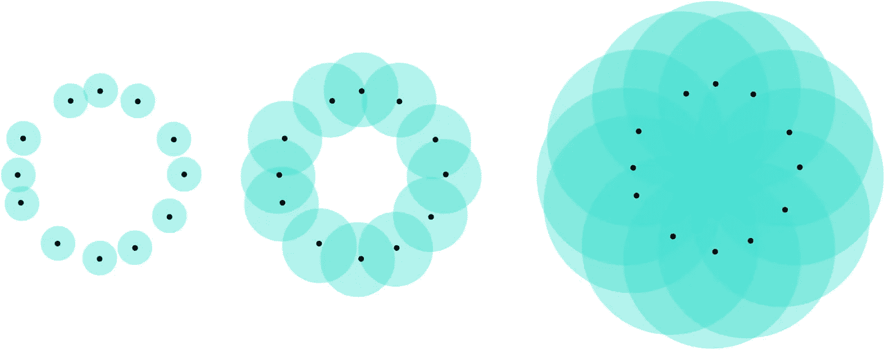
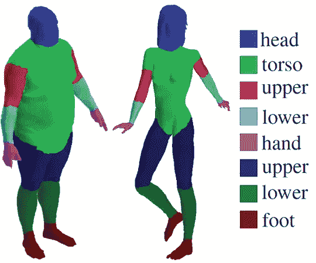
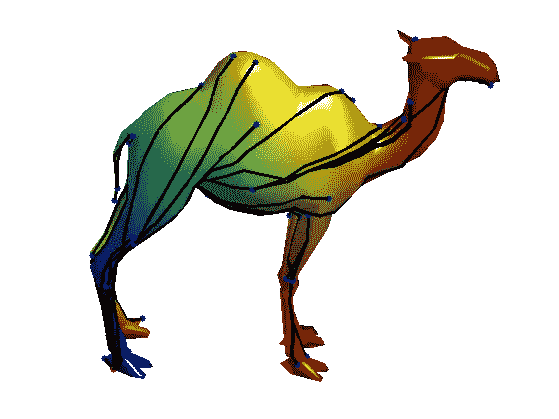
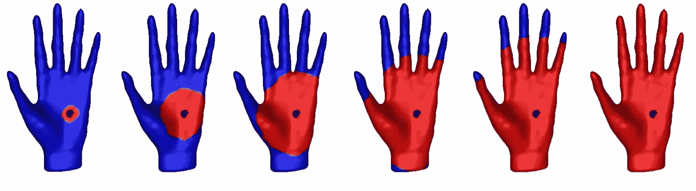
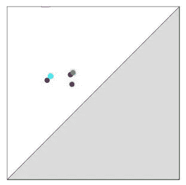
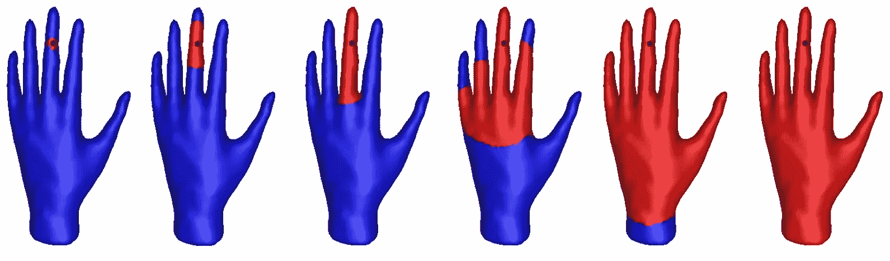
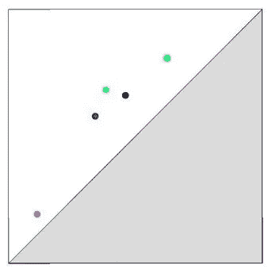

# 拓扑数据分析的一个具体应用

> 原文：<https://towardsdatascience.com/a-concrete-application-of-topological-data-analysis-86b89aa27586?source=collection_archive---------5----------------------->

今天，我将介绍一个机器学习应用**拓扑数据分析** (TDA)，这是一个快速发展的数据科学领域，它利用拓扑来改进数据分析。这很大程度上是从我的一个项目中的[得到的灵感。](https://diglib.eg.org/handle/10.1111/cgf12692)

# 太好了！等等……TDA 是什么？

我将首先简要回顾一下 TDA 的基本情况。感兴趣的读者可能还想看看[的其他](/from-tda-to-dl-d06f234f51d) [故事](/tda-to-rule-them-all-tomato-clustering-878e03394a1)(以及其中的所有参考文献)了解更多细节。

TDA 是一种基于数学的理论，旨在使用数据的*拓扑*来表征数据，而是通过计算拓扑性质的特征来完成的。最常见的是*持久性图*，它采用对角线上方平面中一组点的形式。


Example of persistence diagram computed with the library Gudhi. Source: [http://gudhi.gforge.inria.fr/python/latest/persistence_graphical_tools_user.html](http://gudhi.gforge.inria.fr/python/latest/persistence_graphical_tools_user.html)

每个这样的点代表数据的一个*拓扑特征*(如一个连接的组件、一个孔或一个空腔)。此外，点到对角线的距离作为相应特征的重要性的指示，通常的解释是靠近对角线的点可能是由于噪声。

这样的图的计算需要一个*过滤*，也就是一个增长空间的序列:序列中的每个空间都包含在下一个中。例如，给定一个点云，一个可能的过滤是计算以半径递增的点为中心的球的联合。



Example of union of balls filtration.

这个想法是，对于序列中的每个空间，记录一个拓扑特征是在那个空间中被*创建*还是被*破坏*。例如，如果我们考虑球过滤的联合，可能发生的情况是，对于某些半径，球联合包含一个孔，该孔持续一段时间，直到当球具有足够大的半径时最终被填满，这正是上面显示的过滤中发生的情况。然后，这些半径可用作坐标，在平面上创建一个代表该孔的点。

# 听起来不错，但是…我想要一份申请！

持久性图在数据分析的各个领域都有很多应用。在这篇笔记中，我将介绍几何处理中的一个可视化应用，即 **3D 形状分割**。

3D 形状通常在计算机中存储为一组点、边和三角形。分割的目标是为每个形状的每个点提供标签。例如，如果给你一堆代表人类的 3D 形状，分割的目标是成功地为每个点分配它所属的身体部位(“躯干”、“手臂”、“腿”…)。



Segmented 3D human shapes. The different colors correspond to the different labels or parts. Source: [https://people.cs.umass.edu/~kalo/papers/LabelMeshes/](https://people.cs.umass.edu/~kalo/papers/LabelMeshes/)

这个问题的难点在于，只给你点坐标，这是很差的特征。事实上，用一个点的坐标来描述它是不可能的，因为它们依赖于 3D 形状的嵌入或姿态。例如，想象两个人形，其中一个举起右手，另一个没有；人类是相同的，只是他们的姿势不同。然后，这两个形状的右手点会有很大的不同，即使它们共享相同的标签。

# TDA 来救援了！

这就是持久性图发挥作用的地方。由于它们的拓扑性质，持久性图是固有的，这意味着它们不依赖于 3D 形状的嵌入或姿态。因此，它们是点要素的良好候选对象。为此，我们需要定义一个内在过滤。

这可以通过*测地线距离*来实现。3D 形状上两点之间的测地线距离是该形状上两点之间最短路径的长度。你可以把它想成一只蚂蚁从第一个点到第二个点所走的路径长度。这个距离显然是固有的，因为蚂蚁行走的路径与 3D 形状的姿态无关。



Example of geodesic distances computed for various pair of points on a 3D camel shape. Source: [http://www.numerical-tours.com/matlab/shapes_2_bendinginv_3d/](http://www.numerical-tours.com/matlab/shapes_2_bendinginv_3d/)

测地线距离可以用来定义*测地线球。*半径为*r*0 且以点 *x* 为中心的测地线球，就是到 *x* 的测地线距离小于或等于 *r* 的形状的点集。同样，通过使 *r* 从 0 增加到无穷大，我们使测地线球从单个的 *{x}* 增长到整个形状本身，这给了我们一个内在的过滤。现在，为了计算相应的持续图，我们记录球中发生拓扑事件的半径，并将它们用作坐标。在 3D 形状的情况下，拓扑事件是非常有限的:由于 3D 形状是连接的表面，所以它们的固有维度是 2(实际上，3D 形状局部看起来像平面)，唯一可能发生的拓扑事件是球中出现或填充孔。例如，看看下面 3D 手形上显示的过滤。



Example of geodesic ball filtration computed for a point located on the palm of a 3D hand shape.

增长的测地线球显示为红色，而形状的其余部分显示为蓝色。对于前三个半径，测地线球没有有趣的拓扑结构:它看起来就像一个圆盘。然而，对于第四个半径，五个手指中的每一个都在测地线球中创建了一个洞:出现了五个拓扑事件。它们持续到第五个半径，最终在第六个半径被填满。相应的持久性图，如下图所示，包含五个点。



Each point of the persistence diagram corresponds to a specific finger of the shape.

更有趣的是，如果我对位于形状另一部分的点应用相同的过程，那么图表将会不同。例如，让我们考虑位于中指上的点:



Geodesic ball filtration computed for a point located on the middle finger.

所有手指将再次在测地线球中创建孔，但半径不同。例如，对应于中指的孔出现并被填充的时间比第一次过滤早得多。在余辉图中，相应的点离其他点较远。



The point corresponding to the middle finger (pink) is far from the others.

一般来说，根据 3D 形状点(用于计算图)所属的位置或部分，持久性图点具有不同的配置。这说明了这样一个事实，持久化图是分段的精确描述符。我实现了计算这种图的代码:如果你想试试的话，请看我的 Github。

# 该学习了！

终于！既然我们已经有了点的一个好的特征或描述符，我们就可以开始机器学习(ML)了。

还是我们？

持久性图的一个大问题是它们的非结构化形式:持久性图是可能包含不同数量的点的集合。它们不像传统的欧几里得向量那样容易处理，传统的欧几里得向量是 ML 算法的常见食物。这就是为什么目前 TDA 社区正致力于寻找在 ML 中处理持久性图的方法。到目前为止，两种主要的方法要么是从图中计算矢量(比如持久图像或风景)，要么是在图上定义内核并使用内核化的 ML 算法(比如 PCA 或 SVM)。详见[这个故事](/from-tda-to-dl-d06f234f51d)。

我在一个兼容 **scikit-learn** 的 python 包中实现了大部分方法。我再次向感兴趣的读者推荐[我的 Github](https://github.com/MathieuCarriere/sklearn_tda) 。多亏了这个软件包，所有的方法都可以在一个大的交叉验证过程中进行比较和使用。在[我的笔记本](https://github.com/MathieuCarriere/sklearn_tda/blob/master/example/3DSeg/3DSegTDA.ipynb)中，我用它来分割一堆代表不同大小和形状的飞机的 3D 表面(见下面的代码样本)。最终准确率可以达到 90%，考虑到任务的难度，这已经相当不错了！

```
**import** **sklearn_tda** **as** **tda**
**from** **sklearn.pipeline**        **import** Pipeline
**from** **sklearn.svm**             **import** SVC
**from** **sklearn.ensemble**        **import** RandomForestClassifier
**from** **sklearn.neighbors**       **import** KNeighborsClassifier

*# Definition of pipeline*
pipe = Pipeline([("Separator", tda.DiagramSelector(limit=np.inf, point_type="finite")),
                 ("Rotator",   tda.DiagramPreprocessor(scalers=[([0,1], tda.BirthPersistenceTransform())])),
                 ("TDA",       tda.PersistenceImage()),
                 ("Estimator", SVC())])

*# Parameters of pipeline. This is the place where you specify the methods you want to use to handle diagrams*
param =    [{"Rotator__use":        [**False**],
             "TDA":                 [tda.SlicedWassersteinKernel()], 
             "TDA__bandwidth":      [0.1, 1.0],
             "TDA__num_directions": [20],
             "Estimator":           [SVC(kernel="precomputed")]},

            {"Rotator__use":        [**False**],
             "TDA":                 [tda.PersistenceWeightedGaussianKernel()], 
             "TDA__bandwidth":      [0.1, 1.0],
             "TDA__weight":         [**lambda** x: np.arctan(x[1]-x[0])], 
             "Estimator":           [SVC(kernel="precomputed")]},

            {"Rotator__use":        [**True**],
             "TDA":                 [tda.PersistenceImage()], 
             "TDA__resolution":     [ [5,5], [6,6] ],
             "TDA__bandwidth":      [0.01, 0.1, 1.0, 10.0],
             "Estimator":           [SVC()]},

            {"Rotator__use":        [**False**],
             "TDA":                 [tda.Landscape()], 
             "TDA__resolution":     [100],
             "Estimator":           [RandomForestClassifier()]},

            {"Rotator__use":        [**False**],
             "TDA":                 [tda.BottleneckDistance()], 
             "TDA__wasserstein":    [1],
             "TDA__delta":          [0.1], 
             "Estimator":           [KNeighborsClassifier(metric="precomputed")]}
           ]
```

# 最后一句话…

几何处理只是 TDA 众多可能应用中的一种。这个领域非常活跃，因为它连接了从代数拓扑到计算机科学的不同数学领域，越来越多的人正在成为 TDA 爱好者。不要错过火车！；-)