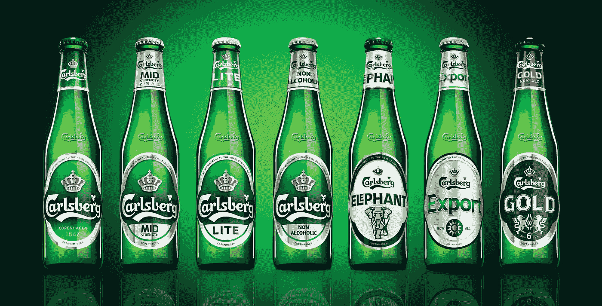
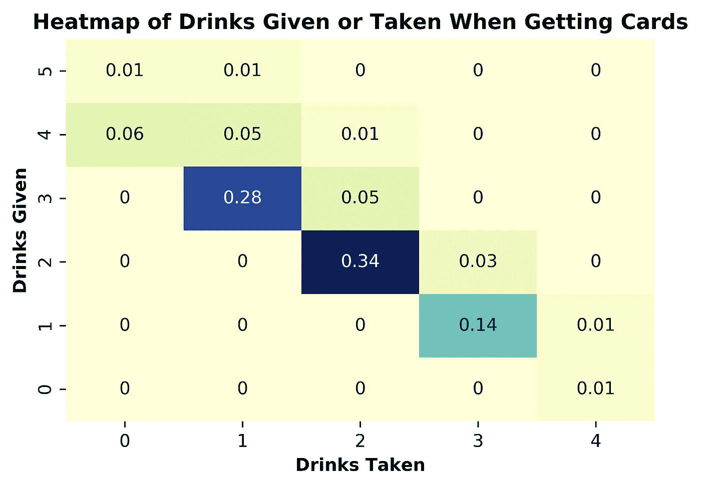
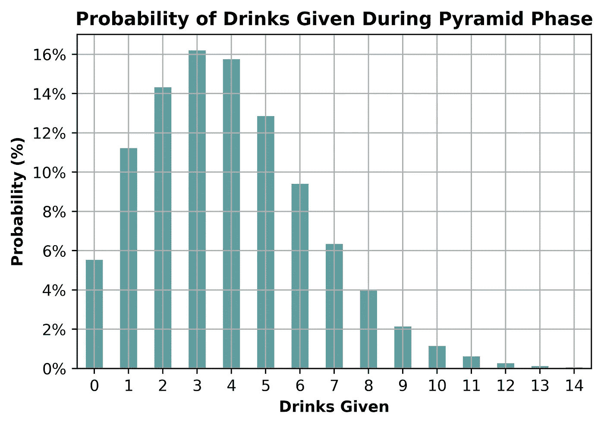
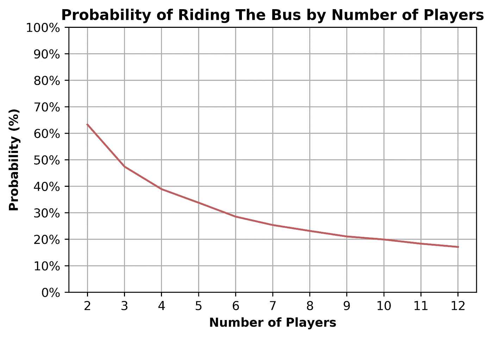
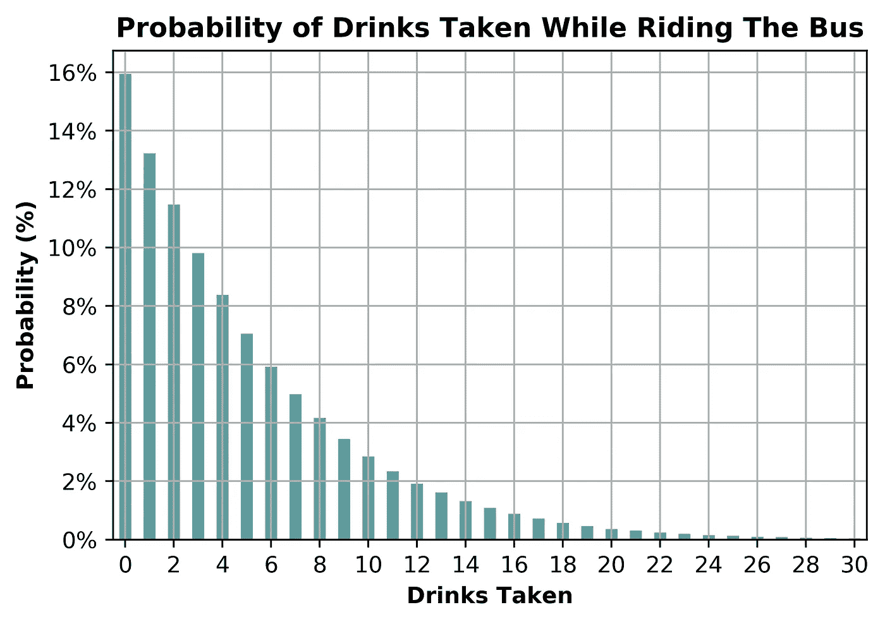
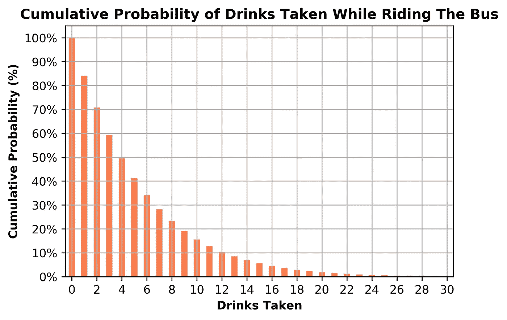

# 在一轮受欢迎的饮酒游戏之前，我应该期待什么？

> 原文：<https://towardsdatascience.com/a-data-analysis-of-riding-the-bus-d2d60fd114e4?source=collection_archive---------10----------------------->

## 乘坐公交车的数据分析

Recommended equipment for Ride The Bus

大学。这是探索你的个性、发现你的价值观和结交终生朋友的时候。这些都很好，但大学也是喝酒游戏的时候！白天有足够的时间去实现更崇高的目标，但是晚上需要新的方式去喝啤酒或者啜饮杜松子酒和滋补品。有很多娱乐性的饮酒游戏，但乘坐公共汽车尤其提出了一些有趣的数据问题。

喝酒游戏通常包括给别人喝饮料作为奖励，不得不拿饮料作为“惩罚”，然后是一大堆运气让事情变得有趣。乘坐公共汽车将所有这些方面整合到一个三阶段的纸牌游戏中，其中臭名昭著的第三阶段甚至可以测试经验丰富的大学生的决心。

有些回合你只需喝一两杯就能脱身。其他时候，你会感觉每隔几秒钟就要喝一杯。那么一个人在一场比赛中到底应该喝什么呢？数据分析和数百万次模拟都有答案。

注意:这个游戏有许多不同的版本，但我会在每一节之前简要说明我正在使用的版本。

# 第一阶段:获得卡片

**工作原理:**

一个庄家在给每个玩家发牌的时候会问他们四个问题。如果玩家答对了，他们会给一杯饮料。如果玩家答错了，他们就喝一杯。

1.  “红的还是黑的？”猜猜你第一张牌的颜色。
2.  “高还是低？”你的第二张牌会比第一张高还是低？
3.  “里面还是外面？”你的第三张牌在前两张之间还是之外？
4.  “什么西装？”猜猜你第四张牌的花色。

如果一张牌在边缘，那么一个人加注饮料赌注，然后给另一张牌。例如，如果你的第一张牌是 8，你说更高，而你的第二张牌是 8，那么你简单地再次猜测高或低，以获得更高的风险。

玩家最终会有 4 张或更多的牌。

**数据:**

平均来说，你将不得不喝 1.8 杯饮料，但在这一轮中，你要送出 2.4 杯饮料。这个阶段是一个轻松的介绍，提倡给予多于索取。除了分发卡片，还增加了一点乐趣。

下面是一张热图，显示了在第一阶段，人们可以预期给予或接受的饮料数量。很少有人能喝超过 3 杯的酒。

# 第二阶段:金字塔

**工作原理:**

这一阶段的目标是摆脱你的卡。正面朝下的卡片金字塔有四排。最下面一排有四张牌，而每高一排少一张。

庄家将从底部开始向上翻牌。如果你有一张翻过来的卡片，你可以把那张卡片放在金字塔上，然后分发一杯饮料。如果卡片在第一排，给一杯饮料，第二排，两杯饮料，依此类推。

手里剩余牌最多的玩家必须在第三阶段“乘坐公共汽车”。

**数据:**

在这个阶段，饮酒的赌注上升了。平均而言，在这一轮中，人们预计会送出 3.9 杯饮料。如果每个人都在随机分发饮料，那么你也可能会喝那么多，但你总有可能被挑出来喝更多。

下面是金字塔阶段你可以分发的饮料数量的直方图。分发的肉大约是 0-7 杯，但是分发 10 杯或更多杯的可能性是非常真实的。

在这一轮分发饮料很有趣，但关键的方面是找出谁必须在下一轮乘坐公共汽车。玩家越多，乘坐公共汽车的可能性就越小。下图显示了基于游戏中有多少玩家，你不得不乘坐公共汽车的概率。

呀！因为最大牌数中的平手几率，乘坐大巴的几率明显大于 1/(玩家人数)。即使是 10 个人，你也有 1/5 的机会坐公交。特别是在小团体中，不得不乘坐公共汽车是非常可能的。

# 第三阶段:乘坐公交车

**工作原理:**

只有在第二阶段中被选中乘坐公共汽车的玩家才参与这个最后阶段。庄家将七张面朝下的牌排成一行。一个庄家会翻一张牌，问玩家，“高还是低？”然后，发牌者在有问题的牌上面展示另一张牌。

如果玩家是正确的，他们翻转下一张牌。如果玩家错了，就从头再来。玩家必须猜对七次才能下车并赢得游戏。

这个游戏最令人生畏的部分，乘坐巴士是一个高度随机的事件，当失败时会感到紧张，但一旦结束就会很兴奋。

**数据:**

与这一阶段的声誉相反，平均而言，你可以预计在下车前只需喝 4.9 杯饮料。当然不是一个低数字，但有时会觉得平均是 20 或 30 杯，这取决于有时下车需要多长时间。

下图显示了乘坐公共汽车时，每次饮酒量的概率。

最典型的结果是在不喝任何饮料的情况下，将七张牌全部答对！这个图表几乎完全类似于一种叫做[指数分布](https://en.wikipedia.org/wiki/Exponential_distribution)的分布。指数分布的重要方面是“无记忆”特性。

这意味着，无论你在乘车时已经喝了多少酒，你都应该准备在下车前再喝 4.9 杯。即使你已经喝了 100 杯了(不太可能)，你也应该在下车前预计还会有 4.9 次失败。下次感觉公共汽车永远不会停下来的时候，请记住这一点！

下图是与上面相同的信息，但显示的是累积概率。例如，不得不喝 12 杯或 12 杯以上的概率约为 10%。

又来了！大量饮酒的负面风险很大。只有在喝了 16 杯左右的时候，才不太可能在没有获胜的情况下坚持那么久。

# 结论

在一个六人游戏中，假设饮料是随机分发的，那么一个人可能总共要喝 9.5 杯饮料。尽管如此，还是有很大的风险，那就是你必须乘两倍或更多的时间，这取决于你是否必须乘公共汽车，以及需要多长时间。

我希望我没有破坏数字游戏的乐趣！保持干渴，我的朋友，继续乘坐公共汽车。

代号:[https://github.com/DastonArman](https://github.com/DastonArman)