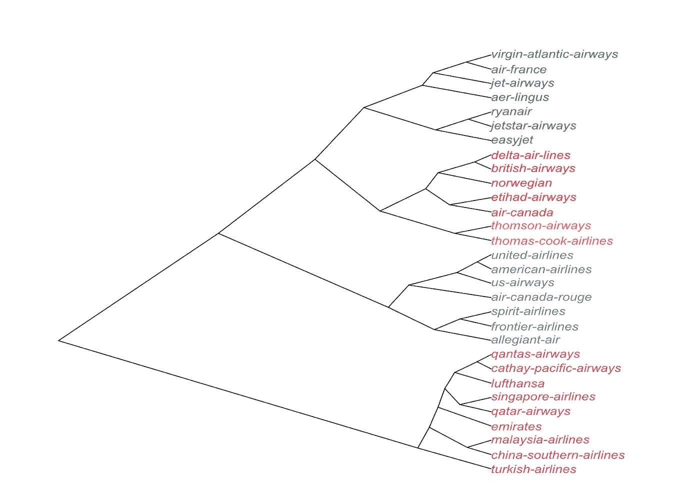
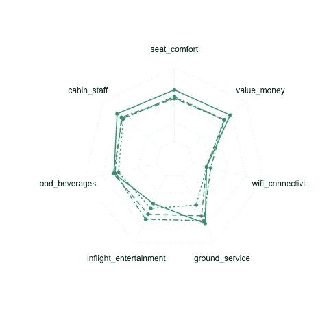
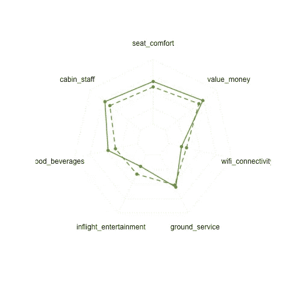
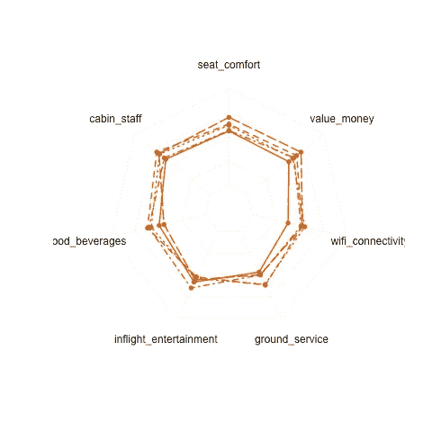
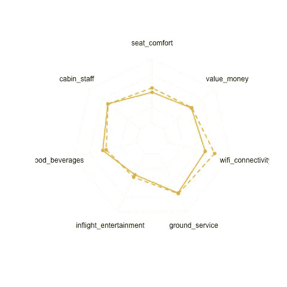
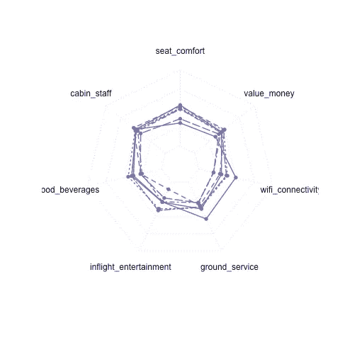
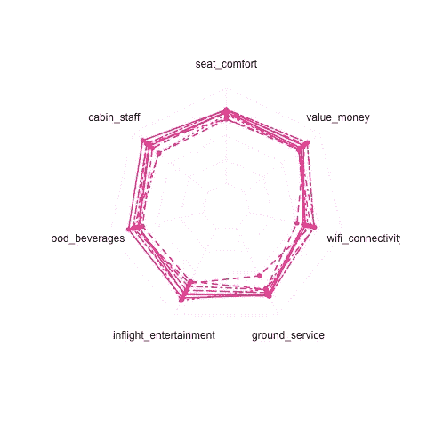
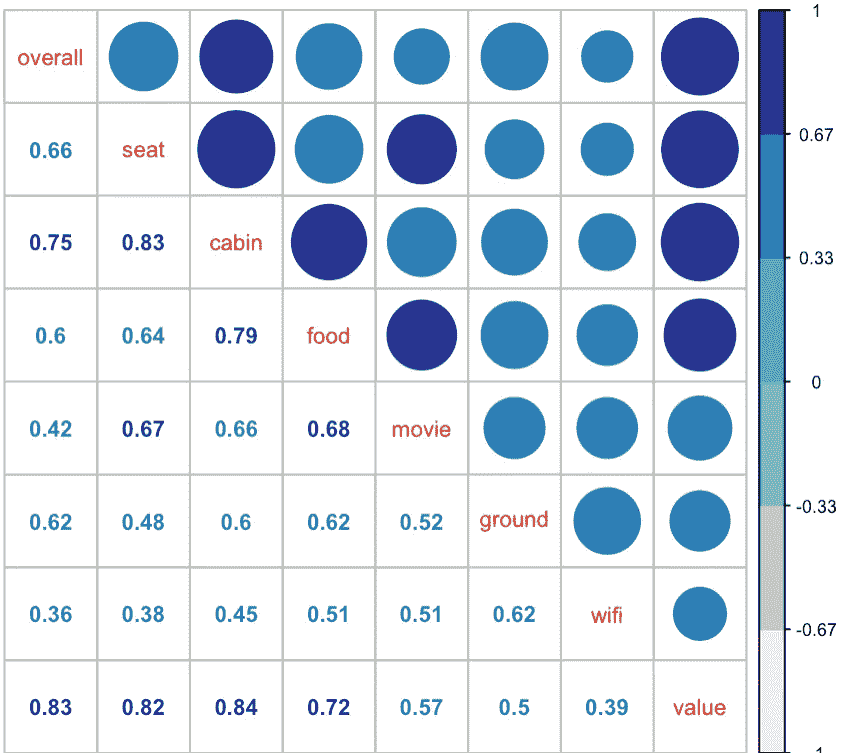

# 关于选择同行的数据驱动指南

> 原文：<https://towardsdatascience.com/a-data-driven-guide-on-choosing-who-to-fly-with-c2c4a67708bb?source=collection_archive---------13----------------------->

继上一篇关于按国家划分的[航空公司偏好的文章之后，今天我将查看 Skytrax 上 30 家最受关注的航空公司的详细评级。](https://medium.com/@yanhann10/do-people-like-their-own-countries-airlines-9e1a40d494ba)

**哪些航空公司处于类似的等级？**

给定 7 个子类别的详细评级，包括座位舒适度、客舱工作人员、食品和饮料、机上娱乐、地面服务、wifi 连接和性价比，我们可以对航空公司进行分层聚类，结果看起来相当合理。



我们观察到以下集群:

*   廉价航空公司(瑞安航空、捷星航空、易捷航空)
*   排名较低的北美航空公司(联合航空、美国航空、加拿大航空)
*   评价稍好的欧洲航空公司(维珍航空、法航)
*   亚洲和中东地区获得良好评价的航空公司(国泰航空、新加坡航空、卡塔尔航空、阿联酋航空)

一个附带说明是，如果还有其他因素对乘客很重要，但没有被属性捕捉到，如安全，详细评级可能不会捕捉到航空公司的整体评级。

**航空公司集群之间有什么不同？**

为了进一步了解每家航空公司的利弊，我们检查了详细的评级。

我们可以看到这些集群的属性:

*   法航和维珍航空在 wifi 连接方面的评级较低
*   廉价航空公司在 wifi 和机上娱乐方面得分较低，但在性价比方面得分较高。为什么这里会有这样的期望？
*   像达美航空和英国航空这样的航空公司得分相当不错，同样，wifi 和地面服务相对较低
*   汤姆森和托马斯·库克这两家英国区域性航空公司在无线网络上的评级相当不错
*   像联合航空这样的北美航空公司在各方面都被评为平均水平
*   亚洲/中东航空公司，如阿联酋航空公司和新加坡航空公司相对得分最高(鉴于没有人真正得到 5 分)



Detailed rating in same color as the previous clusters

这意味着你可以根据你在飞机上最关心的事情来选择航班，无论是 wifi 还是座位舒适度。航空公司也可以评估他们与类似评级的竞争对手的价格竞争力。

**哪个属性对总体评分最重要？**

检查每个属性与总体评分之间的相关性，我们可以看到*价格*的价值最重要，其次是来自机组人员和地勤人员的*服务*，接下来是*座位舒适度*和*食物*。*电影*和 *wifi* 其实没那么重要。



我今天学到的是 r 中的雷达图。雷达图在显示太多等级相差很大的类别时会有点棘手，在这种情况下，类别的排序可能会扭曲故事。在这里，因为大多数评级在 3-4 之间，所以这是了解每个类别评级的一个不错的选择。

```
library(fmsb)#need to add two rows on max and min range of each category
df=rbind(rep(5,7), rep(0,7), df)#plug in the numerical columns
radarchart(df[,2:8])
```

这是我关于数据科学和视觉故事的[# 100 日项目](https://medium.com/@yanhann10)的第 47 天。我的 [github](https://github.com/yanhann10/opendata_viz) 上的全部代码。感谢阅读。欢迎新主题的建议和反馈。