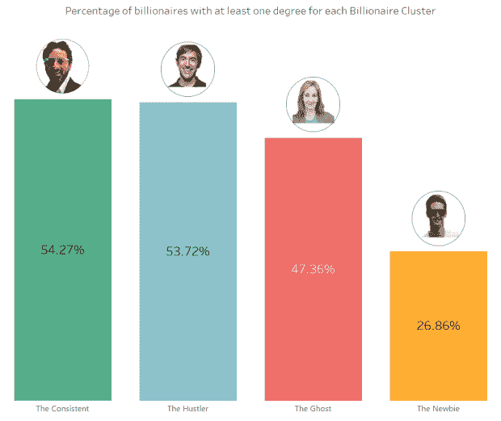
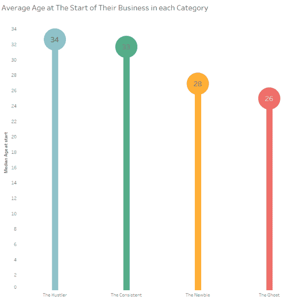
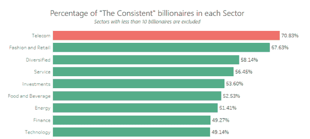
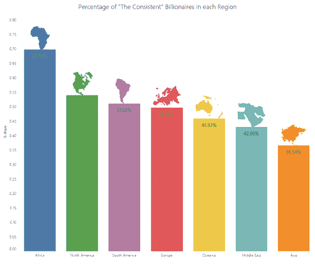
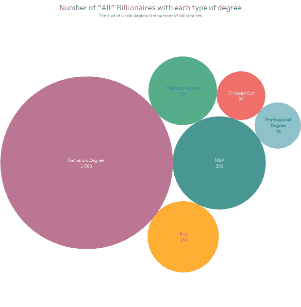
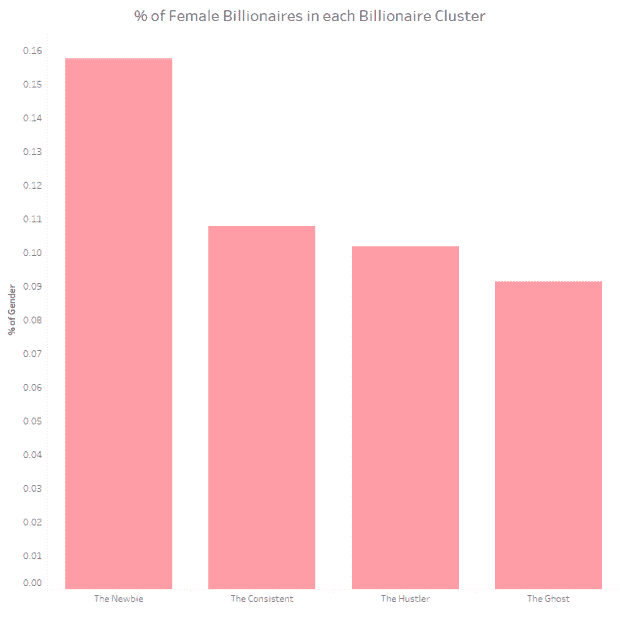
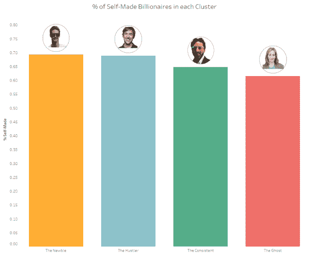
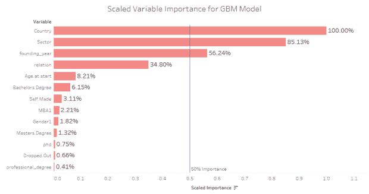

# 成为持续的亿万富翁的数据驱动指南

> 原文：<https://towardsdatascience.com/a-data-driven-guide-to-becoming-a-consistent-billionaire-7fe222971dbe?source=collection_archive---------4----------------------->

# 你真的认为所有的亿万富翁都一样吗？

最近，我对那百分之一的亿万富翁有点着迷了。当我偶然发现一些文章告诉我们谁是真正的亿万富翁时，我很感兴趣。文章说的是这样的事情:大多数企业家没有学位，亿万富翁在开始创业之前一般都是 30 多岁。我觉得这有点笼统，我会解释的。让我们来看看比尔·盖茨和世嘉公司的首席执行官 Hajime Satomi。两人都是亿万富翁，但他们真的一样吗？在过去的十年中，比尔·盖茨每年都是亿万富翁，而哈吉已经三次从福布斯的名单中跌出。当没有人想成为一个朝觐者时，把这两个人放在同一个盒子里，发布漂亮的文章，给出漂亮的统计数据，这公平吗？我认为不会——尤其是在这十年里，像 Hajime 这样反复无常的亿万富翁占到了亿万富翁总数的 50%以上。解决亿万富翁之间的差异是这篇文章的主题。我们将强调关于持续的亿万富翁的有趣事实，并最终找出持续的亿万富翁与其他人的区别。

我所说的持续的亿万富翁是什么意思？这就是我们来这里的目的。🙂

# 对于像我这样的书呆子来说，我是这样做的

*   **数据来源**:大部分数据都是从 3000 份《福布斯》个人资料中刮来的。从一篇研究论文中收集了两个额外的变量: [*亿万富翁特征数据库*](https://piie.com/publications/working-papers/origins-superrich-billionaire-characteristics-database) 。涵盖的亿万富翁是 2007 年至 2017 年 6 月期间是或曾经是亿万富翁的人。
*   **数据收集**:我使用亿万富翁的名字创建了他们的福布斯个人资料网址，并使用 *RSelenium* 和 *rvest* 收集了我需要的数据。我坦白说。一点也不性感。我做了大量的 Excel VLOOKUPS，手工检查和字符串操作，以获得一个可行的数据集。
*   **数据清理**:我使用 *stringr* 从字符串创建了列。

代码可以在这里找到。

# 亿万富翁有多少种类型？

这是我想到的:

*   如其名，这些人年复一年都是亿万富翁。它还包括最多一年没有上榜的亿万富翁(如 2008 年的马克·扎克伯格)。他们在 2015 年之前应该已经是亿万富翁了。
*   **鬼魂:**这些是离开榜单的亿万富翁，他们在过去四年里没有回来过。他们也应该在 2015 年前首次亮相。
*   **皮条客:**这一类别包括所有其他在 2015 年前首次亮相的亿万富翁。即
*   那些不止一次离开的人，每次都卷土重来。
*   那些虽然回到了名单上，但却离开了一年多的人。
*   那些还没有回来，但没有花了长达 4 年的名单。
*   **新手:**这些是在 2015 年至 2017 年间首次亮相的亿万富翁。他们自成一组，因为我认为把他们放在其他任何地方都是不公平的，因为没有足够的数据将他们归入任何其他类别。尽管如此，我认为看看他们在做什么会很有趣。

所以，让我们开始吧！

# 你知道吗？

## 一贯的亿万富翁都受过良好教育。

接近 55%的亿万富翁至少有一个学位。

事实上，拥有学士、博士、硕士和几乎所有其他学位的人最多。

## 亿万富翁创业的平均年龄比普通鬼魂大 7 岁。

这适用于白手起家创业的亿万富翁。亿万富翁平均在 30 多岁开始创业，这与文章[中关于 30 多岁成功创业的观点一致。](https://www.forbes.com/sites/georgedeeb/2015/04/16/does-age-matter-for-entrepreneurial-success/#50107ee330f1)

这位比其他人至少早两年创业的幽灵亿万富翁是否说明了年轻企业家不太可能维持他们的财富？大概吧。然而，如果你看看这些新手，他们大多也是在年轻时开始的。问题是:一般的新手最终会变成幽灵吗？或者说，在过去的几年里，竞争环境发生了变化吗？我们可以在几年后回答这个问题。🙂

## 持续产生亿万富翁比例最高的前三个行业是电信、时尚和多元化投资组合。

看起来极其主流吧？但是时尚？真的吗？

*注:这里的时尚和零售不是指零售。这意味着商业零售时尚商品，如 Zara，H & M 等。*

## 非洲亿万富翁最有可能成为持续的亿万富翁

接近 70%的非洲亿万富翁是稳定的——比世界上任何其他地区都多。最接近的地区是北美，占 53%。

然而，在新手时代，亚洲似乎主宰着所有其他地区，这一数字主要是由中国推动的。事实上，超过 50%的中国亿万富翁是在这一时期上榜的。

另一方面，中东的亿万富翁最有可能是鬼。我知道你在想什么。油价吧？大概吧。然而，大多数中东亿万富翁拥有多样化的投资组合。

## 拥有博士学位的亿万富翁比辍学者还多。

这是我最喜欢的。

这适用于所有其他学位，如工商管理硕士，理学硕士等。只有法律或医学等专业学位的亿万富翁比辍学者少。然而，在新手和骗子类别中，拥有专业学位的人甚至比辍学的人还要多。

## 11%的亿万富翁是女性。

唯一一个男女比例更令人鼓舞的类别是新人类别，约占 16%。然而，鉴于全球男女比例为 50:50，新人类别仍然短缺 34%。好消息是情况正在好转。自 2015 年以来，女性成为亿万富翁的可能性是此前的近两倍。

## 64%的亿万富翁都是白手起家。

唯一百分比较低的类别是幽灵。好消息(或坏消息——取决于你希望你的财富来自哪里)是，新亿万富翁的比例比这高。这意味着在最近一段时间，更多的“新”财富正在产生。此外，白手起家似乎并不奇怪，因为每个类别都有超过 60%的亿万富翁是白手起家。

# 酷，现在怎么办？

我们都知道和喜爱的亿万富翁都受过良好的教育，坦率地说，一般都很无聊。

"如果你想成为持续的亿万富翁，这有多重要？"

为了回答这个问题，我们将做一些机器学习(在这里请原谅，这可能有点技术性)。使用 [h2o.ai](https://www.h2o.ai/h2o/) 机器学习包(我爱！)，我们会训练模型来预测一个亿万富翁会属于哪一类。除了新手，我们会对所有类别的人都这样做，因为和其他人不同，区分这个群体的是他们加入名单的时间，而不是他们在名单上的表现。我们还将使用*真正的*独立变量来训练我们的模型。例如，用于创建类别的变量，如他们离开列表的次数，将不会被使用。如果我们使用这样的变量，就像知道答案并逆向工作一样，对吗？然后，我们将检查哪些变量是预测亿万富翁类别的最佳变量，以回答我们的问题。在上面分享的同一个脚本中也有[代码](https://github.com/RosebudAnwuri/TheArtandScienceofData/tree/master/Consitent%20Billionaire%20Guide/scripts)。

我会首先使用 purrr 和 h2o 包在梯度推进机器、随机森林和深度学习之间找到最佳算法。

看起来 GBM 算法在测试集上的准确性击败了其他机器学习算法。

让我们来看看 GBM 认为哪些变量在预测亿万富翁的类别时最重要。

在 50%的相对重要性之上，我们看到了三个变量:国家、行业和为他们带来财富的公司的成立年份。

这告诉我们什么是持续的亿万富翁？首先，它说，虽然一致性可能受过良好的教育，这肯定不是他们有什么。国家和行业是重要的变量，这并不令人吃惊，但“创建年份”却很有趣。这可能意味着建立一个可持续发展的企业变得越来越容易或越来越难。

还是那句话，非常直白和无聊。在正确的时间进入一个对你所在的行业有利的环境，然后蓬勃发展！你创造了可持续的财富。在这一点上，我觉得我有义务说，84%的技术亿万富翁在北美和亚洲。目前没有一个来自非洲(见上面关于你所在行业有利环境的句子)，但话说回来，你可以成为先锋，所以接受我的建议吧。祝你好运！

# 要记住的事情

数据来自福布斯。这意味着我天生被他们的方法、估计和误差所约束。例如，数据显示只有一位亿万富翁来自政界。我非常怀疑那是真的。

*   一天结束的时候，我有超过 30 个变量，我不能在一篇文章中谈论所有的变量，所以这里有一些[可视化](https://public.tableau.com/profile/rosebud.anwuri#!/vizhome/BillionairesClusters/Visuals)供你玩，自己发现如何成为一个持续的亿万富翁。😉
*   想知道谁是一贯的亿万富翁吗？点击，使用完整数据集[了解详情。](https://github.com/RosebudAnwuri/TheArtandScienceofData/tree/master/Consitent%20Billionaire%20Guide/data)
*   在我的下一篇文章中，我将讨论哪些行业、国家和成立年代是成为持续的亿万富翁的最佳时机；
*   我有一个小小的惊喜。🙂

*原载于 2017 年 10 月 7 日*[*theartandscienceofdata.wordpress.com*](https://theartandscienceofdata.wordpress.com/2017/06/01/the-billionaire-clusters/)*。*