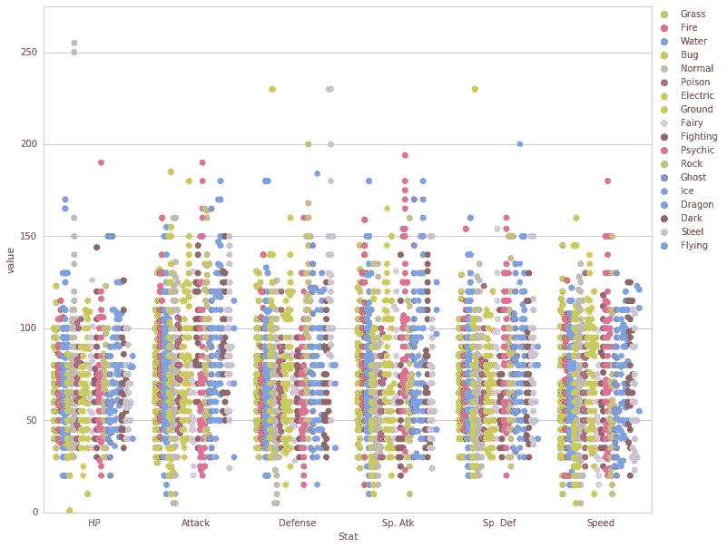
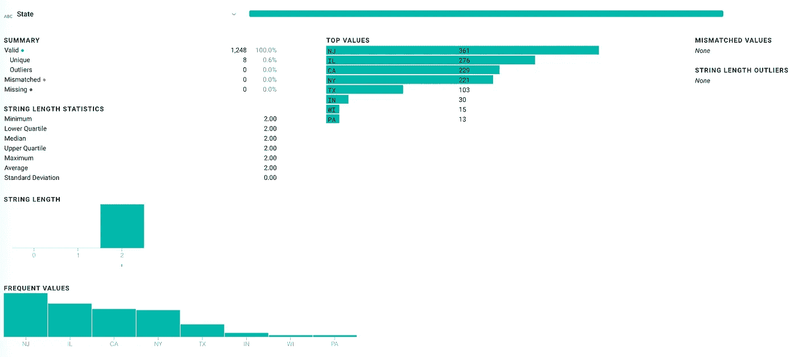
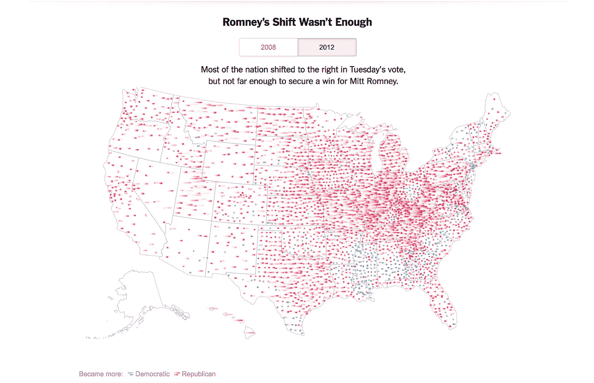

# 现代数据忍者的工具包

> 原文：<https://towardsdatascience.com/a-data-ninjas-toolkit-abfe11d38fe8?source=collection_archive---------4----------------------->


做数据分析既有趣又有益。这是我在空闲时间经常做的事情。但是，如果没有合适的工具，这可能会令人沮丧，而且非常耗时。我将处理数据的过程分为 4 个步骤。

1.  数据收集:找到并获取您感兴趣的数据集
2.  数据清理:将数据转换成正确的格式
3.  数据探索:发现趋势和有趣的模式
4.  数据可视化:将你发现的惊人趋势可视化

# 数据采集

在过去的 5 到 10 年里，收集数据的过程已经有了明显的改善。现在可以在网上找到大量的数据集。

## 卡格尔

[Kaggle](https://www.kaggle.com/datasets) 在 2016 年推出了一个新的数据集功能，它很快成为我最喜欢的浏览和探索数据集的地方。它允许你上传自己的数据集，也可以自由访问他人的数据集。许多人创建了他们自己的“内核”,这是讲述某个数据集的故事/分析的小脚本。这个来源的警告是，它对所有人都是免费的，一些数据集没有得到很好的记录，数据的来源也不清楚。



A [visualization](https://www.kaggle.com/ndrewgele/visualizing-pok-mon-stats-with-seaborn) of a Pokemon dataset found on Kaggle. Don’t ask me to interpret it.

## 谷歌大查询

另一个在过去几年里真正开花结果的大玩家是 Google BigQuery。他们拥有大量的公共数据集。此外，通过 SQL 浏览数据很容易，通常只需要几分钱。

## Data.gov

[Data.gov](https://www.data.gov/)是开始搜索政府相关数据的好地方。我发现这个网站有些断断续续，经常把我链接到一些不可行的政府网站。尽管美国政府越来越重视开放数据，但我确信这将是一个会随着时间而改进的工具。

政府领域开放数据的另一个参与者是 Socrata。寻找大城市政府经常托管他们的数据。一些例子包括[纽约开放数据](https://opendata.cityofnewyork.us/)和[芝加哥数据门户](https://data.cityofchicago.org/)。

## Reddit

[/r/datasets](https://www.reddit.com/r/datasets/) 经常可以有一些非常新颖、漂亮的数据集。你也可以发布一条信息或数据集的请求，偶尔你会得到回应。

我偶尔使用的另一个技巧是浏览 [/r/dataisbeautiful](https://www.reddit.com/r/dataisbeautiful/) 。所有 OC(原创内容)帖子都需要包含一个评论，说明他们的数据集是从哪里来的。

## 令人惊叹的公共数据集

github 存储库`[awesome-public-datasets](https://github.com/caesar0301/awesome-public-datasets)`链接到许多类型的数据集，按类别聚集。

## Scrapy

有时候，最好的数据不是通过下载按钮或容易访问的 API 获得的。我尝试了多种 web scrapers，一次又一次，我回到了 [Scrapy](https://scrapy.org/) 。如果你有编程技能或者不怕钻研一点 python，Scrapy 是一个非常容易上手的 web 抓取工具，它运行良好，并且有很好的文档和工具。

我最喜欢的特性是`scrapy shell <url>`,它会抓取一个网页并为您打开一个 REPL 来运行 python 命令，直到您确定了获取感兴趣的数据所需的命令集。

## 谷歌

这个显而易见，但还是值得一提。网上有大量的其他资源。谷歌一下你想找的东西，加上“数据集”这个词，是一个很好的起点。

## 信息自由法(FOIA)

最后但同样重要的是，如果你真的想得到一些数据，你可以提交一个 [FOIA](https://www.foia.gov/index.html) 请求。这项法律允许你向任何联邦机构索取数据，他们必须交出数据，除非它属于豁免范围。

# 数据清理

处理数据最乏味的部分，也是许多数据黑客可以证明的最耗时的部分。幸运的是，有一些工具可以让这个过程变得更容易。

## Trifacta

如果您依赖 Excel 进行数据转换，您需要立即获取 Trifacta。Trifacta 是数据清理(坦率地说，是数据探索)的一个不可思议的工具，原因有很多。

**处理任意大小的数据**

Trifacta 处理数据的子集，然后生成一个脚本在原始数据集上运行。这是一个惊人的特性，因为它允许您快速操作大量数据集。如果你曾经试图用 Excel 打开超过 100k 行的文件，你就会知道应用宏是多么痛苦。

**更好的数据处理**

Trifacta 引入了一种不同的数据操作范式，称为 recipes。菜谱中的每一步都是对数据集的原子性改变。这很好，因为它允许您非常容易地恢复更改。Trifacta 也有非常灵活的语言来操作数据。

**对您的数据进行分析**

最后，Trifacta 在你操作数据时提供了关于你的数据的有见地的统计数据。它会告诉您列中有多少空值、值的分布、不同值的数量等。这种信息对于进行适当的数据清理是必不可少的。



Example analytics on a column in Trifacta

我怎么强调 Trifacta 改变游戏规则都不为过。尤其是对于那些不习惯命令行工具的人。

## **OpenRefine**

数据清理的老国王。 [OpenRefine](http://openrefine.org/) 在 Trifacta 推出之前曾经是我的 goto 工具。OpenRefine 仍然有一些真正强大的功能，你在许多其他数据清理工具中找不到这些功能。我最喜欢的一个是它的[文本聚类能力](https://github.com/OpenRefine/OpenRefine/wiki/Clustering)。这允许您对文本值进行聚类，然后合并它们。这在您收集城市和州名等数据时非常有用，您的数据条目如下所示:

```
Chicago, IL
chicago il
Chicago Illinois
...
```

这在现实世界的数据收集中经常发生。OpenRefine 对值进行聚类，并允许您通过单击按钮将它们合并为一个值。

## 命令行工具

我强烈建议您熟悉终端，因为许多强大的工具只作为命令行界面存在。这里有一些我最常用的。

[**csvkit**](https://www.google.com/url?sa=t&rct=j&q=&esrc=s&source=web&cd=1&cad=rja&uact=8&ved=0ahUKEwim2rX6zKrWAhXohVQKHVI0BkAQFggoMAA&url=https%3A%2F%2Fcsvkit.readthedocs.io%2F&usg=AFQjCNFoTwT55PQLUmO2uYVVo3q9Qs94zw)

这个工具包非常适合快速处理 CSV 数据。这篇博客文章详细介绍了如何使用它。

[**jq**](https://stedolan.github.io/jq/)

这个工具第一次使用时可能有点吓人，但是一旦你习惯了它，使用 JSON 就变得轻而易举了。我建议浏览一下教程，它会让你很快熟悉基础知识。

[**JSON 2 CSV**](https://www.npmjs.com/package/json2csv)

我经常发现自己将数据集从 json 转换成 csv。我发现 json2csv 非常有用。

# 数据探索

探索数据很可能是整个漏斗中我最喜欢的部分。是你偶然发现迷人发现的时候。这也是容易被忽略的领域之一。找到明显的趋势并不令人兴奋。获取数据集并找出细微差别需要时间。

## Tableau 公共

[Tableau Public](https://public.tableau.com/en-us/s/) 是一个免费的应用程序，可以让你快速绘制巨大的数据集。它可以让您轻松地加入数据集，甚至为您提供可视化建议。它有一个中等大小的学习曲线，有时会令人沮丧地得到你所寻找的图表，但最终很容易获得数据趋势的快速感觉。

除非我在绘制地图，否则我通常坚持使用 Tableau Public 作为我的主要工具。上面提到的其他工具也可以帮助探索过程，例如 *Trifacta。*

## Python 库

如果你准备写一些 python，你可以做比 Tableau 更深入的分析。

*   Pandas:这个库非常适合操作数据，并且与 numpy 配合得很好。这使得在数据集中排序和查找统计分布变得很容易。
*   [Matlibplot](https://matplotlib.org/) :用 python 生成一些快速绘图的强大工具。
*   [NLTK](http://www.nltk.org/) :如果你正在处理任何类型的非结构化数据，我经常会启动 NLTK(自然语言工具包)工具包，在基于文本的数据中寻找见解。

# 数据可视化

漏斗的这一部分挤满了工具，让人应接不暇。很奇怪，因为我经常认为这部分工作最容易。由于工具种类繁多，我将列出我在数据博客[中使用的工具，然后是我过去使用过或听说过的一些其他工具。](https://bitbybit.benrudolph.com/)

## 我经常使用的工具

[**D3.js**](https://d3js.org/)

在所有的可视化库中，这可能是学习曲线最高的，并且需要编程技能，但无疑是最灵活的。你可以做任何你能想到的事情。如果你在做简单的可视化，比如线形图或条形图，我会提醒你远离 D3。我发现这不值得努力。



An excellent [visualization](http://www.nytimes.com/interactive/2012/11/07/us/politics/obamas-diverse-base-of-support.html?mcubz=0) done by the NYTimes using D3.js. Back in the days when Obama was president…

[**沙特克**](https://www.chartkick.com/)

与 D3 相比，这个库使用起来非常简单，并使绘制基本图表变得轻而易举。您不必担心工具提示或标签，因为这些都是为您处理的。可以用 Google 图表或者 High 图表做后盾。

对我来说，就是这样。我当然会使用表格和图像，并不时地使用其他适合工作的工具，但 D3 产生高质量的定制图表的能力通常消除了这种需要。

## 我有时使用或听说过的工具

*   [排行榜](https://www.highcharts.com/)
*   Google Sheets:是的，他们有非常漂亮的可视化工具，而且不需要编程。
*   对于非编码人员来说，这是一个很好的选择
*   [C3.js](http://c3js.org/)
*   [NVD3.js](http://nvd3.org/)
*   [fleet . js](https://github.com/Leaflet/Leaflet)
*   [地图框](https://www.mapbox.com/)
*   [谷歌图表](https://developers.google.com/chart/)
*   [TileMill](https://tilemill-project.github.io/tilemill/)
*   [CartoDB](https://carto.com/builder/)
*   [Seaborn](https://seaborn.pydata.org/)

有几个，但外面有几十个。去探索吧！