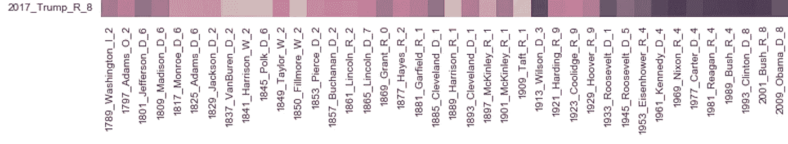
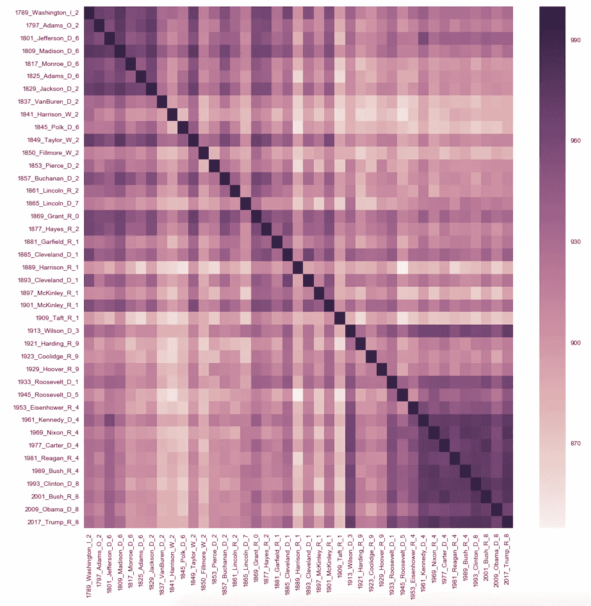
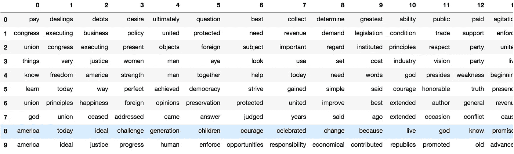

# 一个数据科学练习:根据就职演说，特朗普与其他总统有多相似？

> 原文：<https://towardsdatascience.com/a-data-science-exercise-how-similar-is-trump-to-other-presidents-based-on-inaugural-speeches-8fa7f534a5fb?source=collection_archive---------4----------------------->



Darker is more similar

这是基于运行一些由谷歌团队编写的 NLP(自然语言处理) [Doc2Vec](https://en.wikipedia.org/wiki/Word2vec) 算法的结果。(浅层，两层神经网络)。轴中的名称格式为<年> _ <总统> _ <党> _ <簇>。现在，我们使用了不同的方法来对结果进行聚类，我们将回到这一点。首先，让我们更深入地挖掘相似之处。以下是最相似的演讲:

```
[('1993_Clinton_D_1', 0.9777867794036865),
 ('1977_Carter_D_5', 0.9765924215316772),
 ('1969_Nixon_R_5', 0.975844144821167),
 ('1989_Bush_R_5', 0.974454939365387),
 ('2001_Bush_R_1', 0.9733594655990601),
 ('1961_Kennedy_D_5', 0.973156213760376),
 ('1913_Wilson_D_3', 0.9689352512359619),
 ('1981_Reagan_R_5', 0.9668718576431274),
 ('1945_Roosevelt_D_4', 0.9627108573913574),
 ('1953_Eisenhower_R_5', 0.9612894654273987)]
```

如果你将这些演讲与同一个政党的演讲相比较，最常见的演讲是**、尼克松、老布什和里根**。Doc2Vec/Word to Vec 使用一种叫做单词嵌入的复杂方法来进行比较。以下是所有演讲与其他演讲的对比:



几个有趣的观察可以立即在一个非常高的水平。例如，较暗的下角表示最近几年的演讲都在谈论类似的东西。word2vec 的问题虽然它很好地显示了语义和句法关系的整体保留，但由于向量的性质，更简单的单词关联丢失了或难以可视化。

LDA(一种较老的技术)对于文档的分组(聚类)更加透明。我们将上面找到的文档聚集在一起，发现了一些有趣的关系。



Trump is in Cluster 8

像克林顿和老布什这样的总统使用了一些相同的语言，比如:*挑战、一代、勇气、承诺和变革*。而最不同的总统像早期民主党人和假发党(6 和 2 集群)谈论的事情像:*联盟，国会，外国，联合，党*。或许可以天真地说，总统们谈论的更多的是:A)改变或者 B)保持话语权。同样的，**群集不止不跟随时代而不是总统**。公平地说，总统们通常在同一时期谈论同样的事情。

将所有三个指标(政党、文档向量和聚类)放在一起，我们发现特朗普的演讲**最像里根，**支持他最相似的说法(参考 [4 位具有特朗普般特质的美国总统](http://to.pbs.org/2ww8Ahx))。然而，波尔克的就职演说与特朗普大相径庭。补充说明:由于威廉·亨利·哈里森去世、加菲尔德和肯尼迪遇刺、尼克松被弹劾，我们没有泰勒、亚瑟、约翰逊或福特的正式就职演说。

感谢和更多阅读:

*   [作为 Jupyter 笔记本的此分析的源代码](https://github.com/brianray/data.world-scripts/blob/master/inauguration%20exploration-datadotworld-doc2vec.ipynb)
*   [由 Data Dot World 主办的这次演习的数据](https://data.world/brianray/c-span-inaugural-address)
*   使用的工具:Python，Jupyter，Word2vec，sklearn，pandas，matplotlib
*   [http://brandonrose.org/clustering](http://brandonrose.org/clustering)、[https://medium . com/@ Mishra . the depak/doc 2 vec-in-a-simple-way-fa 80 bfe 81104](https://medium.com/@mishra.thedeepak/doc2vec-in-a-simple-way-fa80bfe81104)[Mishra](https://medium.com/u/b68770157de0?source=post_page-----8fa7f534a5fb--------------------------------)“探索自然语言工具包(NLTK)”by Abhinav Rai[https://medium . com/@ theflyingmanis/Exploring-Natural-Language-Toolkit-NLTK-e 3009 de 61576](https://medium.com/@theflyingmantis/exploring-natural-language-toolkit-nltk-e3009de61576)

相似的分析有不同的结果:

*   [关于特朗普所说的更多 NLP](http://www.trumpdata.org/)
*   “就职演说有什么内容？一个通过 Empath 的词法分析”作者[@ unignorant](http://twitter.com/unignorant)[https://hacker noon . com/whats-in-an-就职演说-词法分析-via-empath-bf9a5eb90b76](https://hackernoon.com/whats-in-an-inauguration-speech-a-lexical-analysis-via-empath-bf9a5eb90b76)
*   《死亡与重生:解读特朗普就职演说的字里行间》作者[@ ascotthines](http://twitter.com/ascotthines)[https://medium . com/@ ascotthines/Death-and-重生-解读特朗普就职演说的字里行间-speech-329fdd4ef632](https://medium.com/@ascotthines/death-and-rebirth-reading-between-the-lines-of-trumps-inauguration-speech-329fdd4ef632)