# Python 中的“好的数据科学”机器学习项目演练:第一部分

> 原文：<https://towardsdatascience.com/a-data-science-for-good-machine-learning-project-walk-through-in-python-part-one-1977dd701dbc?source=collection_archive---------1----------------------->


([Source](https://github.com/dconnolly/chromecast-backgrounds))

## 为社会利益解决一个完整的机器学习问题

在我们这个数据驱动的世界里，数据科学是一个非常强大的工具。你可以说我是理想主义者，但是我相信这个工具不应该仅仅用于让人们点击广告或者花更多的时间在社交媒体上。

在本文和续集中，我们将通过一个完整的机器学习项目来研究一个“[数据科学促进发展](https://www.kdnuggets.com/2015/07/guide-data-science-good.html)的问题:预测哥斯达黎加的家庭贫困。我们不仅能够以最有效的方式提高我们的数据科学技能——通过对真实世界数据的实践*——而且我们还获得了解决一个具有社会效益的问题的回报。*

> 事实证明，公司用来最大化广告浏览量的技巧也可以用来帮助减轻人类的痛苦。

完整的代码在 Kaggle (可以在浏览器中运行，不需要下载)和 GitHub 上都可以作为 [Jupyter 笔记本使用。这是一个活跃的 Kaggle 竞赛，也是一个开始机器学习或学习一些新技能的伟大项目。](https://www.kaggle.com/willkoehrsen/a-complete-introduction-and-walkthrough)

# 问题和方法

[哥斯达黎加家庭贫困水平预测](https://www.kaggle.com/c/costa-rican-household-poverty-prediction)挑战赛是目前正在 Kaggle 上进行的良好机器学习数据科学竞赛。目标是使用个人和家庭社会经济指标来预测家庭的贫困状况。美洲开发银行开发了这个问题，并提供了数据，目的是改进识别需要帮助的家庭的传统方法。


The Costa Rican Poverty Prediction contest is currently running [on Kaggle](https://www.kaggle.com/c/costa-rican-household-poverty-prediction).

贫困标签分为四个等级，这使得这成为一个*监督多类分类*问题:

*   **监督:**给定训练数据的标签
*   **多类分类:**标签是离散的，有两个以上的值

解决[机器学习问题的一般方法是](/a-complete-machine-learning-walk-through-in-python-part-one-c62152f39420):

1.  **了解问题和数据描述**
2.  **数据清理/探索性数据分析**
3.  **特征工程/特征选择**
4.  **车型对比**
5.  **模型优化**
6.  **结果解释**

虽然这些步骤似乎呈现出一种僵化的结构，但机器学习过程是*非线性的*，随着我们对数据越来越熟悉，一些部分会重复多次，看看什么是有效的。有一个大纲来提供一个总的指导是很好的，但是如果事情不顺利或者当我们对问题了解得更多时，我们经常会回到过程的早期部分。

在本文中，我们将大致介绍前四个步骤，看看一些例子，笔记本中提供了全部细节[。这个问题对于初学者来说是一个很好的解决问题——因为数据集的大小是可管理的——对于那些已经有坚实基础的人来说也是如此，因为 Kaggle 提供了一个试验新技术的理想环境。](https://www.kaggle.com/willkoehrsen/a-complete-introduction-and-walkthrough)

最后两个步骤，加上一个实验部分，可以在[第二部分](https://medium.com/@williamkoehrsen/a-data-science-for-good-machine-learning-project-walk-through-in-python-part-two-2773bd52daf0)中找到。

# 理解问题和数据

在理想情况下，我们都是问题主题的专家，拥有多年的经验来指导我们的机器学习。实际上，我们经常处理来自新领域的数据，并且必须快速获取数据所代表的内容以及如何收集数据的知识。

幸运的是，在 Kaggle 上，我们可以使用其他数据科学家分享的[工作来相对快速地达到速度。此外，Kaggle 还提供了一个](https://www.kaggle.com/c/costa-rican-household-poverty-prediction/kernels)[讨论平台](https://www.kaggle.com/c/costa-rican-household-poverty-prediction/discussion)，你可以在这里向比赛组织者提问。虽然与在实际工作中与客户互动不完全相同，但这给了我们一个机会来弄清楚数据字段代表什么，以及在我们遇到问题时应该记住的任何考虑事项。

此时可以问的一些好问题是:

*   根据领域专家的观点，对于这个问题，是否有某些变量被认为是最重要的？
*   数据是否存在已知问题？需要注意的某些价值/异常？
*   数据是如何收集的？如果有异常值，它们可能是人为错误或极端但仍然有效的数据的结果吗？

例如，在与组织者进行讨论后，社区发现文本字符串“yes”实际上映射到值 1.0，并且其中一列的最大值应该是 5，这可用于纠正异常值。如果没有了解数据收集过程的人，我们很难找到这些信息！

数据理解的一部分也意味着挖掘[数据定义](https://www.kaggle.com/c/costa-rican-household-poverty-prediction/data)。最有效的方法是一次浏览一列，阅读描述并确保您知道数据代表什么。我觉得这有点枯燥，所以我喜欢将这个过程与数据探索结合起来，阅读专栏描述，然后用统计数据和数字探索专栏。

比如我们可以读到`meaneduc`是家庭的平均教育量，然后我们可以用标签的值来绘制它的分布，看看它在贫困水平之间是否有任何明显的差异。

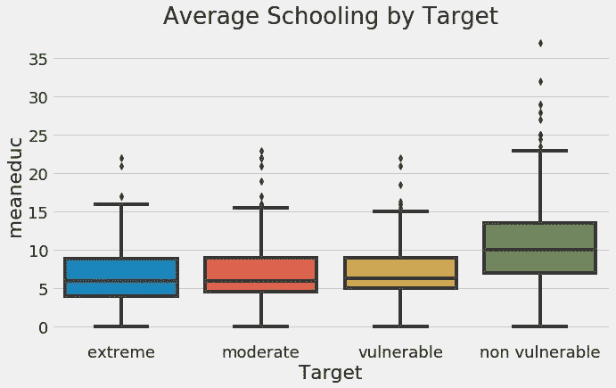

Average schooling in family by target (poverty level).

这表明贫困风险最小的家庭——非弱势家庭——往往比风险最大的家庭有更高的平均教育水平。稍后在特征工程中，我们可以通过从教育中构建特征来使用此信息，因为它似乎显示了目标标签之间的不同。

总共有 143 个专栏(特性)，虽然对于一个实际的应用程序，您希望与专家一起浏览每个专栏，但是我并没有在笔记本中详尽地探究所有这些。相反，我阅读了数据定义，并查看了其他数据科学家的工作，以理解大多数列。

从问题和数据理解阶段建立的另一点是我们想要如何构造我们的训练数据。在这个问题中，我们给出了一个数据表，其中每行代表一个*个体*，列代表特征。如果我们阅读问题定义，我们被告知要对每个*家庭*进行预测，这意味着我们最终的训练数据框架(以及测试)应该对每个家庭有一行。这一点贯穿了我们的整个流程，因此从一开始就把握住这一点至关重要。

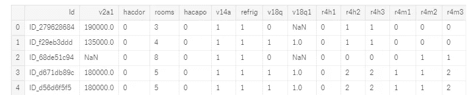

A snapshot of the data where each row is one individual.

## 确定度量标准

最后，我们要确保我们理解了问题的标签和度量。标签是我们想要预测的，度量是我们如何评估这些预测。对于这个问题，标签是一个整数，从 1 到 4，代表一个家庭的贫困程度。该指标是[宏 F1 得分](http://scikit-learn.org/stable/modules/generated/sklearn.metrics.f1_score.html)，这是一个介于 0 和 1 之间的度量值，值越高表示模型越好。**F1 分数是*二进制*分类任务的常用度量，而[“宏”是*多类*问题的平均选项之一。](https://datascience.stackexchange.com/questions/15989/micro-average-vs-macro-average-performance-in-a-multiclass-classification-settin)**

**一旦你知道了度量标准，弄清楚如何用你正在使用的工具来计算它。对于 Scikit-Learn 和宏 F1 分数，代码为:**

```
from sklearn.metrics import f1_score# Code to compute metric on predictions
score = f1_score(y_true, y_prediction, average = 'macro')
```

**知道了度量标准，我们就可以在交叉验证中评估我们的预测，并使用坚持测试集，这样我们就知道我们的选择对性能有什么影响，如果有的话。在这个竞赛中，我们得到了要使用的度量标准，但是在现实世界中，我们必须自己选择一个[合适的度量标准](https://medium.com/usf-msds/choosing-the-right-metric-for-evaluating-machine-learning-models-part-2-86d5649a5428)。**

# **数据探索和数据清理**

**数据探索，也称为[探索性数据分析(EDA)](https://en.wikipedia.org/wiki/Exploratory_data_analysis) ，是一个开放式的过程，在这个过程中，我们要弄清楚我们的数据能告诉我们什么。当我们发现可以用于特性工程或发现异常的有趣的趋势/模式时，我们开始广泛并逐渐在我们的分析中磨练。 [*数据清理*](/data-cleaning-101-948d22a92e4) 与探索密切相关，因为我们需要在建模之前解决我们发现的缺失值或异常。**

**对于数据探索的简单的第一步，我们可以可视化训练数据的标签分布(没有给我们测试标签)。**

**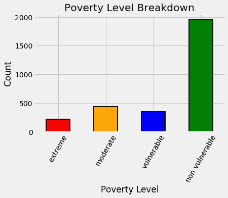**

**Distribution of training labels.**

**这马上告诉我们，我们有一个不平衡的分类问题，这可能使机器学习模型难以学习代表性不足的类别。许多算法都有尝试和处理这一问题的方法，例如在 [Scikit-Learn 随机森林分类器](http://scikit-learn.org/stable/modules/generated/sklearn.ensemble.RandomForestClassifier.html)中设置`class_weight = "balanced"`，尽管它们并不完美。当我们遇到不平衡的分类问题时，我们还希望确保使用 [*分层抽样*](https://stats.stackexchange.com/a/250742/157316) 进行交叉验证，以在每个折叠中获得相同的标签平衡。**

**为了熟悉数据，浏览代表[不同数据统计类型](https://en.wikipedia.org/wiki/Statistical_data_type)的[不同列数据类型](https://pandas.pydata.org/pandas-docs/stable/basics.html#basics-dtypes)是有帮助的:**

*   **`float`:这些通常是连续的数字变量**
*   **`int`:通常要么是布尔型的，要么是序数型的(有顺序的离散型)**
*   **`object`或`category`:通常是在机器学习之前必须以某种方式转换的字符串或混合数据类型**

**我使用*统计类型*来表示数据代表什么——例如只能是 1 或 0 的布尔值——使用*数据类型*来表示值在 Python 中的实际存储方式，例如整数或浮点数。统计类型告知我们如何处理特征工程的列。**

**(我为每个数据类型/统计类型配对指定了*通常是*，因为您可能会发现统计类型被保存为错误的数据类型。)**

**如果我们看一下这个问题的整数列，我们可以看到它们中的大多数表示布尔值，因为只有两个可能的值:**

**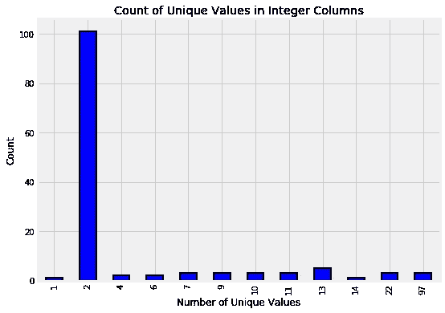**

**Integer columns in data.**

**浏览对象列，我们遇到了一个难题:2 列是 Id 变量(存储为字符串)，但是 3 列看起来是数值。**

```
# Train is pandas dataframe of training data
train.select_dtypes('object').head()
```

**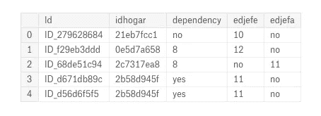**

**Object columns in original data.**

**这就是我们早先的*数据理解*发挥作用的地方。对于这三列，一些条目是“是”，一些是“否”，而其余的是浮动。我们做了背景调查，因此知道“是”意味着 1，“否”意味着 0。使用这些信息，我们可以校正这些值，然后可视化由标签着色的变量分布。**

**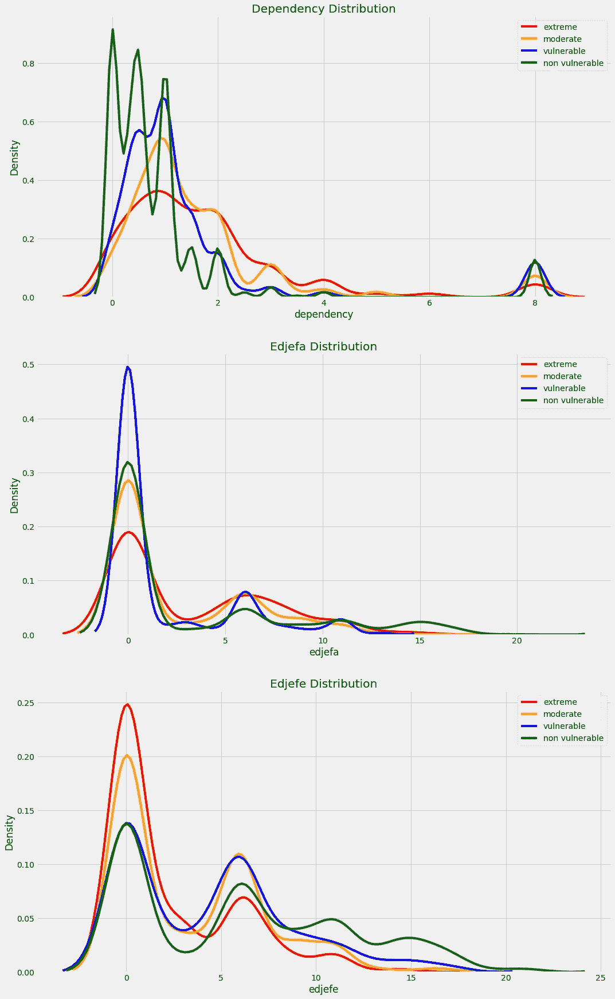**

**Distribution of corrected variables by the target label.**

**这是数据探索和清理齐头并进的一个很好的例子。我们发现数据中的错误，修正它，然后研究数据以确保我们的修正是适当的。**

## **缺少值**

**此数据的一个关键数据清理操作是处理缺失值。在熊猫中，计算缺失值的总数和百分比很简单:**

**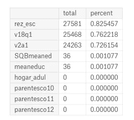**

**Missing values in data.**

**在某些情况下，缺失值是有原因的:`v2a1`列代表月租金，许多缺失值是因为家庭拥有房屋。为了弄清楚这一点，我们可以将数据划分为房屋*缺少租金支付*，然后绘制显示房屋所有权的`tipo_`变量(我不确定这些列名来自哪里)。**

**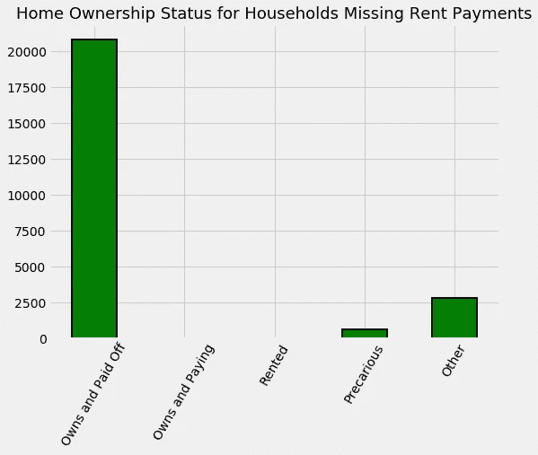**

**Home ownership status for those households with no rent payments.**

**根据该图，解决方案是为拥有自己房屋的家庭填写缺失的租金付款，并让其他家庭进行估算。我们还添加了一个 boolean 列，指示租金付款是否丢失。**

**列中其他缺失的值以同样的方式处理:使用来自*其他列*或关于问题的知识来填充值，或者让它们被估算。添加一个布尔列来指示丢失的值也是有用的，因为有时值丢失了的*信息很重要。需要注意的另一个关键点是，对于缺失值，我们通常希望考虑使用其他列中的信息来填充缺失值，就像我们对租金付款所做的那样。***

**一旦我们处理了缺失值、异常和不正确的数据类型，我们就可以继续进行特性工程。我通常将数据探索视为一个正在进行的过程，而不是一个固定的块。例如，当我们进入特征工程时，我们可能想要探索我们创建的新变量。**

> **数据科学过程是非线性的:虽然我们有一个大致的轮廓，但随着我们对问题的深入，我们经常回过头来重复前面的步骤。**

# **特征工程**

**如果你关注我的工作，你会知道我确信[自动化特征工程](/why-automated-feature-engineering-will-change-the-way-you-do-machine-learning-5c15bf188b96)——具有领域专业知识——将取代传统的手工特征工程。对于这个问题，我采用了两种方法，在主笔记本中完成大部分手工工作，然后用自动化特征工程编写[另一个笔记本。毫不奇怪，自动化的特征工程花费了十分之一的时间，并获得了更好的性能！这里我将展示手动版本，但是请记住](https://www.kaggle.com/willkoehrsen/featuretools-for-good)[自动化特征工程(带有 Featuretools)](https://www.featuretools.com/) 是一个很好的学习工具。**

**在这个问题中，我们特征工程的主要目标是在*家庭*级别聚集所有*个人*级别的数据。这意味着将一所房子里的个人分组，然后计算统计数据，如最大年龄、平均教育水平或家庭拥有的手机总数。**

**幸运的是，一旦我们将单个数据分离出来(放入`ind`数据帧中)，在 Pandas 中做这些聚合就是字面上的一行(使用`idhogar`家庭标识符用于分组):**

```
# Aggregate individual data for each household
ind_agg = ind.groupby('idhogar').agg(['min', 'max', 'mean', 'sum'])
```

**重命名列后，我们有了许多类似于以下的功能:**

**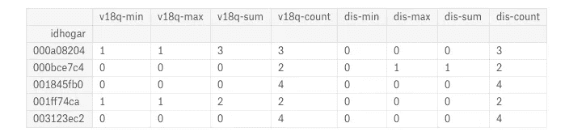**

**Features produced by aggregation of individual data.**

**这种方法的好处是可以快速创建许多特征。其中一个缺点是，这些特征中的许多可能没有用或者高度相关([称为共线](https://en.wikipedia.org/wiki/Collinearity#Usage_in_statistics_and_econometrics))，这就是为什么我们需要使用特征选择。**

**聚合的另一种方法是[基于哪些特征可能对预测贫困有用，使用领域知识](https://medium.com/mindorks/what-is-feature-engineering-for-machine-learning-d8ba3158d97a)一次计算一个特征。例如，在家庭数据中，我们创建了一个名为`warning`的特征，它增加了许多家庭“警告信号”(`house`是家庭变量的数据框架):**

```
# No toilet, no electricity, no floor, no water service, no ceiling
house['warning'] = 1 * (house['sanitario1'] + 
                         (house['elec'] == 0) + 
                         house['pisonotiene'] + 
                         house['abastaguano'] + 
                         (house['cielorazo'] == 0))
```

**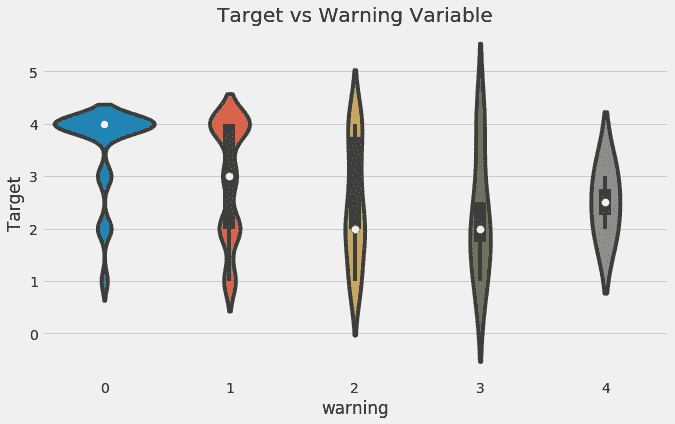**

**Violinplot of Target by Warning Value.**

**我们还可以通过将一个值除以另一个值来计算“人均”特征(`tamviv`是家庭成员的数量):**

```
# Per capita features for household data
house['phones-per-capita'] = house['qmobilephone'] / house['tamviv']
house['tablets-per-capita'] = house['v18q1'] / house['tamviv']
house['rooms-per-capita'] = house['rooms'] / house['tamviv']
house['rent-per-capita'] = house['v2a1'] / house['tamviv']
```

**当谈到[手工与自动化特征工程](https://github.com/Featuretools/Automated-Manual-Comparison)时，我认为最佳答案是两者的混合。作为人类，我们在构建功能时受到创造力和时间的限制，创造力是我们能想到的功能是有限的，时间是我们编写代码的有限时间。我们可以手工制作一些类似上面的有见识的特性，但是自动化特性工程擅长的是在其他特性之上自动构建聚合。**

> **最好的方法是花一些时间使用领域知识手工创建一些特性，然后将这个过程交给自动化的特性工程来生成成百上千个特性。**

**( [Featuretools](https://github.com/Featuretools/featuretools) 是最先进的自动化特征工程开源 Python 库。[这里有一篇文章](/automated-feature-engineering-in-python-99baf11cc219)可以让你在 10 分钟内开始。)**

## **特征选择**

**一旦我们耗尽了时间或耐心来制作特性，我们就应用[特性选择](http://scikit-learn.org/stable/modules/feature_selection.html)来删除一些特性，试图只保留那些对问题有用的特性。“有用”没有固定的定义，但是我们可以使用一些启发法(经验法则)来选择特性。**

**一种方法是通过确定特征之间的相关性。彼此高度相关的两个变量称为共线变量。这是机器学习中的一个问题，因为它们会降低训练速度，创建更难解释的模型，并且会通过对训练数据进行过度拟合来降低模型性能。**

**移除相关特征的棘手部分是确定相关阈值，以表明两个变量过于相关。我通常尽量保持保守，使用 0.95 或以上的相关系数。一旦我们决定了一个阈值，我们就使用下面的代码从每一对相关性高于该值的变量中删除一个:**

**我们只移除那些*相互关联*的特性。我们想要与目标相关的特征*(尽管与标签的相关性大于 0.95 会好得令人难以置信)！***

**特征选择有很多种[方法(我们会在接近文章结尾的实验部分看到另一种)。这些可以是](https://machinelearningmastery.com/feature-selection-machine-learning-python/)[单变量](http://scikit-learn.org/stable/auto_examples/feature_selection/plot_feature_selection.html)——对照目标一次测量一个变量——或[多变量](https://github.com/danielhomola/mifs)——评估多个特征的影响。我也倾向于使用[基于模型的特征重要性进行特征选择](http://scikit-learn.org/stable/modules/feature_selection.html#tree-based-feature-selection)，比如那些来自随机森林的特征。**

**在特征选择之后，我们可以对我们的最终变量集进行一些探索，包括制作一个关联热图和一个[对图](/visualizing-data-with-pair-plots-in-python-f228cf529166)。**

**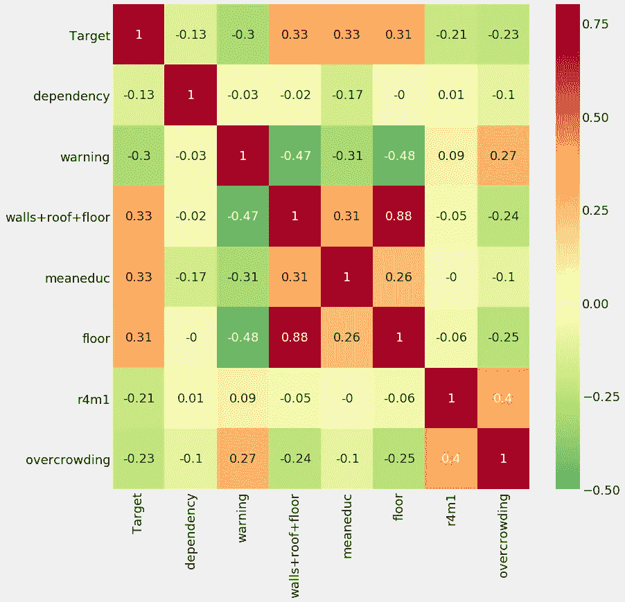****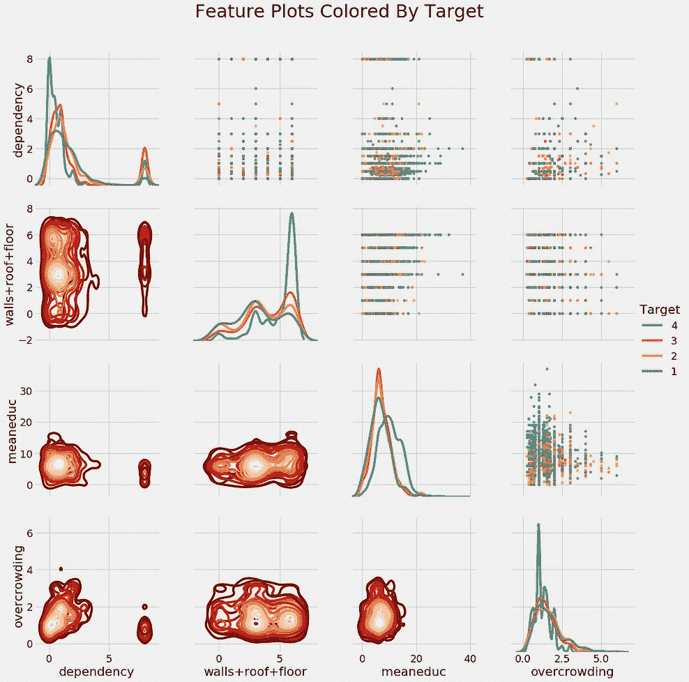**

**Correlation heatmap (left) and pairsplot colored by the value of the label (right).**

**我们从探索中得到的一点是教育与贫困之间的关系:随着一个家庭教育水平的提高(平均和最大)，贫困的严重程度趋于降低(1 为最严重):**

**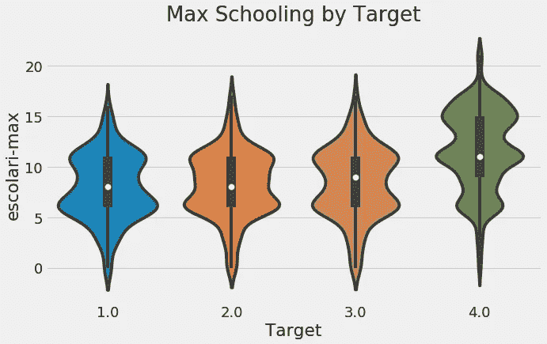**

**Max schooling of the house by target value.**

**另一方面，随着拥挤程度——每个房间的人数——的增加，贫困的严重程度也在增加:**

**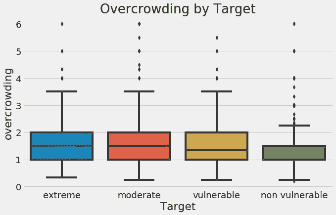**

**Household overcrowding by value of the target.**

**这是来自这场比赛的两个可行的见解，甚至在我们进入机器学习之前:教育水平较高的家庭往往贫困程度较低，每个房间有更多人的家庭往往贫困程度较高。除了技术方面，我喜欢思考数据科学项目的分支和更大的图景。我们很容易被细节淹没，然后忘记了解决这个问题的整体原因。**

> **这个项目的最终目标是找出如何预测贫困，以便最有效地帮助那些需要帮助的人。**

# **模型比较**

**下图是我最喜欢的机器学习结果之一:它显示了机器学习模型在许多数据集上的性能，百分比显示了特定方法击败任何其他方法的次数。(摘自 Randal Olson 的一篇可读性很强的论文。)**

**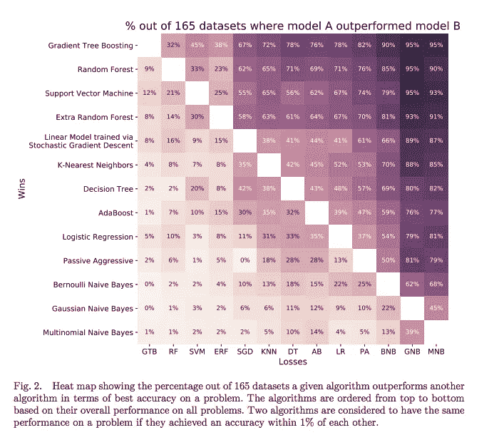**

**Comparison of many algorithms on 165 datasets.**

**这表明在一些问题上*即使是简单的逻辑回归也会胜过随机森林或梯度推进机*。虽然[渐变树增强](https://machinelearningmastery.com/gentle-introduction-gradient-boosting-algorithm-machine-learning/)模型*一般来说*效果最好，但也不能保证它会胜出。因此，当我们处理一个新问题时，最佳实践是尝试几种不同的算法，而不是总是依赖同一个算法。我以前也曾被同一个模型(随机森林)困住，但是请记住没有一个模型永远是最好的。**

**幸运的是，有了 [Scikit-Learn](http://scikit-learn.org/) ，使用相同的语法评估[许多机器学习模型](http://scikit-learn.org/stable/supervised_learning.html)变得很容易。虽然我们不会对每个模型进行超参数调整，但我们可以将模型与默认超参数进行比较，以便选择最有希望进行优化的模型。**

**在笔记本中，我们尝试了六种模型，涵盖了从简单的高斯朴素贝叶斯到复杂的随机森林和梯度推进机器的复杂范围。尽管 Scikit-Learn 确实有一个 GBM 实现，但是它相当慢，更好的选择是使用一个专用的库，比如 XGBoost 或 LightGBM。对于这款笔记本电脑，我使用了 [Light GBM](http://lightgbm.readthedocs.io/en/latest/Python-API.html#training-api) ，并根据过去的良好表现选择了超参数。**

**为了比较模型，我们在 5 或 10 倍的训练数据上计算[交叉验证](https://www.openml.org/a/estimation-procedures/1)性能。我们想要使用*训练*数据，因为*测试*数据只打算用一次来评估我们最终模型在新数据上的性能。下图显示了模型比较。条形的高度是模型记录的折叠的平均宏 F1 分数，黑色条形是标准偏差:**

**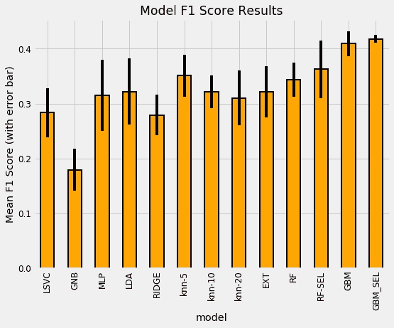**

**Model cross validation comparison results.**

**(要查看名称的解释，请参阅笔记本。RF 代表随机森林，GBM 是梯度提升机器，SEL 代表特征选择后的特征集)。虽然这不完全是水平比较——我没有使用梯度推进机器的默认超参数——但总体结果是:GBM 是最好的模型，遥遥领先。这反映了大多数其他数据科学家的发现。**

**请注意，我们在特性选择前后交叉验证了数据，以查看其对性能的影响。机器学习在很大程度上仍然是一个经验领域，知道一种方法是否有效的唯一方法是尝试它，然后衡量性能。为管道中的步骤测试不同的选择很重要——例如特征选择的相关性阈值——以确定它们是否有帮助。请记住，我们还希望避免将*过多的权重*放在交叉验证结果上，因为即使有许多折叠，我们仍然可能过度适应训练数据。最后，尽管 GBM 最适合这个数据集，但情况并不总是这样！**

**基于这些结果，我们可以选择梯度推进机作为我们的模型(记住这是一个我们可以回头修改的决定！).一旦我们决定了一个模型，下一步就是充分利用它，这个过程被称为[模型超参数优化](https://en.wikipedia.org/wiki/Hyperparameter_optimization)。**

**认识到不是每个人都有时间一口气写 30 分钟的文章(即使是关于数据科学的)，我把这篇文章分成两部分。[第二部分](https://medium.com/@williamkoehrsen/a-data-science-for-good-machine-learning-project-walk-through-in-python-part-two-2773bd52daf0)包括模型优化、解释和实验部分。**

**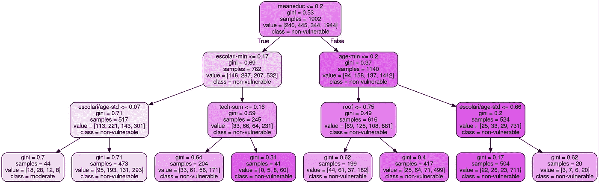**

**Decision tree visualization from part two.**

# **结论**

**至此，我们可以看到[机器学习](http://shop.oreilly.com/product/0636920052289.do)的所有不同部分是如何走到一起形成解决方案的:我们首先必须理解问题，然后我们挖掘数据，根据需要清理数据，然后我们为机器学习模型制作特征，最后我们评估了几个不同的模型。**

**我们已经涵盖了许多技术，并有一个像样的模型(虽然 F1 分数相对较低，但它在提交给比赛的前 50 名模型中占有一席之地)。尽管如此，我们仍然有几个步骤:通过优化，我们可以改进我们的模型，然后我们必须解释我们的结果，因为直到[我们已经交流了我们的工作](/the-most-important-part-of-a-data-science-project-is-writing-a-blog-post-50715f37833a)，分析才是完整的。**

**下一步，[看第二部分](https://medium.com/@williamkoehrsen/a-data-science-for-good-machine-learning-project-walk-through-in-python-part-two-2773bd52daf0)，查看[笔记本](https://www.kaggle.com/willkoehrsen/a-complete-introduction-and-walkthrough)(也在 [GitHub](https://github.com/WillKoehrsen/data-science-for-good/blob/master/costa-rican-poverty/A%20Complete%20Walkthrough.ipynb) 上)，或者开始[为自己解决问题](https://www.kaggle.com/c/costa-rican-household-poverty-prediction)。**

**和往常一样，我欢迎反馈、建设性的批评以及倾听您的数据科学项目。可以在 Twitter [@koehrsen_will](http://twitter.com/koehrsen_will) 上找到我。**