# Python 中的“好的数据科学”机器学习项目演练:第二部分

> 原文：<https://towardsdatascience.com/a-data-science-for-good-machine-learning-project-walk-through-in-python-part-two-2773bd52daf0?source=collection_archive---------8----------------------->

([Source](https://github.com/dconnolly/chromecast-backgrounds))

## 最大限度地利用我们的模型，弄清楚它意味着什么，并尝试新的技术

机器学习是一个强大的框架，从外面看起来可能很复杂，令人生畏。然而，一旦我们将一个问题分解成它的组成步骤，我们就会看到机器学习实际上只是一系列可理解的过程，每个过程本身都很简单。

在本系列的[前半部分，我们看到了我们如何实现一个“为好的数据科学”机器学习问题的解决方案，在我们选择了梯度推进机器作为我们的选择模型之后，我们就停止了。](https://medium.com/@williamkoehrsen/a-data-science-for-good-machine-learning-project-walk-through-in-python-part-one-1977dd701dbc)

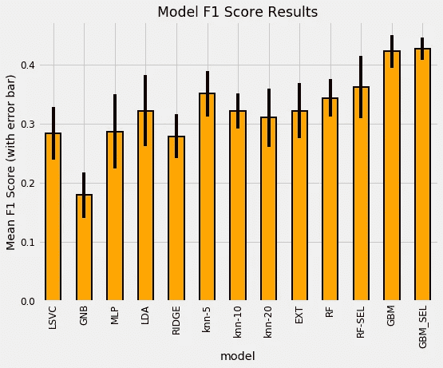

Model evaluation results from part one.

在本文中，我们将继续预测哥斯达黎加的贫困状况，执行模型优化，解释模型，并尝试一些实验技术。

完整的代码可以在 Kaggle (可以在浏览器中运行，不需要下载)和 GitHub 上的 [Jupyter 笔记本中获得。这是一个活跃的 Kaggle 竞赛，也是一个开始机器学习或学习一些新技能的伟大项目。](https://www.kaggle.com/willkoehrsen/a-complete-introduction-and-walkthrough)

# 模型优化

模型优化意味着为给定数据集搜索产生最佳性能的模型超参数(通过交叉验证测量)。因为最佳超参数随数据而变化，所以我们必须优化我们数据的模型，也称为调整模型。我喜欢把调优看作是为机器学习模型寻找最佳设置。

有 4 种主要的调优方法，从最低效率(手动)到最高效率(自动)排列。

1.  **手动调优**:凭直觉/经验或通过猜测选择超参数，用这些值训练模型，找到验证分数，重复直到你失去耐心或对结果满意。
2.  **网格搜索**:设置一个超参数网格，对于每一个数值组合，训练一个模型，找到验证分数。超参数的最佳集合是得分最高的那些。
3.  **随机搜索**:设置超参数网格，选择*随机*数值组合，训练模型，找到验证分数。搜索迭代受到时间/资源的限制
4.  **自动调整**:使用方法(梯度下降、贝叶斯优化、进化算法)引导搜索最佳超参数。这些是使用过去信息的*知情方法*。

自然，我们将跳过前三种方法，直接进入最有效的方法:自动超参数调优。对于这个实现，我们可以使用 [Hyperopt 库](https://github.com/hyperopt/hyperopt)，它使用带有[树 Parzen 估计器](https://papers.nips.cc/paper/4443-algorithms-for-hyper-parameter-optimization.pdf)的贝叶斯优化版本进行优化。你不需要理解这些术语来使用模型，尽管我在这里写了一个概念性的解释。(我还在这里写了一篇关于使用 Hyperopt 进行模型调优的[文章](/automated-machine-learning-hyperparameter-tuning-in-python-dfda59b72f8a)。)

细节有点冗长(见笔记本)，但是我们需要 4 个部分来实现 Hyperopt 中的贝叶斯优化

1.  *目标函数:*我们想要最大化(或最小化)什么
2.  *域空间:*要搜索的区域
3.  *用于选择下一个超参数的算法:*使用过去的结果来建议要评估的下一个值
4.  *结果历史*:保存过去的结果

[贝叶斯优化](/shallow-understanding-on-bayesian-optimization-324b6c1f7083) (BO)的基本思想是，算法从过去的结果中推理——之前的超参数*的得分如何——然后选择它认为最好的*下一个*值组合。网格或随机搜索是不使用过去结果的方法，其思想是通过推理，BO 可以在更少的搜索迭代中找到更好的值。*

完整的实现见笔记本，但下面是 100 次搜索迭代后的优化分数。

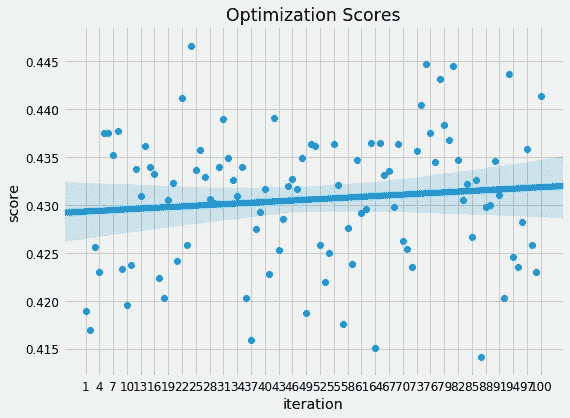

Model optimization scores versus iteration.

与分数随时间随机变化的随机搜索不同，在贝叶斯优化中，随着算法学习最佳超参数的概率模型，分数往往会随着时间的推移而改善。贝叶斯优化的想法是，我们可以通过*将搜索*集中在有希望的设置上来更快地优化我们的模型(或任何函数)。一旦优化运行完成，我们可以使用最佳超参数来交叉验证模型。

优化模型并不总能提高我们的测试分数，因为我们是在为*训练*数据进行优化。然而，与默认的超参数相比，有时它可以带来很大的好处。在这种情况下，最终的交叉验证结果以数据框架的形式显示如下:

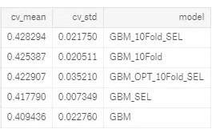

Cross validation results. Models without 10Fold in name were validated with 5 folds. SEL is selected features.

优化的模型(用 OPT 表示，并在选择后使用 10 个交叉验证折叠的特征)正好位于梯度增强机器的非优化变体的中间(它使用我发现对以前的问题工作良好的超参数)。)这表明我们还没有找到最佳的超参数，或者可能有多组表现大致相同的超参数。

我们可以继续优化，尝试找到更好的超参数，但通常超参数调整的[回报远小于特征工程的回报](https://homes.cs.washington.edu/~pedrod/papers/cacm12.pdf)。在这一点上，我们有一个相对高性能的模型，我们可以使用这个模型对测试数据进行预测。然后，由于这是一个 Kaggle 比赛，我们可以将预测提交给[排行榜](https://www.kaggle.com/c/costa-rican-household-poverty-prediction/leaderboard)。这样做让我们进入了前 50 名(目前)，这是对我们所有努力的一个很好的证明！

至此，我们已经实现了这个机器学习问题的完整解决方案。我们的模型可以对哥斯达黎加家庭的贫困做出相当准确的预测(F1 得分相对较低，但这是一个困难的问题)。现在，我们可以继续解释我们的预测，看看我们的模型是否能告诉我们关于这个问题的任何东西。即使我们有解决方案，我们也不想忽视*为什么我们的解决方案很重要*。

## 关于 Kaggle 竞赛的注记

机器学习竞赛的本质可能会鼓励不良做法，例如以牺牲所有其他考虑因素为代价来优化排行榜分数的错误。一般来说，这导致使用更复杂的模型来弥补微小的性能增益。

> 在现实世界中，超过某个阈值——这取决于应用程序——准确性变得次要于可解释性，如果更简单的话，您最好使用性能稍差的[模型。](https://blog.insightdatascience.com/always-start-with-a-stupid-model-no-exceptions-3a22314b9aaa)

投入使用的简单模型比永远无法部署的复杂模型要好。此外，那些在排行榜顶端的人可能[过度适应测试数据](http://gregpark.io/blog/Kaggle-Psychopathy-Postmortem/)，并且没有一个健壮的模型。

> 最大限度地利用 Kaggle 的一个好策略是努力解决一个问题，直到你有一个合理的好解决方案——比方说 90%的排行榜得分——然后不要为达到最高分而感到压力。竞争是有趣的，但学习是承担这些项目最有价值的方面。

# 解释模型结果

在编写所有机器学习代码的过程中，很容易忽略一些重要的问题:我们制作这个模型是为了什么？我们的预测会有什么影响？幸运的是，我们这次的答案不是“增加广告收入”，而是有效地预测哥斯达黎加哪些家庭最容易陷入贫困，以便他们能够获得所需的帮助。

为了尝试了解我们的模型的输出，我们可以根据测试数据以家庭为单位来检查贫困水平的预测。对于测试数据，我们不知道真实的答案，但我们可以将每个预测类的相对频率与训练标签中的相对频率进行比较。下图左侧显示了贫困的训练分布，右侧显示了测试数据的预测分布:

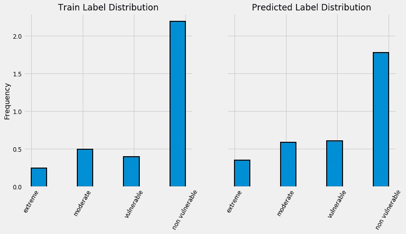

Training label distribution (left) and predicted test distribution (right). Both histograms are normalized.

有趣的是，尽管“不脆弱”的标签在训练数据中最常见，但在预测的相对基础上，它的出现频率*较低。我们的模型预测其他 3 个阶层的比例更高，这意味着它认为在测试数据中有*更严重的贫困*。如果我们把这些分数转换成数字，我们有 3929 个家庭属于“非脆弱”类别，771 个家庭属于“极端”类别。*

另一种看待预测的方式是通过模型的可信度。对于测试数据上的每一个预测，我们不仅可以看到标签，还可以看到模型赋予它的概率。让我们看看箱线图中标签值的置信度。

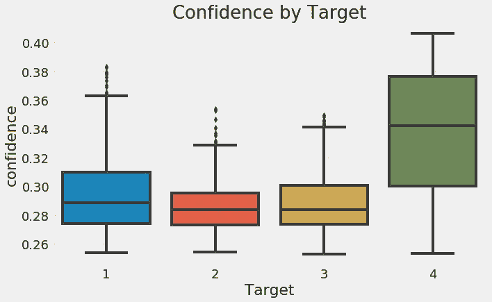

Boxplot of probability assigned to each label on testing data.

这些结果相当直观——我们的模型对最极端的预测最有信心——对温和的预测信心较低。理论上，最极端的标签之间应该有更多的分离，而中间的目标应该更难区分。

从这个图表中得出的另一点是，总的来说，我们的模型对预测并不十分确定。一个没有数据的猜测会将 0.25 的概率放在每一类上，我们可以看到，即使对于最不极端的贫困，我们的模型也很少有超过 40%的置信度。这告诉我们这是一个棘手的问题——在可用的数据中没有太多的分类。

理想情况下，这些预测，或者那些来自竞赛中获胜模型的预测，将被用来确定哪些家庭最有可能需要帮助。然而，仅仅是预测本身并不能告诉我们什么会导致贫困，或者我们的模型是如何“思考”的。虽然我们还不能完全解决这个问题，但我们可以尝试窥视机器学习的[黑箱](https://www.technologyreview.com/s/604087/the-dark-secret-at-the-heart-of-ai/)。

在基于树的模型中——如梯度推进机——特征重要度表示特征上节点分裂的[和基尼系数杂质减少总量。我从来没有发现绝对值很有帮助，而是将这些数字归一化，并在相对的基础上看待它们。例如，下面是优化的 GBM 模型的 10 个最重要的特性。](http://danielhomola.com/wp-content/uploads/2018/03/DanielHomola_PhdThesis_final.pdf)

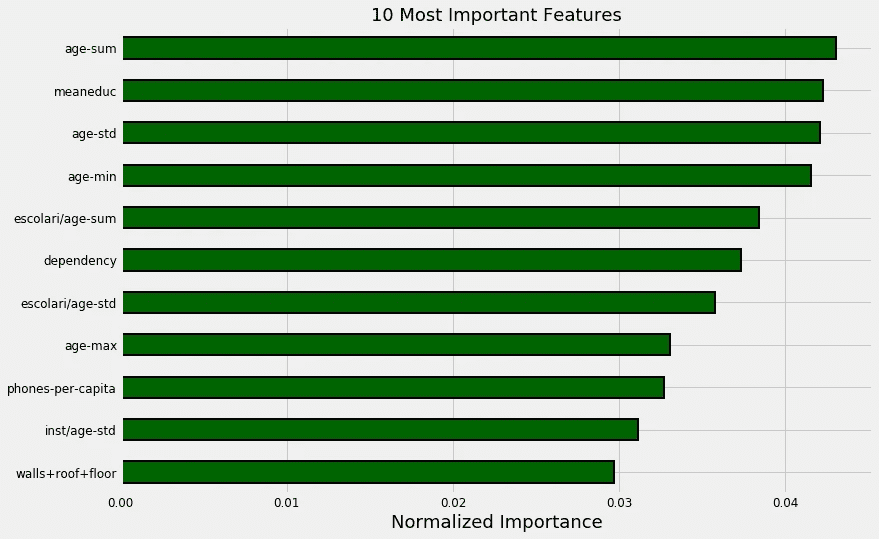

Most important features from optimized gradient boosting machine.

在这里，我们可以看到家庭成员的教育和年龄构成了最重要的特征。进一步看重要性，我们也看到了家庭的大小。这与贫困研究人员的发现相呼应:[家庭规模与更极端的贫困](https://poverty.ucdavis.edu/faq/how-does-family-structure-relate-poverty)相关，而[教育水平与贫困](http://citeseerx.ist.psu.edu/viewdoc/download?doi=10.1.1.201.8131&rep=rep1&type=pdf#page=14)成反比*。在这两种情况下，我们不一定知道哪一个导致了哪一个，但是我们可以使用这些信息来突出哪些因素应该被进一步研究。希望这一数据能够被用来进一步减少贫困(在过去的 25 年中贫困一直在稳步减少)。*

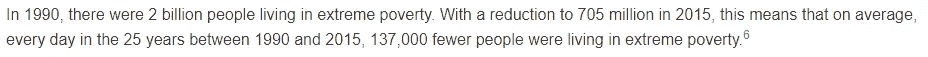

It’s true: the world is better now than ever and still improving ([source](https://ourworldindata.org/extreme-poverty)).

除了潜在地帮助研究人员之外，我们可以通过尝试在这些基础上构建更多的特性来使用特性重要性进行进一步的特性工程。使用上述结果的一个例子是用`meaneduc`除以`dependency`来创建一个新特征。虽然这可能不太直观，但很难提前知道什么对模型有效。

使用测试数据检查我们的模型的另一种方法是将训练数据分成*较小的训练集和*验证集。因为我们有所有定型数据的标签，所以我们可以将我们对维持验证数据的预测与真实值进行比较。例如，使用 1000 个观察值进行验证，我们得到下面的[混淆矩阵](https://www.dataschool.io/simple-guide-to-confusion-matrix-terminology/):

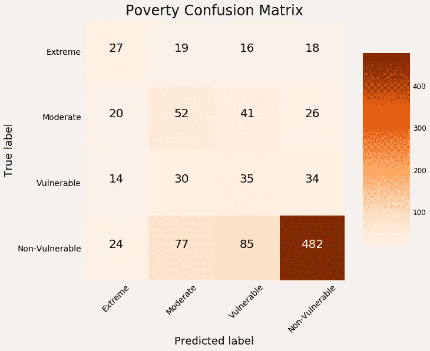

Confusion matrix on validation data.

对角线上的值是模型*正确预测的值*，因为预测标签与真实标签相同。任何偏离对角线的模型*预测错误*。我们可以看到，我们的模型在识别非弱势家庭方面是最好的，但在识别其他标签方面不是很好。

例如，我们的模型错误地将 18 户家庭归类为非弱势群体，而这些家庭实际上处于极端贫困之中。像这些*的预测具有现实世界的后果*，因为这些家庭可能会因为这种模式而得不到帮助。(更多关于错误算法的后果，见 [*数学毁灭的武器*](https://weaponsofmathdestructionbook.com/) )。)

总的来说，这种平庸的表现——模型精度约为 60%,比随机猜测好得多，但并不例外——表明这个问题可能很困难。可能是没有足够的信息来在可用数据中分离类别。

主办机构美洲开发银行的一个建议是，我们需要更多的数据来更好地解决这个问题。这可能表现为更多的特征——因此调查中有更多的问题——或者更多的观察——更多的家庭被调查。这两者都需要付出巨大的努力，但投资于数据科学项目的最佳时间回报通常是通过收集更多的高质量标记数据。

我们可以使用其他方法来理解模型，例如[本地可解释的模型不可知解释器(LIME)](https://homes.cs.washington.edu/~marcotcr/blog/lime/) ，它使用一个更简单的线性模型来近似预测周围的模型。我们还可以查看森林中的单个决策树，这些决策树通常很容易解析，因为它们本质上模拟了人类的决策过程。

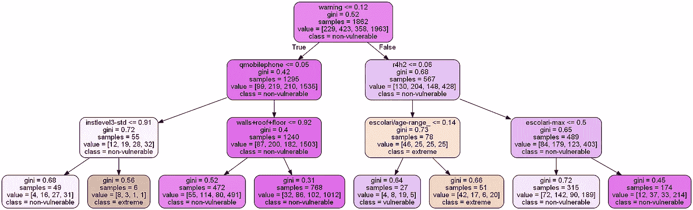

Individual Decision Tree in Random Forest.

> 总体而言，机器学习仍然存在可解释性差距，这阻碍了它的适用性:人们不仅想要准确的预测，还想要了解这些预测是如何产生的。

# 探索技术

我们已经用标准工具箱解决了机器学习问题，那么为什么还要进一步探索技术呢？嗯，如果你像我一样，那么你喜欢仅仅为了学习而学习新的东西。此外，今天的*探索技术将成为明天的标准工具。*

对于这个项目，我决定尝试两项新技术:

*   [递归特征消除](http://scikit-learn.org/stable/modules/generated/sklearn.feature_selection.RFECV.html#sklearn.feature_selection.RFECV)进行特征选择
*   [均匀流形近似和投影](https://arxiv.org/pdf/1802.03426.pdf)用于降维和可视化

## 递归特征消除

递归特征消除是一种用于特征选择的方法，它使用模型的特征重要性(该应用程序的随机森林)来选择特征。这个过程是一个重复的方法:在每次迭代中，最不重要的特性被删除。通过对训练数据进行交叉验证来确定要保留的最佳特征数量。

递归特征消除与 [Scikit-Learn 的 RFECV 方法](http://scikit-learn.org/stable/modules/generated/sklearn.feature_selection.RFECV.html)一起使用很简单。这种方法建立在一个评估器(一个模型)上，然后像任何其他 Scikit-Learn 方法一样`fit`。`scorer`部分是必需的，以便[使用宏 F1 得分制作自定义得分指标](http://scikit-learn.org/stable/modules/generated/sklearn.metrics.make_scorer.html)。

Recursive Feature Elimination code.

虽然我以前使用过特征重要性进行选择，但我从未实现过递归的特征消除方法，并且像往常一样，惊喜地发现在 Python 中做到这一点是多么容易。RFECV 方法根据交叉验证分数从大约 190 个特征中选择了 58 个:

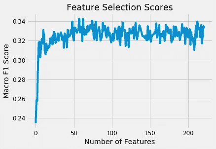

Recursive Feature Elimination Scores.

然后对所选的特征集进行试验，以将交叉验证性能与原始特征集进行比较。(最终结果将在下一部分之后呈现)。鉴于这种方法的易用性，我认为它是您建模技能中的一个好工具。像任何其他 Scikit-Learn 操作一样，它可以[适合一个](http://scikit-learn.org/stable/modules/generated/sklearn.pipeline.Pipeline.html) `[Pipeline](http://scikit-learn.org/stable/modules/generated/sklearn.pipeline.Pipeline.html)`，允许您快速执行一系列完整的预处理和建模操作。

## 可视化降维

机器学习中有[多种无监督方法](http://scikit-learn.org/stable/modules/unsupervised_reduction.html)用于降维。这些分为两大类:

*   矩阵分解算法: [PCA](http://scikit-learn.org/stable/modules/generated/sklearn.decomposition.PCA.html#sklearn.decomposition.PCA) 和 [ICA](http://scikit-learn.org/stable/modules/generated/sklearn.decomposition.FastICA.html)
*   将数据映射到低维流形上的嵌入技术: [IsoMap](http://scikit-learn.org/stable/modules/generated/sklearn.manifold.Isomap.html#sklearn.manifold.Isomap) ， [t-SNE](http://scikit-learn.org/stable/modules/generated/sklearn.manifold.TSNE.html#sklearn.manifold.TSNE)

通常，PCA(主成分分析)和 ICA(独立成分分析)用于可视化和作为机器学习的预处理步骤，而像[t-SNE(t-分布式随机邻居嵌入)这样的多种方法仅用于可视化](https://stats.stackexchange.com/questions/263539/clustering-on-the-output-of-t-sne)，因为它们高度依赖于超参数，并且不保留数据内的距离。(在 Scikit-Learn 中，t-SNE 实现没有`transform`方法，这意味着我们不能用它来建模)。

降维场景中的一个新条目是 [UMAP:一致流形近似和投影](https://github.com/lmcinnes/umap)。它旨在将数据映射到一个低维流形，因此这是一种嵌入技术，同时保留数据的全局结构。虽然背后的数学是严谨的，但它可以像 Scikit-Learn 方法一样使用`[fit](https://github.com/lmcinnes/umap)``[transform](https://github.com/lmcinnes/umap)`[调用](https://github.com/lmcinnes/umap)。

我想尝试这些方法，既可以减少可视化的维度，又可以将减少的组件作为*附加特性添加进来。虽然这个用例可能不是典型的，但是尝试一下没有坏处！下面显示了使用 UMAP 创建训练和测试数据嵌入的代码。*

Uniform Manifold Approximation and Embedding Code.

其他三种方法的应用完全相同(除了 TSNE 不能用于`transform`测试数据)。在完成变换之后，我们可以在 3 维中可视化减少的训练特征，用目标的值给点着色:

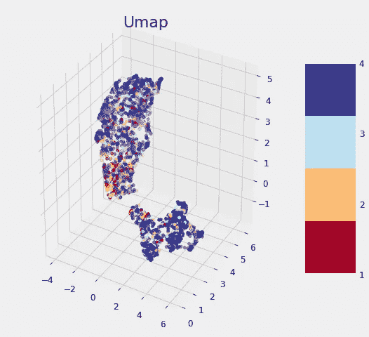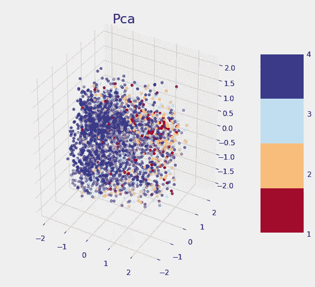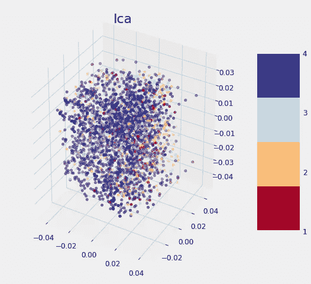

Dimension Reduction Visualizations

没有一种方法能根据标签清晰地分离数据，这些标签遵循其他数据科学家的[发现。正如我们之前发现的，考虑到我们可以访问的数据，这个问题可能很难解决。虽然这些图表不能用来说明我们是否能解决一个问题，但是如果有一个清晰的分离，那么它表明在数据中有*某种*的东西可以让一个模型很容易地辨别每一类。](https://www.kaggle.com/mlisovyi/cluster-analysis-tsne-mds-isomap)

最后一步，我们可以在应用特征选择后将缩减的特征添加到特征集中，以查看它们是否对建模有用。(通常应用降维，然后仅在降维后的维度上训练模型)。每个型号的性能如下所示:

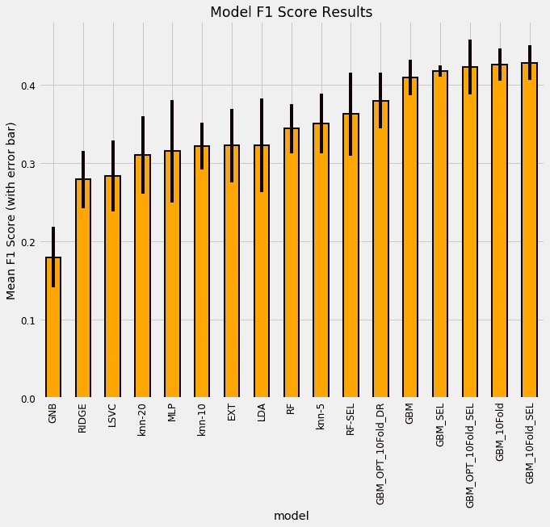

FInal model comparison results.

使用降维特征的模型具有后缀 DR，而 GBM 之后的折叠数是指交叉验证折叠数。总的来说，我们可以看到选择的特征集(SEL)做得稍微好一点，添加降维特征损害了模型性能！鉴于较大的标准偏差，很难从这些结果中得出太多结论，但我们*可以说*梯度增强机器明显优于所有其他模型，并且特征选择过程提高了交叉验证性能。

这个笔记本的实验部分可能是我最享受的部分。始终学习保持在数据科学领域的领先地位不仅重要，而且对于学习新东西来说也是一种享受。

> 不断改进和获取新知识的动力是数据科学家的一项关键技能。

# 后续步骤

尽管对机器学习工具进行了详尽的报道，我们还没有找到解决这个问题的方法！

我们可以采取的一些额外步骤是:

1.  自动化特征工程:详见[本笔记本](https://www.kaggle.com/willkoehrsen/featuretools-for-good)
2.  [过采样少数类](http://contrib.scikit-learn.org/imbalanced-learn/stable/over_sampling.html):一种通过生成合成数据点来解决不平衡类的方法
3.  [进一步的特征选择:](http://scikit-learn.org/stable/modules/feature_selection.html)特别是在自动化特征工程之后，我们有了可能对模型性能产生负面影响的特征
4.  [集合或堆叠模型](http://blog.kaggle.com/2016/12/27/a-kagglers-guide-to-model-stacking-in-practice/):有时将较弱的——性能较低的——模型与较强的模型结合起来可以提高性能

关于 Kaggle 竞赛的伟大之处在于，你可以在[其他数据科学家的笔记本](https://www.kaggle.com/c/costa-rican-household-poverty-prediction/kernels)中读到许多这些尖端技术。此外，这些比赛在非关键任务环境中为我们提供了真实的数据集，这是一个完美的实验环境。

> 最好的竞赛可以通过鼓励友好的竞争、开放的工作分享和奖励创新方法来带来新的进步。

作为更好的机器学习方法竞争能力的一个例子， [ImageNet 大规模视觉识别挑战](http://www.image-net.org/challenges/LSVRC/)导致了卷积神经网络的重大改进。

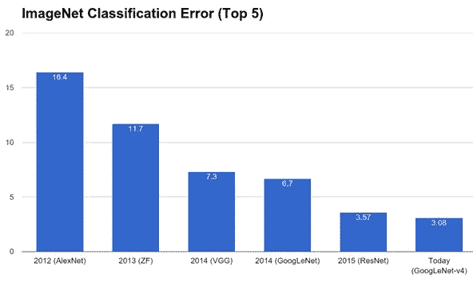

[Imagenet Competitions](http://www.image-net.org/challenges/LSVRC/) have led to state-of-the-art convolutional neural networks.

# 结论

数据科学和机器学习不是不可理解的方法:相反，它们是组合成强大解决方案的一系列简单步骤。通过一步一步地解决问题，我们可以学习如何构建整个框架。我们如何使用这个框架最终取决于我们自己。我们不必奉献一生去帮助他人，但是接受一个更有意义的挑战是值得的。

在本文中，我们看到了如何将完整的机器学习解决方案应用于数据科学中的好问题，即构建一个机器学习模型来预测哥斯达黎加的贫困水平。

我们的方法遵循一系列流程(1-4 在第一部分[中](https://medium.com/@williamkoehrsen/a-data-science-for-good-machine-learning-project-walk-through-in-python-part-one-1977dd701dbc)):

1.  理解问题和数据
2.  在探索性数据分析的同时执行数据清理
3.  自动和手动设计相关特征
4.  比较机器学习模型
5.  优化最佳性能模型
6.  解释模型结果并探索它是如何做出预测的

最后，如果在所有这些之后，您仍然没有完全理解数据科学，您可以继续探索技术并学习新的东西！

和任何过程一样，你只会在练习中进步。竞争是有价值的，因为它为我们提供了*运用和发展*技能的机会。此外，他们鼓励*讨论、创新和协作*，从而培养出更有能力的个人数据科学家和更好的社区。通过这个数据科学项目，我们不仅提高了我们的技能，还努力改善我们人类同胞的成果。

和往常一样，我欢迎反馈、建设性的批评以及倾听您的数据科学项目。我可以通过推特 [@koehrsen_will](http://twitter.com/koehrsen_will) 联系到。