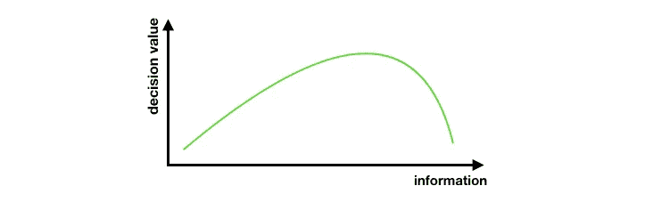

# 高效项目生命周期的数据科学家指南

> 原文：<https://towardsdatascience.com/a-data-scientists-guide-to-an-efficient-project-lifecycle-c4f44ef41df7?source=collection_archive---------7----------------------->

最近，我发现自己处于一个项目的末尾，这个项目花费的时间可能是它应该花费的 3 倍。与预期的 6-8 周不同，我的团队花了 5 个多月的时间来应对不断变化的目标、收集和验证数据的低效方法，以及探索各种解决方案。

回过头来看，这些都是反复出现的问题，本可以通过更有纪律的决策来缓解。简而言之，有三个主要原则可以在不牺牲结果质量的情况下大幅缩短项目长度:

1.  *快速失败*
2.  *40/70 法则*
3.  *费米估算*

在回顾这些原则的作用之前，我应该提到定义总体目标的重要性。正如我在之前的帖子中所说:

> 您定义问题和目标的方式对于确定使用哪些绩效指标以及在何处设置标准至关重要。定期停下来，以确保您的问题、目标、指标和数据仍然一致。

假设我们的任务是建立一个识别狗图片的模型。我们*可以*找到地球上所有动物的数据集，训练一个模型单独挑出每种动物，然后*然后*选择只有狗的照片。然而，我们也可以只选择有狗和没有狗的照片，用更少、更有效的数据训练更有效的分类器。方法的不同可能意味着数月的数据收集、验证和复杂的评估指标。花在案例驱动目标上的每一个单位的时间都将为你的团队节省数十个到达终点线的时间。

## 快速失败

快速判断解决问题的方法是否可行是很重要的。快速失败是一种方法论，用于在初步测试后判断一个想法是否值得追求。

设定一个初始目标并尝试 A 方法可以很快告诉你是否在大概范围内。如果没有，在回到 A 方法进行微调之前，你可能值得花时间去寻找其他途径。

> 举个例子:我想把情感分析放在我的产品里，我收集了一些真相数据。我可以尝试使用一种简单的方法，通过识别一系列表示积极和消极情绪的单词，并计算出现的次数。然而，如果当我仔细地为我的产品设置一个 70%准确率的标准时，这个方法达到了 25%的准确率，当我可以尝试另一个方法时，修改这个方法可能没有用。

## 四七法则

通常情况下，人们在做决定前会尽量等待，直到掌握尽可能多的信息。虽然这有助于我们感觉更好，但从长远来看，这并不一定会带来更好的结果，尤其是当许多决定需要快速做出的时候。

前国务卿科林·鲍威尔(Colin Powell)认为，领导者应该掌握不低于 40%也不高于 70%的信息来做决定。任何低于这个门槛的都被认为是不成熟的，任何高于这个门槛的都意味着你已经等了太久。

问问你自己完美的信息是什么样的，然后反过来找出门槛在哪里。这不是一个硬性规定，因为 35%到 45%的信息之间的界限太难尝试和客观区分。相反，关键在于找到*知情*和*及时*决策之间的平衡。

> 例如:如果我有 10 个类问题，我需要弄清楚我的真实数据有多可靠，也许我可以使用众包来验证 4 个类，并进行推断以减少成本和时间。如果数据被错误标注，那么使用它就没有什么意义了。我已经决定尝试一种新的方法，而不是花费时间和金钱来检查每一寸数据，因为我已经有了做出及时而明智的决定所需的所有信息。

## 费米估计

费米估计是使用近似值来获得一个复杂问题的“足够好”的答案，而不需要花费大量的时间和金钱。要获得更详细的解释，请阅读本文，或者略读引言以获得其要点。

我发现费米估算在估算项目长度时非常有用。通过分解项目的不同部分，我们可以快速乘以各种任务的预期长度，以找到一项任务将花费多长时间的粗略估计。在项目开始的时候，知道某件事需要一天、一周还是两周是非常有用的。有一个大概的估计可以帮助数据科学家更有效地设置期望值和规划他们的工作流程。

费米估算本质上是不精确的，并且估算总是可以被更新，以获得关于项目长度的预期的越来越精确的视图。

## 简单>花哨(加分)

这一原则的核心是机会成本。过度设计解决方案会浪费时间追求不必要的复杂解决方案，没有真正的附加价值。例如，当我们可以通过 scikit-learn 的逻辑回归模型获得足够好的分数时，为什么要用 tensorflow 精心设计复杂的神经网络呢？绝招问题**——**没有理由这样做。

然而，并不是所有的例子都如此明显。让我们考虑一下我们的情感示例:如果我设定一个 70%准确率的目标来发布一个用于生产的情感分析模型，我可以尝试朴素的单词字典方法，并计算正面和负面单词的出现次数。

如果这种方法让我达到 67%的准确率，我应该重新考虑成功的标准，并在尝试使用更复杂的东西之前确保我们的简单模型 T2 确实不够好。

有时候，简单的解决方案已经足够好了，你最好把时间花在新的问题上，而不是对现有的解决方案进行不必要的微调。机会成本是关键。

## 结论

数据科学问题很复杂，在没有完美信息的情况下做出决策会让*感到*错误。通过一些启发和保持更大的视野，我们可以克服寻找完美信息和设计完美解决方案的自然倾向。感谢您的阅读，希望您能在这些提示中找到价值！