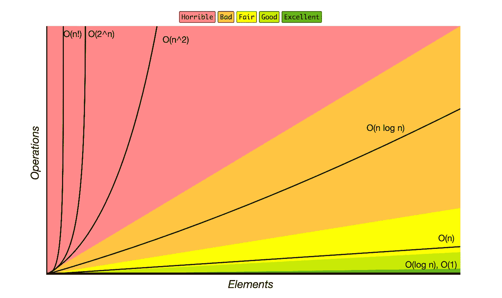
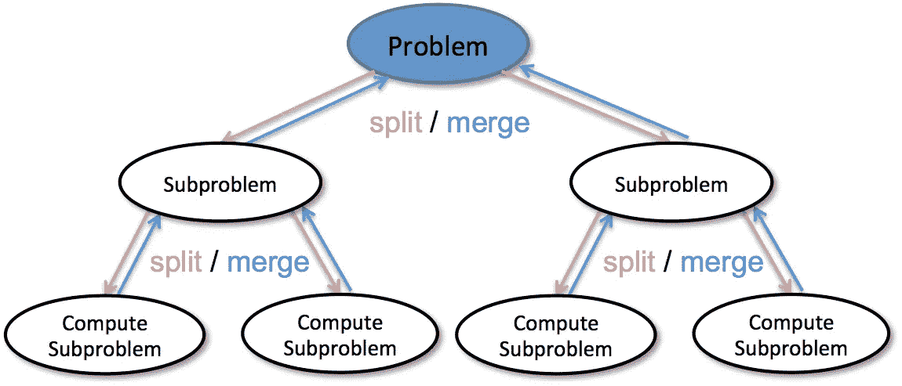
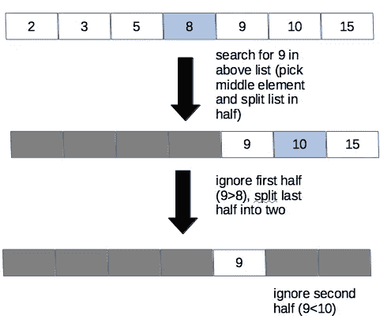
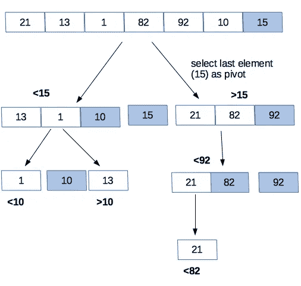

# 数据科学家的数据结构和算法指南，第 1 部分

> 原文：<https://towardsdatascience.com/a-data-scientists-guide-to-data-structures-algorithms-1176395015a0?source=collection_archive---------2----------------------->

注意:这是 2 部分系列的第 1 部分。后续帖子见 [*此处*](/a-data-scientists-guide-to-data-structures-algorithms-part-2-6bc27066f3fe) *。*

在数据科学中，计算机科学和统计学融合在一起。作为数据科学家，我们使用统计原理来编写代码，以便我们可以有效地探索手头的问题。

这至少需要对数据结构、算法和时空复杂性有一个基本的了解，这样我们才能更有效地编程并理解我们使用的工具。对于较大的数据集，这变得尤为重要。我们编写代码的方式会影响我们分析数据的速度，从而得出相应的结论。在这篇文章中，我将描述大 O 符号作为一种描述时空复杂性的方法，并简要回顾一些与时间复杂性相关的算法。在以后的文章中，我将讨论与空间复杂性相关的算法。

# **大 O 批注**

在编程中，算法是为了实现特定目标而遵循的一个过程或一组规则。一个算法的特征是它的运行时间(运行时间)，无论是空间还是时间。作为数据科学家，我们对最有效的算法感兴趣，这样我们就可以优化我们的工作流程。

在计算机科学中，大 O 符号用于描述一个算法**增长**有多“快”，通过比较算法内的运算次数。这将在后面进一步详细解释，但现在，让我们理解所有的正式符号。

**形式符号**

*   大ω:最好的情况。算法的大ω描述了算法在最佳情况下运行的速度。
*   大 O:最坏的情况。通常，我们最关心的是大 O 时间，因为我们感兴趣的是一个给定的算法在最坏的情况下会运行多慢。我们如何从本质上让“最坏的情况”不那么糟糕？
*   大θ:这只能用来描述一个算法的运行时间，如果大ω和大 O 相同的话。也就是说，算法的运行时间在最好和最坏的情况下都是相同的。

因为我们最关心的是一个算法的大 O，所以这篇文章的其余部分将只关注大 O。

我们如何用大 O 来描述一个算法？假设你想在电话簿中搜索某人的名字。


Phone books: before Google was a thing

找到这个人最直接的方法是什么？你可以查遍电话簿上的每个名字直到找到你的目标。这就是所谓的简单搜索。

如果电话簿很小，只有 10 个名字，这是一个相当快的过程。但是如果电话簿里有 1000 个名字呢？

在最好的情况下，你的目标的名字在列表的前面，你只需要检查第一项。在最坏的情况下，你的目标的名字在电话簿的最后，你需要搜索所有 1000 个名字。随着“数据集”(或电话簿)大小的增加，运行简单搜索所需的最长时间也呈线性增加。

在这种情况下，我们的算法是一个简单的搜索。大 O 符号允许我们描述最坏的情况是什么。最坏的情况是，我们将不得不搜索电话簿中的所有元素( *n* )。我们可以将运行时间描述为:

```
O(n) where n: number of operations
```

因为操作的最大数量等于我们的电话簿中元素的最大数量(您可能需要搜索所有元素来找到您的目标的名字)，所以我们说简单搜索的大 O 是 O( *n* )。一个简单的搜索绝对不会比 O( *n* )时间慢。

**不同的大 O 运行时间**

不同的算法有不同的运行时间。也就是算法增长速度不同。从最快到最慢，最常见的大 O 运行时间是:

*   O(log *n* ):又名日志时间
*   O( *n* ):又名线性时间
*   O( *n* 日志 *n* )
*   O( *n* )
*   O( *n* ！)

大 O cheatsheet 对于不同运行时间的快速图形表示以及它们之间的相互比较也非常有用。



A graphical representation of common Big O run times (credit: [http://bigocheatsheet.com/](http://bigocheatsheet.com/))

在这篇文章及其后续文章中，我将描述由这些不同的运行时描述的常见算法。

# 笔记

在讨论一些常用算法之前，有一些重要的原则需要理解。

递归:递归是指函数调用自己。也许递归的典型例子是阶乘函数的实现:

```
def factorial(n):
    if n < 1:        #base case
        return 1
    else:             #recursive case
        return n * factorial(n-1)
```

该函数在函数自身内被调用，并且将继续调用自身，直到到达基本情况(在本例中，当 n 为 1 时)。

**分而治之(D & C):** 一种解决问题的递归方法，D & C (1)确定问题的最简单情况(也称为基本情况)和(2)减少问题，直到它现在是基本情况。



General overview of divide & conquer technique (credit: [http://bigdata.ices.utexas.edu/project/divide-conquer-methods-for-big-data-analytics/](http://bigdata.ices.utexas.edu/project/divide-conquer-methods-for-big-data-analytics/))

也就是说，一个复杂的问题被分解成更简单的子问题。这些子问题被解决，然后它们的解决方案被组合以解决原始的、更大的问题。

# 常见算法

搜索和排序算法可能是首先要理解的最重要的算法。

# 搜索

**简单搜索** 这在前面的电话簿示例中已经描述过了，最糟糕的情况是需要搜索电话簿中的所有名字，然后才能找到感兴趣的名字。一般来说，简单搜索的时间为 O( *n* )。所需的最大时间与列表中元素的数量成线性关系。

二分搜索法
让我们继续以电话簿为例。我们仍然对在电话簿中查找某人的名字感兴趣，只是这一次我们将尝试更有效地查找。我们将从电话簿的中间开始，从那里开始，而不是单调乏味地浏览电话簿中的每一个名字。

假设我们的目标名字以一个 *P.* 开头，我们打开到大约在字母表中间的 *M* s。我们知道在字母表中 *M* 比 *P* 早，所以我们可以删除从 *A* 到 *M 的部分。现在我们可以查看电话簿的后半部分( *N* 到 *Z* )，从中间分割该部分(到 *Ts* ，并与我们的目标进行比较。在字母表中，T* 比 P 靠后。我们然后知道要剔除后半部分( *T* 到 *Z* )。我们现在专注于 *N* 到 *S* ，把这个分成两半等等，直到找到我们感兴趣的名字。

一般来说，在二分搜索法，你把你的**排序后的**(这很重要)数据，找到中点。每一次，你都将你的目标与中间值进行比较。如果目标值与中间值相同，那么您的工作就完成了。否则，根据比较，你就知道应该消除列表中的哪一半。继续分割，直到找到目标或数据集无法再被分割。



Diagram of binary search with a list of numbers

因为二分搜索法涉及到数据集的减半，所以大 O 时间是 O(log *n* )。因此，它比简单搜索更快，尤其是当数据集增长时(该算法的增长不是线性的，而是对数的，因此相对于 O( *n* ))的线性运行时间，它增长得更慢)。

顺便说一句，二分搜索法可以递归编写，但不认为是 D&C 算法。尽管较大的输入确实被分解成子集，但是如果这些子集不包含感兴趣的值，它们将被忽略。没有为这些子集产生解决方案，因此它们可以被组合以解决更大的输入。

# 分类

**选择排序** 很像简单的搜索搜索算法，选择排序可能是最直接的，对你的数据进行排序的‘蛮力’方式。本质上，您遍历列表中的每个元素，并按照所需的顺序将每个元素添加到一个新列表中。例如，如果您对从最大到最小的数字列表排序感兴趣，您可以:

1.  在列表中搜索以找到最大的数字
2.  将该号码添加到新列表中
3.  转到原始列表，再次搜索以找到下一个最大的数字
4.  将该号码添加到新列表中，以此类推…

对于选择排序，您必须遍历列表中的每一项(这需要花费 *n* 次，就像简单搜索一样)，并且您必须这样做 *n* 次(不仅仅是一次，因为您必须不断返回到原始列表以找到您想要添加到新列表中的下一项)。因此，这需要 O( *n* 时间。

快速排序与选择排序有什么不同？如果我们像以前一样处理一系列数字:

1.  从列表中选择一个元素，称为轴心。枢纽的选择对于确定快速排序算法的运行速度非常重要。现在，我们可以每次选择最后一个元素作为轴心。(关于 pivot 选择的更多信息，我推荐[斯坦福 Coursera 算法课程](https://www.coursera.org/specializations/algorithms)。)
2.  对列表进行分区，使所有小于主元的数字都在它的左边，所有大于主元的数字都在它的右边。
3.  对于列表的每一半，你可以把它当作一个有新支点的新列表，重新排列每一半，直到它被排序。



Diagram of quicksort with a list of numbers

快速排序是 D&C 算法的一个例子，因为它将原始列表分成越来越小的有序列表。然后将这些较小的有序列表组合起来，得到一个较大的有序列表。

快速排序是独一无二的，因为它的速度取决于枢轴选择。在最坏的情况下，它可能需要 O( *n* )的时间，这与选择排序一样慢。但是，如果 pivot 总是列表中的某个随机元素，则 quicksort 平均运行时间为 O( *n* log *n* )次。

假设我们仍然在处理我们的数字列表。对于合并排序算法，列表将被分解成单个元素。然后从这些元素创建有序对(较小的数字在左边)。然后，这些有序对被分组为四个有序组，这一过程一直持续到最终的合并排序列表被创建。


Animated overview of mergesort algorithm (credit: By Swfung8 — Own work, CC BY-SA 3.0, [https://commons.wikimedia.org/w/index.php?curid=14961648](https://commons.wikimedia.org/w/index.php?curid=14961648))

与 quicksort 一样，mergesort 是一种 D&C 算法，因为输入列表在被组合以产生更大的原始列表的有序版本之前被分解和排序。

Mergesort 运行 O( *n* log *n* )次，因为整个列表被减半(O(log *n* ))，并且这是针对 *n* 个项目完成的。

算法和数据结构的知识对数据科学家很有用，因为我们的解决方案不可避免地是用代码编写的。因此，理解我们的数据结构以及如何从算法的角度思考是很重要的。在我的下一篇文章中，我将描述常见的数据结构、空间复杂性和常见的相关算法。

**其他有用资源:**

*   Aditya Y. Bhargava 的 [*搜索算法*](https://www.amazon.com/Grokking-Algorithms-illustrated-programmers-curious/dp/1617292230)
*   [*破解编码访谈*](https://www.amazon.com/Cracking-Coding-Interview-Programming-Questions/dp/0984782850/ref=sr_1_3?s=books&ie=UTF8&qid=1534792380&sr=1-3&keywords=cracking+the+coding+interview) 作者格利·拉克曼·麦克道尔
*   斯坦福大学 Coursera [算法](https://www.coursera.org/specializations/algorithms)专业化
*   [大 O 小抄](http://bigocheatsheet.com/)