# 数据科学家的数据结构和算法指南，第 2 部分

> 原文：<https://towardsdatascience.com/a-data-scientists-guide-to-data-structures-algorithms-part-2-6bc27066f3fe?source=collection_archive---------4----------------------->

在我的[上一篇文章](/a-data-scientists-guide-to-data-structures-algorithms-1176395015a0)中，我描述了大 O 符号，为什么它很重要，以及常见的搜索和排序算法及其时间复杂度(本质上，一个给定的算法在数据大小变化时的运行速度)。现在，有了基础知识，我们可以开始讨论数据结构、空间复杂性和更复杂的绘图算法。

# 空间

以前，我使用大 O 符号来描述一些常见的搜索和排序算法的时间复杂度。大 O 也是用来形容空间复杂度的。毕竟，时间不是我们可支配的唯一有限资源。任何计算机都只有这么多的空间(也称为内存)，任何给定的算法也可以用它需要的工作存储量来表征。可以想象，随着我们感兴趣的数据集的增长，空间变得更加令人担忧。

当处理数据时，选择正确的数据结构允许我们优化时间和空间，这样我们的管道运行得足够平稳，允许我们得出结论

# 数据结构

数据可以以不同的方式存储；存储的方式确实是依赖于上下文的。

让我们从由它们的排序行为定义的更抽象的数据结构开始。这些数据结构被称为堆栈和队列，在许多语言中可能没有正式的实现，尽管它们可以并且经常是手动实现的。

它们的重要性主要在于解释管理数据和访问内存的不同方式。随着数据量的增加，数据结构的选择变得越来越重要；与各种操作相关的大 O 时间取决于数据结构。栈和队列，作为概念，告知基本数据结构(如列表和数组)是如何组织的。实际上，堆栈和队列也经常被合并到许多算法中，并且是这些算法如何工作的组成部分。

## **栈**

后进先出(LIFO)排序。添加到堆栈中的最后一个项目总是第一个被移除。为了理解堆叠是如何工作的，想象一个假设的盘子堆叠。

你总是把一个新盘子放在盘子堆的顶部(或末端)。当你想要一个盘子时，你可以从盘子堆里拿最上面的(或者最近添加的)盘子。添加(“推入”)到堆叠中的最后一个板首先被移除(“弹出”)。

您可能在处理列表时认识到了这个“推送”和“弹出”术语(实际上，在本文的后面，我们将把列表(或数组)称为数据结构)。

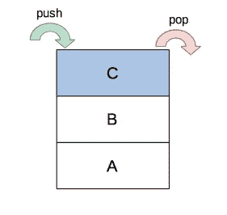

visual representation of a stack

## **队列**

先进先出(FIFO)。添加到队列中的第一个项目将总是第一个被删除。这最好用一个实际的排队人群来说明。

第一个进入队列的人也将是第一个接受所需服务的人，对吗？这正是队列作为数据结构的工作方式。最新的项目仍然被推到队列的末尾，但是第一个项目首先被弹出。

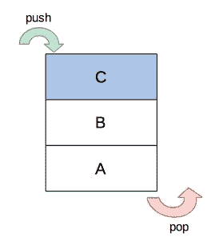

既然我们理解了堆栈和队列，我们就可以描述我们通常会遇到的具体的数据结构实现。

## 具体数据结构

我们如何将这些抽象结构(栈和队列)与我们经常遇到的数据结构协调起来呢？

*数组*一个数组由一个线性的项目集合(称为元素)组成，连续存储在内存中。任何给定的元素都可以使用数字索引来访问，该索引指向元素在数组中的位置。在 Python native 中，这是用 list 类型实现的。

*哈希表* 在哈希表中，唯一键映射到值。在 Python 原生语言中，字典是哈希表的实现。

## **图表**

作为一种抽象数据结构，图由节点和边组成，以模拟连接。想想一个人如何建立一个社交网络模型:

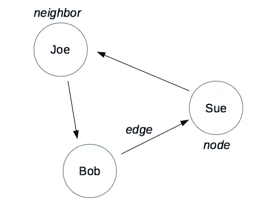

How are Bob, Sue, and Joe connected?

对于任何给定的节点，它的邻居构成了它所连接的所有节点。需要注意的是，上图是一个有向图的例子(节点是箭头，表示连接的单向方向)。因为苏和乔有联系(联系从苏到乔)，所以乔是苏的邻居。然而，苏不是鲍勃的邻居。这种关系是单向的。

对于无向图，边不是箭头，关系是双向的。

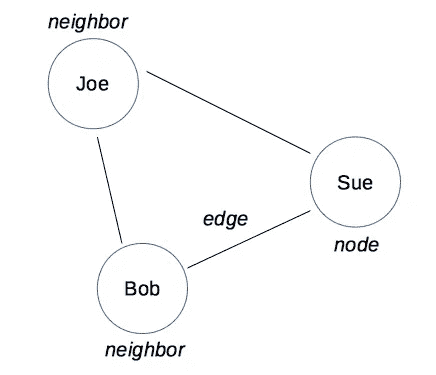

在这样的无向图中，乔和鲍勃都是苏的邻居。

**树
熟悉[决策树](https://en.wikipedia.org/wiki/Decision_tree)的人应该已经知道树的一般结构。**

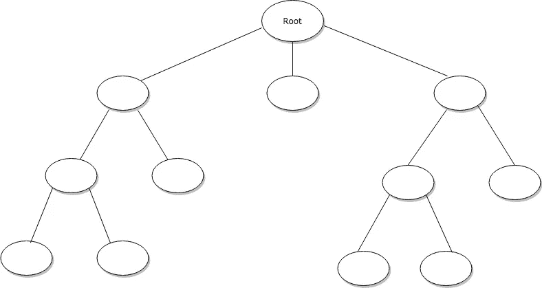

every tree has a single root node from which all other nodes stem. each ‘child’ node will only have one parent node.

每棵树都有一个根节点，它实质上是所有其他节点的“起点”。任何两个节点之间都只有一条路径(而对于常规图，两个节点之间可以有多条边)。

由于决定它们各自结构的特征，通常用图来模拟网络，用树来模拟层次结构。图和树之间还有许多其他的差异，但这是最重要的一点。

然而，相同的算法对图和树都起作用(尽管由于结构的不同，实现方式不同)。因为图和树用于通过节点和边来建模关系，所以这种算法旨在沿着这些边“搜索”以表征任何给定节点之间的距离(和连接程度)。

(更高级的树有:[二分搜索法树](https://en.wikipedia.org/wiki/Binary_search_tree)和[红黑树](https://www.geeksforgeeks.org/red-black-tree-set-1-introduction-2/))。

# 图形/树遍历

有不同的方法来遍历(搜索)这些结构，以便我们可以从起始节点找到感兴趣的节点。

这为什么有用？实际上，你可以做这样的事情:

*   找到去教室的最快路线
*   找到赢得象棋的最短路径
*   在“迷宫”中找到通向出口的路径
*   在你的 LinkedIn 网络中找到最近的 X 公司关系

从这些例子中可以明显看出，我们可以将许多问题建模为图，然后使用图搜索算法来解决这些问题。我们使用这些算法来评估(1)感兴趣的节点之间是否存在路径和/或(2)这些节点之间的最短路径。

这些算法最容易用树来解释(由于它的层次性)。然而，这也适用于图形。

**广度优先搜索(BFS)** [BFS](https://en.wikipedia.org/wiki/Breadth-first_search) 从根节点(或图形的某个随机节点)开始，在移动到下一个深度之前，它检查第一个“级别”或深度的所有节点。BFS 通常用于评估任意两个给定节点之间是否存在路径，以及这两个节点之间的最短路径。

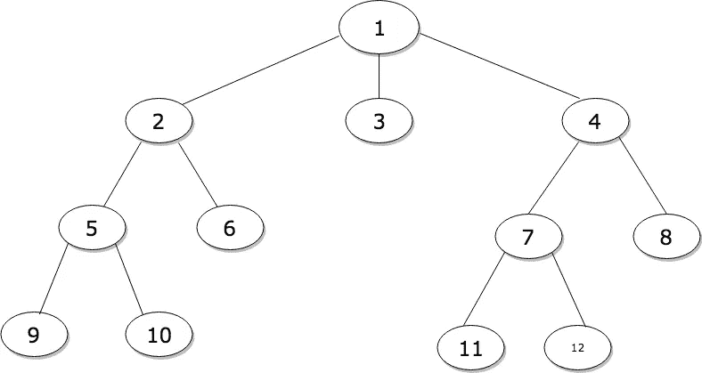

numbers correspond with the search order

实现是如何工作的？让我们考虑一下 BFS 要求的行为:第一个项目(根)也是第一个被搜索的项目(一旦被检查，就被删除)。这是**先进先出(FIFO)** 行为，因此将使用队列来顺序检查节点，直到找到目标。

这可能会令人困惑，所以让我们用更高级的术语来描述它。

我们使用图(或树)结构来描述关系。因为图是抽象数据结构，所以必须使用具体的数据结构(将每个节点映射到其相邻节点)在代码中手动实现。现在我们需要在图上实现我们感兴趣的算法(BFS)。因为 BFS 的特点是 FIFO 行为，我们使用队列结构来手动实现 BFS。

抽象地说，我们可以说树结构是用来描述关系的。堆栈和队列结构用于描述行为。

BFS 在日常生活中有什么用处？

你对 X 公司感兴趣，你想在你的关系网中找到在 X 公司工作的人。你更喜欢找一个和你“更亲近”的人；一级连接比四级连接更可取。这对 BFS 来说再好不过了。你先搜索你的一级人脉(先加的)，再搜索你的二级人脉(他们的朋友)等等。

**深度优先搜索(DFS)** [DFS](https://en.wikipedia.org/wiki/Depth-first_search) 从根节点(或图的某个随机节点)开始，在回溯之前沿着单个分支一路向下搜索。

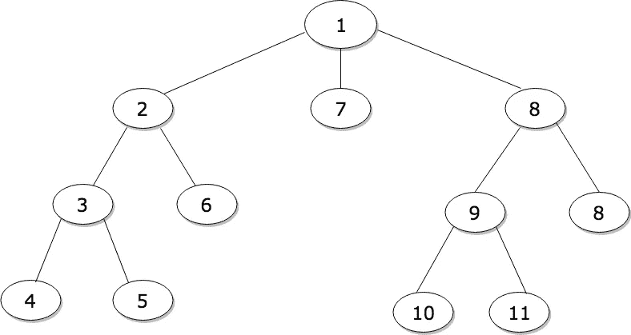

numbers correspond with the search order

与涉及队列实现的 BFS 不同，DFS 涉及堆栈的实现。总是首先检查根节点(在 BFS 和 DFS 中)。如果它不是感兴趣的节点，它的后续子节点将被添加到堆栈的顶部:

*   节点 8、7 和 2 按此顺序添加到堆栈中。此时，节点 2 位于堆栈的顶部
*   栈顶(节点 2)被检查。如果它不是感兴趣的节点，它的子节点，即节点 6 和 3，将按此顺序添加到堆栈的顶部。此时，节点 3 位于堆栈的顶部。
*   栈顶(节点 3)被检查。如果它不是感兴趣的节点，它的子节点，即节点 5 和 4，将按此顺序添加到堆栈的顶部。此时，节点 4 位于堆栈的顶部。
*   节点 4 已选中。它没有孩子。如果不是感兴趣的节点，则检查下一个节点(节点 5)。

诸如此类…

DFS 通常用于更复杂的算法中。

与树不同，图可能是循环的(每个节点可以有一个以上的连接，因此，存在返回到同一个节点的风险)。当与图形结构一起使用时，这些算法变得更加复杂。我推荐[斯坦福算法课程](https://www.coursera.org/specializations/algorithms)了解更多信息。

## BFS 与外勤支助部

BFS 和 DFS(以及相关的运行时间)的使用确实因数据和图/树结构而异。

两种算法的时间复杂度相同。在 BFS 和 DFS 中，每个节点只被访问一次。big-O 时间是 O(n)(对于树中的每个节点)。

然而，这些算法的空间复杂度各不相同。

对于 BFS，它遍历树中给定深度的所有节点，并使用队列实现，树的宽度很重要。BFS 的空间复杂度是 O(w ),其中 w 是树的最大宽度。

对于 DFS，它沿着一个“分支”一直向下，并使用堆栈实现，树的高度很重要。DFS 的空间复杂度是 O(h ),其中 h 是树的最大高度。

# Dijkstra 算法

对于 BFS，我们假设所有的树都没有加权。最短路径简单地定义为具有最少边的路径。

像 BFS 一样， [Dijkstra 的算法](https://medium.com/basecs/finding-the-shortest-path-with-a-little-help-from-dijkstra-613149fbdc8e)也试图找到节点间的最短路径，但它是在*加权*图([有向无环图](https://en.wikipedia.org/wiki/Directed_acyclic_graph))上操作的；这些边具有不同的权重或一些成本(如时间或距离)。

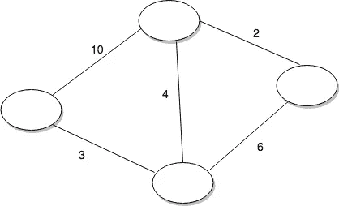

因为边将具有不同的权重，所以任意两个给定节点之间的最短路径不一定是具有最少线段的路径。Dijkstra 的算法识别总权重最小的路径。

*流程*1。从起始节点，找到并访问“最便宜”的节点

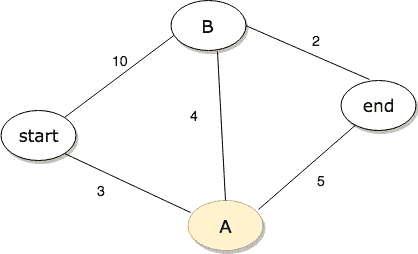

assume cost is in minutes. from start, go to node A (has the lowest cost, 3 versus 10)

> 到节点 A 的时间:3
> 到节点 B 的时间:10
> 到结束的时间:无穷大(未知)

2.在这个新节点上，更新其相邻节点的成本(对于任何给定的邻居，可以通过计算从起始节点到那里**的成本来完成)。**

2a。如果先前访问的任何相邻节点的成本发生变化(您必须访问图中的每个节点，因此成本可能会发生变化)，您必须更新任何成本。

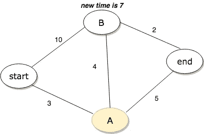

time to node B is updated from 10 to 7 minutes (fastest path is through node A)

> 到节点 A 的时间:3
> 到节点 B 的时间:7
> 到结束的时间:8

3.对图中的每个节点重复上述步骤。

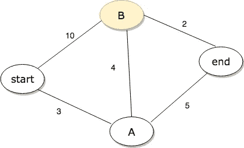

focus on node B now

不需要更新权重。

> 到节点 A 的时间:3
> 到节点 B 的时间:7
> 到结束的时间:8

4.计算最终的最低成本路径。

最短路径仍然是通过节点 a。

# 数据结构的大时代

对于任何给定的数据结构，访问、搜索、插入和删除都有不同的运行时间。

例如，对于一个数组，如果删除了任何给定的元素，所有后续的元素都必须相应地移动。访问数组非常快(O(1))，因为元素在内存中是连续排列的，并且可以通过索引来访问。但是连续排列使得与删除相关的 big-O 时间变得更糟。

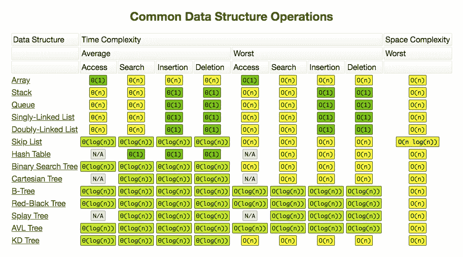

source: [http://bigocheatsheet.com/](http://bigocheatsheet.com/)

随着数据结构基础的下降，我认为简要讨论两个在讨论算法时经常使用的主题可能会有所帮助。

# 贪婪算法

贪婪算法是一种快速找到最大值或最小值的方法。它用于描述常见的算法，如[决策树](https://en.wikipedia.org/wiki/Decision_tree)分析(根据熵减少的多少在每一步做出决策)。

背包问题是描述贪婪算法如何工作的一种常见方式。

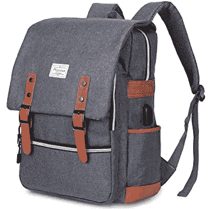

假设你有一个背包，一个只能装 20 磅的背包。你面前有几样东西，每样都有不同的重量和价值。你想最大化你放入背包的物品的总价值，而不超过背包所能承载的最大重量。(假设尺寸不是问题。)

*   笔记本电脑:2200 美元(3 磅)
*   显示器:2500 美元(18 磅)
*   扬声器:1500 美元(15 磅)

第一步，你伸手去拿价值最高的东西，显示器。在第二步，你会拿到下一个最高价值的物品，笔记本电脑。然而，背包只能容纳 20 磅，所以现在没有更多的空间放笔记本电脑或任何其他物品。你有价值 2500 美元的物品。

最佳解决方案实际上是带上笔记本电脑和扬声器。你不会超过 20 磅的最大重量，并且会有价值 3700 美元的物品。

背包问题说明了贪婪算法的过程及其缺陷。它并不完美，当然，贪婪算法也不能保证你得到最优解。但它离工作地点很近，有时，这就是你所需要的。最终，你的包里仍有价值 2500 美元的物品。

# 动态规划

与贪婪算法相反，d [动态规划](https://en.wikipedia.org/wiki/Dynamic_programming)是一种详尽的问题解决方法，它涉及将一个大问题分解成子问题并解决这些子问题。保证能找到最优解。在每一步之后，基于先前的决策做出决策，并且可以重新考虑先前的步骤(参见上面的 Dijkstra 算法中的动态规划示例)。

它不同于也涉及子问题的分治(D&C)方法。D&C 涉及**递归**解决子问题，然后组合这些解决方案来解决更大的问题。动态规划解决**重叠**子问题(考虑与到达任何给定节点相关的成本如何取决于先前访问的节点)。每个子问题只需要解决一次，因为每个子问题的解决方案都存储在一个表中，如数组或哈希表(称为[记忆](https://en.wikipedia.org/wiki/Memoization))以供将来参考。

我希望大家清楚为什么理解数据结构和算法对于数据科学的成功工作如此重要。当然，除了我的博客帖子所涵盖的内容之外，还有更多的内容，我鼓励你寻找更多的资源来真正丰富你对这个主题的理解。下面是我推荐的一些资源(也列在我之前的博文中):

*   [*搜寻算法*](https://www.amazon.com/Grokking-Algorithms-illustrated-programmers-curious/dp/1617292230)Aditya y . Bhargava 著
*   [*破解编码访谈*](https://www.amazon.com/Cracking-Coding-Interview-Programming-Questions/dp/0984782850/ref=sr_1_3?s=books&ie=UTF8&qid=1534792380&sr=1-3&keywords=cracking+the+coding+interview) 作者格利·拉克曼·麦克道尔
*   斯坦福大学 Coursera [算法](https://www.coursera.org/specializations/algorithms)专业化
*   [大 O 小抄](http://bigocheatsheet.com/)