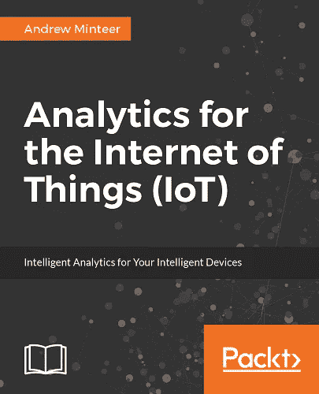

# 深入了解物联网

> 原文：<https://towardsdatascience.com/a-deep-dive-into-the-internet-of-things-2c8d813e9653?source=collection_archive---------6----------------------->

***读安德鲁·明特尔*** 的《物联网分析》

**本周，我一直在阅读 Packt 出版社最近出版的一本名为《物联网分析》的书。这是一本很棒的读物，我绝对可以把它推荐给任何想更多了解这个迷人领域的人。**

有很多关于物联网的书，但这本书最吸引我。广告的文字“突破宣传，了解如何从海量的物联网数据中提取可操作的情报”特别吸引我——物联网是一个随处可见的术语，甚至在你最意想不到的地方。此外，它仅在一个月前(2017 年 7 月)出版，因此至少这意味着内容将是最新的，这是一个优势，因为该领域正在快速发展。

我不仅有兴趣了解物联网应用，还有它背后的技术，以及硬件和软件的结合，最后还有一个开发者的视角。这本书的作者是 Andrew Minteer，他目前是一家领先的全球零售公司的数据科学和研究高级总监。他是物联网领域的专家，拥有统计学、软件开发、数据库设计、云架构方面的背景，领导分析团队超过 10 年。从这本书来看，他也是一位伟大的作家。

“物联网分析”面向各种读者群体。在 Packt Publishing books 的序言中，有一个名为“这本书是给谁的”的部分描述了目标读者。最重要的是，这本书面向的是*“目前正在努力利用物联网数据创造价值，或者正在考虑在不久的将来建立这种能力的专业人士。”*这些人可能是"*开发人员、分析从业人员、数据科学家和普通物联网爱好者。"*就成本与收益而言，价值创造的确是一个突出的主题，但同样重要的是物联网数据流的不同组成部分:设备和传感器、网络协议以及数据收集技术。最后，读者将获得数据存储和处理选项及策略的概述，所有这些都以使用物联网大数据集实现商业价值最大化为基本主题。Python、R 以及 Tableau 中都有代码示例。

我喜欢这本书的一点是，作者从零开始，向你解释了人们对“物联网”、“物联网数据”的理解，以及为什么物联网数据不同于其他数据。作者用日常用语来阐述他的观点。例如，他在物联网分析中的第一条规则如下:“永远不要相信你不知道的数据。像陌生人给你糖果一样对待它。”另一个伟大的想法是以一个虚构的场景开始每一章，该场景是一名数据科学家与他的首席执行官进行对话，每次应用新的物联网数据分析场景时，都会接到新的任务，从而带来新的挑战。这些成为每一个新章节的主题，并赋予这本书一定的逻辑。它们读起来也很有趣，给了文本一点空气，因为大多数章节都很复杂。

事情很早就变得复杂了，例如在第 2 章中讨论了物联网设备和网络协议。下一章涵盖了面向云的物联网分析，描述了来自云基础设施市场领导者亚马逊的亚马逊网络服务。AWS 的服务列表长度令人印象深刻，作者在后面的章节中详细介绍了本书的一些相关服务，例如 AWS Lambda 和 AWS IoT 平台。正如作者解释的那样，这种云基础设施是来自各地设备的大量数据的最佳选择——云是处理和分析物联网数据的首选。

下一步是定义收集物联网数据的策略，以便进行分析。在这里，我们进入了大数据技术领域，因此期待来自 AWS、Microsoft Azure 和 Hadoop 生态系统等存储大数据技术的大量关于物联网特定服务的信息。我发现这一章是书中最强的一章，因为它详细解释了多个生态系统的许多不同组件，同时揭开了大数据分析的复杂性。干得好。

本书的后半部分更加实用:您将学习如何使用 Tableau 来探索和可视化数据，使用 R 语言来增强可视化工具，并了解一些特定于行业的示例。外部数据集可以增加现有数据集的价值，并且可能更容易访问，因为有许多免费的在线数据集可用。Tableau 再次用于可视化物联网数据分析的结果，这在准备仪表板时提供了一些很好的建议。

关于将地理空间分析应用于物联网数据的单独一章有点令人失望，因为它相当短，因此不完整。它没有提到最近的物联网和大数据分析工具，如 Esri 的 ArcGIS GeoAnalytics 和 ArcGIS GeoEvent Server。虽然这不是本书的重要部分，但它很容易成为一本书的主题。另一方面，作者解释得很好的是 GIS 中使用的不同文件格式，以及几个开放和封闭源数据库如何处理空间数据。

在关于物联网分析的数据科学的一章中介绍了机器学习概念，以及深度学习和预测。特别关注如何将这些方法用于物联网数据。每一个的核心概念都通过 r 中的例子进行了回顾，同样，如果你是这些主题的新手，这本书是一个很好的资源来解释它们和一些示例代码。由于作者是这些领域的专家，这是一个非常复杂和详细的章节，因此是核心章节，第三章是关于云的物联网分析。最后两章最后关注经济学(预算)和组织数据进行分析的策略。这两者是相互关联的:更多的数据意味着更多的云基础设施成本。如果没有明确的维护策略，数据湖可能会变成数据沼泽。

关于 Python 和 R 的使用，最后说一句:这两种语言在整本书中都有使用，但作者承认 Python 是大型数据集的更好选择，这通常(如果不总是)是物联网数据分析的情况。但是 R 比 Python 更容易实现数据分析，这也是事实(有时)。这也可能是作者的偏好问题，因为他在本书中多次选择 R 而不是 Python。我从这本书中获得的另一个深刻见解是 Linux 在大数据计算集群中的作用。正如作者在第 130 页所写的那样，“……你需要知道如何与 Linux 操作系统进行交互，以进行物联网分析。这是不可避免的，一旦你习惯了，也没那么糟糕。你不需要成为专家，但你需要知道如何找到自己的路，运行程序，并做一些基本的脚本。”这本书提供了许多这样的建议。这是与物联网相关的所有内容的绝佳资源，强烈推荐。