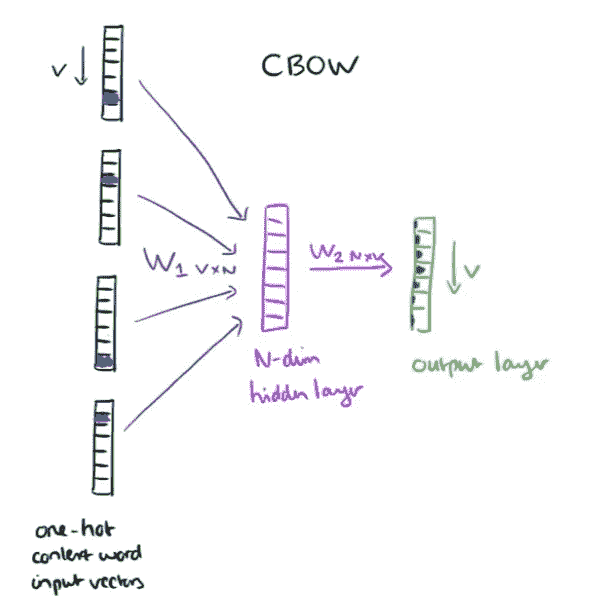
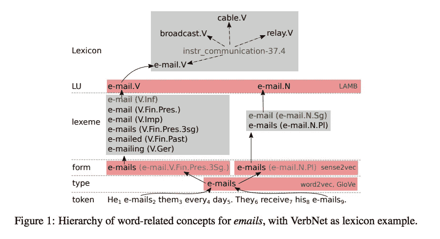
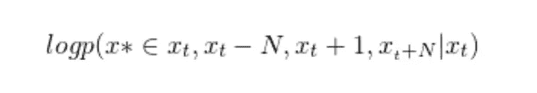

# 深入探究嵌入——一种语言学方法

> 原文：<https://towardsdatascience.com/a-deeper-look-into-embeddings-a-linguistic-approach-89cc428a29e7?source=collection_archive---------3----------------------->

所以你可能知道 Word2vec 或者 Glove 甚至 Elmo，甚至可能知道它背后的算法(Skipgram 等)。但是，它们之间的区别是什么，为什么一个比另一个好？这个博客是关于单词嵌入及其解决的语言学问题的，利用了一篇非常棒的关于 ACL 的论文来帮助解释一些语言学概念。

那么首先，什么是嵌入？

它们可以被认为是一个学习查找表，其中输入是一个单词(一位热编码)，输出是一个 n 维向量。

Picture from Adrian Colyer

这个博客不是为单词嵌入初学者准备的。如果你是这样的人，请访问 Adrian Colyer 的[惊人的帖子，以获得对嵌入、连续单词包和 Skipgram 的良好概述。](https://blog.acolyer.org/2016/04/21/the-amazing-power-of-word-vectors/)

所以——让我们从头开始，带着 NLP 的前辈们必须解决的问题:建模语言的问题。我们如何预测哪些单词序列有意义，哪些没有意义？更具体地说，给定一个长度为 *t* 的句子，其中有单词 w_1，w_2，…，w_t，那么 p(w_1，w_2，…，w_t)是多少，或者一个单词以那个特定顺序一个接一个出现的概率是多少？这将需要准确地表示单词的*含义*。

那么，建模的真正含义是什么呢？

You in the future when others don’t understand what the big deal is about using the ELMO word embedding over Word2Vec.

# 一点语言形态学背景

首先，我们需要确保那些只是彼此版本的单词被映射到一个向量上。作为人类，我们知道“吃”，和“吃”有相同的意义，但形态结构不同。单词有一个词干，或引理，在吃和被吃的情况下会是“吃”正如这篇论文所言，“一个词的所有可能的词形都代表了这个词的词素”。

其次，有些词可能看起来很相似，但意思不同。以“蝙蝠”为例蝙蝠可能意味着恐怖电影中的动物，或者是美国最受欢迎的运动之一的击球动作。这两个*义*，或者说 bat 的意思，被分配到各个词汇单位。

所有这些可能看起来只是一堆术语，所以论文中的这张图表很好地总结了这一点。

单词嵌入的神经网络方法使用直觉

> “相似的单词也会被相似的上下文所包围”

从数学上来说，上面可以写成下面的目标函数

其中 x*和 x_t 是在句子中频繁出现在彼此 2N 个单词内的两个单词。

这意味着给定一个焦点词 x_t，Skipgram 将最大化该焦点词周围的相似词 x*的对数概率。通常，神经网络 Skipgram 训练模型的最终隐藏层将被用作单词嵌入。

虽然这一切都做得很好，但基于 Skipgram 的 approach post(在这里解释得很好)基于精确的字符匹配为每个单词分配一个表示。这意味着“bat”只获得一个平均 bat 的各种含义的向量，并将“bat”可能使用的各种上下文编码到一个向量中——这意味着对于该词的每个上下文，表示都将过于一般化(这是一个万事通，无所不能的情况)。然而，Skipgram 将“吃”、“吃”和“吃”映射到不同的单词表示，因为“吃”！=“吃”！=“吃了”，虽然都是同一个词干，来自同一个词汇单位。那样的话，Word2Vec 就太具体了，没有很好地处理多义词，所谓的*多义词*词。

Yep that’s probably what our NLP forefathers probably felt like

# 那我们该怎么办？

我们可以通过明确标注词类及其词汇形式来帮助半监督这种方法，从而增加一个额外的步骤。例如，您可以用词类显式地标记语料库中的单词，和/或将其转换为词条。例如，您可以将所有动词“going”替换为“going”。v”(表示词性)和 lemma(“go”)，这将允许模型为多义词的各种意义区分和分配不同的向量。

现在，一切都解决了吧？

那么，单词嵌入模型没有见过的单词呢？多次被训练成单词级模型(至少在 Word2Vec 中)的 Skipgram 不能很好地处理这些情况。

其次，不同于诸如去除标点符号的更机械的预处理步骤，必须为每个目标函数和每个 NLP 问题训练单词嵌入。例如，虽然“快乐”和“悲伤”在大多数上下文中可能使用相似，并且都是情绪，但在情感分析的上下文中，这些词的使用非常不同。因此，使用预先训练的模型可能不会很好地工作。

# ELMO 来了

今年早些时候推出的 ELMO 使用语言模型方法来解决缺乏可训练性和看不见的单词。

与其他嵌入不同，ELMO 使用基于字符的模型，这意味着不是给它一个单词的热编码，而是给它一个字符的热编码。这意味着它能够处理没有出现在其训练语料库中的单词的表示，从而通过编码其词根和前缀的语义来处理拼写错误的单词或未见过的单词(类似于 GRE 或 SAT 的方式！).如果你有兴趣了解更多关于 ELMO 的信息，请看这篇文章。

ELMO 由多双向 LSTM (biLM)组成，它还在每一层(而不仅仅是最后一层)暴露其输出和隐藏状态，从而允许科学家了解特定 NLP 问题所需的 LSTM 每一层的权重。例如，与更抽象的理解有关的问题，如句子摘要，可能会受益于比第一层嵌入更多地加权 ELMO 的最后几层。

所以，下次你听到有人说，“哦，我就用 Word2Vec 吧，”让他们想想 ELMO、Sense2Vec 和其他单词嵌入方法，以找出哪种方法最适合你的问题和数据集，并针对你自己的特定数据进一步训练嵌入。

如果你对这篇文章有任何编辑或评论，请通过 yp913@nyu.edu 联系我。爱说话:)

# 参考资料:

[Sense2Vec 论文](https://arxiv.org/pdf/1511.06388.pdf)

[介绍性单词嵌入](http://hunterheidenreich.com/blog/intro-to-word-embeddings/)博客

[更多关于语言学+多义词的资源](http://www.linguistics.ucsb.edu/faculty/stgries/research/2015_STG_Polysemy_HbCogLing.pdf)