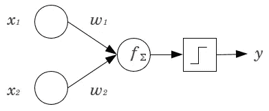
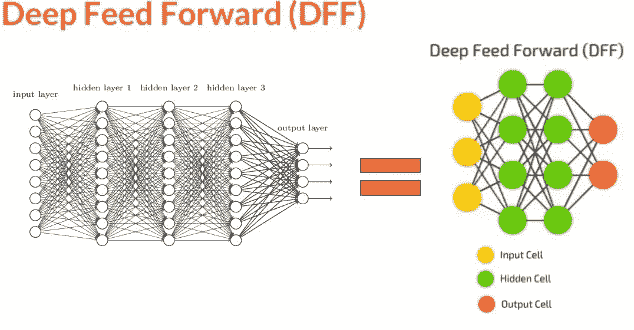
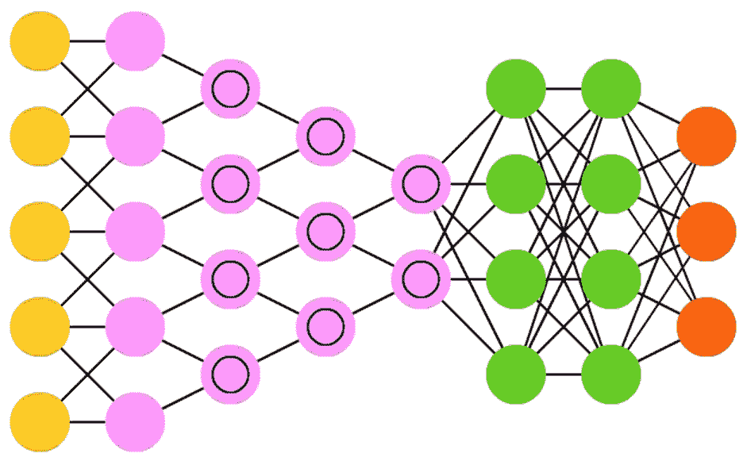
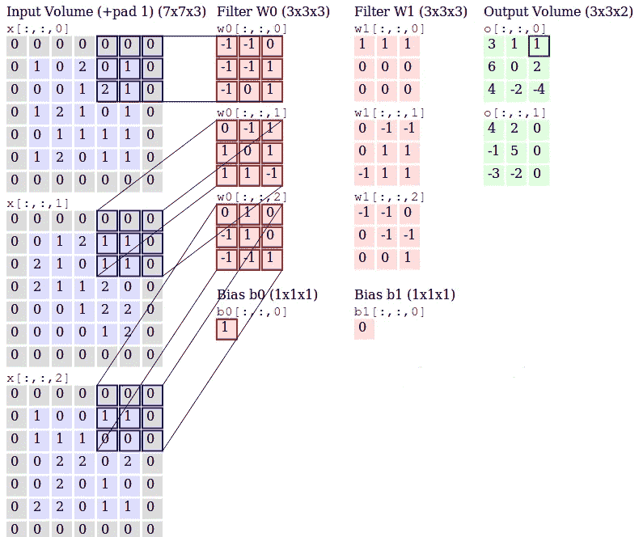
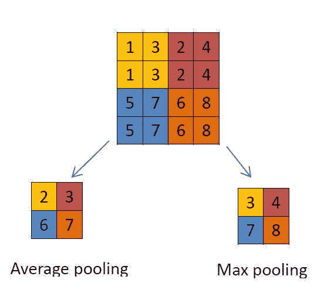
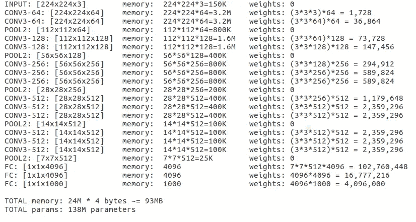

# 加深对网络英语的理解(上)——CNN

> 原文：<https://towardsdatascience.com/a-deeper-understanding-of-nnets-part-1-cnns-263a6e3ac61?source=collection_archive---------0----------------------->

# 介绍

深度学习和人工智能是 2016 年的热门词汇；到了 2017 年底，它们变得更加频繁，也更加混乱。所以让我们试着一次理解一件事。我们将研究深度学习的核心，即神经网络(NNets)。Nets 的大多数变体很难理解，底层架构组件使它们听起来(理论上)和看起来(图形上)都一样。

感谢阿西莫夫研究所的 Fjodor van Veen，我们有了最流行的 NNet 架构变体的公平代表。请参考他的[博客](http://www.asimovinstitute.org/neural-network-zoo/)。为了提高我们对网络的理解，我们将每周学习和实现一个架构。以下是我们将在未来几周讨论的架构。

## 第一周

本周的架构是**卷积神经网络或 CNN** 。但是在开始 CNN 之前，我们将首先对*感知器*进行一次小小的深入探究。NNet 是称为感知器的几个单元/单元的集合，感知器是二元线性分类器。让我们快速看一下，以了解相同的内容。

输入`x1`和`x2`乘以各自的权重 w1 和 w2，并使用函数`f`求和，因此得到`f = x1*w1 + x2*w2 + b`(偏置项，可选添加)。这个函数`f`可以是任何其他的运算，但是对于感知器来说，它通常是求和。该功能`f`随后通过允许所需分类的激活进行评估。Sigmoid 函数是用于二元分类的最常见的激活函数。关于感知机的更多细节，我推荐这篇[文章](https://appliedgo.net/perceptron/)。

现在，如果我们堆叠多个输入，并使用函数`f`将它们与堆叠在另一层中的多个单元连接，这形成了多个完全连接的感知机，来自这些单元(*隐藏层*)的输出成为最终单元的输入，最终单元再次使用函数`f`和激活来导出最终分类。如下图所示，这是最简单的神经网络。

由于被称为“*通用近似函数*的 nnet 的独特能力，nnet 的拓扑或架构变体是多样的。这本身就是一个巨大的话题，最好由迈克尔·尼尔森*[在这里](http://neuralnetworksanddeeplearning.com/chap4.html)讲述。读完这篇文章后，我们可以相信这样一个事实:无论多么复杂，NNet 都可以表现为任何函数。上述网络也被称为前馈神经网络或 FFNN，因为信息流是单向的而不是循环的。现在我们知道了感知器和 FFNN 的基础知识，我们可以想象数百个输入连接到几个这样的隐藏层，会形成一个复杂的网络，流行称为深度神经网络或深度前馈网络。*

**

## *深度神经网络和 CNN 到底有什么不同？让我们找出答案。*

*CNN 通过像 ImageNet 这样的竞赛而变得流行，最近它们也被用于自然语言处理和语音识别。要记住的一个关键点是，许多其他变体，如 RNN、LSTM、GRU 等，都是基于与 CNN 相似的架构，但在架构上有所不同。我们将在后面详细讨论这些差异。*

**

*使用 3 种类型的层来形成 CNN，即“**卷积**”、“**汇集**”和“**密集或完全连接**”。我们之前的网络是“密集”层网络的典型示例，因为所有层都是完全连接的。要了解更多关于需要切换到卷积和池层的信息，请阅读 *Andrej Karpathy 的*精彩讲解[这里](https://cs231n.github.io/convolutional-networks/)。继续我们对层的讨论，让我们看看卷积层。*

*(对于下面的讨论，我们将使用图像分类作为理解 CNN 的任务，稍后转移到 NLP 和视频任务)*

***卷积层**:考虑一个 5X5 像素的图像，有`1 as white`和`o as black`，这个图像被识别为一个 5X5 尺寸的单色图像。现在想象一个具有随机`1s and 0s`的 3×3 矩阵，这个矩阵被允许与图像子集进行矩阵乘法，这个乘法被记录在一个新的矩阵中，因为我们的 3×3 矩阵在每次迭代中移动一个像素。下面是这一过程的视觉效果。*

**

*上面考虑的 3X3 矩阵被称为“*滤波器*，它的任务是从图像中提取特征，它通过使用“**优化算法**来决定 3X3 矩阵中的特定`1s and 0s`。我们允许几个这样的过滤器在一个神经网络的卷积层中提取几个特征。3×3 矩阵的单个步骤被称为“*步距**

*下面提供了使用两个 3 通道滤波器产生两个卷积输出的 3 通道(RGB)图像的详细视图。感谢安德烈·卡帕西！*

**

*这些滤波器`W0 and W1`是“卷积”,`output`是提取的特征，由所有这些滤波器组成的层是卷积层。*

***池层**:该层用于使用不同的函数降低输入的维度。一般来说，卷积层之后经常使用" *MAX Pooling* "层。池化使用 2X2 矩阵，并以与卷积层相同的方式对图像进行操作，但这一次它缩小了图像本身。以下是使用“*最大池化*或“*平均池化*”来池化图像的两种方法*

**

***密集层**:该层是激活层和前一层之间的完全连接层。这类似于我们之前讨论的简单的“神经网络”。*

***注意**:归一化层也用在 CNN 架构中，但它们将单独讨论。此外，池层不是首选，因为它会导致信息丢失。通常的做法是在卷积层中使用更大的步幅。*

*ILSVRC 2014 年的亚军 VGGNet ，是一个受欢迎的 CNN，它通过使用 16 层网络而不是 ILSVRC 2012 年获奖者 *AlexNet* 的 8 层网络，帮助世界了解网络深度的重要性。一个即插即用模型“VGG-16”可在 keras 中使用，我们将使用相同的来查看一个获奖的 CNN 架构。*

**

*在 *Keras* 中加载模型后，我们可以看到每一层的*输出形状*以了解张量维度，以及 *Param #* 以查看如何计算参数以获得卷积特征。" *Param #* "是所有特征的每个回旋特征的总权重更新。*

**

*现在，我们已经熟悉了 CNN 的架构，了解了它的层次和工作原理，我们可以进一步了解它在 NLP 和视频处理中的应用。这将在下周的文章中讨论，同时介绍 RNNs 以及 CNN 和 RNNs 之间的主要区别。同时，免费阅读自 2012 年以来赢得 ImageNet 竞赛的所有 CNN 模特，[此处](https://adeshpande3.github.io/The-9-Deep-Learning-Papers-You-Need-To-Know-About.html)，感谢 Adit Deshpande！*

## *未来的工作*

*   *一旦我们讨论了所有的架构，我们将遵循相同的顺序，并使用 jupyter 笔记本来实现它们。*一旦我们完成实施*，所有的代码链接都将可用。*

***更新者上的类似帖子***

*   *合成成分*
*   *阿达德尔塔*
*   *阿达格拉德*
*   *亚当*
*   *涅斯特罗夫*
*   *RMSPROP*
*   *签名于*
*   *共轭梯度*
*   *黑森自由报*
*   *LBFGS*
*   *线梯度下降*

***类似开机自检激活功能***

*   *ELU*
*   *硬乙状结肠*
*   *哈尔坦*
*   *身份*
*   *LEAKYRELU*
*   *理性坦*
*   *RELU*
*   *RRELU*
*   *乙状结肠的*
*   *SOFTMAX*
*   *SOFTPLUS*
*   *软设计*
*   *双曲正切*

***感谢您的阅读，希望有所帮助***