# 一种不同的(深度)学习:第 1 部分

> 原文：<https://towardsdatascience.com/a-different-kind-of-deep-learning-part-1-90fe6c52f1ab?source=collection_archive---------6----------------------->

## 自我监督学习导论

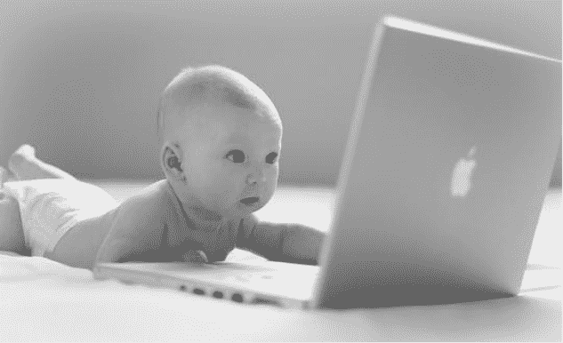

深度学习真正重新洗牌了机器学习领域的东西，特别是在图像识别任务中。2012 年，Alex-net 发起了一场解决(或至少显著改善)计算机视觉任务的竞赛(仍远未结束)。虽然主要思想相当稳定(对所有事情都使用深度神经网络)，但研究人员采取了非常不同的途径:

*   尝试优化**模型架构**。
*   尝试优化**训练计划，**例如优化者自己。
*   尝试优化数据，例如它的**顺序、大小、多样性**等等。

这些研究路径中的每一条都提高了训练质量(速度、准确性，有时还有泛化能力)，但似乎做更多同样的事情可能会导致一些逐渐的改进，但不会有重大突破。

另一方面，深度学习领域越来越多的工作表明，当前的方法存在重大缺陷，特别是在泛化方面，例如[最近的这个](https://arxiv.org/pdf/1811.11553.pdf)对象旋转时的泛化失败:

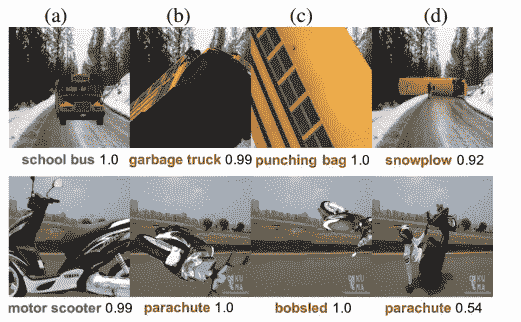

因此，似乎有必要进行更积极的改进。或者把研究范围扩大到更冒险的想法。

除了上述方法，还有一些方向试图改变学习范式。可能是:

*   镜头学习
*   半监督学习
*   领域适应
*   自我监督学习

这些方法采用一些不同的训练范式，试图更具创造性，或者模仿一些类似人类的模式。虽然我们还没有从上述方法(和其他方法)中获得重大突破的证据，但它们确实取得了一些不平凡的结果，也教会了我们许多关于训练过程的知识。

在这篇和接下来的文章中，我将尝试讨论一些最有趣的方法，并将这个系列命名为“**不同种类的(深度)学习**”。我绝不试图预测深度学习的未来发展，而仅仅是描述最近的有趣作品，这些作品可能不会受到关注。这可以为读者提供几个目的:

*   你可能有兴趣了解你不知道的作品。
*   你可能会对自己的工作有新的想法。
*   你可能会在深度学习中了解到你没有意识到逻辑部分和任务之间的关系。

这个系列的第一部分将是关于**自我监督学习**，这是我写这个系列的主要动力之一。

# 自我监督学习

想象一下，你有一个搜索网络的代理，它可以从遇到的每张图片中无缝学习。这个想法非常有趣，因为如果它将被实现，深度学习的最大障碍，即注释数据，将(部分)被移除。

但是怎么做呢？嗯，它首先在 **text** 中提出:文本由人类很好地组织，因此有许多概念可以在没有任何注释的情况下从中学习。预测下一个/前一个单词是一个突出的例子，如在 [**单词嵌入**](https://arxiv.org/abs/1301.3781) 和**语言模型**任务中所做的。

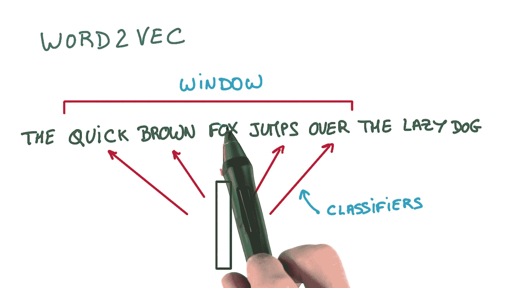

在**视觉**中，做这样的技巧有点复杂，因为视觉数据(图像和视频)不是人类明确创建的(嗯，一些摄影师可能在他的摄影中投入了一定的思想)，但不是每个视频，并且肯定不是每个图像都有任何类型的逻辑结构可以用来提取信号。

不就是另一种形式的**无监督学习**吗？的确，但是它有一个特殊的微妙之处:因为任务是被监督的(例如分类)，但是没有主动的注释发生。这个话题是我的最爱之一，也迅速成为了本文的主要话题。我不能保证这种特定的范式会给深度学习带来最好的成就，但它肯定已经带来了一些伟大的创造性想法。

如上所述，这种任务的名称是**自我监督学习**。与“弱注释”不同，弱注释意味着图像具有不同的标签、标题或说明，自监督任务被认为除了图像本身没有注释。如果你问从一张没有标注的图片中能学到什么，敬请期待。

# 着彩色

也许图像中最直观的信号是它的**颜色**。当大多数计算机化颜色表示中有 3 个通道时，1 或 2 可以无缝地用作注释。

由于给旧图像着色是一项有趣的任务，因此有许多作品致力于此。然而，如果我们考虑全自动着色(这是自我监督的资格),数量减少到相当少。

这种情况下的**着色**任务形成为“交叉通道编码器”，这意味着图像中的一个(或一些)通道用于编码其他通道。这个概念将在以后的文章中进一步讨论。

最引人注目的彩色纸是张曦轲和阿列克谢·埃夫罗斯的这张。

解决着色任务的常见方法不是使用标准的 RGB 编码，而是使用 [Lab](https://en.wikipedia.org/wiki/CIELAB_color_space) 色彩空间。在 Lab 色彩空间中， **L** 代表亮度(B & W 强度)，用于预测 **ab** 通道(a —绿色到红色，b —蓝色到黄色)。

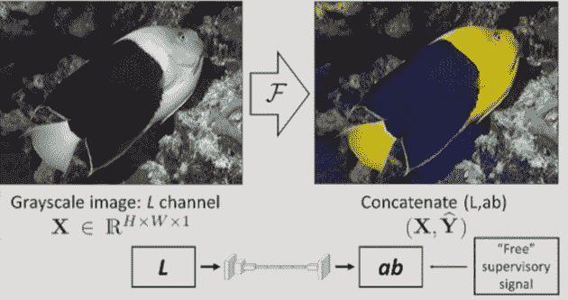

Colorization with Lab encoding, from [1]

正如我们将在我们讨论的所有任务中看到的，自我监督学习不像我们在深度学习中习惯的那样简单。有一些**工件**打断了模型实现它的设计目标。此外，有时如果训练没有被仔细检查，模型会制造出“**捷径**”，这将阻碍它推广到其他任务。

以下是着色任务的一些挑战:

**1。彩色化中固有的模糊性:**很明显，对于一些图像来说，有不止一种似乎合理的彩色化。这个问题会在培训和评估中引起多种问题:

在下面的唐纳德·特朗普图片中，窗帘的颜色可能是红色或蓝色(以及许多其他颜色)。唐纳德的领带可以搭配(也可以不搭配)。给定数据集中领带和窗帘的不同示例，模型将倾向于对它们进行平均，将这些项目用**灰色**着色。

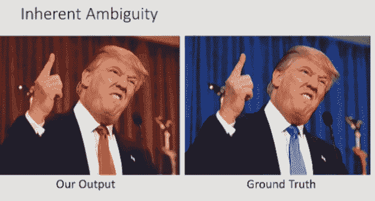

**解**:在张[的文章](https://arxiv.org/pdf/1603.08511.pdf)中，研究者将彩色化处理为一个分类问题，而不是回归问题。除了使用特殊的损失函数，他们的模型还预测了一个概率分布层，而不是图像的实际颜色，然后将这些概率转换为颜色-从 Lab space 的 313 种可用颜色中选择:

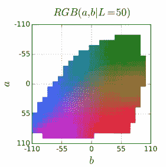

**2。偏向:**实验室不是一个均匀分布的空间。由于云、路面等的高频率，大多数解决方案倾向于较低的值。

**解决方案**:对损失函数进行重新加权来解决这个问题。

**3。评估问题**:既然模型可以预测不同的正确答案，例如，如果地面实况是蓝色，模型将选择红色，那么在标准评估中它将被认为是错误的。

**解决方案**:使用不同的评估方法，其中包括:人类后 hok 分类—“**彩色化图灵测试**”，要求人们区分真实图像和机器彩色图像。此外，将图像输入图像分类器，将结果与真实图像进行比较。

该模型在彩色化图灵测试中获得了 35%的分数，这……还不算太差。

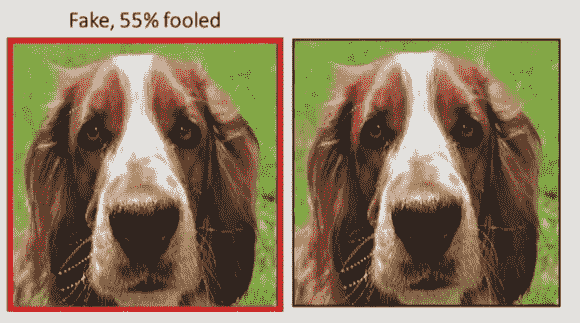

in this image the machine-colored dog looks more real than the original one

在另一篇最近的[论文](https://people.cs.uchicago.edu/~larsson/colorization/)中，Larson 等人与 Zhang 和 Efros(两篇论文都提到对方)同时工作，并使用了空间定位的多层切片(超柱)和**回归损失**。他们试图通过预测颜色直方图并从中采样来克服模糊问题:

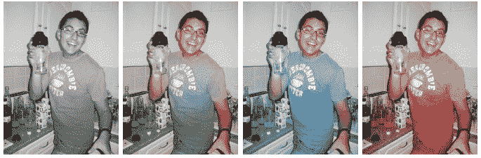

除了使用 LAB 空间之外，这项工作还试图预测色调/色度属性，这与“HSV”颜色空间有关。

# 语境

除了颜色预测，下一个最明显的(但也是创造性的)任务是从**图像结构**中学习东西。更准确地说，试图预测一些关于**图像裁剪**的事情。

这个任务的灵感直接来自于 **word2vec** ，或许我们可以称之为图像的“跳过克”。

然而，在文本中，字数受限于词汇量的大小，很可能不会超过一百万。而一个像素接一个像素地完成图像补片占用了大得多的空间。你可能会说 **GANs** 正是这么做的，但是:

1.  确实有大量的正确解，因此很难一概而论
2.  我们将在下一部分讨论 gan。

在这种范式中，实际任务不会自然出现:研究人员必须想出模型要解决的“游戏”。会举一些突出的例子:

## 拼图背景

从图像中提取上下文最简单的方法是使用类似拼图的任务。第一个是由 **Doersch 和 Efros** 完成的[工作:从图像中裁剪小块，并训练模型对它们的关系进行分类。一个例子可以很好地解释这一点:](https://arxiv.org/abs/1505.05192)

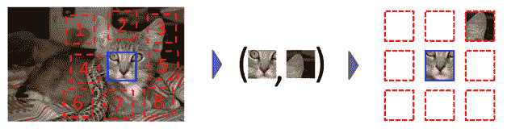

和着色一样，任务并不简单。具体来说，model 正在寻找“**快捷方式**”:它可能会学习某些低级特征，如边缘和光照关系，而不是实际学习高级特征及其关系。这倾向于暗示图像部分。

为了解决这个问题，研究人员在补丁上应用了一些抖动(如图所示)

研究人员遇到的另一个问题是通过一些照明伪像预测斑块位置的模型—****。这意味着在一些相机中，图像不同部分的颜色分布是不同的。**解决方案**:这部分是通过一些颜色转换处理的，特别是将绿色和品红色向灰色转移。****

**下一个突出的成果是诺鲁齐和法瓦罗的这篇[论文](https://arxiv.org/pdf/1603.09246)，它一路走来，使用了一个更难的问题，解决了完整的 9 部分拼图，但作为回报，它获得了更强的性能:**

**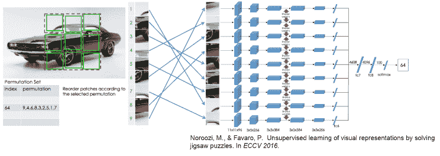**

**研究人员验证了片的良好混排和每幅图像多于 1 个混排样本。**

## **上下文编码器**

**如前所述，text 中的 word2vec 会填充缺失的单词。在视觉上有没有尝试这样做？事实上，有。在这篇[文章](https://arxiv.org/abs/1604.07379)中，Pathak 等人(当然还有 Efros)尝试了一些自动编码器模型来填充图像上的裁剪空间。**

**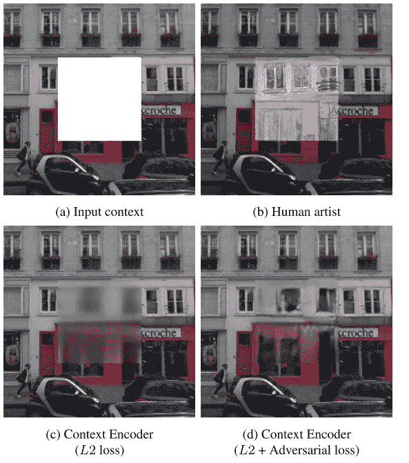**

**结果表明，这实际上是可能的，特别是增加了对抗性损失，这成功地避免了处理多模式(如前所述)，从而防止模糊，“平均”的结果。**

# **旋转**

**在我们跳到下一个级别之前，我想提一下这个花絮:**旋转预测**。这篇[论文](https://openreview.net/forum?id=S1v4N2l0-)采用了预测图像旋转的创造性方法。**

**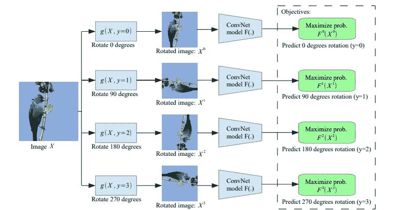**

**旋转预测除了具有创造性之外，还相对较快，并且不需要像我们之前看到的其他任务那样进行任何预处理，以克服对琐碎特征的学习。**

**论文还探讨了一些“注意力地图”,显示出他们的网络聚焦于图像的重要部分:头部、眼睛等。**

**虽然将迁移学习的最新成果报告给了 imageNet 分类(大多数其他作品都与 pascal 相关)，但评论者在论文中发现了一些缺陷，因此不得不持保留态度。**

# **一般化**

**那么在所有这些工作之后，我们从中获得了什么呢？当然，给 B&W 图像着色很好，解决拼图可能是一个有趣的演示应用程序，但更大的目标是在主要任务中取得更好的结果——特别是**分类**、**检测**和**分割**。**

**当使用 imagenet 预训练时，最常见的基准是 VOC Pascal 数据集，具有当前的技术水平:**

**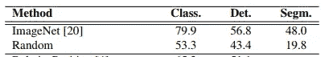**

**目前的结果是:**

**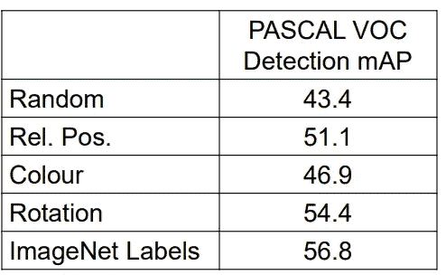**

**Detection results, from rotation article**

**嗯，看来我们还没到那一步。虽然自我监督的数据实际上是无限的，但还没有一项工作挑战“经典的”基于 Imagenet 的迁移学习结果。然而，在具体任务上有一些好的结果，我们将在后面的帖子中讨论。**

**除了对上述任务的标准概括，研究人员还利用这组任务的具体特征来尝试和概括其他一些任务，如图像聚类(最近邻、可视化数据挖掘等)**

# **包裹**

**下一个大的进步会来自于**自我监督**学习吗？也许是，也许不是，但我相信探索这样不同的方法会显著改善深度学习领域，并可能间接积极影响真正的突破。在下一篇文章中，我们将了解更多的想法和方法，这些想法和方法会带来一些有趣和新奇的结果。**

**如果您希望进一步阅读，请继续关注(并跟随我)本系列的下一部分。此外，以下是一些对我研究和学习这些主题有很大帮助的资源:**

1.  **由**阿列克谢·埃夫罗斯**发表的演讲，他是该领域的杰出研究人员之一(也是这里讨论的大多数论文的合著者)。他在这里谈的[非常值得推荐。](https://www.youtube.com/watch?v=YhYsvD6IfKE)**
2.  **一个伟大的[甲板](https://docs.google.com/viewer?url=http%3A%2F%2Fwinsty.net%2Ftalks%2Fself_supervised.pptx)总结了在这一领域所做的工作。**

## **系列链接:**

*   **自我监督学习介绍(这篇文章)**
*   **[自我监督学习:生成方法](/a-different-kind-of-deep-learning-part-2-b447ff469255)**