# 一种不同的(深度)学习:第 2 部分

> 原文：<https://towardsdatascience.com/a-different-kind-of-deep-learning-part-2-b447ff469255?source=collection_archive---------20----------------------->

## 自我监督学习:生成方法

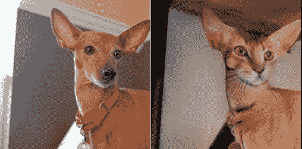

# 介绍

在[之前的帖子](/a-different-kind-of-deep-learning-part-1-90fe6c52f1ab)中，我们已经讨论了一些**自我监督**学习文章，以及一些朝着“圣杯”努力的尝试:利用几乎无限数量的无注释图像，以推广到其他任务。希望能更接近目前未达到的基准 **ImageNet** 预培训。

令人惊讶的是，或者也许不那么令人惊讶的是，我们从**阎乐存**那里获得了一些额外的支持，他在他的 NeurIPS [演讲](https://youtu.be/U2mhZ9E8Fk8?t=2425)(“迈向人工智能的下一步”)中花了几分钟时间讨论自我监督学习。他将自我监督学习描述为“*蛋糕的主体*”当浇头是监督学习，樱桃是强化学习(因为 RL 中奖励的稀疏性)。Lecun 还从我们最喜欢的自我监督研究员 Aloysha Efros 那里拿了一些幻灯片，所以我很高兴我们有共同的兴趣。

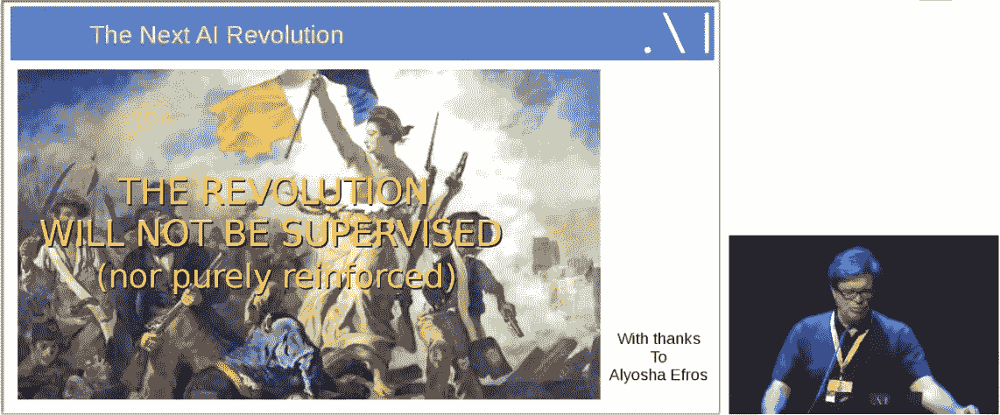

此外，一些读者指出，也有突出的自我监督机构处理**视频**，这是显而易见的。然而，视频将在稍后的帖子中讨论，因为我们有另一个主题，即**生成模型**。

# 生成模型和自我监督有什么关系

在他关于自我监督的谈话中，Efros(是的，他也将在这篇文章中占主导地位)经常讨论为自我监督的任务找到正确的损失函数的困难。

在前一篇文章中，我们检查了用于**着色**任务的特殊分类损失，并强调了为它们找到正确损失函数的难度。

在的[演讲中， **Efros** 描述了一种寻找这种损失函数的方法。他称之为:*“研究生血统*”。换句话说，为这些模型找到一个好的损失函数需要大量的反复试验。那么我们能有更好的，更通用的方法来找到它们吗？](https://youtu.be/8881p8p3Guk?t=3004)

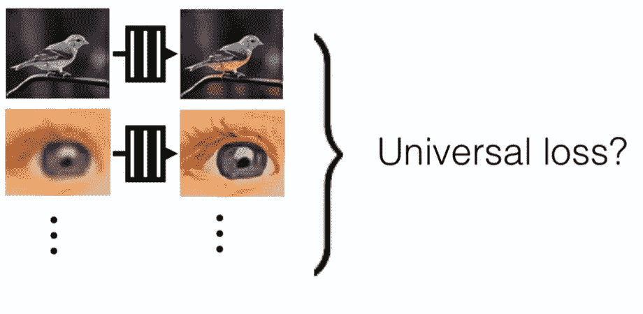

colorization, super resolution, etc: is there a universal self supervised loss function?

此外，还有**彩色图灵测试**的事情:为了评估结果，研究人员使用机械土耳其人来区分真假照片。因此，我们希望有某种机制来区分这两种类型的图像。

如果您在 2014 年就热衷于深度学习，您可能还记得，当伊恩·古德费勒(Ian Goodfellow)首次展示他开创性的作品《T0》、《T1》、《T2》、《T3》时，社区对这种有希望的代际能力非常兴奋，但许多研究人员对这项工作的目的持怀疑态度。对他们来说，这只是一个玩具，至少在取得重大进展之前是这样。

自我监督的研究人员有一些不同的想法:在他们看来，GAN 可能是自我监督任务的一种**定制丢失功能**。

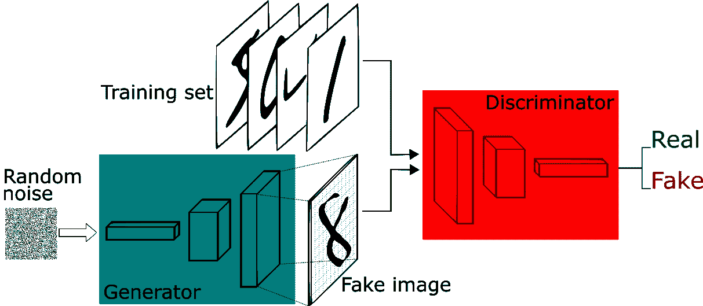

This is how Generative Adversarial network works

让我们想一想:在着色工作中，我们使用了标准的深度学习范式来预测每个像素的颜色。我们可以将 GAN 鉴频器的能力用作定制损耗吗？如果是这样，就需要用不同的方式来构造问题。

我们知道，氮化镓本质上是从一个完全随机的分布产生图像。如果我们可以让它给定一个黑白图像，生成一个彩色图像，使用鉴别器来评估结果呢？

这需要范式上的一些改变:从不同的东西生成图像，然后通过[条件 GAN](https://arxiv.org/abs/1411.1784) 完成完全随机的分布:向生成器添加一个特征，使其生成目标空间的一些子集。例如，来自 Mnist 数据集的特定数字。但是如果我们可以使用**标量**(数字)作为“条件”，我们也可以使用**向量**。如果我们可以用一个向量，我们也可以用一个**张量**。图像只是一个张量，不是吗？

因此，我们的想法是:训练一个类似条件 GAN 的网络，其中条件(以及生成器的输入)是黑白图像，这将限制输出为彩色图像。

# Pix2pix

菲利普·伊索拉(Phillip Isola)是 Efros 的学生，也参与了之前讨论的彩色化[工作](http://richzhang.github.io/colorization/)，他在论文“*中承担了这项任务，论文名为 [Pix2pix](https://phillipi.github.io/pix2pix/) 。这需要对 GAN 架构进行重大调整:首先为生成器使用编码器-解码器架构。第二，鉴别器不能只从数据集和生成器中获得随机配对的图像。它应该有严格的图像对，一个是原始的 RGB，另一个是由黑白图像生成的。鉴别器架构和训练时间表也不同于标准。你可以在这个[帖子](https://medium.com/@ManishChablani/cyclegans-and-pix2pix-5e6a5f0159c4)中读到关于它的很好的解释。很明显，这份文件投入了大量的辛勤工作。*

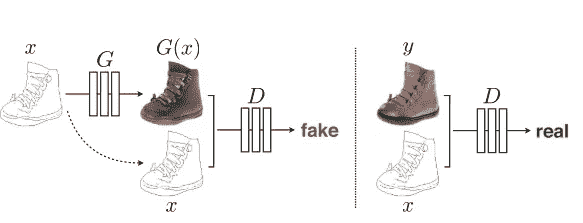

The pairing strategy of pix2pix. Here with edges=>photo instead of B&W=>RGB

但伊索拉更进一步:他可能对自己说:好吧，如果我成功地建立了一个彩色化-GAN，它从成对的图像中学习，为什么我不能将其应用于不同的图像对？关于:

*   谷歌地图和谷歌地球图像对
*   建筑抄本和实际建筑立面
*   边缘和对象

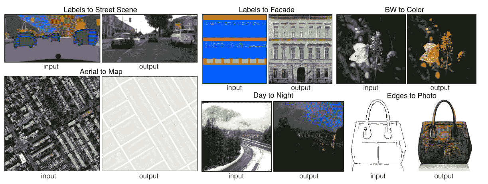

诸如此类。一切都成功了。

这成为了过去几年中最有趣的深度学习作品之一(这意味着有史以来)，它引发了 Efros 所谓的东西:“ **Twitter 驱动的研究**”。由于这篇论文的代码在 GitHub 上很容易获得，许多人在各种图像配对上训练它，并得出一些[高度](https://affinelayer.com/pixsrv/) [创造性](https://vimeo.com/260612034)的结果。这些也是:

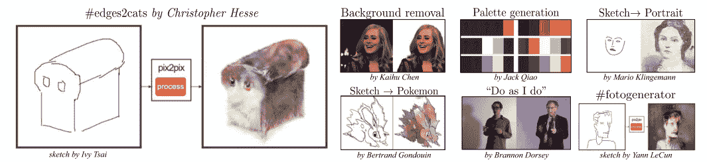

你也可以通过在 twitter 上寻找 ***#pix2pix*** 找到更多。埃夫罗斯说，这些项目让他感到惊讶，带来了许多新的想法，并使他们的研究前进了许多步。

好吧，我们有点忘乎所以了——所有这些令人兴奋的事情带来了各种新的选择。然而，在通往创新的道路上，一个小细节被忽略了:自我监督的范式，它旨在使用自我监督的模型进行迁移学习，在这个过程中被忽略了，甚至在本文中也没有提到。也许发生器的结构太不一样，无法尝试，或者也许生成结果的重要性掩盖了又一次部分成功的自我监督尝试的潜力。

# 甘比

嗯，pix2pix 作品是第一篇文章中**着色**和**背景**作品的“自然继承者”。但还有另一项工作确实尝试在 GAN 网络上应用迁移学习:双向 GAN—**。**

**甘比提出了一个新概念(当时，2016 年):除了标准的 GAN 架构，一个**编码器**被添加到该架构中(见下文)。出于不同的目的，该编码器用于学习发生器的逆过程。**

**这项工作采用了一种非常有趣的方法:采用标准的 GAN 架构，而不是为鉴频器提供 *x* (真实图像)和 *G(z)* (生成的图像，当 *z* 是发生器的随机输入时)鉴频器馈入 2 对: *(x，E(x))、( G(z)、z)* ，这意味着随机输入 *z* **和** *有趣的是，生成器和编码器之间没有共享知识。***

**这有点难以理解，所以您可以在文章中阅读更多的细节——关于编码器和生成器的正式(和直观的)解释必须学会相互反转以欺骗鉴别器。**

**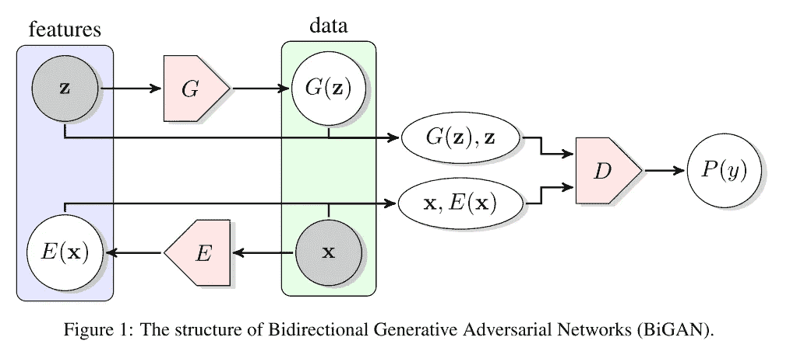**

**虽然这里没有条件元素— ***z*** 不是标签，但是编码器可以通过迁移学习用于分类(以及因此的检测和分割，在切换一些层之后)。结果可以说是“合理的”。**

**如果你觉得类似的想法出现在甘比和 Pix2Pix 作品中(我应该提到甘比更早出现)这不是偶然的。pix2pix 的后续论文 [**CycleGAN**](https://junyanz.github.io/CycleGAN/) 是两者的结合，允许在没有“成对”训练图像的情况下训练这样的网络，并显著扩展了可转移的对象，创造了著名的斑马到马(和背)的转移。**

**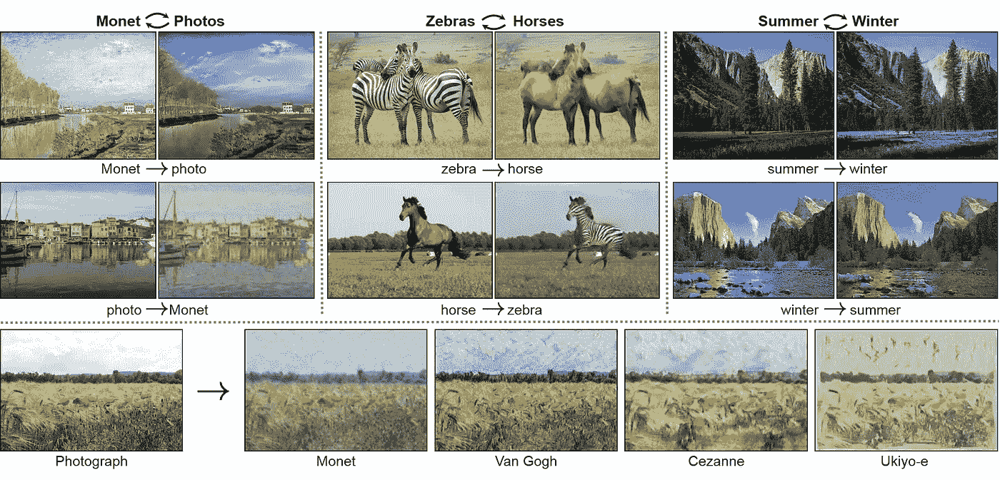**

**some results from CycleGAN**

# **交叉通道编码器**

**因此，我们已经看到 GANs 在自我监督学习中有巨大的潜力(不知何故还有待实现)。但是他们更老的、目前不太受欢迎的同类产品**自动编码器**怎么样呢？**

**事实上，自动编码器在某些任务上已经取得了很好的结果，但是它们总是遭受通过它们的层的信息丢失。**

**在自我监督学习中，他们也取得了一些成功。**

**在我们之前的文章中关于彩色化的讨论中，我们提到了彩色化实际上是一个跨通道编码器。意思是，用一些渠道去预测其他的。如果我们给真正的自动编码器一个机会，用不同的方式定义通道，会怎么样？**

**更具体地说，通过试图用另一半来重建图像的一半。接下来的[工作](https://arxiv.org/pdf/1611.09842.pdf)，名为“裂脑”正是这么做的。它定义的任务是对角地将图像一分为二，并使用自动编码器预测一半，使用另一半。**

**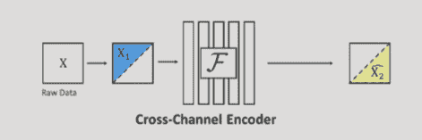**

**更进一步，每个图像可以使用两次，每一半用于预测另一半。**

**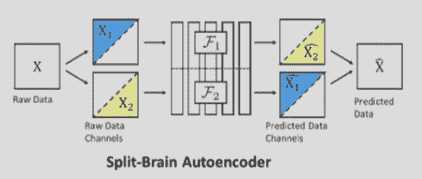**

**看到这种方法对对角线平分法相当有效，研究人员又回到了颜色，来回预测:B&W 预测 RBG，反之亦然，颜色预测黑白(特别使用实验室空间)**

**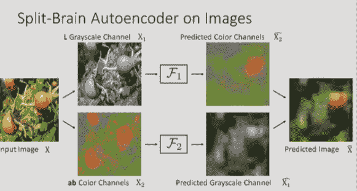**

# **总结和评估**

**根据之前的帖子，我有一些关于自我监督模型的实际迁移学习结果的问题。如那里所说，重要的特征是对不同任务的概括，例如检测和分割。有意地，我没有把太多的重点放在这些结果上，因为它们相当脆弱，并且总是保持与它们的目标 10%的相当稳定的差异:ImageNet 预训练。**

**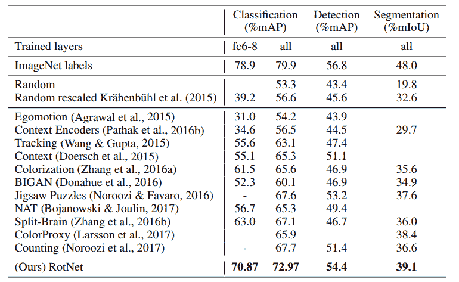**

**上面的表格摘自轮换[的作品](https://openreview.net/forum?id=S1v4N2l0-)，这可能是令人惊讶的自我监督迁移学习的当前“艺术状态”。大多数其他讨论过的论文也在那里。然而，这应该有所保留，因为:**

*   **审稿人对轮换论文的评价不高**
*   **这些论文中有一些数据展示技巧，使它们在发表时看起来领先，但在现实生活中并不真正有用。**

**因此，再一次，它似乎有很大的潜力，特别是在客户损失函数的想法，但结果还没有“在那里”。然而，我们仍然有一些理由保持乐观:幸运的是，视觉信号不仅限于图像，也存在于…视频中。视频增加了重要的时间维度，这反过来又增加了大量新的可能的任务、范例和选项，最终，一些真实的结果(！).这一点和更多将在下一篇文章中讨论，敬请关注。**

**一如既往，我欢迎反馈和建设性的批评。可以通过 Twitter @shgidi 联系到我**

## **系列链接:**

*   **[自我监督学习简介](/a-different-kind-of-deep-learning-part-1-90fe6c52f1ab)**
*   **自我监督学习:生成方法(本帖)**
*   **通过视频进行自我监督学习(未来帖子)**