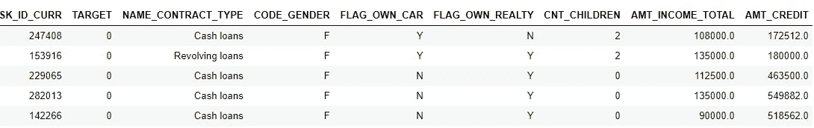
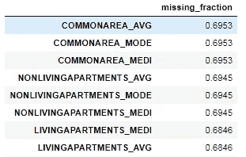
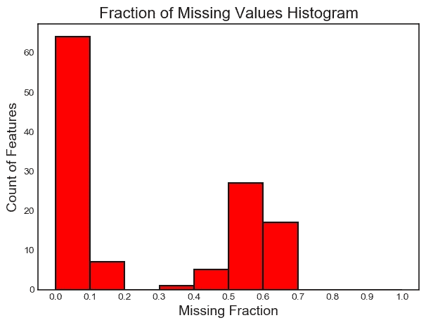
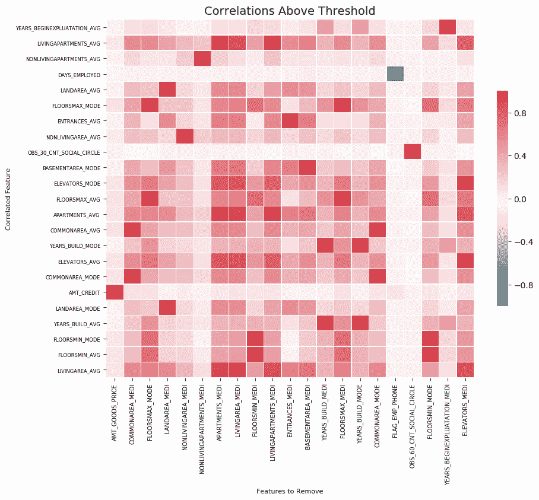
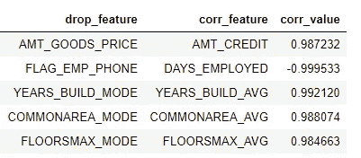
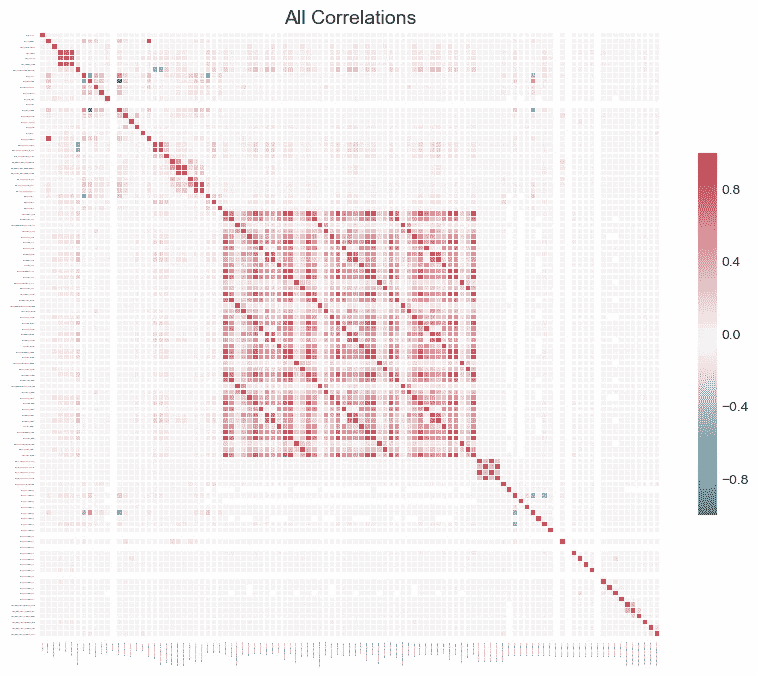
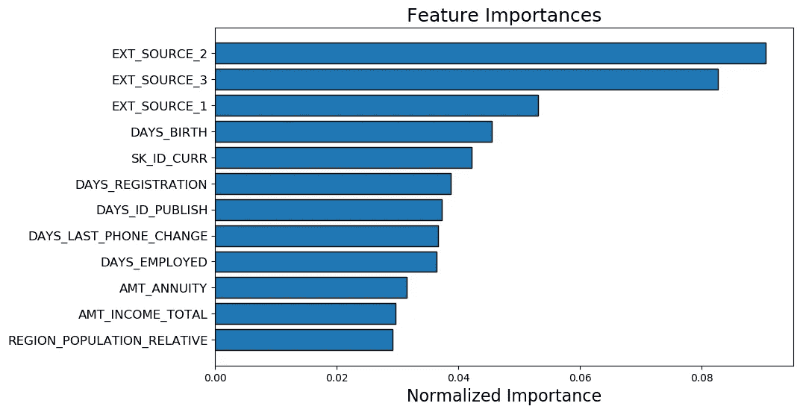
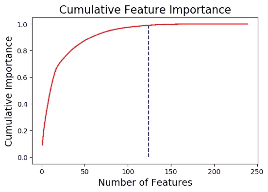
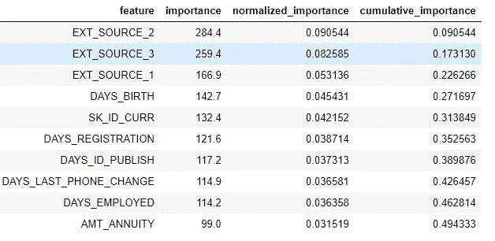
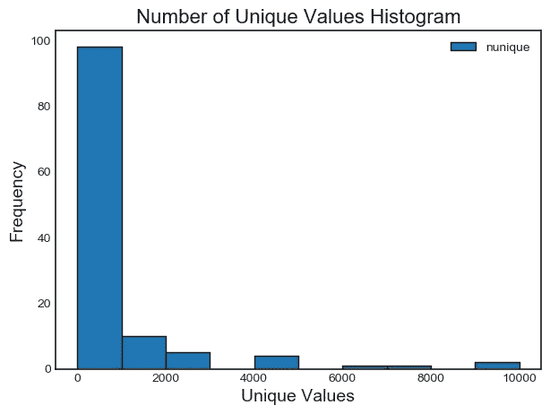

# Python 中用于机器学习的特征选择工具

> 原文：<https://towardsdatascience.com/a-feature-selection-tool-for-machine-learning-in-python-b64dd23710f0?source=collection_archive---------0----------------------->


## 使用 FeatureSelector 实现高效的机器学习工作流

特征选择，即在数据集中寻找和选择最有用的特征的过程，是机器学习管道的关键步骤。不必要的特征降低了训练速度，降低了模型的可解释性，最重要的是，降低了测试集的泛化性能。

我发现自己在机器学习问题上一遍又一遍地应用特别的特征选择方法，这让我感到沮丧，于是我用 Python [编写了一个特征选择类，可以在 GitHub](https://github.com/WillKoehrsen/feature-selector) 上找到。`FeatureSelector`包括一些最常见的特征选择方法:

1.  **缺失值百分比高的特征**
2.  **共线(高度相关)特征**
3.  **在基于树的模型中具有零重要性的特征**
4.  **重要性低的特征**
5.  **具有单一唯一值的特征**

在本文中，我们将在一个示例机器学习数据集上使用`FeatureSelector`。我们将看到它如何允许我们快速实现这些方法，从而实现更高效的工作流。

完整的代码可以在 GitHub 上获得，我鼓励任何贡献。功能选择器是一项正在进行的工作，并将根据社区需求继续改进！

## 示例数据集

对于这个例子，我们将使用 Kaggle 上的[家庭信用违约风险机器学习竞赛](https://www.kaggle.com/c/home-credit-default-risk)的数据样本。(参赛入门，见[本文](/machine-learning-kaggle-competition-part-one-getting-started-32fb9ff47426))。整个数据集可以从下载[，这里我们将使用一个示例来说明。](https://www.kaggle.com/c/home-credit-default-risk/data)



Example data. TARGET is the label for classification

竞争是一个监督分类问题，这是一个很好的数据集，因为它有许多缺失值、许多高度相关(共线)的要素和许多对机器学习模型没有帮助的不相关要素。

## 创建实例

为了创建一个`FeatureSelector`类的实例，我们需要传递一个行中有观察值、列中有特性的结构化数据集。我们可以使用一些只有特征的方法，但是基于重要性的方法也需要训练标签。由于我们有一个监督分类任务，我们将使用一组特征和一组标签。

(确保在与`feature_selector.py`相同的目录下运行此程序)

```
from feature_selector import FeatureSelector# Features are in train and labels are in train_labels
fs = FeatureSelector(data = train, labels = train_labels)
```

## 方法

要素选择器有五种方法来查找要移除的要素。我们可以访问任何已识别的特征，并手动将其从数据中删除，或使用特征选择器中的`remove`功能。

在这里，我们将介绍每种识别方法，并展示如何同时运行所有 5 种方法。`FeatureSelector`另外还有几个绘图功能，因为视觉检查数据是机器学习的一个重要组成部分。

# 缺少值

查找要移除的要素的第一种方法很简单:查找缺失值比例高于指定阈值的要素。下面的调用识别缺失值超过 60%的特征(输出**粗体**)。

```
fs.identify_missing(missing_threshold = 0.6)**17 features with greater than 0.60 missing values.**
```

我们可以看到数据帧中每一列缺失值的比例:

```
fs.missing_stats.head()
```



为了查看被识别为要删除的特性，我们访问了`FeatureSelector`的`ops`属性，这是一个 Python 字典，特性在值中作为列表。

```
missing_features = fs.ops['missing']
missing_features[:5]**['OWN_CAR_AGE',
 'YEARS_BUILD_AVG',
 'COMMONAREA_AVG',
 'FLOORSMIN_AVG',
 'LIVINGAPARTMENTS_AVG']**
```

最后，我们绘制了所有特征中缺失值的分布图:

```
fs.plot_missing()
```



# 共线特征

[共线特征](https://www.quora.com/Why-is-multicollinearity-bad-in-laymans-terms-In-feature-selection-for-a-regression-model-intended-for-use-in-prediction-why-is-it-a-bad-thing-to-have-multicollinearity-or-highly-correlated-independent-variables)是彼此高度相关的特征。在机器学习中，由于高方差和较低的模型可解释性，这些会导致测试集上的泛化性能下降。

`identify_collinear`方法基于指定的[相关系数](http://www.statisticshowto.com/probability-and-statistics/correlation-coefficient-formula/)值寻找共线特征。对于每对相关的特征，它识别要移除的特征之一(因为我们只需要移除一个):

```
fs.identify_collinear(correlation_threshold = 0.98)**21 features with a correlation magnitude greater than 0.98.**
```

我们可以用相关性做一个简洁的可视化，这就是热图。这将显示至少有一个相关性高于阈值的所有要素:

```
fs.plot_collinear()
```



和以前一样，我们可以访问将被移除的相关要素的完整列表，或者在数据帧中查看高度相关的要素对。

```
# list of collinear features to remove
collinear_features = fs.ops['collinear']# dataframe of collinear features
fs.record_collinear.head()
```



如果我们想要研究我们的数据集，我们也可以通过向调用传递`plot_all = True`来绘制数据中所有相关性的图表:



# 零重要性特征

前两种方法可以应用于任何结构化数据集，并且是**确定性的** —对于给定的阈值，每次结果都是相同的。下一种方法仅设计用于监督机器学习问题，其中我们有用于训练模型的标签，并且是不确定的。`identify_zero_importance` 函数根据梯度推进机器(GBM)学习模型查找重要性为零的特征。

利用基于树的机器学习模型，[比如 boosting 集成，我们可以发现特征的重要性。](https://machinelearningmastery.com/feature-importance-and-feature-selection-with-xgboost-in-python/)重要性的绝对值不如相对值重要，相对值可用于确定任务的最相关特征。我们还可以通过移除零重要性特征来使用特征重要性进行特征选择。在基于树的模型中，重要性为零的[特征不用于分割任何节点](https://www.salford-systems.com/blog/dan-steinberg/what-is-the-variable-importance-measure)，因此我们可以在不影响模型性能的情况下移除它们。

`FeatureSelector`使用梯度推进机器从 [LightGBM 库](http://lightgbm.readthedocs.io)中找到特征重要性。为了减少方差，在 GBM 的 10 次训练运行中对特征重要性进行平均。此外，使用验证集的早期停止来训练模型(有一个选项可以关闭它)，以防止过度拟合训练数据。

下面的代码调用方法并提取零重要性特征:

```
# Pass in the appropriate parameters
fs.identify_zero_importance(task = 'classification', 
                            eval_metric = 'auc', 
                            n_iterations = 10, 
                             early_stopping = True)# list of zero importance features
zero_importance_features = fs.ops['zero_importance']**63 features with zero importance after one-hot encoding.**
```

我们传入的参数如下:

*   `task`:对应我们问题的“分类”或“回归”
*   `eval_metric`:用于提前停止的度量(如果提前停止被禁用，则不需要)
*   `n_iterations`:平均特征重要性的训练运行次数
*   `early_stopping`:是否使用提前停止来训练模型

这次我们用`plot_feature_importances`得到两个图:

```
# plot the feature importances
fs.plot_feature_importances(threshold = 0.99, plot_n = 12)**124 features required for 0.99 of cumulative importance**
```



左边是`plot_n`个最重要的特征(根据归一化重要性绘制，总和为 1)。右边是累积重要性与特征数量的关系。垂直线画在累积重要性的`threshold`处，在本例中为 99%。

对于基于重要性的方法，需要记住两点:

*   训练梯度推进机器是随机的，这意味着*特征的重要性将在每次模型运行时发生变化*

这应该不会有很大的影响(最重要的特性不会突然变得最不重要)，但是会改变一些特性的顺序。它还会影响所识别的零重要性特征的数量。如果特性的重要性每次都发生变化，不要感到惊讶！

*   为了训练机器学习模型，首先对特征进行*一键编码*。这意味着某些被标识为重要性为 0 的要素可能是在建模过程中添加的一次性编码要素。

当我们到达特征移除阶段时，有一个选项来移除任何添加的独热编码特征。然而，如果我们在特征选择之后进行机器学习，我们无论如何都要对特征进行一次性编码！

# 低重要性特征

下一种方法建立在零重要性函数的基础上，使用模型中的特征重要性进行进一步选择。函数`identify_low_importance`查找对指定的总重要性没有贡献的最低重要性特征。

例如，下面的调用查找实现 99%的总重要性不需要的最不重要的功能:

```
fs.identify_low_importance(cumulative_importance = 0.99)**123 features required for cumulative importance of 0.99 after one hot encoding.
116 features do not contribute to cumulative importance of 0.99.**
```

基于累积重要性的图和该信息，梯度推进机器认为许多特征与学习无关。同样，这种方法的结果会在每次训练中发生变化。

要查看数据框架中所有特征的重要性:

```
fs.feature_importances.head(10)
```



`low_importance`方法借鉴了[的一种方法，使用主成分分析(PCA)](/pca-using-python-scikit-learn-e653f8989e60) ，其中通常只保留需要保留一定百分比方差(如 95%)的 PC。占总重要性的百分比是基于同样的想法。

基于特征重要性的方法实际上仅在我们要使用基于树的模型进行预测时才适用。除了随机性之外，基于重要性的方法是一种黑盒方法，因为我们并不真正知道为什么模型认为特征是不相关的。如果使用这些方法，运行几次，看看结果如何变化，也许可以创建多个带有不同参数的数据集进行测试！

# 单一独特价值特征

最后一个方法相当简单:[查找任何具有唯一值的列。](https://github.com/Featuretools/featuretools/blob/master/featuretools/selection/selection.py)只有一个唯一值的特征不能用于机器学习，因为这个[特征的方差为零](https://www.r-bloggers.com/near-zero-variance-predictors-should-we-remove-them/)。例如，基于树的模型永远不能对只有一个值的特征进行分割(因为没有组来划分观察值)。

与其他方法不同，这里没有可供选择的参数:

```
fs.identify_single_unique()**4 features with a single unique value.**
```

我们可以绘制每个类别中唯一值数量的直方图:

```
fs.plot_unique()
```



需要记住的一点是，默认情况下，`NaNs`在[计算 Pandas 中的唯一值之前被删除。](http://pandas.pydata.org/pandas-docs/stable/generated/pandas.Series.nunique.html)

# 移除功能

一旦我们确定了要丢弃的特性，我们有两个移除它们的选项。所有要删除的特征都存储在`FeatureSelector`的`ops`字典中，我们可以使用列表手动删除特征。另一种选择是使用`remove`内置函数。

对于这个方法，我们传入`methods`来用来移除特性。如果我们想使用所有实现的方法，我们只需传入`methods = 'all'`。

```
# Remove the features from all methods (returns a df)
train_removed = fs.remove(methods = 'all')**['missing', 'single_unique', 'collinear', 'zero_importance', 'low_importance'] methods have been run

Removed 140 features.**
```

该方法返回一个移除了特征的数据帧。要移除在机器学习过程中创建的一次性编码特征:

```
train_removed_all = fs.remove(methods = 'all', keep_one_hot=False)**Removed 187 features including one-hot features.**
```

在继续操作之前检查将要删除的功能可能是个好主意！原始数据集存储在`FeatureSelector`的`data`属性中作为备份！

# 同时运行所有方法

我们可以通过`identify_all`使用所有的方法，而不是单独使用这些方法。这需要每个方法的参数字典:

```
fs.identify_all(selection_params = {'missing_threshold': 0.6,    
                                    'correlation_threshold': 0.98, 
                                    'task': 'classification',    
                                    'eval_metric': 'auc', 
                                    'cumulative_importance': 0.99})**151 total features out of 255 identified for removal after one-hot encoding.**
```

请注意，由于我们重新运行了模型，总特征的数量将会发生变化。然后可以调用`remove`函数来丢弃这些特征。

# 结论

特征选择器类实现了几个常见的[操作，用于在训练机器学习模型之前移除特征](https://machinelearningmastery.com/an-introduction-to-feature-selection/)。它提供了用于识别要移除的特征以及可视化的功能。方法可以单独运行，也可以同时运行，以实现高效的工作流程。

`missing`、`collinear`和`single_unique`方法是确定性的，而基于特征重要性的方法会随着每次运行而改变。特征选择，很像机器学习的[领域，很大程度上是经验性的](https://hips.seas.harvard.edu/blog/2012/12/24/the-empirical-science-of-machine-learning-evaluating-rbms/)，需要测试多个组合来找到最佳答案。最佳实践是在管道中尝试几种配置，特性选择器提供了一种快速评估特性选择参数的方法。

一如既往，我欢迎反馈和建设性的批评。我想强调的是，我正在寻求关于`FeatureSelector`的帮助。任何人都可以[在 GitHub](https://github.com/WillKoehrsen/feature-selector) 上做出贡献，我感谢那些刚刚使用这个工具的人的建议！也可以通过 Twitter [@koehrsen_will](http://twitter.com/@koehrsen_will) 联系到我。