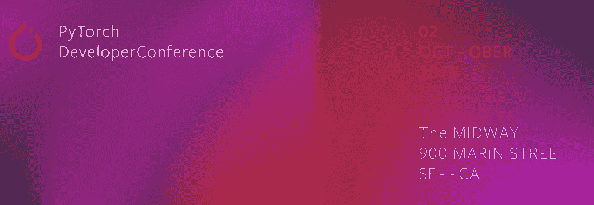
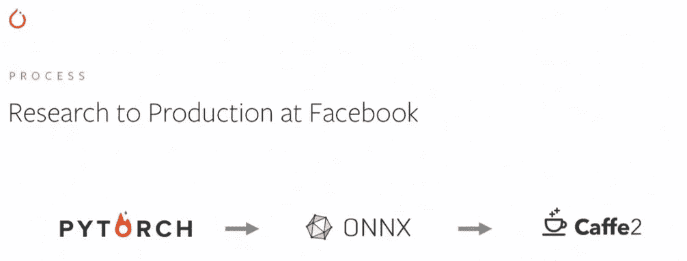
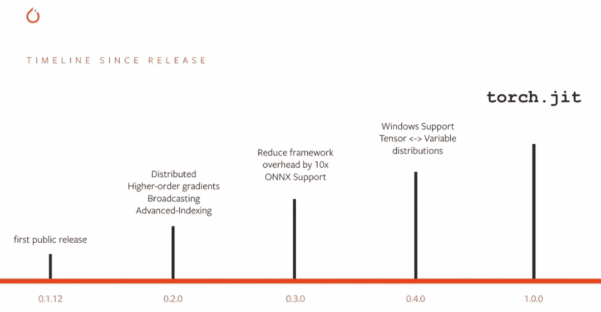
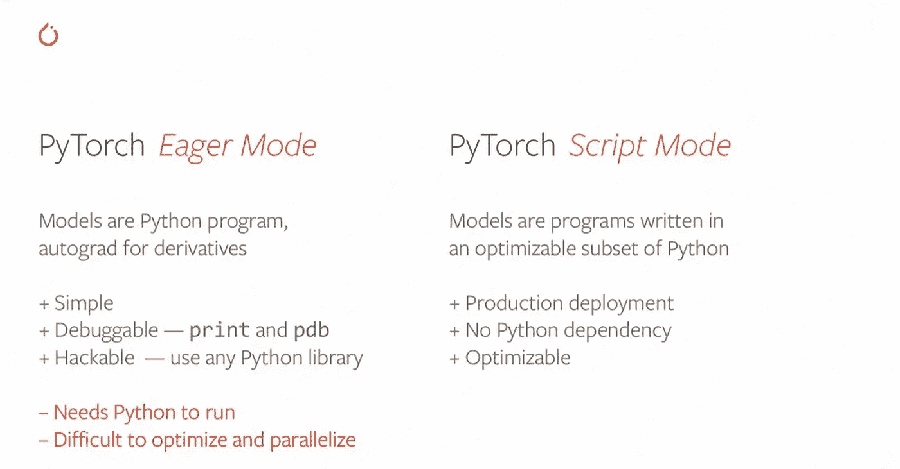
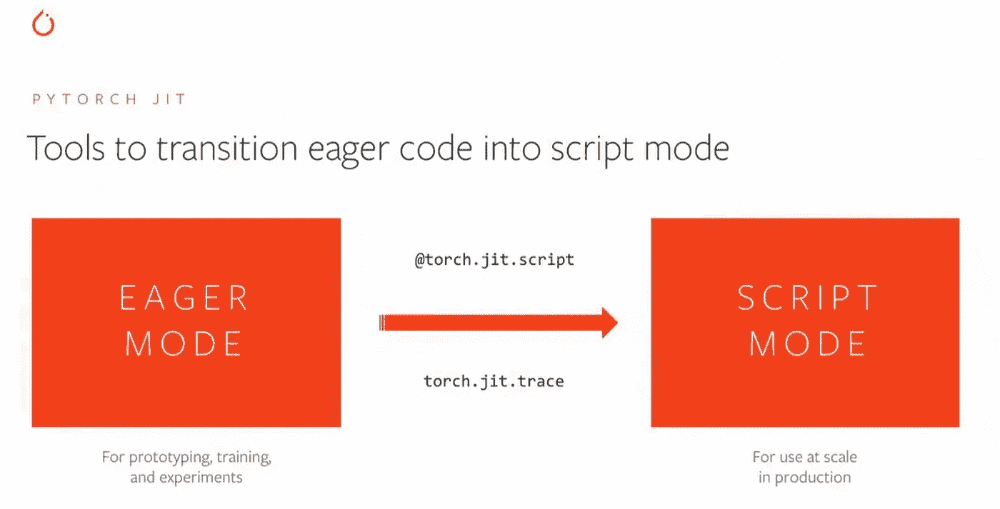
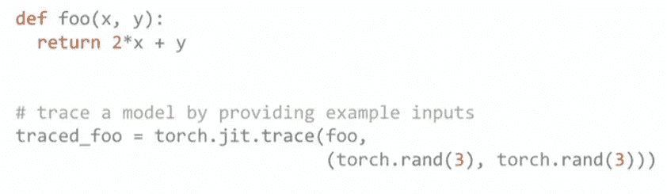
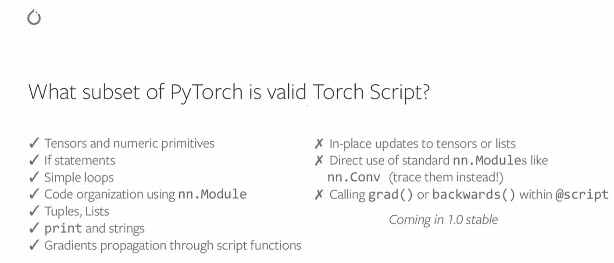
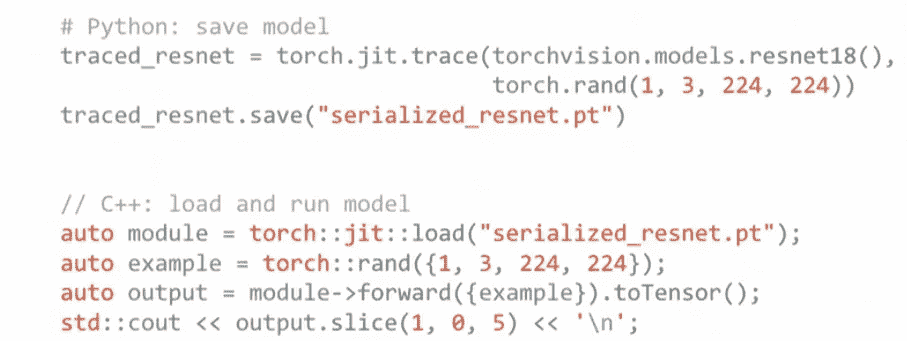
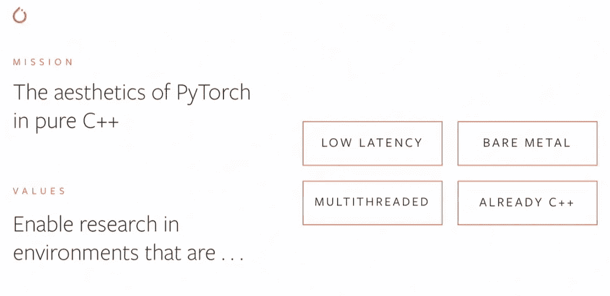
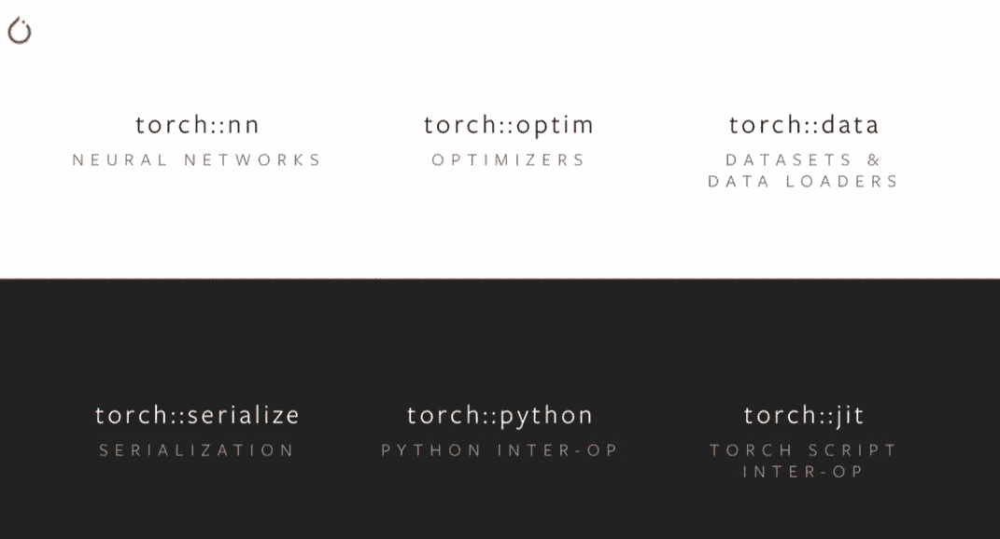

# Pytorch 1.0 初探

> 原文：<https://towardsdatascience.com/a-first-look-at-pytorch-1-0-8d3cce20b3ee?source=collection_archive---------10----------------------->

Image by [Facebook](https://www.facebook.com/)

今年 10 月 2 日，我有幸参加了第一届 Pytorch 开发者大会。这是一次很棒的经历！Pytorch 已经迅速成为深度学习框架中的一等公民，两年前刚刚起步。在这次活动中，我遇到了许多熟悉的面孔。我将讲述 Pytorch 1.0 上午会议中与软件开发人员最相关的部分。会议包括脸书副总裁 Jerome Pesenti 和 Pytorch 核心开发团队成员的演讲，旨在向社区介绍 Pytorch 1.0。

Pytorch 主要由 Facebooks 的人工智能研究团队开发。目标是使人工智能开放和协作，以便越来越多的人可以利用它。这个团队成立于大约 5 年前，从那时起，他们为脸书的大部分产品提供核心支持。脸书广泛使用人工智能来增强他们产品的功能。一些广泛的领域是(a)提供推荐(新闻源/你可能喜欢的文章)，(b)机器翻译(这样世界各地的每个人都可以相互理解),以及(c)创建机器人和消息助手。脸书研究公司在工业界和学术界有很多合作伙伴。

Pytorch 用于新模型和系统的研究和原型制作。这个框架是灵活和必要的，因此易于使用。接下来，必须使用 ONNX(开放式神经网络交换)将 Pytorch 模型移植为更适合生产的形式。ONNX 是深度学习模型的一种格式，能够跨不同的开源 AI 框架移植它们。正在讨论的生产系统是 Caffe2。在脸书，Caffe2 是大多数人工智能应用的主力，并在数据中心大规模部署。Caffe2 框架是健壮的、稳定的，每天能进行 300 万亿次预测。Pytorch 1.0 的目标是**将所有这 3 个框架的伟大特性结合成一个单一的框架，以便提供从研究到生产的无缝路径。**

# **T5【py torch 1.0 之路】T6**

在之前的升级中，这一次非常重要(因此从 0.4 跳到了 1.0)。每个 Pytorch 版本之前都解决了 Pytorch 框架中的一个核心增强/改进，如图所示。Pytorch 1.0 的重点是引入了高级编译器 **torch.jit** 。torch.jit 的引入是出于解决两个主要问题的需要:

**将模型与代码分离:**在 1.0 之前，AI 模型*是*用 Pytorch 编写的代码，为了运行它，需要一个 python VM/环境。对于定制计算环境、移动系统、多线程服务器等，这不是最佳解决方案。Pytorch 1.0 通过在 *torch.jit* 中提供函数和类注释，允许您将模式与 python 代码分开。这些函数/类可以被编译成可检查、可导出并保存在磁盘上的高级表示。

**针对定制硬件的高效模型优化:**py torch 模型可以在服务器、TPU 的 GPU、移动设备等上运行**。**Python 代码的纯命令式执行会错过很多优化机会。 *Torch.jit* 模型可以提前检查，以在不同的粒度级别执行整体程序优化、节点融合等。

Pytorch 1.0 预览版被认为是相当稳定和成熟的，据称 90%的特性已经存在。在脸书，这个系统已经在生产中使用，团队不希望开发人员暴露在严重的错误中。预计 1.0 的稳定版本将于 2018 年 NIPS 前后发布。

# **深入研究 torch.jit**

急切执行模式是研究的绝佳选择。我们可以在代码中使用任意的 python 库，并使用我们选择的调试工具快速构建原型。一旦我们有了一小组想要投入生产的模型，事情看起来就变得更加麻烦了。python 解释器的要求使得移动环境或多线程环境下的服务器设置变得不舒服。即使使用 python 解释器，代码的优化和并行化程度也是有限的。

脚本模式代码可以在没有 python 解释器的情况下执行。这是一个使用 Python 子集编写的模型，可以优化并转换成中间格式。脚本模式拥有构建 AI 模型所需的所有基本构件，但它限制了 python 语言的其他动态行为。

理想的过渡看起来会像上面这样。正如我们所知，大多数人会以渴望模式开始编写程序，这是常规的 Pytorch 代码。当您想要将一个特定的模型转移到生产中时，可以使用 *pytorch.jit* 工具来注释代码，以将其从渴望模式转移到脚本模式。这可以逐步完成，从您最有信心的模型部分开始，同时仍然保留可调试性，并用其余代码进行测试。为了实际完成从一种形式到另一种形式的转换， *torch.jit* 提供了两种方法:

**Torch.jit.trace — T** his 适用于现有的 eager python 模型，这些模型是没有控制流的“直线型”(vision CNN 模型)。跟踪器使用提供的输入运行模块，记录它遇到的张量运算。

例如，可以在常规 python 函数 *foo* 上运行 *torch.jit.trace* ，也传入预期的输入。跟踪器基础结构记录发生了什么操作，并将其存储在对象 *traced_foo 中。traced_foo* 是一个独立的包，可以独立于 python 运行，保存到磁盘和加载等等。

**Torch.jit.script —** 这对于控制流很重要的模型很有用，比如自定义 RNN。这里我们直接用 Torch 脚本编写代码，这是 Python 的一个子集，可以进行优化。我们使用类和方法注释( *@torch.jit.script，@torch.jit.script_method* )来表示 python 代码的 torch 脚本部分。循环、打印语句和控制流被保留下来，因为我们只是在 python 代码上使用注释。要使用标准 python 工具调试这部分代码，或者切换到急切执行模式，我们只需要移除注释。

在任何一种情况下(跟踪模式或脚本模式)，基本部分仍然是用 python 编写的，而不是用任何中间元编程范式编写的。一个模型可以包含脚本和跟踪代码的混合。保存模型并将其加载到另一个环境中，比如说 C++非常简单，如下图所示。

# Pytorch 1.0 和 C++，Pytorch C++前端

首先，Pytorch 1.0 使得将现有的 C++函数集成到您的 Python 环境中变得很容易。例如，您希望使用一些 OpenCV 库功能，并将其引入 Python 代码中。Pytorch 已经有了像 ATEN 这样的库，可以让你用 C++编程，它还有 Autograd，引入了梯度和微分。在 eager 和 script 模式场景中支持 C++似乎很容易:(a)对于 eager 模式，您可以将 C++程序代码转换成一个 Python 模块进行实验(b)对于 script 模式，在 script 模式中使用 C++代码本身

第二，对于特殊的环境，有一个 C++前端，你甚至可以用它来运行训练循环，而不仅仅是推理。这对于具有低延迟、裸机、多线程需求的应用程序来说可能是有意义的。C++前端支持现有的 Pytorch 特性，如 torch::nn、torch::optim、序列化等。

## 参考资料:

[Pytorch 开发者大会活动](https://www.facebook.com/events/685693415119412/)。视觉效果取自活动期间展示的幻灯片。Pytorch 核心发展演讲者是 Soumith Chintala、Dmytro Dzhulgakov、Zack DeVito、Peter Goldsborough 和李腾