# 利用以太坊收盘价进行时间序列预测的尝试

> 原文：<https://towardsdatascience.com/a-foray-into-time-series-forecasting-using-ethereum-closing-prices-5ca69dbbd76a?source=collection_archive---------6----------------------->

Photo by [Executium](https://unsplash.com/@executium?utm_source=medium&utm_medium=referral) on [Unsplash](https://unsplash.com?utm_source=medium&utm_medium=referral)

围绕加密货币的狂热炒作不同于我在这个星球上 25 年来所目睹的任何事情(也许除了狂骨的崛起，这在我上小学的时候是身份的象征)。每天，似乎都有各种密码达到“历史新高”的新报告，经济学家预言[众所周知的密码泡沫破裂](http://strategiccoin.com/bitcoin-price-bubble-will-burst-claims-columbia-university-economist/)，新玩家(我正看着你，[涟漪](https://coinmarketcap.com/currencies/ripple/))震撼市场。伴随着所有的讨论，我开始思考——这个市场有什么逻辑吗？昨天(甚至最后一小时)的市场动态可以用来预测未来的表现吗？带着这些问题，我开始寻找噪音中是否有信号。

在本帖中，我将使用几种不同的算法，看看是否有可能仅使用“传统”加密货币市场数据(开盘价/收盘价、高/低价、成交量)对每小时的加密货币价格进行可靠的预测。由于许多不同的[因素](https://bitconnect.co/bitcoin-information/10/how-is-the-price-of-cryptocurrency-defined)驱动着市场(供给/需求、媒体炒作和/或公众认知、硬币效用等。)，这可能看起来像是一个西西弗式的努力，但正如我们将看到的，即使使用节省计算费用的模型，也可以生成相当不错的预测。(此外，这个项目给了我一个深入时间序列分析/预测的借口，我在这里的一组笔记[中详细介绍了这一点](https://medium.com/@chbonfield/2-000-words-on-time-series-forecasting-1839714dcce)。)

事不宜迟，我们开始吧！

# 数据源

对于这项工作，我通过 crypto compare API([https://www.cryptocompare.com/api/](https://www.cryptocompare.com/api/))获取每小时的加密货币数据。我发现使用他们的 API/文档非常简单，事实上他们集成了 75 个以上不同的交换，这对我来说是一个一站式商店。然而，唯一的缺点是，当使用免费帐户的 API 时，只能访问 2000 年最近的时间点(大约 3 个月的每小时数据)。

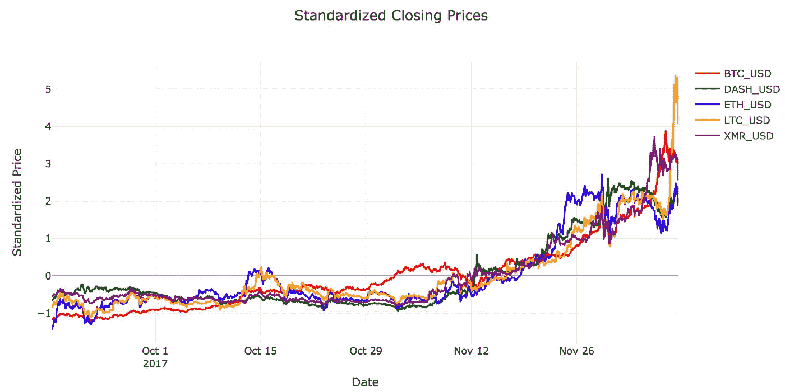

Cryptocurrency closing prices (standardized for visualization).

在这个[脚本](https://github.com/cbonfield/springboard_dsct/blob/master/cryptocurrency/code/cryptocompare_scraper.py)中，我从五个最大的交易所(比特币基地、波洛涅克斯、北海巨妖、Bitstamp、Bitfinex)提取了五种流行的加密货币(比特币、以太币、莱特币、Dash 和 Monero)的数据。一旦我有了所有的数据，我就执行必要的聚合(平均)以将来自每个交换的特征组合成一个，尽管人们可以想象将它们都保存起来并观察这如何改变事情。

您可能会从脚本中注意到，我还添加了一些额外的功能。除收盘价外，我还包括:

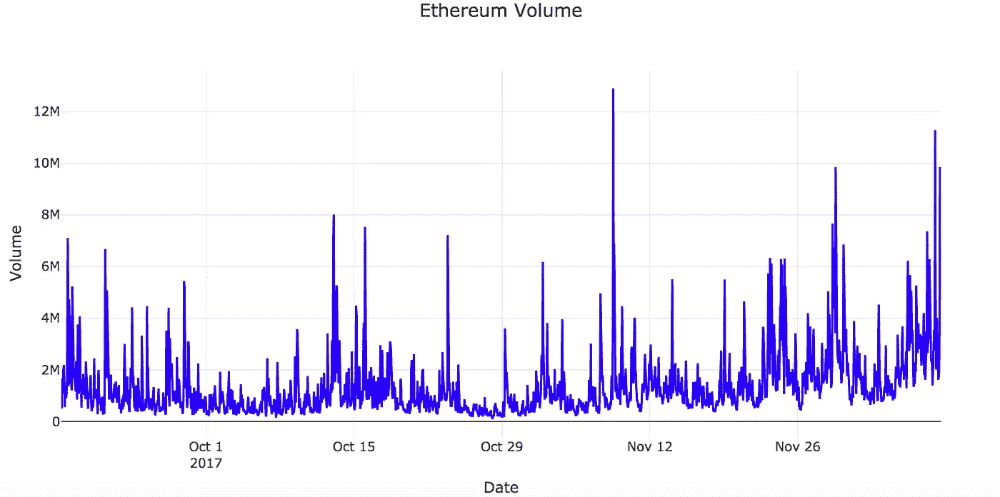

*   *成交量*:总成交量(交易所平均；一个总数会更自然，但是我丢失了一些交换的数据)

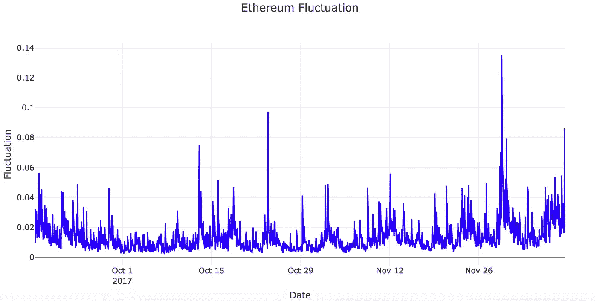

*   *波动*:波动性的度量；定义为小时最高价和最低价与开盘价之差(交易所的平均值)

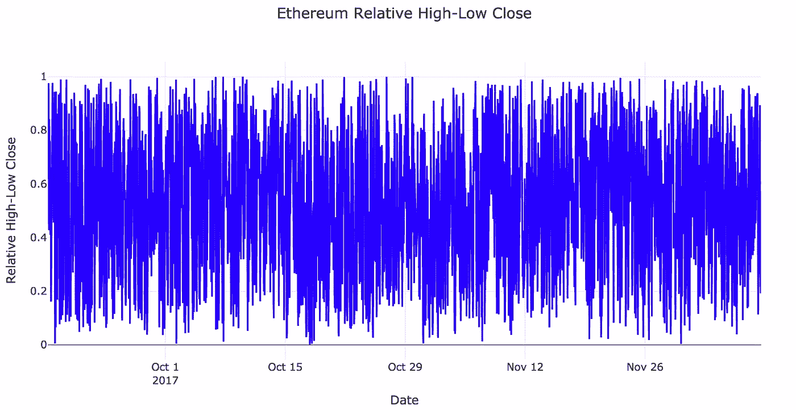

*   *relative_hl_close* :波动率的附加度量；使用高/低价(交易所的平均值)对收盘价进行最小-最大缩放。值为 1 表示收盘价与所有交易所在该小时的最高价相同，而值为 0 表示所有交易所的收盘价都是最低价。

在博客的其余部分，我将通过时间序列分析/预测，使用 **ARIMA** 、**随机森林**和长短期记忆( **LSTM** )网络来预测收盘价，详细描述我的冒险经历。我选择使用比特币的亲戚以太坊，它正日益流行。在我修补各种模型/算法的时间里，以太坊市场增长如此之快，以至于我可能会在我这里添加更多的最新数据(我的数据集只持续到 2017 年 12 月的一周左右)，但现在，我们将使用我手头的数据。

# 预赛

在深入研究结果之前，我想花点时间讨论一下贯穿本文其余部分的几个总体统计概念— **平稳性、时间序列验证、**和**先行一步**预测。

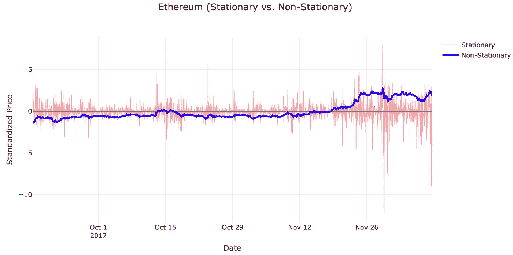

Ethereum closing prices (blue) and differenced closing prices (red), standardized for the sake of visualization. The [Augmented Dickey-Fuller Test](https://en.wikipedia.org/wiki/Augmented_Dickey%E2%80%93Fuller_test) was used to assess stationarity.

**平稳**过程的[维基百科定义](https://en.wikipedia.org/wiki/Stationary_process)是“一个随机过程，它的无条件联合概率分布在时间移位时不变”。对于那些讲统计的人来说，这是一个非常好的一行程序(因此被引用)，但是如果它让你抓耳挠腮，不要害怕！本质上，平稳性意味着生成时间序列数据的基本过程与时间无关——如果存在时间相关性，我们如何能够以有意义的方式进行预测？平稳性是一些经典预测技术的核心(例如， [ARMA](http://www2.econ.iastate.edu/classes/econ674/bunzel/documents/Lecture2.pdf) )，即使在它不是必要条件的情况下(树，神经网络)，它也是准备数据时要考虑的因素。

**时间序列验证**是一个[相当任性的企业](http://multithreaded.stitchfix.com/blog/2017/02/28/whats-wrong-with-my-time-series/)。在一个普通的机器学习问题中，您将获得手头的所有数据，将其随机划分为训练集/测试集(其中一些训练集被保留用于验证)，根据训练集拟合模型，根据训练模型为测试集生成预测，并使用所述预测来评估模型的性能。然而，当您有时间依赖性时，这种方法可能不可行，这取决于您选择的算法——随机分割您的时间序列可能会对可以利用的任何类型的自相关造成严重破坏，并且在实践中，您可能会对选择尊重数据的时间依赖性的分割感兴趣(即，使用[滚动窗口](https://robjhyndman.com/hyndsight/tscv/))。即使找到了合适的验证方案，您也必须决定如何生成预测(一次一个/多个步骤，使用实际/预测值等)。).

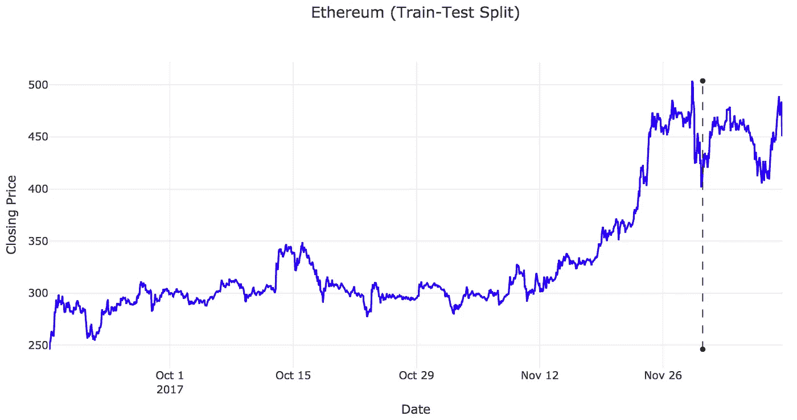

Train-test split (time ordering preserved) for Ethereum closing prices.

在这篇文章中，我用以下方式来解决这些问题:

*   对于随机森林，我在超参数调整期间使用了滚动窗口([时间序列分割](http://scikit-learn.org/stable/modules/generated/sklearn.model_selection.TimeSeriesSplit.html#sklearn.model_selection.TimeSeriesSplit))。对于 LSTM，为了节省计算时间，我没有加入任何花哨的验证方案。(不过，我确实添加了一些剔除层，有望解决过度拟合的问题)。
*   我保留最近一周左右的数据作为测试集，并生成**提前一步的预测**，其中实际观察值在需要时成为滞后协变量。我之前提到过，我将在本文的剩余部分使用以太坊，这样做的部分原因与测试集和训练集末尾的收盘价动态之间的偶然相似性有关。如果我们在测试集中有以前没有观察到的不可靠的行为，评估模型性能将是一个徒劳的练习——在这里，这不应该构成太大的问题。

# ARIMA

首先，我决定看看我是否能在以太坊的收盘价上安装一个 **ARIMA** 。如果我在数据中发现了某种 AR(p)或 MA(q)特征，那么我将尝试引入一组额外的外生变量(ARIMAX ),看看我是否可以改进 ARIMA 的拟合/预测。然而，我很快发现，在这种情况下，单靠 ARIMA 是不可行的，这可能是因为推动加密货币市场的许多不同因素(对自回归/误差项进行线性拟合是不够的)。

我和 ARIMA 的工作进展如下:

*   在 ARIMA， **I** 代表“整合的”——在实践中，它指的是使所考虑的时间序列平稳所需的差分(d)阶。对于以太坊收盘价，一阶差分(d=1)是我们使时间序列平稳所需要的。
*   **AR** (p)和 **MA** (q)分别指我们模型的自回归和移动平均部分。说白了，AR 项是感兴趣的量的滞后值(我们保留其中的 *p* )，而 MA 项说明过去时间点的回归误差(我们保留其中的 *q* )。传统上，参数 p 和 q 是从差分(平稳)序列的部分自相关和自相关函数(PACF/ACF)中手动确定的，尽管它们也可以通过模型选择经由[AIC](https://en.wikipedia.org/wiki/Akaike_information_criterion)/[BIC](https://en.wikipedia.org/wiki/Bayesian_information_criterion)([auto . ARIMA](https://www.rdocumentation.org/packages/forecast/versions/8.1/topics/auto.arima)用于 R 用户)来选择。
*   自相关(在滞后 *n* 时)就是一个时间序列和移动了 *n* 个周期的同一序列之间的线性相关。另一方面，部分自相关是一个时间序列和偏移了 *n* 个周期*的相同序列之间的线性相关性的度量，调整来自滞后 n* 之前的所有滞后的相关性。后者消除了中间(少于 *n* )滞后阶数之间可能存在的任何相关性，允许对任何给定滞后阶数的相关性进行独立评估。

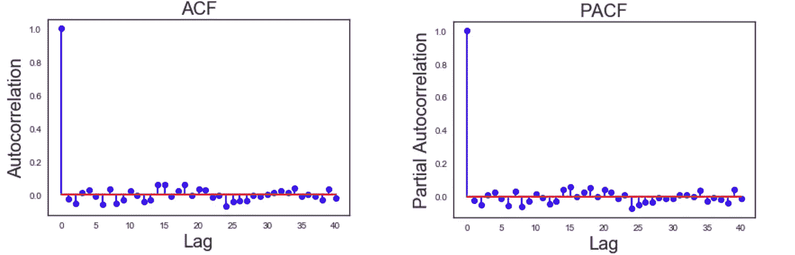

Autocorrelation (ACF) and partial autocorrelation (PACF) functions for differenced closing prices.

*   本质上，我们在寻找 AR 模型的 PACF/ACF 在滞后零之后稳定/急剧下降的某种模式，以及 MA 签名的相反情况(ACF/PACF)(有关更详细的概述，请查看这些[注释](http://people.duke.edu/%7Ernau/Notes_on_nonseasonal_ARIMA_models--Robert_Nau.pdf))。为了可视化的目的，我已经将上面显示的 ACF/PACF 缩短到只有 50 个滞后，但是最终，没有结构指示 ARMA 过程。

回想起来，我们在这里运气不佳可能并不奇怪。正如我前面提到的，加密货币市场的兴衰是由不确定的潜在因素驱动的，这使得自回归/误差项的线性拟合充其量是可疑的。

# 随机森林

尽管在 ARIMA 没有取得成功，我还是想探索一些流行的 ML 方法会有怎样的表现。另一个简单(但流行/强大)的预测时间序列的方法是通过回归树，所以我决定尝试一下**随机森林** (RF)！

当使用 RF 进行时间序列分析/预测时，人们通常会使用时间序列的滞后值和任何其他被认为在您的问题环境中具有某种效用的附加特征来构建特征矩阵。在这里，我包括了以太坊收盘价的八个滞后值，我前面提到的衍生功能，以及 Monero (XMR)的相同功能集，因为在早期我将完整的功能集(八个滞后加上所有五种加密货币的附加功能)输入 RF 时，这两者之间似乎有某种联系。(旁注:为了更严格地做到这一点，可以用 [Boruta](https://github.com/scikit-learn-contrib/boruta_py) 来代替)。

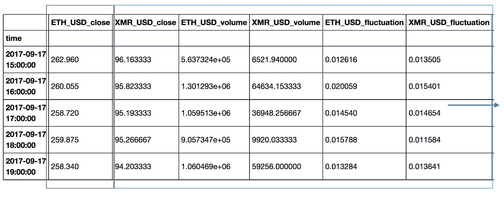

Snapshot of feature matrix (target variable in red box, predictors contained in blue box).

在对一些 RF 参数(n_estimators、max_features、min_samples_leaf)执行了(一点点)网格搜索交叉验证之后，在检查结果之前，我查看了特征的重要性，试图了解 RF 正在做什么:

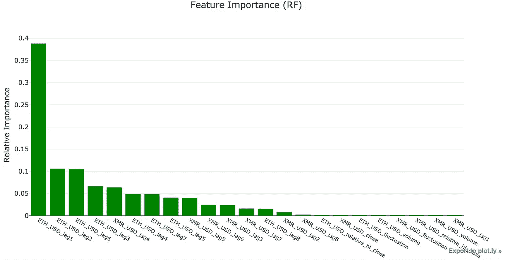

Feature importances for ETH_USD.

正如人们可能预料的那样，我们看到收盘价的最后几个滞后值支配了所有其他特征(我加入的额外值也完全无关紧要)。由于 ARIMA 只包含目标变量滞后值(和误差项)的线性回归，**这将表明，在所有**之后，可以从滞后值中收集到一些东西(非线性的)。

此外，Monero (XMR_USD)的一些滞后收盘价中包含一小部分信息。由于我对加密没有深入的投资，我不确定这是否是伪造的，但我认为即使没有适当的解释，我也会保留这些特性。

现在，看看结果:

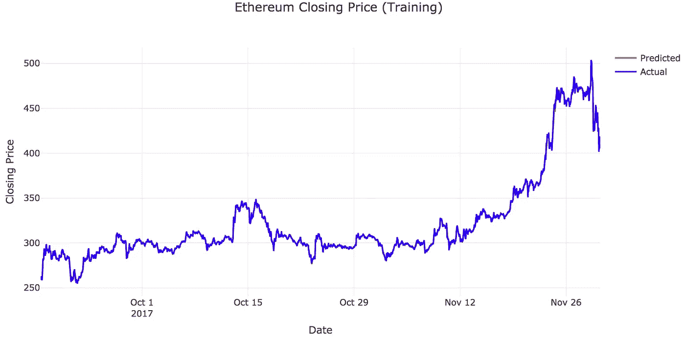

Actual/predicted ETH_USD closing prices for training set (RF).

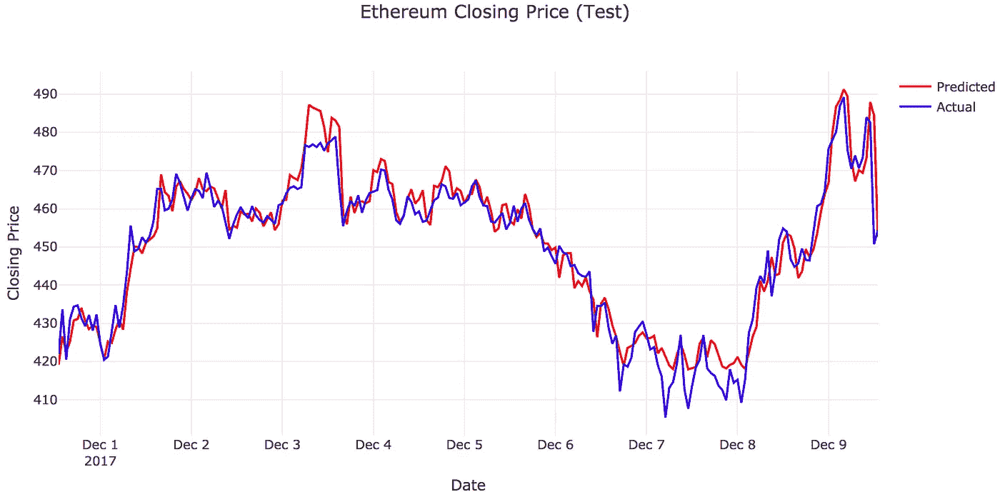

Actual/predicted ETH_USD closing prices for test set (RF).

还不错！尽管我们有时会与实际收盘价不同步，但我们从未偏离它们太远。凭借更具识别性的功能，RF 可能会表现得足够好，让加密投资者用他们的钱包做出合理的金融决策——目前，它可能只适合那些喜欢在生活中加点料的人。

# LSTM

如果模型的可解释性不是问题，为什么不试着把数据塞进神经网络呢？这里，我们将使用一个长短期记忆网络。(关于 LSTMs 的更多背景，请看[这里](http://colah.github.io/posts/2015-08-Understanding-LSTMs/)，这里[这里](http://blog.echen.me/2017/05/30/exploring-lstms/)，这里[这里](https://deeplearning4j.org/lstm.html)。如果你想了解与 crypto 类似的努力，只需看看这里的[和这里的](http://www.jakob-aungiers.com/articles/a/Multidimensional-LSTM-Networks-to-Predict-Bitcoin-Price)。

在将我们的数据输入 LSTM 之前，我们将标准化我们所有的输入特性——为了保持一致，我将包括与 RF 相同的特性。在将其分成适当的训练/测试集之后，我们将把我们的数据分块输入到 LSTM 中——我已经决定以 12 小时为间隔进行此操作——并尝试预测紧接在每个 12 小时窗口之后的一个小时的(标准化)收盘价。对于测试集，我们将使用前面详述的方案进行预测。提前一步预测会对我们的预测提出一个过于乐观的观点(立即预测更长的时间段或使用拟合值会做得更差)，但它应该足以用于演示目的。

我们的 LSTM 的总体框架如下:

*   在内部，我们将有一个两层，**堆叠的** LSTM。我在每个隐藏层中任意选择了 20 个隐藏节点，但是在实践中，人们可以通过反复试验来确定最佳数量。
*   为了使**正规化**，我在每次 LSTM 后加入两层退图层。我为每个下降层提供的参数(0.2)也是任意选择的，但也可以调整。
*   出于计算方面的考虑(我正在笔记本电脑上运行这个程序)，我将**时期**的数量限制为五个。通过增加这个数字，你不会烧掉房子，但是损失看起来稳定了，即使是很少的时期。

随着这些细节的公开，以下是我们的 LSTM 的表现:

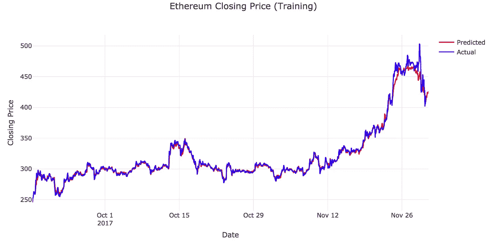

Actual/predicted ETH_USD closing prices for training set (LSTM)

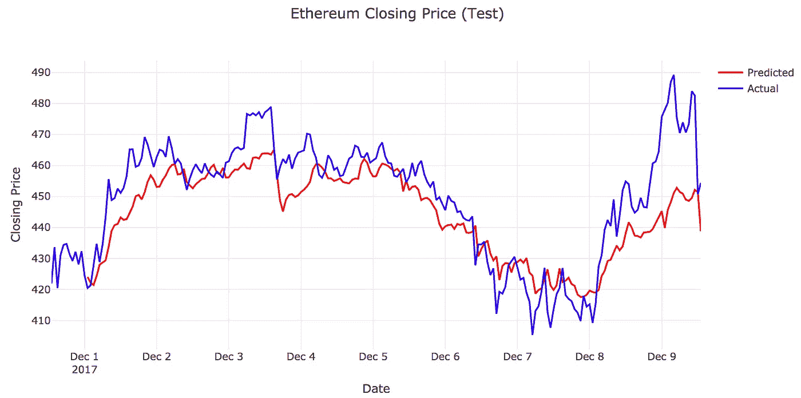

Actual/predicted ETH_USD closing prices for test set (LSTM).

汪汪。虽然我们看到 LSTM 在 11 月底之前的训练中表现相似，但我们在测试中表现不尽如人意。然而，值得注意的是，我们似乎能够捕捉到该系列的总体形状(上涨时上涨，下跌时下跌，等等。)，但我们永远无法到达最高点和最低点。如果我是一个打赌的人，我会把这种行为归因于缺乏参数调整，或者我们的 LSTM 学习到的大多数“长期”行为可能来自 9 月到 11 月初，在 11 月底/12 月更不稳定的行为之前。这反过来又说明了 LSTMs 的一个局限性——要使它真正发挥优势，我们需要许多样本，这些样本包含像这样的时间序列的所有细微行为，以馈入我们的网络。

# 总结(TL；博士)

在这篇博文中，我介绍了在加密货币收盘价的背景下用于时间序列分析/预测的三种流行方法的比较。虽然我们确实观察到了不错的结果，但加密货币市场的善变性质阻止了我们提升到吉姆·坎托雷级别的预测者，并且从理论上来说，纳入从诸如[外汇市场](http://moneyinc.com/foreign-exchange-markets-integrating-trading-cryptocurrencies/)和 T10 在线论坛 T11(或 Twitter/Google)构建的其他协变量可能会带来更好的时机。

# 参考

Jupyter 笔记本:[各种剧情](https://github.com/cbonfield/springboard_dsct/blob/master/cryptocurrency/code/visualize_prices.ipynb)、 [ARIMA](https://github.com/cbonfield/springboard_dsct/blob/master/cryptocurrency/code/arima_crypto.ipynb) 、[随机森林](https://github.com/cbonfield/springboard_dsct/blob/master/cryptocurrency/code/rf_crypto.ipynb)、 [LSTM](https://github.com/cbonfield/springboard_dsct/blob/master/cryptocurrency/code/lstm_crypto.ipynb)