# GAMEBOY 超级电脑

> 原文：<https://towardsdatascience.com/a-gameboy-supercomputer-33a6955a79a4?source=collection_archive---------6----------------------->

每秒超过 10 亿帧的总速度可以说是世界上最快的 8 位游戏主机集群。

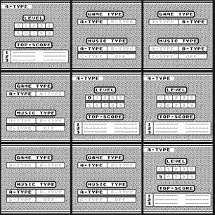

Distributed Tetris (1989)

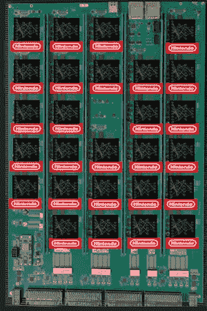

1 of 48 boards of IBM Neural Computer which was used for experiments

怎么建一个？

## 食谱

拿一把硅，倒**强化学习**知识、**超算**经验和**计算机架构**激情，然后加上汗水和泪水，最后搅拌大约 1000 小时，直到沸腾*瞧吧……*

为什么会有人想要一个呢？

## **简答**:向强人工智能迈进。

这是**更长的版本**:

**现在是 2016 年**。深度学习无处不在。图像识别可以被认为是由卷积神经网络解决的，我的研究兴趣被吸引到具有记忆和强化学习的神经网络。

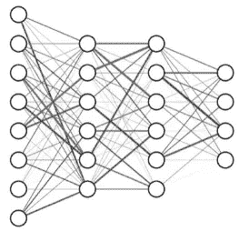

具体来说，在 *Google Deepmind* 展示的一篇论文中，已经表明使用一种叫做 *Deep Q-Neural Network* 的简单强化学习算法，在各种 Atari 2600(1977 年发布的家用游戏机)游戏上实现人类甚至超人级别的性能是可能的。所有这些都是通过观察游戏来完成的。这引起了我的注意。

 [## 通过深度强化学习实现人类水平的控制

### 一个人工智能体被开发出来，它可以直接从电脑上学习玩各种经典的 Atari 2600 电脑游戏

www.nature.com](https://www.nature.com/articles/nature14236) 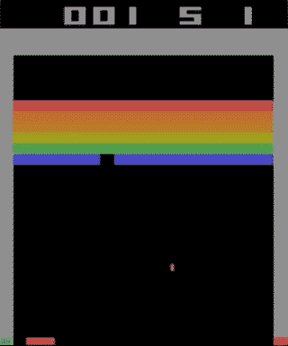

One of the Atari 2600 games, Breakout. Trained using a simple RL algorithm. After millions of iterations, the computer agent plays at a super-human level.

我开始在雅达利 2600 游戏上运行实验。虽然令人印象深刻，但《T21》并不是一个复杂的游戏。人们可以通过将你的行动(操纵杆)与结果(得分)联系起来的难度来定义复杂性。当人们需要等待很长时间才能观察到效果时，问题就出现了。

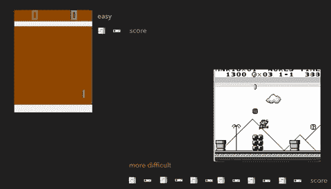

An illustration of the problem with more complex games. LEFT: Breakout (ATARI 2600) is very reactive, we get feedback very quickly; RIGHT: Mario Land (NINTENDO GAMEBOY) does not provide immediate information about consequences of an action, there can be stretches of irrelevant observations between important events

为了让学习更有效率，你可以想象尝试从简单的游戏中转移一些知识。这是目前尚未解决的问题，也是一个热门的研究课题。OpenAI 最近发布的一项挑战试图测量这一点:

 [## OpenAI 复古大赛

### OpenAI 是一家非营利性的人工智能研究公司，旨在发现和制定通往安全人工智能的道路。

contest.openai.com](https://contest.openai.com/2018-1/) 

拥有迁移学习能力不仅会使训练更快，而且我甚至认为，除非有一些先验知识，否则有些问题是无法解决的。你需要的是**数据效率。**让我们来看看波斯王子:

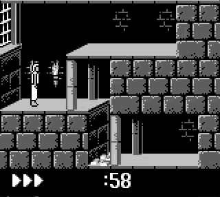

A short clip from Prince of Persia

*   没有明显的分数
*   如果不执行任何操作，需要 60 分钟才能结束游戏(动画中还剩 58 分钟)。

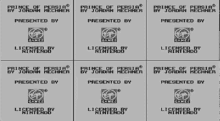

Random actions

你能尝试和 Atari 2600 论文中完全一样的方法吗？如果你想一想，你随机按键到达终点的可能性有多大？

这激励我通过解决这个问题来为社区做贡献。所以，从本质上说，这是一个先有鸡还是先有蛋的问题——你需要一个更好的算法来传递知识，但这需要很长时间的研究和实验，因为我们没有更有效的算法。

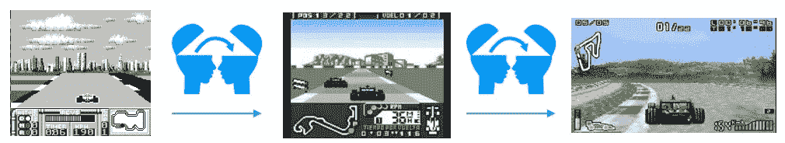

Transfer learning example: Imagine first learning a very simple game, such as the one on the lefthand side, then you preserve concepts such as ‘race’, ‘car’, ‘track’, ‘win’, and learn colors or 3D models. We say that the common concepts are ‘transferrable’ between those games. One could define similarity by the amount of transferrable knowledge between two problems. I.e. Tetris and F1 racing will not be similar.

我决定退而求其次，通过让环境变得更快来避免最初的减速。我的目标是:

*   **更快的环境**(想象你可以用 1/100 的时间完成波斯王子)同时运行 100，000 个游戏
*   **更好的研究环境**(关注问题，但不做预处理，有各种游戏)

最初，我认为性能瓶颈可能在某种程度上与模拟器代码的复杂性有关(例如 Stella 的代码库相当大，而且它依赖于 C++抽象，这对于模拟器来说不是最佳选择)。

# **控制台**

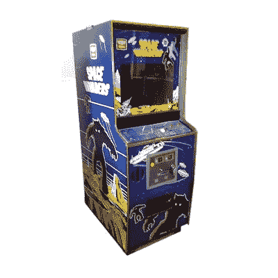

Arcade Space Invaders

总的来说，我在几个平台上工作过，从可能是有史以来最早的游戏之一(和 Pong 一起)——街机“太空入侵者”、Atari 2600、NES 和 Gameboy 开始。所有用 c 写的。

我能观察到的最大帧速率大约是 2000-3000 FPS。为了开始看到实验结果，我们需要数百万或数十亿帧，所以差距是巨大的。

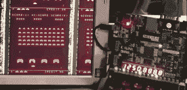

My Space Invaders running inside an FPGA — low speed debug mode, the counter in the FPGA shows clock cycles elapsed

我想——如果我们可以对这些环境进行硬件加速会怎么样。例如，最初的太空入侵者运行在 1MHz 的 8080 CPU 上。我能够在 3GHz Xeon 上模拟 40MHz 8080 CPU。还不错，但作为概念验证，一旦放入 FPGA，它就能达到 400 MHz。这意味着单个实例可以达到 24000 FPS，相当于 30GHz 的至强 CPU！我有没有提到一个可以在中间层 FPGA 中安装大约 100 个 8080 CPU 的处理器？也就是 2.4M FPS。

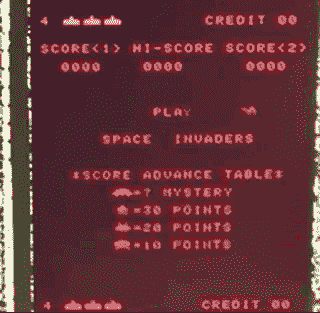

Hardware-accelerated Space Invaders, 100MHz, 1/4 of the full speed

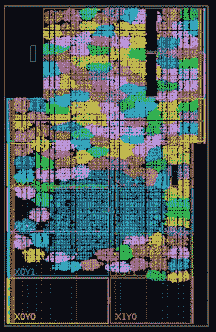

Over one hundred tiny cores inside one Xilinx Kintex 7045 FPGA (bright colors, the blue patch in the middle is shared logic for display)

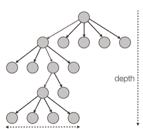

Irregular Execution Path

此时，你可能会问，GPU 呢？简而言之，你需要 MIMD 式的平行，而不是 SIMD 式的。在学生时代，我花了一些时间在 GPU 上实现蒙特卡罗树搜索(AlphaGo 中使用了 MCTS)。

[http://olab . is . s . u-Tokyo . AC . jp/~ kamil . rocki/rocki _ IP dps 11 . pdf](http://olab.is.s.u-tokyo.ac.jp/~kamil.rocki/rocki_ipdps11.pdf)

当时我花了无数个小时试图让 GPU 和其他种类的 SIMD 硬件(IBM Cell、Xeon Phi、AVX CPU)高效运行这类代码，但都失败了。几年前，我开始相信，如果我能设计出自己的硬件，来解决类似的问题，那就太好了。

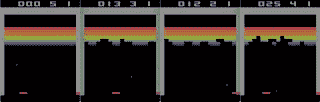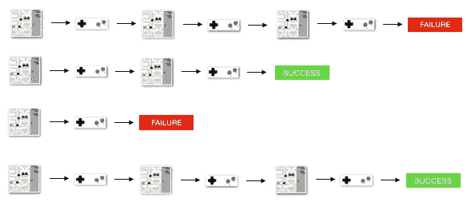

Multiple Instruction Multiple Data (MIMD) Parallellism

# 雅达利 2600，NES 还是 GAMEBOY？

总之，我用《太空入侵者》、《NES》、《2600》和《游戏男孩》实现了 8080。这里有一些事实和他们各自的优势。

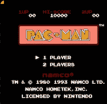

NES Pacman

太空入侵者只是一个热身。我们让它工作，但它只是一个游戏，所以它不是很有用。

Atari 2600 是强化学习研究的事实标准。CPU (MOS 6507)是著名的 6502 的简化版本，它的设计更优雅，比 8080 更高效。我没有选择 2600，只是因为我认为它在游戏和图像方面有一定的局限性。

我实现了 NES(任天堂娱乐系统)以及，它与 2600 共享 CPU。游戏比 2600 上的好多了。NES 和 2600 都受到过于复杂的图形处理管道和许多需要支持的墨盒格式的困扰。

与此同时，我重新发现了任天堂 Gameboy。这就是我一直在寻找的东西。

**game boy 为什么这么牛逼？**

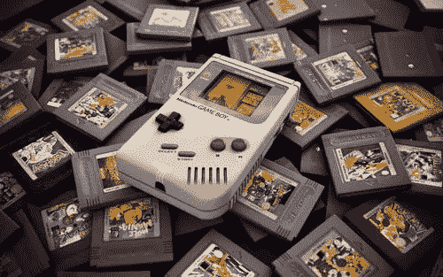

1049 Classic games + 576 for Gameboy Color

*   总共超过 1000 个游戏(经典+彩色)，范围非常广，都是高质量的，其中一些非常具有挑战性(王子)，游戏可以进行某种程度的分组，并为迁移学习和课程学习的研究分配难度(例如，有俄罗斯方块、赛车游戏、Marios 的变体)。试图解决波斯王子可能需要从其他类似的游戏中转移知识，这些游戏有明确的分数(王子没有！)

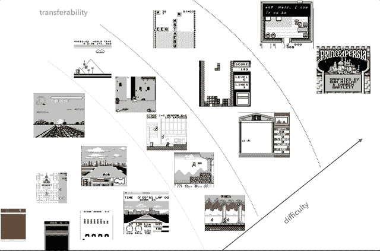

Nintendo Gameboy is my transfer learning research platform of choice. In this chart I tried to group the games and plot them according to their difficulty (subjective judgement) and their similarity (concepts such as racing, jumping, shooting, variety of Tetris games; Has anyone ever played HATRIS?).

*   Gameboy classic 有一个非常简单的屏幕(160×144 2 位颜色),这使得预处理更简单，我们可以专注于重要的事情。在 2600 的情况下，即使是简单的游戏也有各种颜色。除此之外，Gameboy 有更好的显示物体的方式，所以不需要闪烁或最多连续几帧。

IBM Boot ROM + Super Marioland

*   没有像 NES 或 2600 案件中那样疯狂的记忆地图绘制者。你可以用总共 2-3 个地图绘制者来完成大部分游戏工作。
*   它被证明是非常紧凑的，总的来说，我能够用不到 700 行代码完成 C 仿真器，用大约 500 行代码完成我的 Verilog 实现。
*   它带有与街机版相同的简单版《太空入侵者》

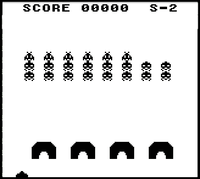

Gameboy version of Space Invaders — Basically no preprocessing needed!

这就是我 1989 年的点阵游戏机，以及在 4K 屏幕上通过 HDMI 运行的 FPGA 版本。

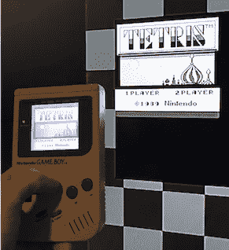

这是我以前的游戏机做不到的:

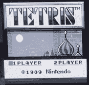

Hardware accelerated Tetris, this is a realtime screen recording at 1/4 the max speed.

# 实际有用吗？

是的，它是。到目前为止，我已经在一个简单的环境中测试过了，那里有一个外部策略网络，它与 Gameboy 的工作人员进行交互。更具体地说，我使用了分布式 A3C(优势行动者评论家)算法，我将在另一篇文章中描述这一部分。我的一个同事也将它连接到 FPGA convnet，它工作得相当好。更多将在即将到来的职位。

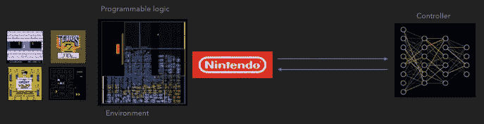

FPGA-NN communication

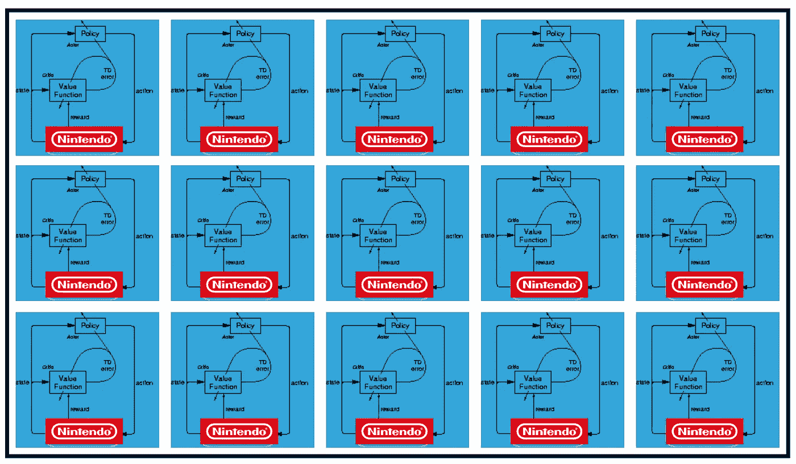

Distributed A3C setup

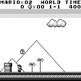

Mario land: Initial State. Pressing buttons at random does not get us far. Top right corner shows remaining time. If we get lucky and Goomba, we finish quickly as we touch Goomba. If not, it takes 400 seconds to ‘lose’.

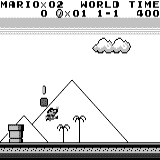

Mario land: after less than 1 hour of gameplay, Mario has learned to run, jump and even discovers a secret room by going into a pipe.

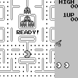

Pac Man: after about one hour of training it can even finish the entire game once (eats all dots), then the games starts all over again.

# 结论

我喜欢将未来十年视为 HPC 和 AI 最终走到一起的时期。我希望硬件有一定程度的定制允许，这取决于人工智能算法的选择。

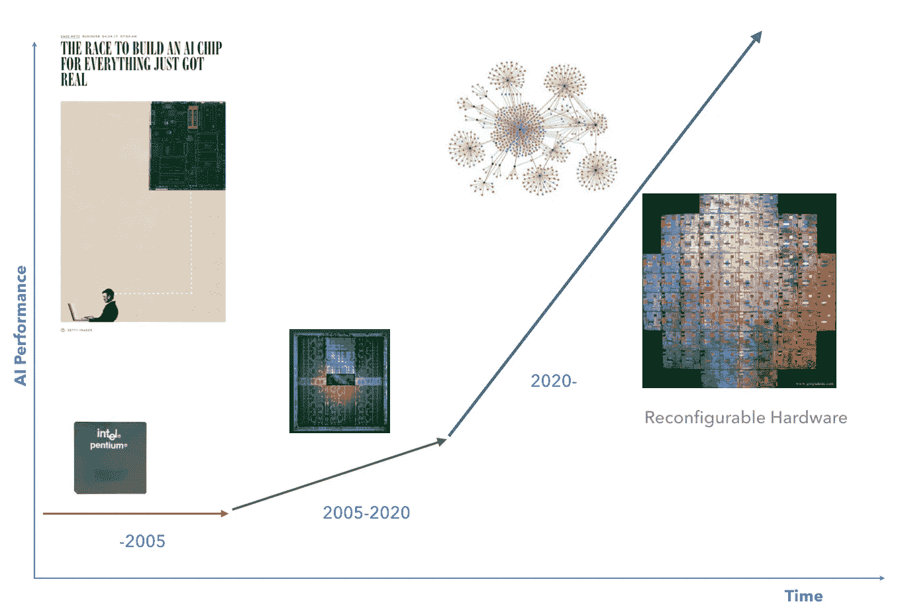

The Next Decade

这里的国标 C 码【https://github.com/krocki/gb 

# 奖金 A —调试

这一部分可能值得单独写一篇文章，但是现在，我太累了。

经常有人问我:最难的部分是什么？一切……都很痛苦。一开始就没有 gameboy 的规范。我们所知道的一切都是逆向工程的结果，我的意思是:运行一些代理任务，如游戏或任何其他片段，并观察它是否执行。这与标准的软件调试非常不同，因为在这里执行代码的硬件被调试。我必须想出一些方法来完成这个过程。我有没有提到当它运行在 100MHz 时很难看到一些东西？哦，没有指纹。

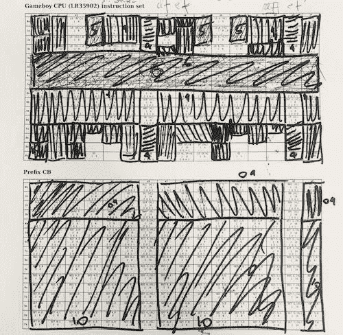

One approach to implementing the CPU is to group instructions into some clusters which do more or less the same thing. This is much easier with 6502\. LR35092 has much more `random` stuff and many edge cases. Here is the chart which I used while I worked on the Gameboy CPU. I adopted a greedy strategy of taking the largest chunk of instructions, implementing it and then crossing it out, then repeat. In this case 1/4 of the instructions are ALU, 1/4 are register loads which can be implemented relatively quickly. On the other side of the spectrum, there are some outliers such as `load from HL to SP, signed` which need to be handled separately

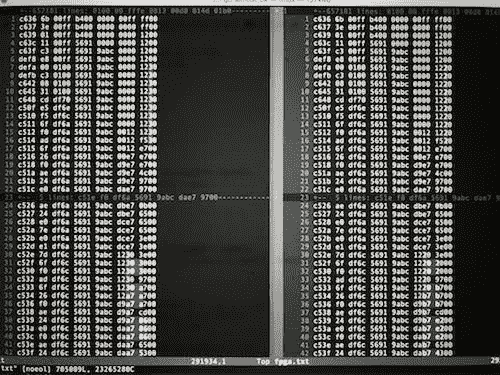

Debugging: you run a piece of code on the hardware you are debugging, record a log for your implementation and some other reference implementation (here I compared Verilog code, left vs my C emulator, right). Then you run diff on the logs to identify discrepancies (blue). One reason for using some automated way is that in many cases I found problems after millions of cycles of execution, where a single CPU flag caused a snowball effect. I tried many approaches and this seemed to be one of the most effective ones.

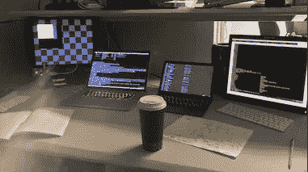

You need coffee! Lots of it.

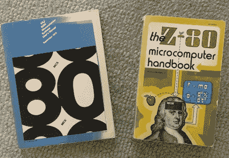

These books are 40 years old — It’s incredible to go through them and see the world of computers through the eyes of the users then. I felt like a visitor from the future.

# 奖金 B——开放式研究申请

最初我想从内存的角度来看游戏，就像 OpenAI 在这篇文章中描述的那样。

 [## 研究请求

### 关注的序列对序列模型取得了巨大的成功。他们使得神经网络成为可能…

openai.com](https://openai.com/requests-for-research/#q-learning-on-the-ram-variant-of-atari) 

> 令人惊讶的是，当输入为 RAM 状态时，让 Q-learning 正常工作具有意想不到的挑战性。
> 
> 该项目可能无法解决。如果事实证明 Q-learning 在 Atari 的 RAM 变体上永远不会成功，那将是令人惊讶的，但它有一些机会将被证明是具有挑战性的。

鉴于 Atari 游戏只使用 128B 的内存，处理这些 128B 的内存而不是整个屏幕帧是非常有吸引力的。我得到了不同的结果，所以我开始深入调查。

虽然我不能证明直接从记忆中学习是不可能的，但我可以证明，记忆捕捉游戏的整个状态的假设是错误的。Atari 2600 CPU (6507)使用 128B 的 RAM，但它也可以访问独立电路中的额外寄存器(电视接口适配器，类似于 GPU)。这些寄存器用于存储和处理关于物体的信息(桨、导弹、球、碰撞)。换句话说，当只考虑 RAM 时，这将不可用。同样，NES 和 Gameboy 有额外的寄存器用于屏幕操作和滚动。RAM 本身并不能反映游戏的完整状态。

只有 8080 以直接方式将数据存储到 VRAM 中，这将允许检索整个状态。在其他情况下,“GPU”寄存器插在 CPU 和屏幕缓冲区之间，在 RAM 之外。

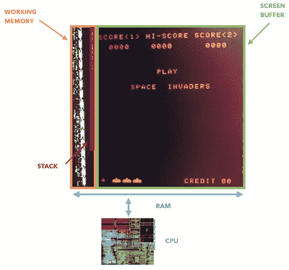

**琐事**:如果你正在研究 GPU 的历史，这可能是第一个“图形加速器”——8080 有一个外部移位寄存器，使用单个命令移动入侵者，卸载 CPU。

# 参考

 [## 我做了一个 NES 模拟器。以下是我对最初的任天堂的了解。

### 关于 NES 有趣的技术花絮…

medium.com](https://medium.com/@fogleman/i-made-an-nes-emulator-here-s-what-i-learned-about-the-original-nintendo-2e078c9b28fe)  [## 为什么我花了 1.5 个月的时间创建一个 Gameboy 模拟器？托梅克的博客

### 后来我意识到这并不完全正确——创建一个工作程序是一个相当大的挑战。同时…

博客. rekawek.eu](https://blog.rekawek.eu/2017/02/09/coffee-gb/)  [## 深度强化学习:来自像素的 Pong

### 一位计算机科学家的思考。

karpathy.github.io](http://karpathy.github.io/2016/05/31/rl/) 

还有更多…

Gameboy 和 NES 是任天堂的注册商标。

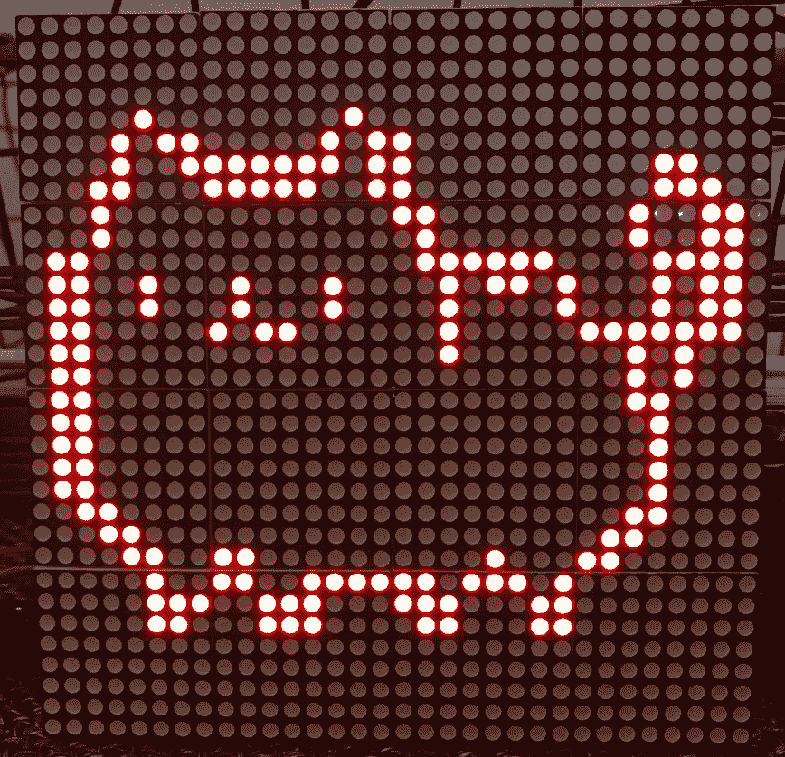

文件结束