# 购物篮分析——关联规则简介

> 原文：<https://towardsdatascience.com/a-gentle-introduction-on-market-basket-analysis-association-rules-fa4b986a40ce?source=collection_archive---------0----------------------->

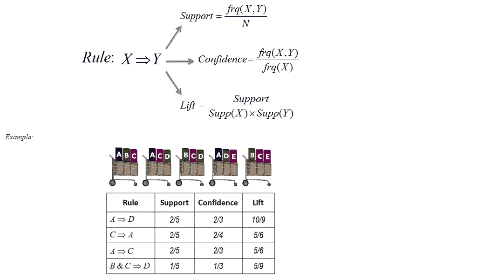

Source: UofT

## 介绍

购物篮分析是大型零售商用来发现商品之间关联的关键技术之一。它通过寻找在交易中频繁出现的项目组合来工作。换句话说，它允许零售商识别人们购买的商品之间的关系。

关联规则被广泛用于分析零售购物篮或交易数据，并且旨在基于强规则的概念，使用感兴趣的度量来识别在交易数据中发现的强规则。

**关联规则的一个例子**

*   假设有 100 个客户
*   其中 10 人买了牛奶，8 人买了黄油，6 人两样都买了。
*   买了牛奶= >买了黄油
*   支持= P(牛奶和黄油)= 6/100 = 0.06
*   信心=支持度/P(黄油)= 0.06/0.08 = 0.75
*   lift =置信度/P(牛奶)= 0.75/0.10 = 7.5

注意:这个例子非常小。在实践中，一个规则需要数百个事务的支持，才能被认为具有统计意义，数据集通常包含数千或数百万个事务。

好了，理论到此为止，让我们来看看代码。

我们今天使用的数据集来自 [UCI 机器学习库](http://archive.ics.uci.edu/ml/index.php)。该数据集被称为“在线零售”，可以在[这里](http://archive.ics.uci.edu/ml/datasets/online+retail)找到。它包含一家总部位于英国的注册在线零售商在 2010 年 1 月 12 日至 2011 年 9 月 12 日之间发生的所有交易。

## 装载包裹

```
library(tidyverse)
library(readxl)
library(knitr)
library(ggplot2)
library(lubridate)
library(arules)
library(arulesViz)
library(plyr)
```

## 数据预处理和探索

```
retail <- read_excel('Online_retail.xlsx')
retail <- retail[complete.cases(retail), ]
retail <- retail %>% mutate(Description = as.factor(Description))
retail <- retail %>% mutate(Country = as.factor(Country))
retail$Date <- as.Date(retail$InvoiceDate)
retail$Time <- format(retail$InvoiceDate,"%H:%M:%S")
retail$InvoiceNo <- as.numeric(as.character(retail$InvoiceNo))glimpse(retail)
```

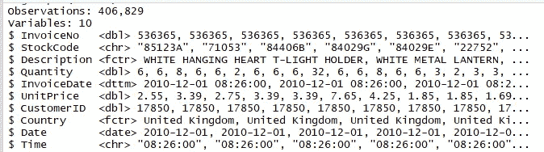

经过预处理后，数据集包括 406，829 条记录和 10 个字段:发票号、库存代码、描述、数量、发票日期、单价、客户 ID、国家、日期、时间。

人们通常在什么时候上网购物？

为了找到这个问题的答案，我们需要从时间列中提取“小时”。

```
retail$Time <- as.factor(retail$Time)
a <- hms(as.character(retail$Time))
retail$Time = hour(a)retail %>% 
  ggplot(aes(x=Time)) + 
  geom_histogram(stat="count",fill="indianred")
```

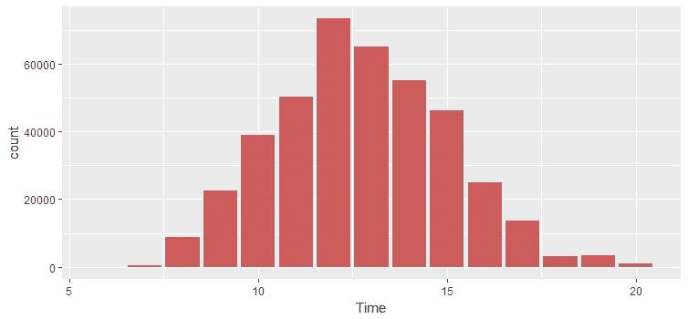

Figure 1\. Shopping time distribution

一天中的小时和订单量之间有明显的偏差。大多数订单发生在 10:00-15:00 之间。

**每位顾客购买多少件商品？**

```
detach("package:plyr", unload=TRUE)retail %>% 
  group_by(InvoiceNo) %>% 
  summarize(n_items = mean(Quantity)) %>%
  ggplot(aes(x=n_items))+
  geom_histogram(fill="indianred", bins = 100000) + 
  geom_rug()+
  coord_cartesian(xlim=c(0,80))
```

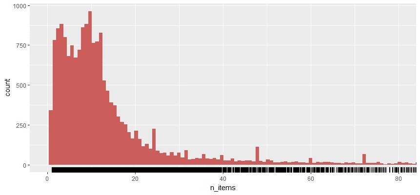

Figure 2\. Number of items per invoice distribution

大多数人购买的商品少于 10 件(每张发票少于 10 件)。

**十大畅销书**

```
tmp <- retail %>% 
  group_by(StockCode, Description) %>% 
  summarize(count = n()) %>% 
  arrange(desc(count))
tmp <- head(tmp, n=10)
tmptmp %>% 
  ggplot(aes(x=reorder(Description,count), y=count))+
  geom_bar(stat="identity",fill="indian red")+
  coord_flip()
```

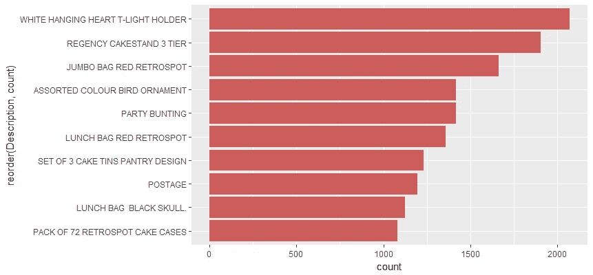

Figure 3\. Top 10 best sellers

## 在线零售商的关联规则

在使用任何规则挖掘算法之前，我们需要将数据从数据帧格式转换为事务，这样我们就可以将所有购买的商品放在一行中。例如，这是我们需要的格式:

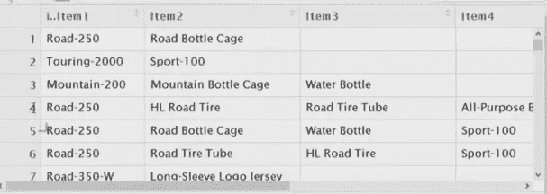

Source: Microsoft

```
retail_sorted <- retail[order(retail$CustomerID),]
library(plyr)
itemList <- ddply(retail,c("CustomerID","Date"), 
                       function(df1)paste(df1$Description, 
                       collapse = ","))
```

函数 ddply()接受一个数据帧，根据一个或多个因素将其分割成多个部分，对这些部分进行计算，然后将结果作为数据帧返回。我们用“，”来分隔不同的项目。

我们只需要项目交易，所以删除 customerID 和 Date 列。

```
itemList$CustomerID <- NULL
itemList$Date <- NULL
colnames(itemList) <- c("items")
```

将数据帧写入 csv 文件，并检查我们的事务格式是否正确。

```
write.csv(itemList,"market_basket.csv", quote = FALSE, row.names = TRUE)
```

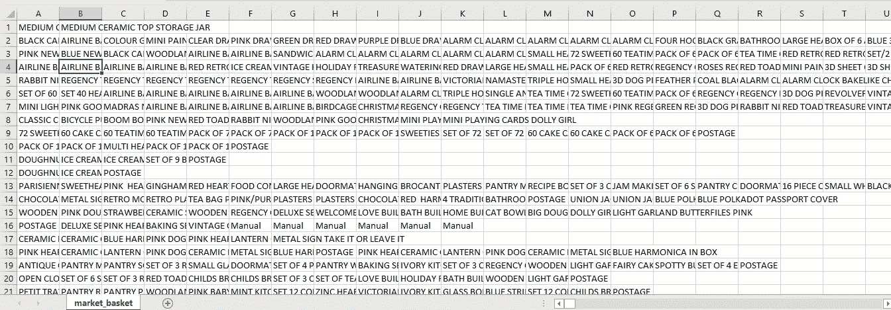

完美！现在我们有了交易数据集，它显示了一起购买的商品的矩阵。我们实际上看不到他们多久一起买一次，也看不到规则。但是我们会找到答案的。

让我们仔细看看我们有多少事务，它们是什么。

```
tr <- read.transactions('market_basket.csv', format = 'basket', sep=',')
tr
summary(tr)
```

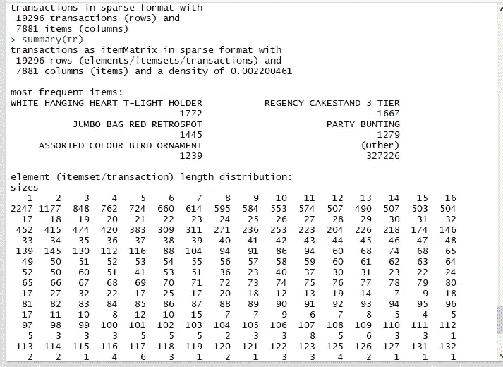

我们看到 19，296 个事务，这也是行数。有 7，881 个项目—记住项目是我们原始数据集中的产品描述。这里的事务是这 7，881 个项目的集合或子集。

总结给了我们一些有用的信息:

*   密度:稀疏矩阵中非空单元的百分比。换句话说，购买的商品总数除以矩阵中可能的商品总数。我们可以这样使用密度来计算购买了多少物品:***19296 X 7881 X 0.0022***
*   最常见的项目应该与图 3 中的结果相同。
*   看看交易的规模:2247 笔交易仅针对 1 件商品，1147 笔交易针对 2 件商品，一直到最大的交易:1 笔交易针对 420 件商品。这表明大多数顾客在每次交易中只购买少量商品。

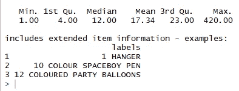

*   数据的分布是右偏的。

让我们看一下项目频率图，它应该与图 3 一致。

```
itemFrequencyPlot(tr, topN=20, type='absolute')
```

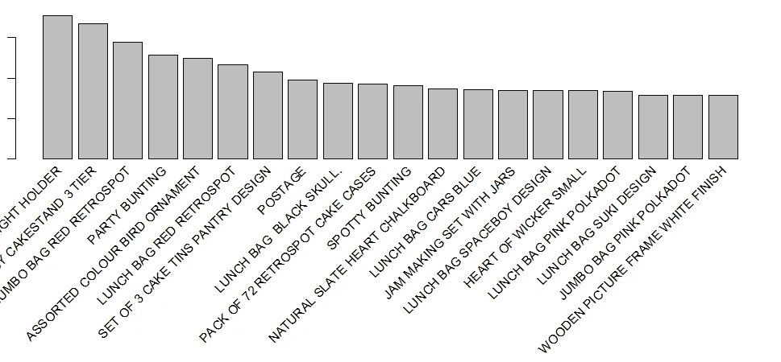

Figure 4\. A bar plot of the support of the 20 most frequent items bought.

## 创建一些规则

*   我们使用 Arules 库中的 Apriori 算法来挖掘频繁项集和关联规则。该算法对频繁项集采用逐级搜索。
*   我们通过 supp=0.001 和 conf=0.8 来返回支持度至少为 0.1%、置信度至少为 80%的所有规则。
*   我们按照置信度递减的方式对规则进行排序。
*   看一下规则的总结。

```
rules <- apriori(tr, parameter = list(supp=0.001, conf=0.8))
rules <- sort(rules, by='confidence', decreasing = TRUE)
summary(rules)
```

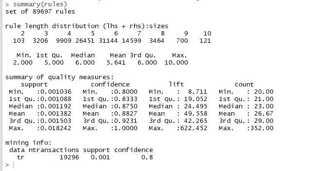

这些规则的总结给了我们一些非常有趣的信息:

*   规则数:89697。
*   按长度分布规则:长度为 6 项的规则最多。
*   质量度量的概要:支持、信心和提升的范围。
*   关于数据挖掘的信息:挖掘的数据总量，以及我们之前设置的最小参数。

我们有 89697 条规则。我不想把它们都印出来，所以我们来检查一下前 10 名。

```
inspect(rules[1:10])
```

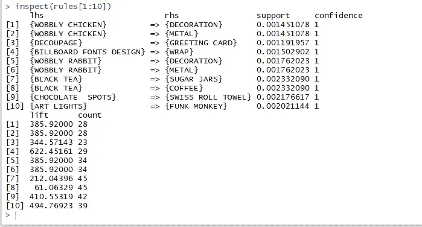

解释相当直接:

*   100%买了“晃晃悠悠的鸡”的顾客也买了“装修”。
*   买了“红茶”的顾客 100%也买了“糖罐”。

并列出这 10 条最重要的规则。

```
topRules <- rules[1:10]
plot(topRules)
```

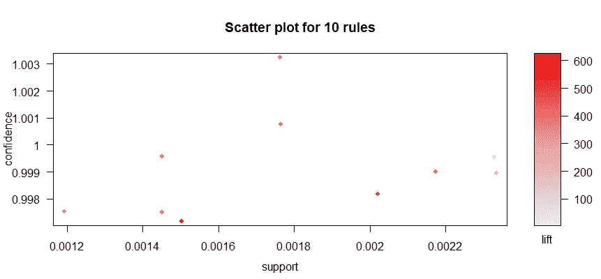

```
plot(topRules, method="graph")
```

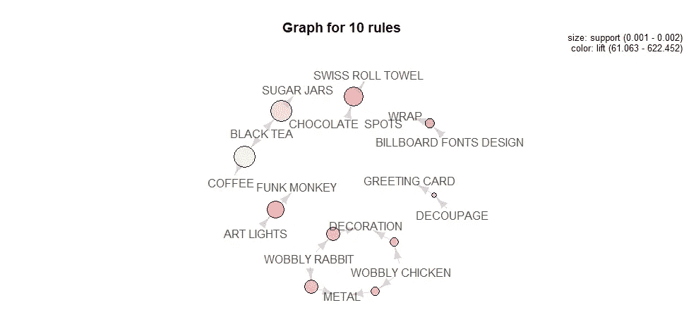

```
plot(topRules, method = "grouped")
```

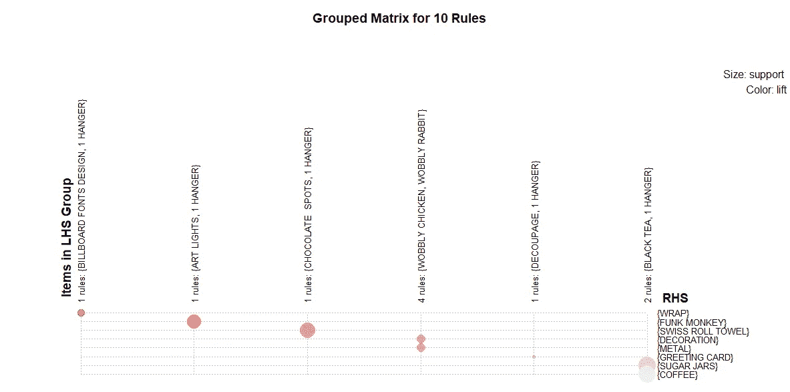

## 摘要

在这篇文章中，我们学习了如何在 R 中执行购物篮分析，以及如何解释结果。如果你想用 Python 实现它们， [Mlxtend](http://rasbt.github.io/mlxtend/) 是一个 Python 库，它实现了这类应用程序的 Apriori 算法。这里可以找到介绍教程[。](http://pbpython.com/market-basket-analysis.html)

如果你想用 R Markdown 文件来制作这篇博文，你可以在这里找到。

参考: [R 和数据挖掘](http://www.rdatamining.com/examples/association-rules)