# 用 Go 对遗传算法的简单介绍

> 原文：<https://towardsdatascience.com/a-gentle-introduction-to-genetic-algorithms-c5bc15827e2d?source=collection_archive---------5----------------------->

## 通过进化蒙娜丽莎引入遗传算法

乍一看可能不太明显，但计算机科学算法经常受到自然和生物过程的启发。这些算法包括神经网络、粒子群优化、人工蜂群、蚁群优化、进化算法等等。事实上，你可以把生物过程看作是大自然想出的解决问题的简单算法。从这个角度来看，很容易理解为什么这些算法是优化试探法和元试探法。毕竟，大自然为了生存而优化。

[试探法](https://stackoverflow.com/questions/2334225/what-is-the-difference-between-a-heuristic-and-an-algorithm)，如果你不熟悉这个术语，是通过做一些假设来试图更快解决问题的算法。因此，试探法通常不是最佳的，但在获得最佳结果需要很长时间的情况下更有用。[元启发式](https://www.researchgate.net/post/What_are_the_differences_between_heuristics_and_metaheuristics)把这带到下一个层次——它们是一种产生或发现启发式的启发式方法。

# 遗传算法

遗传算法是基于[自然选择](https://en.wikipedia.org/wiki/Natural_selection)过程的元启发式算法。遗传算法是一种进化算法。

自然选择，作为一种更新，是进化中的一个关键机制。这是一个自然过程，随着时间的推移，导致(生物)种群适应它们的环境。这些群体在特征上有所不同。具有更合适特征的个体生物在环境中生存的机会更高。从这些幸存下来的生物体中繁殖的下一代将继承它们的特征，最终产生具有这些更合适特征的种群。

然而，如果整个种群都有相同的特征，而环境改变了，种群就会灭绝。幸运的是，偶尔发生的突变会导致性状的变异，这使得具有更适合变化的环境的性状的生物体得以生存并成为主导。

一个普遍使用的例子是英国胡椒蛾的颜色变化。在 19 世纪早期之前，英格兰的胡椒蛾大多是白色的，它的颜色有助于它躲避食肉鸟类，因为它与浅色的地衣和英国树木很好地融合在一起。然而，在工业革命期间，浅色的地衣因污染而死亡，许多飞蛾栖息的树木被煤烟熏黑。这使得深色的蛾子在躲避捕食者时具有优势，而浅色的蛾子很容易被发现。到了 19 世纪中期，深色蛾子的数量增加了，到了 19 世纪末，几乎所有的胡椒蛾都是深色品种。1956 年《清洁空气法案》的影响打破了这种平衡，深色的蛾子又变得罕见了。

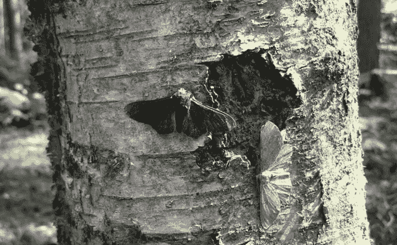

Peppered moth (credits: [https://commons.wikimedia.org/wiki/File:Lichte_en_zwarte_versie_berkenspanner_crop.jpg](https://commons.wikimedia.org/wiki/File:Lichte_en_zwarte_versie_berkenspanner_crop.jpg))

这就是自然选择。遗传算法是如何出现的？遗传算法是启发式的，使用与自然选择相同的机制——DNA、种群、变异、适应度、选择、繁殖、遗传和突变。

*   *DNA*——定义拥有一个或多个 DNA 的生物体
*   *种群*——从 DNA 基因(值)不同的生物体初始种群开始
*   *适合度* —确定每种生物对其环境的适合度
*   *选择*——选择最适合的生物，给它们更高的繁殖机会
*   *繁殖* —从选择的最适合的生物体中创造下一代种群
*   *遗传* —人口的下一代必须继承基因的值
*   *突变*——每一代人的基因值都有微小的变化

# 猴子、打字机和莎士比亚

[无限猴子定理](http://www.ietf.org/rfc/rfc2795.txt)说的是，无限数量的猴子坐在无限数量的打字机前随机敲击键盘，只要给足够的时间，最终会重现莎士比亚的全集。假设我们只想让一只猴子复制这句话:*“生存还是毁灭”。*你觉得猴子随机锤出这个要多长时间？

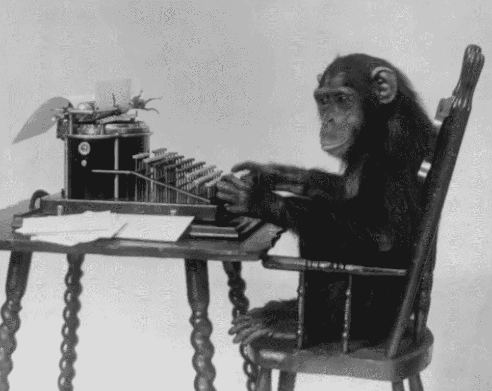

Monkeying around with Shakespeare (credits: [https://commons.wikimedia.org/wiki/File:Chimpanzee_seated_at_typewriter.jpg](https://commons.wikimedia.org/wiki/File:Chimpanzee_seated_at_typewriter.jpg))

报价有 18 个字符(包括空格)。猴子打出*【t】*(姑且说全是小盘也可以)的概率是 26 分之一。因此，键入确切序列*“生存还是毁灭”*的概率是 26 的 18 次方分之一，或者是大约 29，479，510，200，013，920，000，000，000 的 1 分之一。假设猴子每秒钟打一封信，那么在 934，789，136，225，707，600 年中，它只有 1 次机会打出这句话。这是 934 万亿年的 1 倍。

显然，这种野蛮的方式不会让我们有任何进展。如果我们尝试“改进”报价会怎么样？让我们看看如何使用遗传算法来做到这一点。下面是用于解决该问题的遗传算法的步骤:

## 定义由一个或多个 DNA 组成的有机体

我们的莎士比亚-喷算法中的一个生物体由单个 DNA 组成，它是一个字节数组和一个代表生物体适应度的数字。

```
type Organism struct {
	DNA    []byte
	Fitness float64
}
```

从最初的生物群体开始

我们需要为我们的初始种群创建有机体，所以这里有一个函数来做这件事。

```
func createOrganism(target []byte) (organism Organism) {
	ba := make([]byte, len(target))
	for i := 0; i < len(target); i++ {
		ba[i] = byte(rand.Intn(95) + 32)
	}
	organism = Organism{
		DNA:    ba,
		Fitness: 0,
	}
	organism.calcFitness(target)
	return
}
```

`target`是我们想要实现的，在这种情况下，它是字符串“生存还是毁灭”的字节数组表示。在这个函数中，我们随机创建一个与目标长度相同的字节数组，并将其设置为新创建的生物体中基因的值。

既然我们可以创造生物体，我们需要创造一个生物体群体。

```
func createPopulation(target []byte) (population []Organism) {
	population = make([]Organism, PopSize)
	for i := 0; i < PopSize; i++ {
		population[i] = createOrganism(target)
	}
	return
}
```

`population`是一组生物体，而`PopSize`是一个定义种群规模的全局变量。

## 找到生物体的适合度

我们需要计算我们种群中生物体的适合度。这在我们创造有机体时被称为早期，但在我们交叉有机体时也会被称为晚期。

```
func (d *Organism) calcFitness(target []byte) {
	score := 0
	for i := 0; i < len(d.DNA); i++ {
		if d.DNA[i] == target[i] {
			score++
		}
	}
	d.Fitness = float64(score) / float64(len(d.DNA))
	return
}
```

这个健身功能比较简单。我们简单地计算基因中的字节与目标匹配的次数。分数除以目标中的总字节数，以使适合度为一个百分比，即 0.0 到 1.0 之间的数字。这意味着如果适应度是 1.0，我们将进化生物体的基因以匹配“生存还是毁灭”的引用。

## 选择最适合的生物，给它们更高的繁殖机会

现在我们有了一个种群，我们可以找出哪些生物最适合，我们想挑选最适合的生物，让它们繁殖来创造种群的下一代。有许多不同的方法可以做到这一点，但在这种情况下，我们使用的是一种“繁殖池”机制。

```
func createPool(population []Organism, target []byte, maxFitness float64) (pool []Organism) {
	pool = make([]Organism, 0)
	// create a pool for next generation
	for i := 0; i < len(population); i++ {
		population[i].calcFitness(target)
		num := int((population[i].Fitness / maxFitness) * 100)
		for n := 0; n < num; n++ {
			pool = append(pool, population[i])
		}
	}
	return
}
```

我们所做的是创造一种繁殖池，在这里我根据生物的适合度将相同生物的多个副本放入池中。有机体的适应度越高，池中就有越多的有机体副本。

## 从所选择的最适合的生物体中创建种群的下一代

之后，我们从繁殖池中随机挑选 2 个生物体，用它们作为亲本，为种群创造下一代生物体。

```
func naturalSelection(pool []Organism, population []Organism, target []byte) []Organism {
	next := make([]Organism, len(population)) for i := 0; i < len(population); i++ {
		r1, r2 := rand.Intn(len(pool)), rand.Intn(len(pool))
		a := pool[r1]
		b := pool[r2] child := crossover(a, b)
		child.mutate()
		child.calcFitness(target) next[i] = child
	}
	return next
}
```

## 人口的下一代必须继承基因的价值

然后，下一代的`child`由两个随机挑选的生物体杂交而成，*继承了两个生物体的*DNA。

```
func crossover(d1 Organism, d2 Organism) Organism {
	child := Organism{
		DNA:    make([]byte, len(d1.DNA)),
		Fitness: 0,
	}
	mid := rand.Intn(len(d1.DNA))
	for i := 0; i < len(d1.DNA); i++ {
		if i > mid {
			child.DNA[i] = d1.DNA[i]
		} else {
			child.DNA[i] = d2.DNA[i]
		} }
	return child
}
```

对于交叉，我简单地选择了一个中点`mid`，并使用第一个生物体的第一个`mid`字节和第二个生物体的剩余字节。

## 随机变异每一代

在一个新的子有机体从两个亲代有机体中复制出来后，我们观察子有机体是否发生了突变。

```
func (d *Organism) mutate() {
	for i := 0; i < len(d.DNA); i++ {
		if rand.Float64() < MutationRate {
			d.DNA[i] = byte(rand.Intn(95) + 32)
		}
	}
}
```

这里的突变仅仅意味着确定一个随机生成的数是否低于`MutationRate`。为什么我们需要突变子生物体？如果突变从未发生，群体中的 DNA 将始终保持与原始群体相同。这意味着如果原始种群没有所需的特定基因(值),将永远无法获得最佳结果。就像在这个例子中，如果字母`t`在初始种群中根本找不到，那么无论我们经历多少代，我们都无法得出这个引用。换句话说，没有突变，自然选择就不起作用。

更专业地说，突变让我们摆脱局部最大值，以找到全局最大值。如果我们将遗传算法视为一种寻找最优解的机制，如果我们没有突变，一旦找到局部最大值，该机制将简单地停留在这一点上，而不会继续寻找全局最大值。突变可以使群体跳出局部最大值，因此为算法提供了继续寻找全局最大值的机会。

一旦我们检查了突变，我们就计算出子生物体的适应度，并将其插入到下一代种群中。

这就是遗传算法的全部内容！现在让我们把它们放在`main`函数中。

```
func main() {
	start := time.Now()
	rand.Seed(time.Now().UTC().UnixNano()) target := []byte("To be or not to be")
	population := createPopulation(target) found := false
	generation := 0
	for !found {
		generation++
		bestOrganism := getBest(population)
		fmt.Printf("\r generation: %d | %s | fitness: %2f", generation, string(bestOrganism.DNA), bestOrganism.Fitness) if bytes.Compare(bestOrganism.DNA, target) == 0 {
			found = true
		} else {
			maxFitness := bestOrganism.Fitness
			pool := createPool(population, target, maxFitness)
			population = naturalSelection(pool, population, target)
		} }
	elapsed := time.Since(start)
	fmt.Printf("\nTime taken: %s\n", elapsed)
}
```

在主函数中，我们经历了几代，每一代我们都试图找到最适合的有机体。如果最适合的生物体的基因与目标相同，我们就会找到答案。

现在运行软件程序！你花了多长时间？

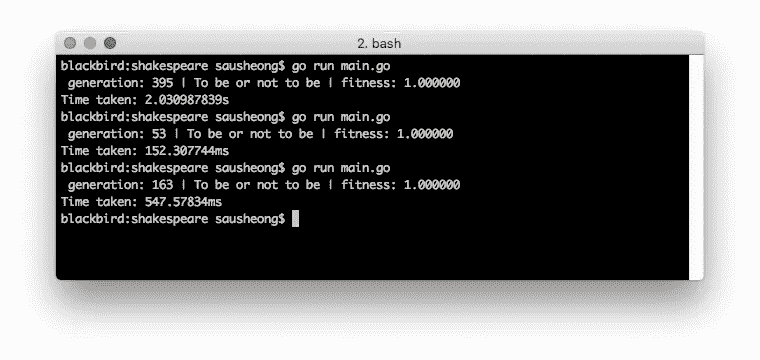

因为初始群体是随机生成的，所以每次您都会得到不同的答案，但大多数情况下，我们可以在不到一秒钟的时间内完成报价！如果我们不得不强行计算的话，这与 934 万亿年有很大的不同。

# 进化中的蒙娜丽莎

进化莎士比亚似乎很简单。毕竟只是一串。来点不同的怎么样，比如说一个图像？还是有史以来最著名的画作，达芬奇的《蒙娜丽莎》?我们能进化吗？

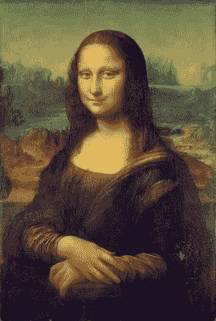

Mona Lisa (public domain)

让我们给它同样的待遇。我们将从定义生物体来代表蒙娜丽莎的照片开始。

## 定义由一个或多个 DNA 组成的有机体

我们的 DNA 不再是字节数组，而是来自`image`标准库的结构。

```
type Organism struct {
	DNA     *image.RGBA
	Fitness int64
}
```

## 从最初的生物群体开始

像以前一样，让我们先看看如何创造一个有机体。

```
func createOrganism(target *image.RGBA) (organism Organism) {
	organism = Organism{
		DNA:     createRandomImageFrom(target),
		Fitness: 0,
	}
	organism.calcFitness(target)
	return
}
```

我们不创建随机字节数组，而是调用另一个函数来创建随机图像。

```
func createRandomImageFrom(img *image.RGBA) (created *image.RGBA) {
	pix := make([]uint8, len(img.Pix))
	rand.Read(pix)
	created = &image.RGBA{
		Pix:    pix,
		Stride: img.Stride,
		Rect:   img.Rect,
	}
	return
}
```

一个`image.RGBA` struct 由一个字节数组`Pix` ( `byte`和`uint8`是一回事)、一个`Stride`和一个`Rect`组成。对我们来说重要的是`Pix`，我们使用相同的`Stride`和`Rect`作为目标图像(这是蒙娜丽莎的图像)。幸运的是，`math/rand`标准库有一个名为`Read`的方法，可以用随机字节很好地填充一个字节数组。

你可能会好奇，那么我们在这里讨论的字节数组有多大呢？`Pix`无非是用 4 个字节代表一个像素的字节数组(R，G，B，A 各用一个字节表示)。对于一个 800 x 600 的图像，我们谈论的是每个图像中有 192 万字节！为了保持程序相对较快的速度，我们将使用一个 67 x 100 大小的较小图像，它给出了一个 26，800 字节的数组。如果你到现在还没有意识到，这和我们在上一个程序中使用的 18 字节相差甚远。

此外，你可能会意识到，因为每个像素现在是随机着色的，我们最终会得到一个彩色的静态雪花图案。

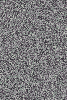

Randomly generate image

我们继续吧。

## 找到生物体的适合度

有机体的适合度是两个图像之间的差异。

```
// calculate the fitness of an organism
func (o *Organism) calcFitness(target *image.RGBA) {
	difference := diff(o.DNA, target)
	if difference == 0 {
		o.Fitness = 1
	}
	o.Fitness = difference}// find the difference between 2 images
func diff(a, b *image.RGBA) (d int64) {
	d = 0
	for i := 0; i < len(a.Pix); i++ {
		d += int64(squareDifference(a.Pix[i], b.Pix[i]))
	}
	return int64(math.Sqrt(float64(d)))
}// square the difference between 2 uint8s
func squareDifference(x, y uint8) uint64 {
	d := uint64(x) - uint64(y)
	return d * d
}
```

为了找到区别，我们可以回到勾股定理。如果你记得，我们可以找到两点之间的距离，如果我们平方`x`和`y`值的差，将它们相加，然后平方根结果。


Pythagorean theorem

给 2 个点`a` (x1，y1)和`b` (x2，y2)，`a`和`b`之间的距离`d`为:

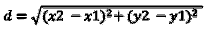

那是在二维空间。在三维空间中，我们简单地做两次勾股定理，在四维空间中，我们做三次。一个像素的 RGBA 值本质上是 4 维空间中的一个点，因此为了找出两个像素之间的差异，我们对两个像素的`r`、`g`、`b`和`a`值之间的差异求平方，将它们相加，然后对结果求平方根。

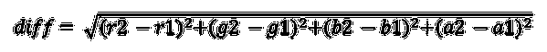

这就是 2 个像素的区别。为了找出所有像素之间的差异，我们只需将所有结果加在一起，就可以得到最终的差异。因为`Pix`本质上是一个包含连续 RGBA 值的长字节数组，所以我们可以使用一个简单的快捷方式。我们简单地平方图像和目标中每个对应字节之间的差异，然后将它们全部相加，并对最终数字求平方根，以找到两个图像之间的差异。

作为参考，如果两个图像完全相同，差异将为 0，如果两个图像完全相反，差异将为 26，800。换句话说，最适合的生物体应该具有 0 的适合度，并且数字越高，生物体越不适合。

## 选择最适合的生物，给它们更高的繁殖机会

我们仍然使用繁殖池机制，但有所不同。首先，我们将人群从最佳健康状态到最差健康状态进行排序。然后我们把最好的生物放入繁殖池。我们使用一个参数`PoolSize`来表示我们希望池中有多少最适合的生物体。

为了计算出应该把什么放入繁殖池，我们减去每一个最好的生物体，最不适合的生物体在最上面。这在最好的生物体之间产生了不同的等级，并且根据该不同的等级，我们将该生物体的相应数量的拷贝放入繁殖池中。例如，如果最适合的生物体和最不适合的生物体之间的差异是 20，我们将 20 个生物体放入育种池。

如果最适合的生物之间没有差异，这意味着种群是稳定的，我们不能真正创造一个合适的繁殖池。为了克服这一点，如果差值为 0，我们将池设置为整个群体。

```
func createPool(population []Organism, target *image.RGBA) (pool []Organism) {
	pool = make([]Organism, 0)
	// get top best fitting organisms
	sort.SliceStable(population, func(i, j int) bool {
		return population[i].Fitness < population[j].Fitness
	})
	top := population[0 : PoolSize+1]
	// if there is no difference between the top  organisms, the population is stable
	// and we can't get generate a proper breeding pool so we make the pool equal to the
	// population and reproduce the next generation
	if top[len(top)-1].Fitness-top[0].Fitness == 0 {
		pool = population
		return
	}
	// create a pool for next generation
	for i := 0; i < len(top)-1; i++ {
		num := (top[PoolSize].Fitness - top[i].Fitness)
		for n := int64(0); n < num; n++ {
			pool = append(pool, top[i])
		}
	}
	return
}
```

## 从所选择的最适合的生物体中创建种群的下一代

有了游泳池之后，我们需要创造下一代。这里自然选择的代码和前面的程序没有什么不同，所以我们在这里就不展示了。

## 人口的下一代必须继承基因的价值

`crossover`函数略有不同，因为孩子的 DNA 不是字节数组，而是 image.RGBA。实际的交叉机制在`Pix`上工作，而是像素的字节数组。

```
func crossover(d1 Organism, d2 Organism) Organism {
	pix := make([]uint8, len(d1.DNA.Pix))
	child := Organism{
		DNA: &image.RGBA{
			Pix:    pix,
			Stride: d1.DNA.Stride,
			Rect:   d1.DNA.Rect,
		},
		Fitness: 0,
	}
	mid := rand.Intn(len(d1.DNA.Pix))
	for i := 0; i < len(d1.DNA.Pix); i++ {
		if i > mid {
			child.DNA.Pix[i] = d1.DNA.Pix[i]
		} else {
			child.DNA.Pix[i] = d2.DNA.Pix[i]
		} }
	return child
}
```

## 随机变异每一代

`mutate`功能也相应不同。

```
func (o *Organism) mutate() {
	for i := 0; i < len(o.DNA.Pix); i++ {
		if rand.Float64() < MutationRate {
			o.DNA.Pix[i] = uint8(rand.Intn(255))
		}
	}
}
```

现在我们已经有了所有的东西，我们把它们放在`main`函数中。

```
func main() {
	start := time.Now()
	rand.Seed(time.Now().UTC().UnixNano())
	target := load("./ml.png")
	printImage(target.SubImage(target.Rect))
	population := createPopulation(target) found := false
	generation := 0
	for !found {
		generation++
		bestOrganism := getBest(population)
		if bestOrganism.Fitness < FitnessLimit {
			found = true
		} else {
			pool := createPool(population, target)
			population = naturalSelection(pool, population, target)
			if generation%100 == 0 {
				sofar := time.Since(start)
				fmt.Printf("\nTime taken so far: %s | generation: %d | fitness: %d | pool size: %d", 
				sofar, generation, bestOrganism.Fitness, len(pool))
				save("./evolved.png", bestOrganism.DNA)
				fmt.Println()
				printImage(bestOrganism.DNA.SubImage(bestOrganism.DNA.Rect))
			}
		}
	}
	elapsed := time.Since(start)
	fmt.Printf("\nTotal time taken: %s\n", elapsed)
}
```

现在运行它看看。你得到了什么？

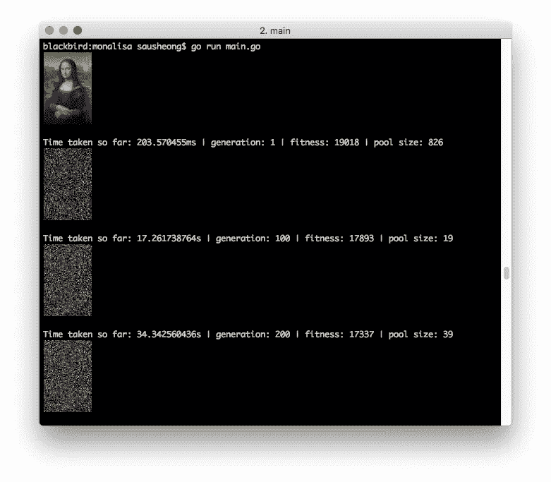

Start evolving Mona Lisa

按照我设置的参数，当我运行它时，我通常会以 19，000 左右的健身值开始。平均来说，我需要 20 多分钟才能达到低于 7500 的体能。

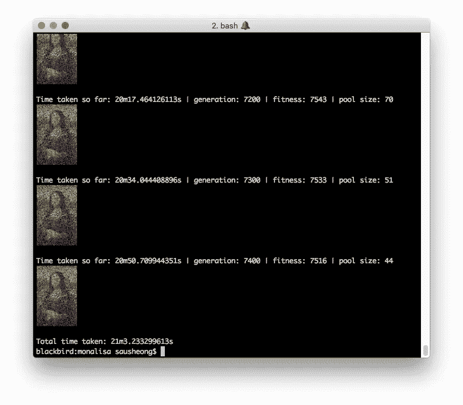

After about 20 minutes

这是一系列随着时间推移而产生的图像:

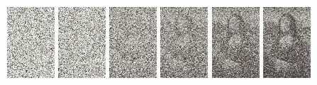

Evolving Mona Lisa

# 用圆形和三角形进化蒙娜丽莎

我通过在一张图片上画圆圈和三角形来玩《蒙娜丽莎》的演变。结果没有那么快，图像也没有那么明显，但它显示了实际发生的一瞥。你可以从资源库中找到剩下的代码，自己调整参数，看看是否能得到更好的图片，但这里有一些我得到的图片。

## 蒙娜丽莎三角形

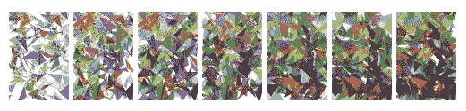

## 蒙娜丽莎的圆圈

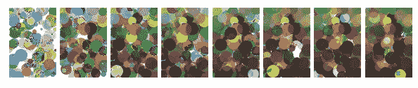

玩得开心！

# 在终端上显示图像

你可能在我的截图中注意到了，我实际上在终端上显示了图像。我本来可以创建一个 web 应用程序来展示这一点，但是我想让事情简单得多，所以我想直接在终端上显示图像。虽然终端控制台不是您通常期望显示图像的地方，但实际上有几种方法可以做到这一点。

我选了一个最简单的。我正好用了优秀的 [iTerm2](https://www.iterm2.com/) ，这是 MacOS 中默认终端应用的替代品，iTerm2 中有一个[有趣的 hack，可以显示图像](https://www.iterm2.com/documentation-images.html)。

诀窍是这样的——如果你可以用 Base64 编码你的图像，你可以用一个特殊的命令把图像打印到终端上。下面是实现这一点的 Go 代码，但是您也可以用任何其他语言实现这一点。上面的文档中有几个脚本展示了如何使用简单的 shell 脚本来实现这一点。

```
func printImage(img image.Image) {
	var buf bytes.Buffer
	png.Encode(&buf, img)
	imgBase64Str := base64.StdEncoding.EncodeToString(buf.Bytes())
	fmt.Printf("\x1b]1337;File=inline=1:%s\a\n", imgBase64Str)
}
```

不幸的是，这意味着如果你在 iTerm2 之外的任何地方运行这段代码，你将看不到图像的变化。但是，您可以随时调整输出，以便每隔几代就捕获一次输出。

# 密码

这篇文章中的所有代码和图片都可以在这里找到:[https://github.com/sausheong/ga](https://github.com/sausheong/ga)

# 参考

示例代码受到了以下工作的启发:

*   丹尼尔·席夫曼的优秀著作*代码的本质*【http://natureofcode.com】T2——这是一本很棒且容易理解的读物！我还用 Java 编写了一些丹尼尔的代码，并将其转换成莎士比亚引用算法
*   罗杰·约翰逊在《遗传编程:蒙娜丽莎的进化》一文中的出色工作*https://rogerjohansson . blog/2008/12/07/Genetic-Programming-evolution-of-Mona-Lisa/——尽管我最终使用了一种完全不同的方式来完成遗传算法，但他的原创工作给了我灵感，让我使用蒙娜丽莎，并尝试用三角形和圆形来完成它*