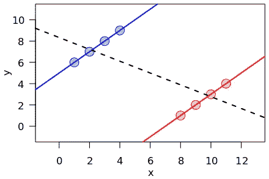
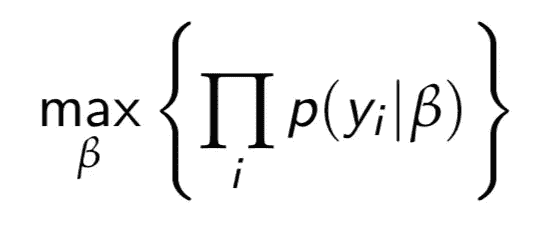
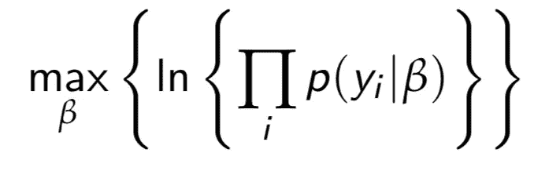
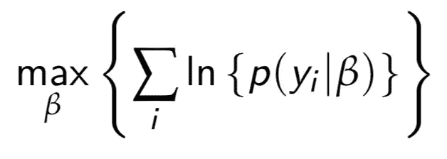
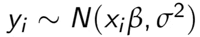
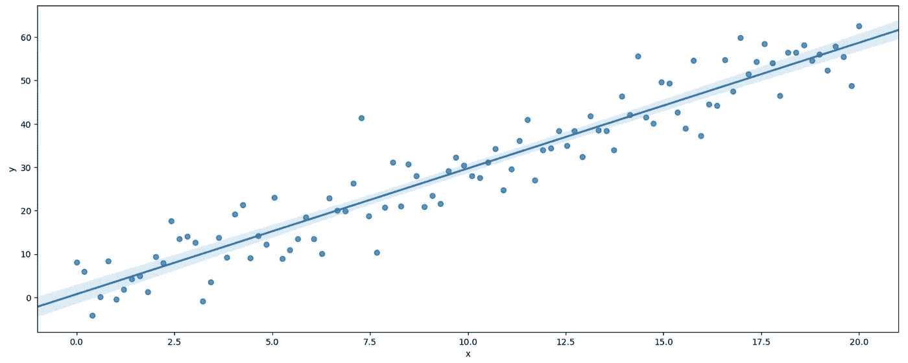
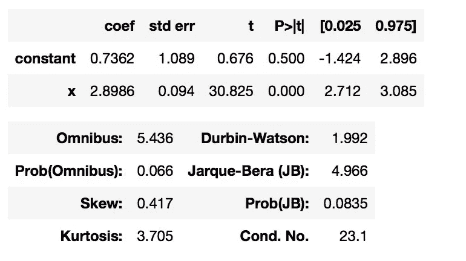

# 最大似然估计简介

> 原文：<https://towardsdatascience.com/a-gentle-introduction-to-maximum-likelihood-estimation-9fbff27ea12f?source=collection_archive---------0----------------------->

我第一次听到有人使用术语**最大似然估计**时，我去了谷歌，并找出了它的意思。然后我去[维基百科](https://en.wikipedia.org/wiki/Maximum_likelihood_estimation)了解它真正的意思。我得到了这个:

> 在统计学中，**最大似然估计** ( **MLE** )是一种[估计](https://en.wikipedia.org/wiki/Estimator)[统计模型](https://en.wikipedia.org/wiki/Statistical_model)给定观测值的[参数](https://en.wikipedia.org/wiki/Statistical_parameter)的方法，通过寻找使给定参数下进行观测的[似然](https://en.wikipedia.org/wiki/Likelihood)最大化的参数值。MLE 可以被视为[最大后验概率估计](https://en.wikipedia.org/wiki/Maximum_a_posteriori_estimation) (MAP)的特殊情况，其假设参数的[均匀](https://en.wikipedia.org/wiki/Uniform_distribution_(continuous)) [先验分布](https://en.wikipedia.org/wiki/Prior_probability)，或者被视为忽略先验分布的 MAP 的变体，因此其[不规则](https://en.wikipedia.org/wiki/Regularization_(mathematics))。

*好吗？？*

为了避免你为理解 MLE 并将其融入你的数据科学工作流程、理念和项目而绞尽脑汁，我编辑了这个指南。下面，我们将:

*   将概率上下文设置为 MLE
*   钻研所需的数学
*   看看 MLE 在 Python 中是如何工作的
*   利用 MLE 探索数据科学的最佳实践

不过先来点 [xkcd](https://xkcd.com) :

# [**常客 vs .贝叶斯**](https://xkcd.com/1132/)


这很有趣(如果你遵循这个奇怪的幽默领域)，而且这两个阵营之间的差异基本上是正确的。不要介意我们的太阳进入新星并不是一个真正可重复的实验——抱歉，常客们！—我们可以概括为，对于真实的观察和研究，两个阵营通常会得出类似的结论，但当研究设计或数据开始变得棘手时，就会有很大的不同。

简而言之，MLE 帮助我们回答了这个问题:

> 哪些参数/系数最适合我的模型？

有趣的是，你可以用这两种观点中的任何一种来解释 MLE 为什么有效！因为，虽然最大似然估计给出了一个现场估计——这在 frequentist 输出中很常见——但它可以被视为[最大后验概率](https://en.wikipedia.org/wiki/Maximum_a_posteriori_estimation) (MAP)估计的一个特例，在这里我们使用了一个天真的先验知识，并且从不费心去更新它。

# 设置我们的问题

今天为了接近 MLE，让我们从贝叶斯的角度出发，使用[贝叶斯定理](https://www.bayestheorem.net)将我们的问题框定如下:

```
P(β∣y) = P(y∣β) x P(β) / P(y)
```

或者，用英语说:

```
posterior = likelihood x prior / evidence
```

我们可以有效地忽略`prior`和`evidence`,因为——给定均匀先验分布的 Wiki 定义——所有系数值都是同等可能的。而且所有数据值的概率(假设连续)都是相等的，而且基本上为零。

所以，在实际的英语中:给定一些特定系数的概率，我看到一些结果，涉及到以完全相反的方式提出问题。这很有帮助，因为这个问题更容易解决。

## 概率和可能性

从今以后，我们将在代码中引入可能性的概念，或`L`。为了理解其中的区别，我将从 Randy Gallistel 的[精彩文章](https://www.psychologicalscience.org/observer/bayes-for-beginners-probability-and-likelihood)中摘录:

> 概率和可能性之间的区别是非常重要的:概率与可能的结果相联系；可能性附属于假设。
> 
> 可能的结果是互斥的和穷尽的。假设我们让一个受试者预测 10 次投掷硬币的结果。只有 11 个可能的结果(0 到 10 个正确的预测)。实际的结果总是一个又一个可能的结果。因此，可能结果的概率总和必须为 1。
> 
> 与结果不同，假设既不是互斥的，也不是穷尽的。假设我们测试的第一个对象正确预测了 10 个结果中的 7 个。我可能会假设受试者只是猜测，你可能会假设受试者*可能*有某种千里眼，你的意思是受试者可能被期望以稍高于概率的长期正确预测结果。这些是不同的假设，但并不互相排斥，因为你说“*可能*是”的时候就对冲了。你因此允许你的假设包括我的。用专业术语来说，我的假设嵌套在你的假设中。其他人可能会假设受试者有很强的透视能力，观察到的结果低估了她下一次预测正确的可能性。另一个人可以假设一些完全不同的东西。人们可以接受的假设是无限的。
> 
> 我们赋予可能性的一系列假设受到我们虚构它们的能力的限制。实际上，我们很少能确信我们已经设想了所有可能的假设。我们关心的是估计实验结果在多大程度上影响我们和其他人目前所接受的假设的相对可能性。因为我们通常不考虑所有的替代假设，而且因为一些假设嵌套在其他假设中，我们附加到假设上的可能性本身没有任何意义；只有相对可能性——也就是两个可能性的比率——才有意义。

太神奇了！谢谢你兰迪。

MLE 是频率主义者，但可以从贝叶斯的角度出发:

*   常客可以声称 MLE，因为它是一个**逐点估计**(不是一个分布)，并且它假设**没有先验分布**(技术上，不知情或一致)。
*   此外，MLE 没有给出真实参数值的 95%概率区域。
*   然而，最大似然法是一种特殊形式的映射，并且使用了似然的概念，这是贝叶斯哲学的核心。

当心天真或一致的先验假设！！您可能会将数据错误地归因于一个极不可能的模型。你可能会成为辛普森悖论的受害者，如下图。你很容易被小样本欺骗。



Simpson’s Paradox

以上都是常客和数据科学家必须处理或意识到的问题，所以 MLE 没有什么本质上更糟糕的。

## 回到我们的问题

所以如果`p(y|*β*)`相当于 `L(*β*|y)`，那么`p(y_1,y_2,...,y_n|*β*)`相当于`L(*β*|y_1,y_2,...,y_n)`。另外，请记住，我们可以将独立概率相乘，就像这样:

`p(A,B) = p(A)p(B)`

我们越来越近了！这是我们当前的设置:

`L(*β*|y1,y2,…,yn) = p(y1|*β*)p(y2|*β*),…,p(yn|*β*) = ∏p(yi|*β*)`

右边的部分看起来像是我们可以最大化的东西:



Initial Cost Function

但是我们可以做得更好！用自然对数把我们的积函数变成和函数怎么样？日志是[单调变换](https://en.wikipedia.org/wiki/Monotonic_function)，所以我们将简化我们的计算，但保持我们的最佳结果。



Halfway there!

我们最终的成本函数如下所示:



Ready to roll!

为了简单起见，让我们假设我们有一个回归问题，所以我们的结果是连续的。最大似然法对于离散结果的分类问题非常有效，但是我们必须使用不同的分布函数，这取决于我们有多少个类，等等。

现在，记住普通最小二乘法(OLS)等模型的一个中心假设是残差正态分布在均值零附近，我们拟合的 OLS 模型实际上成为了最大期望值`y`的体现。而我们的概率分布是… [正态](http://mathworld.wolfram.com/NormalDistribution.html)！



y is normally distributed around our ŷ

因为计算机在计算概率方面比我们好得多，所以我们将从这里转向 Python！

# Python 中的 MLE

在您的数据科学建模管道中实现 MLE 可能非常简单，有多种方法。下面是一个你可以偷着开始的方法。

## 设置

如果导入正确的包，MLE 很容易:

```
# import libraries
import numpy as np, pandas as pd
from matplotlib import pyplot as plt
import seaborn as sns
from scipy.optimize import minimize
import scipy.stats as statsimport pymc3 as pm3
import numdifftools as ndt
import statsmodels.api as sm
from statsmodels.base.model import GenericLikelihoodModel
%matplotlib inline
```

在此基础上，我们将生成遵循围绕基本事实函数的正态分布误差的数据:

```
# generate data
N = 100
x = np.linspace(0,20,N)
ϵ = np.random.normal(loc = 0.0, scale = 5.0, size = N)
y = 3*x + ϵdf = pd.DataFrame({‘y’:y, ‘x’:x})
df[‘constant’] = 1
```

最后，让我们使用 Seaborn 的 [regplot](https://seaborn.pydata.org/generated/seaborn.regplot.html) 进行可视化:

```
# plot
sns.regplot(df.x, df.y);
```

我得到了下面的，你应该看到类似的东西。但是，请记住这里有随机性，我们没有使用种子:



Scatter plot with OLS line and confidence intervals

## 使用 Statsmodels 为 OLS 建模

由于我们创建了类似回归的连续数据，我们将使用`sm.OLS`来计算最佳系数和对数似然(ll)作为基准。

```
# split features and target
X = df[[‘constant’, ‘x’]]# fit model and summarize
sm.OLS(y,X).fit().summary()
```

我得到这个，并将记录拟合模型的系数:



注意`constant`接近于零，对于我们使用的地面真实发生器，特征`x`的`beta`接近于 3。

## 最大化 LL 以求解最佳系数

从这里开始，我们将使用软件包和自定义函数的组合，看看我们是否可以使用 MLE 方法计算相同的 OLS 结果。

因为`scipy.optimize`只有一个`minimize`方法，我们将最小化对数似然的负值。这甚至是他们推荐的[！数学欺骗通常比重新发明轮子更快更容易！](https://docs.scipy.org/doc/scipy/reference/tutorial/optimize.html)

我们可以构建一个简单的函数，一次完成回归输出的所有工作:

```
# define likelihood function
def MLERegression(params):
 intercept, beta, sd = params[0], params[1], params[2] # inputs are guesses at our parameters
 yhat = intercept + beta*x # predictions# next, we flip the Bayesian question
# compute PDF of observed values normally distributed around mean (yhat)
# with a standard deviation of sd
 negLL = -np.sum( stats.norm.logpdf(y, loc=yhat, scale=sd) )# return negative LL
 return(negLL)
```

现在我们有了一个成本函数，让我们初始化并最小化它:

```
# let’s start with some random coefficient guesses and optimize
guess = np.array([5,5,2])results = minimize(MLERegression, guess, method = ‘Nelder-Mead’, 
 options={‘disp’: True})--------------------------------------------------------------------
Optimization terminated successfully.
         Current function value: 311.060386
         Iterations: 111
         Function evaluations: 195
```

让我们来看看结果:

```
results # this gives us verbosity around our minimization
# notice our final key and associated values…--------------------------------------------------------------------
final_simplex: (array([[0.45115297, 3.03667376, 4.86925122],
       [0.45123459, 3.03666955, 4.86924261],
       [0.45116379, 3.03667852, 4.86921688],
       [0.45119056, 3.03666796, 4.8692127 ]]), array([300.18758478, 300.18758478, 300.18758478, 300.18758479]))
           fun: 300.18758477994425
       message: 'Optimization terminated successfully.'
          nfev: 148
           nit: 80
        status: 0
       success: True
             x: array([0.45115297, 3.03667376, 4.86925122])
```

我们可以进一步清理:

```
# drop results into df and round to match statsmodels
resultsdf = pd.DataFrame({'coef':results['x']})
resultsdf.index=['constant','x','sigma']   
np.round(resultsdf.head(2), 4)# do our numbers match the OLS model?
--------------------------------------------------------------------
```

你会注意到 OLS 和我很相配！你的结果会有所不同，因为我们没有使用随机种子。

# MLE 的最佳实践

在我们更进一步之前，这可能是一个加强我们对 MLE 信任的好时机。作为我们的回归基线，我们知道，根据定义，普通最小二乘法是具有正态分布残差并满足线性回归的其他假设的连续结果的最佳线性无偏估计量。使用最大似然法来寻找我们的系数是否稳健？

## *是的！*

*   MLE 与 OLS 一致。
*   对于无限的数据，它将估计最佳的 *β，并很好地近似它*用于小而健壮的数据集。
*   MLE 是高效的；没有一致的估计量具有比 MLE 更低的渐近均方误差。

所以看起来它完全复制了 OLS 的做法。那么…为什么用 MLE 而不是 OLS？

## 因为！

*   MLE 对于回归和分类是可推广的！
*   MLE 是高效的；如果你使用正确的分布，没有一致的估计比 MLE 有更低的渐近误差。

我们可以将 MLE 视为通过优化概率成本函数来拟合模型的模块化方式！

## 应用 MLE 的四个主要步骤:

1.  定义可能性，确保您对回归或分类问题使用正确的分布。
2.  取自然对数，将乘积函数简化为和函数。
3.  最大化——或最小化目标函数的负值。
4.  验证制服前科是一个安全的假设！否则，你可以将数据归因于一个生成函数或世界模型，它不符合[简约法则](https://en.wikipedia.org/wiki/Occam%27s_razor)。

在最大似然估计空间中有更多的东西，包括分类分布，使用贝叶斯统计软件包如`PyMC3`等。但是今天我们就讲到这里。

您如何在数据科学工作流程中使用 MLE？在下面评论，或者在 [LinkedIn](https://www.linkedin.com/in/jbalaban/) 或者 [Twitter](https://twitter.com/ultimetis) 上联系我！

*特别感谢* [*查德·谢勒*](https://www.linkedin.com/in/chadscherrer/) *的优秀同行点评。*