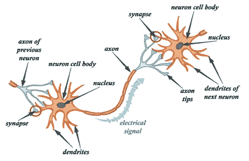
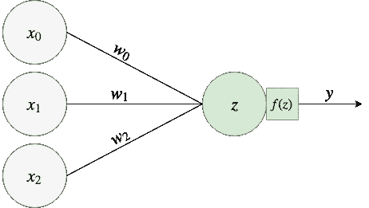
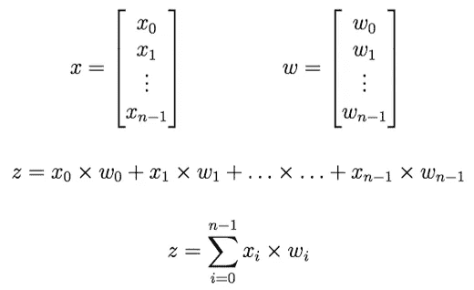
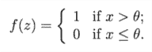

# 神经网络简介

> 原文：<https://towardsdatascience.com/a-gentle-introduction-to-neural-networks-14e5c02bafe?source=collection_archive---------16----------------------->

## [神经网络系列](https://towardsdatascience.com/tagged/neural-networks-series)

## 神经网络系列—第 0 章

## 序言注释

这个故事是我正在创作的关于神经网络的新系列的第一部分。作为一名前研究人员，我喜欢让自己跟上研究领域的最新发展，我也喜欢写作。我最近一直在努力做到这一点，直到我想到了一个主意:如果我强迫自己通过写作来强迫自己阅读和调查更多的东西，会怎么样？所以我想出了这个从零开始的想法，深入研究神经网络领域的历史，从基础直到今天应用的复杂的神经网络架构。这个系列对我个人来说有两个挑战:填补知识上的空白(我很确定我不是什么都知道)，以及确保我可以开始一个想法并坚持到底而不放弃。

我决定将这一章命名为第 0 章，因为在这篇文章中，我将只解释该领域的最初历史步骤，为什么神经网络存在，它们用于什么，以及神经生物学和计算机科学之间的桥梁是什么。

## 神经网络

神经网络是一种人工智能[连接主义](https://en.wikipedia.org/wiki/Connectionism)方法，能够学习如何执行模式识别或过程控制任务，而无需显式编程。神经网络应用的一些例子可以是(1) [控制房间的温度](http://www.sysecol2.ethz.ch/OptiControl/LiteratureOC/Ruan_06_EB_inPress.pdf)，(2) [识别图片/视频中的人脸](http://cis.csuohio.edu/~sschung/CIS660/DeepFaceRecognition_parkhi15.pdf)，(3) [生成文本序列](https://www.cs.utoronto.ca/~ilya/pubs/2011/LANG-RNN.pdf)。它们受到我们大脑工作方式的启发，通过连接和引起多个基本实体之间的交互来实现最终目标。这些实体被称为神经元(根据这些算法和我们大脑工作方式之间的整体相似性)。神经元可以与其他神经元相互作用，这取决于它们相互连接的方式以及它们的连接有多强。

## 这个过程是如何从生物学转化到计算机科学的？

从生物学上讲，神经元由 3 个主要部分组成:树突、核/细胞体和轴突。其完整结构如图 1 所示。

Figure 1: Structure of a neuron. Image taken from [this lifehacker article](https://lifehacker.com/the-science-of-practice-what-happens-when-you-learn-a-510255025)

树突以电脉冲的形式接收来自其他神经元的信息。细胞体是接收和处理来自树突的信息的地方。这种处理的结果然后通过轴突传导，直到它到达末端(突触)。然后，信息通过一个称为突触过程的化学过程传递给另一个树突神经元。在整个人类生活中，许多神经元被创建和死亡，神经元之间的许多连接被创建，而其他连接则不复存在(这是一种过于简化的说法，但它让你了解了我们大脑的动态)。

根据[赫布边理论](https://en.wikipedia.org/wiki/Hebbian_theory)，当它们之间的突触过程重复发生时，这些连接的强度会更大。换句话说，两个神经元一起放电越多，它们之间的联系就越强。另一方面，如果两个神经元从未一起被激发，它们的连接就会变弱。这条规则被称为**赫布规则**。

一些人认为赫布法则是经典条件作用的一种形式[(也称为巴甫洛夫学习)。经典条件反射是一种应用于刺激的联想学习形式。这个想法是将两种刺激联系在一起，这样它们就可以共享相同的反应。在巴甫洛夫的实验中，以他的名字命名这个概念的人，他训练他的狗，给它们食物，同时按铃。因为一旦给了狗食物，狗就会开始分泌唾液，在重复这个食物-铃的联系相当多的次数后，他的狗一听到铃响就开始分泌唾液。赫比学习也是如此:如果代表'*获取食物'*的最终神经元与流涎反应相关，并且如果'*听觉铃*'神经元和'*获取食物*'神经元之间的连接受到刺激，从而变得更强，那么在某个点激发'*听觉铃*'神经元就足以引起相同的流涎反应。](https://en.wikipedia.org/wiki/Classical_conditioning)

1943 年，麦卡洛克和皮茨提出了一个数学模型，能够捕捉神经元的这些生物特征。图 2 描述了神经元的这种数学模型的模式。这个被称为**麦卡洛克-皮茨神经元**。

Figure 2: Schema of the McCulloch-Pitts neuron

麦卡洛克-皮茨神经元有三个组成部分:

*   **一组加权输入**(*x*和 *w* )。它们分别代表输入和连接强度。赫布规则是关于刺激或减弱神经元之间的连接，取决于它对两个神经元一起放电的重要性。 *w* 的角色就是这个意思:描述关系的优势。它们被称为权重，因为它们量化了连接的权重。 *x* 映射到从突触中一个神经元的轴突末端传递到其他神经元的树突的输入。
*   **一个加法器**(即 *z* )。这代表负责将所有输入信号整理和聚集成统一电脉冲的核/细胞体，该电脉冲稍后将沿着轴突传输。用数学术语来说，麦卡洛克和皮茨将这种聚合转化为输入( *x* )和权重( *w* )之间的点积。但这意味着什么呢？让我们使用图 2 中的例子。向量 *x* 由 *x₀* 、 *x₁* 、 *x* ₂组成，而向量 *w* 具有元素 *w₀* 、 *w₁* 、 *w* ₂ *。*那么 x 和 w 的点积就是:*x₀×w₀*﹢*x₁×w₁*﹢*x*₂*×w*₂.让我们用数学符号将这个逻辑形式化。

*   **一个激活功能**(*f(z)*块)。激活功能的作用是决定整理后的信号的输出，并基于整理后的信号检查神经元是否应该触发。神经元的这一部分是一个数学函数，它抓取 *z* 并基于该函数计算输出 *y* 。麦卡洛克和皮茨提出的方法是阈值函数。基本上定义一个阈值电平𝜃，如果 z 大于𝜃，输出将是 *1* ，否则输出将是 *0* 。

让我们尝试一个端到端的例子。想象你有一个神经元，它有输入: *x₀﹦2* ， *x₁﹦-0.75* ， *x* ₂﹦ *2* ，还有权重 *w₀﹦-1* ， *w₁﹦-1* ， *w* ₂﹦ *1* 。所以，要做的第一件事就是计算 z。根据之前定义的方程，*z*﹦*2×(-1)*﹢(*-0.75)×(-1)*﹢*2×1*﹦*0.75*。最后一步是计算激活函数 *f(z)* 。例如，让我们假设一个𝜃﹦为 0 的阈值函数。因为 *0.75* > *0* 我们的输出会是 *1* 。

我已经解释了最基本的神经网络是如何工作的。但真的是全部吗？你现在已经理解了网络如何基于外部输入或来自环境的传感器来计算其输出/预测/结果，但是在这个解释中描述的学习过程在哪里呢？答案是:无处！神经网络学习的方式是通过找到向量 *w* 的正确值，这些值将增加网络根据提供的输入正确猜测答案的次数。向量 *w* 在很大程度上是神经网络中的“内部”,因此尝试不同的值是我们可以用来训练网络的。那么这些权重 *w* 如何修改才能提高网络质量呢？我将在我的下一章:感知机网络中谈论这个。敬请期待！

感谢阅读！你喜欢这篇文章吗？非常感谢你的反馈，🗣。你可以随时在 [**Twitter**](https://twitter.com/adrianovinhas) 或 [**LinkedIn**](https://www.linkedin.com/in/adrianovinhas/) 上联系我，或者如果你对下一章的最新消息感兴趣，就在 Medium 上关注我😀。

一些相关阅读:

*   【1】[神经网络简介、优势及应用](/introduction-to-neural-networks-advantages-and-applications-96851bd1a207)作者[Jahnavi Mahanta](https://medium.com/u/17a6dbe78d34?source=post_page-----14e5c02bafe--------------------------------)；
*   【2】[神经网络简介](https://medium.com/@johnolafenwa/introduction-to-neural-networks-ca7eab1d27d7)作者[约翰·奥拉芬瓦](https://medium.com/u/90303d006c1a?source=post_page-----14e5c02bafe--------------------------------)；
*   [3] [对神经网络的可视化介绍](/a-visual-introduction-to-neural-networks-68586b0b733b)作者[shik har Sharma](https://medium.com/u/9947e090b1d1?source=post_page-----14e5c02bafe--------------------------------)；
*   [4] [人工神经网络——简介](https://medium.com/@tharanignanasegaram/artificial-neural-network-a-brief-introduction-572d462666f1)作者 [Tharani Gnanasegaram](https://medium.com/u/faf652cfc457?source=post_page-----14e5c02bafe--------------------------------) 。
*   【5】[麦卡洛克-皮茨神经元——人类第一个生物神经元的数学模型](/mcculloch-pitts-model-5fdf65ac5dd1)作者[阿克谢·钱德拉·拉甘杜拉](https://medium.com/u/202534492f47?source=post_page-----14e5c02bafe--------------------------------)