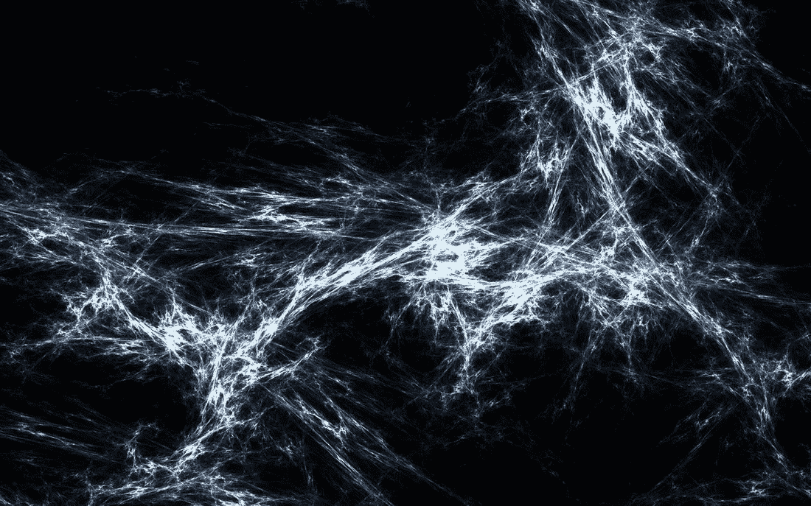
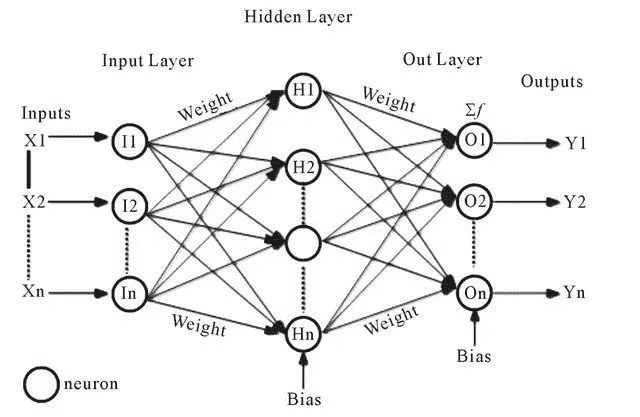
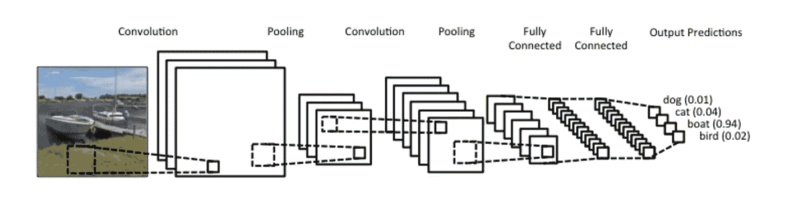

# 神经网络系列简介—第 1 部分

> 原文：<https://towardsdatascience.com/a-gentle-introduction-to-neural-networks-series-part-1-2b90b87795bc?source=collection_archive---------1----------------------->

*神经网络系列简介(GINNS)。*

# 介绍

神经网络和深度学习是计算机科学和技术行业的重要话题，它们目前为图像识别、语音识别和自然语言处理中的许多问题提供了最佳解决方案。最近，许多论文发表了人工智能，它可以学习绘画，建立 3D 模型，创建用户界面(pix2code)，有些可以根据一个句子创建图像，还有许多令人难以置信的事情正在使用神经网络进行日常工作。

我正在撰写这一系列关于神经网络和深度学习的帖子，我将指导您学习人工神经网络(ANN)的基本概念，向您展示从简单网络模拟与门到使用卷积神经网络(CNN)、递归神经网络(RNN)等解决图像识别任务的示例。代码将始终用 python 编写，有时会借助 Tensorflow(我不期望您是使用 Tensorflow 的专家，因为我将尝试详细解释代码)。

# **议程**

*   **神经网络导论(本帖)**
*   *与门神经网络(感知器)和异或门前馈神经网络(2 层)。*
*   *使用 CNN 进行首次数字识别*
*   *用 RNN 识别第一位数字*

# 神经网络

神经网络，更确切地说是“人工”神经网络(ANN)的定义是由第一台神经计算机的发明者 Robert Hecht-Nielsen 博士提出的。他将神经网络定义为:

> "...由许多简单、高度互联的处理元件组成的计算系统，这些元件通过对外部输入的动态响应来处理信息

或者，你也可以将人工神经网络视为计算模型，它是受人脑中生物神经网络处理信息的方式的启发。

# 生物动机和联系

大脑的基本计算单元是一个神经元。在人类神经系统中可以找到大约 860 亿个神经元，它们与大约 10 个⁴-10 个⁵ **突触**相连。下图显示了一个生物神经元(左)和一个常见数学模型(右)的卡通图。

biological neuron (left) and a common mathematical model (right)

神经网络中的基本计算单元是神经元，通常称为节点或单元。它接收来自其他节点或外部源的输入，并计算输出。每个输入都有一个相关的
权重(w ),该权重根据其对其他输入的相对重要性进行分配。该节点对其输入的加权和应用一个函数。

这个想法是，突触强度(权重 *w* )是可以学习的，并控制影响的强度和方向:一个神经元对另一个神经元的兴奋性(正权重)或抑制性(负权重)。在基本模型中，树突将信号传递到细胞体，并在那里进行汇总。如果最终总和高于某个阈值，神经元就会*触发*，沿着其轴突发出一个尖峰信号。在计算模型中，我们假设尖峰脉冲的精确时间并不重要，只有放电的频率才能传递信息。我们用一个**激活函数** *(e.x sigmoid function)* 来模拟神经元的*放电频率*，它代表了沿着轴突的尖峰的频率。

# 神经网络体系结构

> 从上面的解释中，我们可以得出结论，神经网络由神经元组成，从生物学上讲，神经元通过突触连接，信息在突触中流动(计算模型的权重)，当我们训练神经网络时，我们希望神经元在从数据中学习到特定模式时触发，我们使用激活函数对触发率进行建模。

**但这并不是一切……**

*   **输入节点(输入层):**这一层内不做任何计算，它们只是把信息传递给下一层(大部分时间是隐藏层)。节点块也被称为**层**。
*   **隐藏节点(Hidden layer):**中的**隐藏层是进行中间处理或计算的地方，它们执行计算，然后将权重(信号或信息)从输入层传递到下一层(另一个隐藏层或输出层)。有一个没有隐藏层的神经网络是可能的，我稍后会解释这一点。**
*   ****输出节点(输出层):**这里我们最后使用一个激活函数，它映射到所需的输出格式(例如用于分类的 softmax)。**
*   ****连接和权重:***网络*由连接组成，每个连接将神经元 I 的输出传输到神经元 *j* 的输入。从这个意义上来说， *i* 是 *j* 的前任，而 *j* 是 *i* 的继任者，每个连接都被赋予一个权重 *Wij。***
*   ****激活函数:**给定一个输入或一组输入，节点的**激活函数**定义该节点的输出。一个标准的计算机芯片电路可以被看作是一个激活功能的数字网络，激活功能可以是“开”(1)或“关”(0)，这取决于输入。这类似于神经网络中线性感知器的行为。然而，正是*非线性*激活函数允许这样的网络仅使用少量节点来计算非平凡的问题。在人工神经网络中，这个函数也称为传递函数。**
*   ****学习规则:***学习规则*是修改神经网络参数的规则或算法，目的是使网络的给定输入产生有利的输出。这个*学习*过程通常相当于修改权重和阈值。**

# **神经网络的类型**

**神经网络有许多类别，这些类别也有子类，这里我将列出最常用的类别，并使学习神经网络的过程变得简单。**

## **1.前馈神经网络**

**前馈神经网络是一种人工神经网络，其中单元之间的连接不*也不*形成循环。在这个网络中，信息只在一个方向上移动，即从输入节点向前，通过隐藏节点(如果有的话)到达输出节点。网络中没有循环或环路。**

**我们可以区分两种类型的前馈神经网络:**

## ****1.1。单层感知器****

**这是最简单的前馈神经网络，不包含任何隐藏层，这意味着它只由单层输出节点组成。之所以说这是单一的，是因为当我们计算层数时，我们不包括输入层，原因是因为在输入层不进行任何计算，输入通过一系列权重直接馈入输出。**

****

**Simple Perceptron**

## **1.2.多层感知器(MLP)**

**这类网络由多层计算单元组成，通常以前馈方式互连。一层中的每个神经元都与下一层的神经元有直接连接。在许多应用中，这些网络的单元应用 sigmoid 函数作为激活函数。MLP 非常有用，一个很好的原因是，它们能够学习非线性表示(大多数情况下，呈现给我们的数据不是线性可分的)，我们将在下一篇文章中展示的示例中回来分析这一点。**

****

**MLP**

## **1.3.卷积神经网络(CNN)**

**卷积神经网络与普通神经网络非常相似，它们由具有可学习权重和偏差的神经元组成。在卷积神经网络(CNN 或 ConvNet 或移位不变量或空间不变量)中，单元连接模式受到视觉皮层组织的启发，单元在称为感受野的受限空间区域中对刺激做出反应。感受野部分重叠，覆盖整个视野。单位响应可以通过卷积运算进行数学近似。它们是使用最少预处理的多层感知器的变体。它们广泛应用于图像和视频识别、推荐系统和自然语言处理。CNN 需要大量数据进行训练。**

****

**CNN for image classification**

## **2.递归神经网络**

**在递归神经网络(RNN)中，单元之间的连接形成了一个有向循环(它们向前传播数据，但也向后传播数据，从后面的处理阶段到前面的阶段)。这允许它展示动态的时间行为。与前馈神经网络不同，rnn 可以使用其内部存储器来处理任意输入序列。这使得它们适用于诸如未分段的、连接的手写识别、语音识别和其他通用序列处理器的任务。**

# **常用的激活功能**

**每个激活函数(或*非线性*)取一个数字，并对其执行某个固定的数学运算。以下是一些您在实践中经常会发现的激活功能:**

*   ****乙状结肠****
*   ****谭****
*   ****ReLU****
*   ****泄漏的 ReLU****

**有关更多详细信息，请遵循此[激活功能](https://medium.com/towards-data-science/activation-functions-in-neural-networks-58115cda9c96)帖子以及此[cs 231n(CNN)课程笔记](http://cs231n.github.io/neural-networks-1/)。**

# **人工神经网络和大脑**

**人工神经网络不像我们的大脑那样工作，人工神经网络只是简单粗糙的比较，生物网络之间的连接比那些由**人工神经网络**架构实现的要复杂得多，记住，我们的大脑要复杂得多，我们需要从中学习更多。关于我们的大脑，有许多事情我们不知道，这也使得我们很难知道我们应该如何在人类层面上模拟一个人工大脑来进行推理。每当我们训练一个神经网络时，我们希望我们的模型学习最佳权重(w ),该权重在给定输入信号或信息(x)的情况下最好地预测期望的结果(y)。**

## ****接下来是什么？****

**在下一篇文章中，我将带来一些代码示例，并解释我们如何训练神经网络。敬请期待！**

## **参考资料:**

*   **[神经网络和深度学习](http://neuralnetworksanddeeplearning.com/index.html)**
*   **http://cs231n.github.io/neural-networks-1/**

***如果你喜欢这些作品，请留下你的掌声*👏*推荐这篇文章，让其他人也能看到。***