# OCR 简介

> 原文：<https://towardsdatascience.com/a-gentle-introduction-to-ocr-ee1469a201aa?source=collection_archive---------2----------------------->

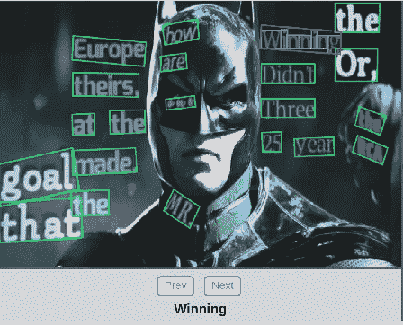

> 想了解更多？参观[www.Shibumi-ai.com](https://www.shibumi-ai.com/)
> 
> 在这里阅读[这个帖子的](/ocr-101-all-you-need-to-know-e6a5c5d5875b)**重访**版本

# 介绍

光学字符识别(OCR)是最早解决的计算机视觉任务之一，因为在某些方面它不需要深度学习。因此，在 2012 年深度学习热潮之前就有不同的 OCR 实现，有些甚至可以追溯到 1914 年(！).

这让很多人以为 OCR 挑战是**“解决了**”，就不再有挑战性了。另一个来自类似来源的信念是，OCR 不需要**深度学习**，或者换句话说，使用深度学习进行 OCR 是一种矫枉过正。

任何实践计算机视觉或一般意义上的机器学习的人都知道，没有所谓的已解决的任务，这个案例也不例外。相反，OCR 仅在非常具体的用例上产生非常好的结果，但是一般来说，它仍然被认为是具有挑战性的。

此外，对于某些不需要深度学习的 OCR 任务，确实有很好的解决方案。然而，要真正迈向更好、更通用的解决方案，深度学习将是强制性的。

## 我为什么要写 OCR？

像我的许多作品/文章一样，这也是作为客户的项目开始的。我被要求解决一个特定的 OCR 任务。

在从事这项工作期间和之后，我得出了一些值得分享的结论和见解。此外，在集中精力完成一项任务后，很难停下来扔掉它，所以我继续我的研究，并希望获得一个更好、更通用的解决方案。

## 你会在这里找到什么

在这篇文章中，我将探索一些用于解决不同 OCR 任务的**策略**、**方法**和**逻辑**，并分享一些有用的方法。在最后一部分，我们将用代码解决一个现实世界的问题。这不应该被认为是一个详尽的评论(不幸的是),因为这种方法的深度、历史和广度对于这种博客文章来说太广了。

然而，和往常一样，我不会放过你参考文章、数据集、知识库和其他相关的博客文章。

# OCR 的类型

如前所述，OCR 有不止一种含义。从最普遍的意义上来说，它指的是从每一个可能的图像中提取文本，无论是一本书的标准印刷页，还是一张随机的带有涂鸦的图像( **in the wild** )。在这之间，你可能会发现许多其他任务，比如阅读**车牌**，无人机器人**验证码**，**街道标志**等。

尽管这些选项中的每一个都有自己的困难，但显然“在野外”的任务是最难的。

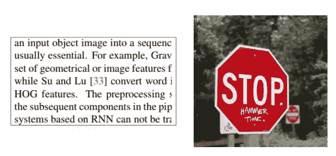

Left: Printed text. Right: text in the wild

从这些例子中，我们可以得出 OCR 任务的一些**属性**:

*   **文字密度**:在打印/书写的页面上，文字密度大。然而，给定一个只有一个街道标志的街道图像，文本是稀疏的。
*   **文本的结构**:页面上的文本是结构化的，大部分是严格的行，而野生的文本可能会以不同的旋转方式散落在各处。
*   字体:印刷字体更容易，因为它们比嘈杂的手写字符更有结构。
*   **字符类型:**文本可能以不同的语言出现，这些语言可能彼此非常不同。此外，文本的结构可能不同于数字，例如门牌号等。
*   **伪像**:很明显，室外照片比舒适的扫描仪要嘈杂得多。
*   **位置**:一些任务包括裁剪/居中的文本，而在其他情况下，文本可能位于图像中的随机位置。

# 数据集/任务

## SVHN

一个很好的起点是街景门牌号数据集。顾名思义，这是从谷歌街景中提取的一组门牌号数据。任务难度中等。数字以各种形状和书写风格出现，然而，每个门牌号位于图像的中间，因此不需要检测。这些图像的分辨率不是很高，它们的排列可能有点奇特。

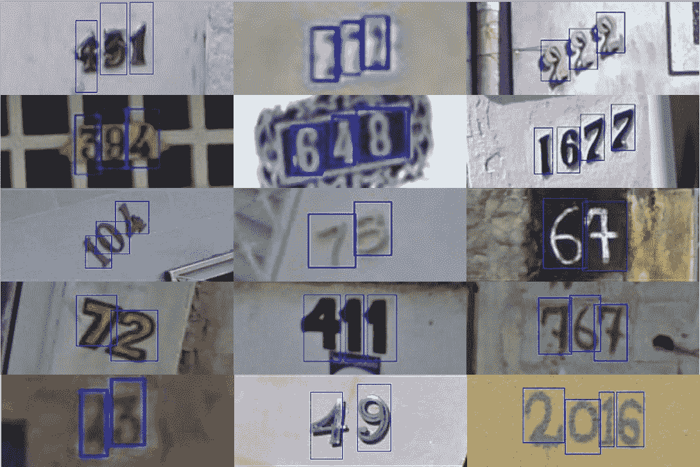

## 车牌

另一个常见的挑战是车牌识别，这在实践中不是很难，也不是很有用。这个任务和大多数 OCR 任务一样，需要检测车牌，然后识别它的**字符**。由于车牌的形状相对恒定，一些方法在实际识别数字之前使用简单的整形方法。以下是一些来自网络的例子:

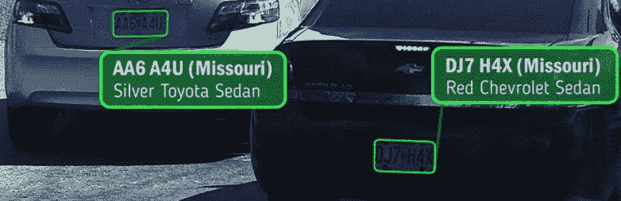

OpenALPR example. with car type a s abonus

1.  OpenALPR 是一个非常强大的工具，不需要深度学习，可以识别不同国家的车牌
2.  这个 [repo](https://github.com/qjadud1994/CRNN-Keras) 提供了 CRNN 模型的实现(将进一步讨论)来识别韩国车牌。
3.  监督. ly，一家数据应用公司，[写了](/number-plate-detection-with-supervisely-and-tensorflow-part-1-e84c74d4382c)关于使用他们的工具生成的人工数据来训练一个车牌识别器(人工数据也将被进一步讨论)

## 验证码

由于互联网上到处都是机器人，区分它们和真正人类的常见做法是视觉任务，特别是文本阅读，又名验证码。这些文本中的许多是随机的和扭曲的，这应该使计算机更难阅读。我不确定开发验证码的人是否预测到了计算机视觉的进步，但是今天大多数文本验证码并不难解决，尤其是如果我们不试图一次解决所有的验证码。

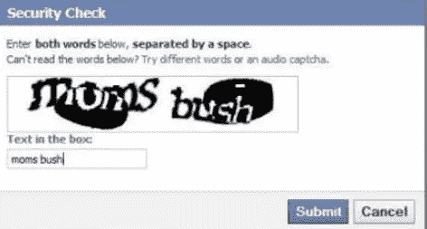

Facebook knows how to make challenging CAPTCHAs

亚当·盖特基提供了一个[不错的教程](https://medium.com/@ageitgey/how-to-break-a-captcha-system-in-15-minutes-with-machine-learning-dbebb035a710)，用深度学习解决一些验证码，其中包括再次合成人工数据。

## PDF OCR

OCR 最常见的情况是印刷/pdf OCR。打印文档的结构化特性使得解析它们变得更加容易。大多数 OCR 工具(例如 [Tesseract](https://github.com/tesseract-ocr/) )主要是为了解决这个任务，并获得良好的结果。因此，我不会在这篇文章中对这个任务做过多的阐述。

## 野外的 OCR

这是最具挑战性的 OCR 任务，因为它将所有一般的计算机视觉挑战(如噪声、光照和伪像)引入 OCR。此任务的一些相关数据集是 [coco-text](https://vision.cornell.edu/se3/coco-text-2/) 和 [SVT](http://tc11.cvc.uab.es/datasets/SVT_1) 数据集，它们再次使用街景图像来提取文本。

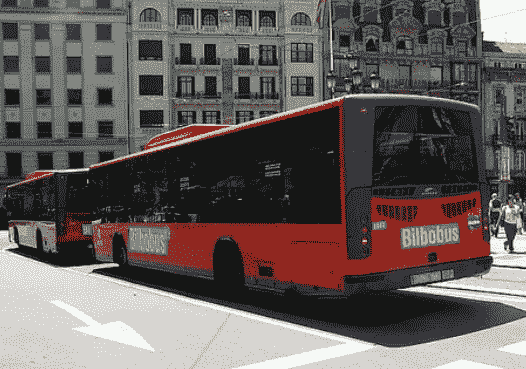

COCO text example

## 合成文本

SynthText 不是一个数据集，甚至可能不是一个任务，但提高训练效率的一个好主意是人工数据生成。由于文本的扁平性质，在图像上随意添加字符或单词看起来比其他任何物体都要自然。

我们之前已经看到了一些为简单任务生成的数据，比如验证码和车牌。在野外生成文本稍微复杂一点。该任务包括考虑图像的深度信息。幸运的是，SynthText 是一个很好的作品，它接收带有上述注释的图像，并智能地散布文字(来自新闻组数据集)。

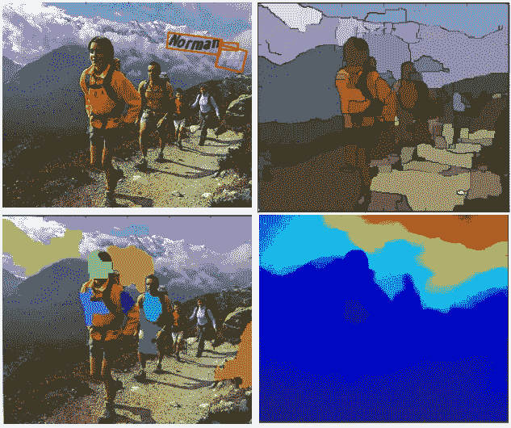

SynthText process illustration: top right is the segmentation of an image, bottom right is the depth data. Bottom left is a surface analyses of the image, which according to text is sprinkled on the image.

为了使“分散”的文本看起来真实而有用，SynthText 库为每幅图像设置了两个遮罩，一个是深度遮罩，另一个是分段遮罩。如果您喜欢使用自己的图像，也应该添加这些数据

*   建议查看 [repo](https://github.com/ankush-me/SynthText) ，自己生成一些图像。你应该注意，回购使用了 opencv 和 maptlotlib 的一些过时版本，所以一些修改可能是必要的。

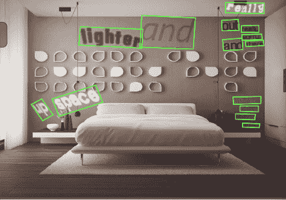

## Mnist

虽然这并不是一个真正的 OCR 任务，但是要写 OCR 而不包括 Mnist 例子是不可能的。最广为人知的计算机视觉挑战实际上并不是一项经过深思熟虑的 OCR 任务，因为它一次只包含一个字符(数字)，而且只有 10 个数字。然而，它可能暗示了为什么 OCR 被认为是容易的。此外，在一些方法中，每个字母将被单独检测，然后 Mnist like(分类)模型变成 relevantץ

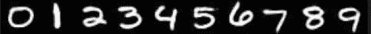

# 战略

正如我们已经看到和暗示的，文本识别主要是一个两步任务。首先，您希望**检测**图像中的文本外观，可能是密集的(如在打印的文档中)或稀疏的(如在野外的文本)。

在检测行/字级别之后，我们可以再次从一大组解决方案中进行选择，这些解决方案通常来自三种主要方法:

1.  经典的计算机视觉技术。
2.  专业化的深度学习。
3.  标准深度学习方法(检测)。

让我们逐一检查一下:

## 1.经典的计算机视觉技术

如前所述，计算机视觉解决各种文字识别问题由来已久。你可以在网上找到很多例子:

*   伟大的**阿德里安·罗斯布鲁克**在他的网站上有大量的教程，像这个[一个](https://www.pyimagesearch.com/2017/07/17/credit-card-ocr-with-opencv-and-python/)，这个[一个](https://www.pyimagesearch.com/2017/07/24/bank-check-ocr-with-opencv-and-python-part-i/)和[更多的](https://www.pyimagesearch.com/category/optical-character-recognition-ocr/)。
*   **堆栈溢出**也有一些像[这个](https://stackoverflow.com/questions/9413216/simple-digit-recognition-ocr-in-opencv-python)一样的宝石。

经典 CV 方法通常声称:

1.  应用**滤镜**让人物从背景中凸显出来。
2.  应用**轮廓检测**逐个识别字符。
3.  应用**图像分类**识别字符

显然，如果第二部分做得好，第三部分很容易，无论是模式匹配还是机器学习(例如 Mnist)。

然而，轮廓检测对于概括来说是相当具有挑战性的。它需要大量的手动微调，因此在大多数问题中变得不可行。例如，让我们将一个简单的计算机视觉脚本从[应用到来自 SVHN 数据集的一些图像上。第一次尝试我们可能会取得很好的结果:](http://scikit-image.org/docs/dev/auto_examples/segmentation/plot_label.html#sphx-glr-download-auto-examples-segmentation-plot-label-py)

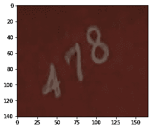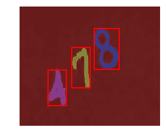

但是当角色之间的距离越来越近时，事情就开始变得不可收拾了:

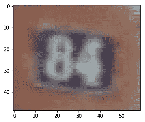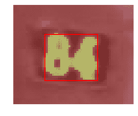

我艰难地发现，当你开始摆弄参数时，你可能会减少这样的错误，但不幸的是会引起其他错误。换句话说，如果你的任务不简单，这些方法就不合适。

## 2.专门的深度学习方法

大多数成功的深度学习方法都在通用性方面表现出色。然而，考虑到上述属性，专用网络可能非常有用。

我将在这里检查一些著名方法的非详尽示例，并对介绍它们的文章做一个快速总结。与往常一样，每篇文章都以“任务 X(文本识别)最近获得关注”为开头，并继续详细描述他们的方法。仔细阅读这些文章会发现，这些方法是从以前的深度学习/文本识别工作中收集的。

结果也描述得很透彻，但是由于设计上的许多差异(包括数据集的微小差异)，实际比较是不可能的。真正了解这些方法在您的任务中的性能的唯一方法，是获取它们的代码(最好到最坏:找到**官方的**回购，找到**非官方但评价很高的**回购，**自己实现**)并在您的数据上尝试。

因此，我们总是更喜欢附有好的回购的文章，如果可能的话，甚至是演示。

**东**

[EAST](https://arxiv.org/pdf/1704.03155.pdf) (高效准确的场景文本检测器)是一种简单而强大的**文本检测方法**。使用专门的网络。

与我们将要讨论的其他方法不同，只限于文本检测(不是实际的识别)，但是它的健壮性值得一提。
另一个优势是它也被添加到 **open-CV** 库(从版本 4 开始)所以你可以很容易地使用它(见教程[这里](https://www.pyimagesearch.com/2018/08/20/opencv-text-detection-east-text-detector/))。这个网络实际上是众所周知的 U 形网的一个版本，它可以很好地检测大小不同的特征。这个网络的底层前馈“stem”(如文中杜撰，见下图)可能非常— **文中使用 PVANet** ，然而 opencv 实现使用 **Resnet** 。显然，它也可以被预先训练(例如使用 imagenet)。与 U-Net 一样，特征是从网络的不同层次提取的。

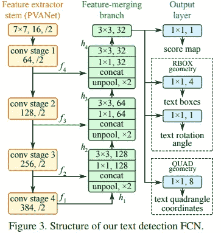

最后，网络允许两种类型的输出旋转边界框:带有旋转角度(2X2+1 个参数)的标准边界框或“四边形”,它只是带有所有顶点坐标的旋转边界框。

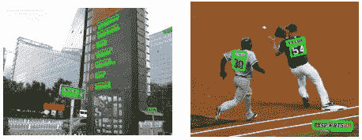

如果现实生活的结果就像上面的图片一样，那么识别这些文字并不需要太多的努力。然而，现实生活的结果并不完美。

**CRNN**

卷积回归神经网络是 2015 年的一篇文章，其中提出了一种混合(或三混合？)端到端架构，旨在以三步方法捕获单词。

其思想如下:第一层是标准的全卷积网络。网络的最后一层被定义为特征层，并划分为“特征列”。在下图中可以看到，每个这样的特征列是如何表示文本中的某一部分的。

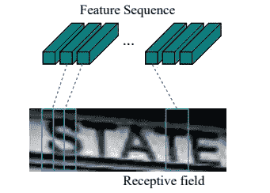

然后，特征列被输入到深度双向 LSTM 中，后者输出一个序列，用于查找字符之间的关系。


最后，第三部分是转录层。它的目标是获取杂乱的字符序列，其中一些字符是冗余的，而另一些是空白的，并使用概率方法来统一和解释它。

这种方法叫做 **CTC 丢失**，在这里可以读到[。该层可以与/或不与预定义的词典一起使用，这可以促进单词的预测。](https://gab41.lab41.org/speech-recognition-you-down-with-ctc-8d3b558943f0)

本文在固定文本词典的情况下达到了高准确率(> 95%)，在没有固定文本词典的情况下达到了不同的成功率。

## STN-net/参见

[参见](https://arxiv.org/pdf/1712.05404.pdf) —半监督的端到端场景文本识别，是 Christian Bartzi 的作品。他和他的同事应用真正的端到端策略来检测和识别文本。他们使用非常弱的监督(他们称之为半监督，与通常意义不同)。因为他们训练网络只使用**文本注释**(没有边界框)。这允许他们使用更多的数据，但使他们的训练过程非常具有挑战性，他们讨论了不同的技巧来使其工作，例如，不要在超过两行文本的图像上训练(至少在训练的第一阶段)。

这份文件有一个更早的版本，叫做 [STN OCR](https://arxiv.org/abs/1707.08831) 。在最后的论文中，研究人员改进了他们的方法和陈述，此外，由于结果的高质量，他们更加强调他们方法的通用性。

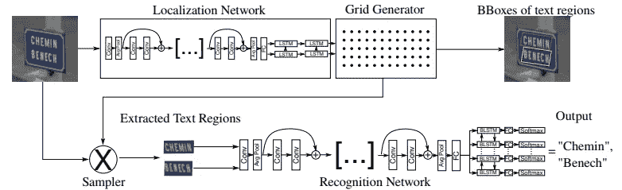

SEE strategy

STN-OCR 的名字暗示了使用空间转换器的策略。

他们在中训练**两个级联网络**，其中第一个网络，即变换器，学习对图像的变换，以输出更容易解释的子图像。

然后，另一个 LSTM 在前的前馈网络(嗯…好像我们以前见过)识别文本。

研究人员在这里强调了使用 resnet 的重要性(他们使用了两次),因为它提供了到早期层的“强”传播。然而，这种做法如今已被广泛接受。

不管怎样，这都是一个有趣的尝试。

## 3.标准深度学习方法

正如标题所暗示的，在检测到“单词”后，我们可以应用标准的深度学习检测方法，如 SSD、YOLO 和 Mask RCNN。因为网上有太多的信息，所以我不打算详细说明这些方法。

我必须说这是我目前最喜欢的方法，因为我喜欢深度学习的“端到端”哲学，在这种哲学中，你可以应用一个强大的模型，通过一些调整可以解决几乎所有问题。在这篇文章的下一部分，我们将看到它实际上是如何工作的。

然而，当涉及到密集、相似的类时，SSD 和其他检测模型会受到挑战，如这里的[所述](https://arxiv.org/pdf/1611.10012.pdf)。我觉得这有点讽刺，因为事实上，深度学习模型发现识别数字和字母比识别更具挑战性和复杂的物体(如狗、猫或人)要困难得多。它们往往达不到预期的精度，因此，专门的方法蓬勃发展。

# 实际例子

所以说了这么多之后，是时候动手了，试着自己做些模特。我们将尝试解决 [SVHN](http://ufldl.stanford.edu/housenumbers/) 任务。SVHN 数据包含三个不同的数据集:*训练*、*测试*和*额外*。差异不是 100%清楚，但是最大的*额外的*数据集(约 50 万样本)包括更容易识别的图像。因此，为了这次拍摄，我们将使用它。

要准备该任务，请执行以下操作:

*   你需要一台 Tensorflow≥1.4、Keras≥2 的基本 GPU 机器
*   从[这里](https://github.com/pierluigiferrari/ssd_keras)克隆 SSD_Keras 项目。
*   从[这里](https://drive.google.com/open?id=1vmEF7FUsWfHquXyCqO17UaXOPpRbwsdj)下载 coco 数据集上预先训练好的 SSD300 模型。
*   在此从[克隆*该*项目的回购..](https://github.com/shgidi/OCR)
*   下载[extra.tar.gz](http://ufldl.stanford.edu/housenumbers/extra.tar.gz)文件，其中包含 SVHN 数据集的额外图像。
*   更新此项目报告中 json_config.json 中的所有相关路径。

为了有效地遵循流程，您应该阅读以下说明，并从项目的 repo 中运行 **ssd_OCR.ipynb** 笔记本。

而且…你已经准备好开始了！

## 步骤 1:解析数据

不管你喜不喜欢，但是在探测任务中没有“黄金”格式的数据表示。一些众所周知的格式有:coco、via、pascal、xml。还有更多。例如，SVHN 数据集用晦涩的*进行了注释。mat* 格式。幸运的是，这个[要点](https://gist.github.com/veeresht/7bf499ee6d81938f8bbdb3c6ef1855bf)提供了一个巧妙的 *read_process_h5* 脚本来转换。mat 文件转换为标准 json，您应该更进一步，将其进一步转换为 pascal 格式，如下所示:

```
def json_to_pascal(json, filename): #filename is the .mat file
    # convert json to pascal and save as csv
    pascal_list = []
    for i in json:
        for j in range(len(i['labels'])):
            pascal_list.append({'fname': i['filename'] 
            ,'xmin': int(i['left'][j]), 'xmax': int(i['left'][j]+i['width'][j])
            ,'ymin': int(i['top'][j]),  'ymax': int(i['top'][j]+i['height'][j])
            ,'class_id': int(i['labels'][j])})
    df_pascal = pd.DataFrame(pascal_list,dtype='str')
    df_pascal.to_csv(filename,index=False)*p = read_process_h5(file_path)*json_to_pascal(p, data_folder+'pascal.csv')
```

现在我们应该有一个更加标准的 *pascal.csv* 文件，它将允许我们继续前进。如果转换太慢，你应该注意到我们不需要所有的数据样本。~10K 就够了。

## 第二步:看数据

在开始建模过程之前，您最好对数据进行一些探索。我只为健全性测试提供了一个快速功能，但是我建议您做一些进一步的分析:

```
def viz_random_image(df):
    file = np.random.choice(df.fname)
    im = skimage.io.imread(data_folder+file)
    annots =  df[df.fname==file].iterrows() plt.figure(figsize=(6,6))
    plt.imshow(im) current_axis = plt.gca() for box in annots:
        label = box[1]['class_id']
        current_axis.add_patch(plt.Rectangle(
            (box[1]['xmin'], box[1]['ymin']), box[1]['xmax']-box[1]['xmin'],
            box[1]['ymax']-box[1]['ymin'], color='blue', fill=False, linewidth=2))  
        current_axis.text(box[1]['xmin'], box[1]['ymin'], label, size='x-large', color='white', bbox={'facecolor':'blue', 'alpha':1.0})
        plt.show() viz_random_image(df)
```

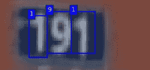

A representative sample form SVHN dataset

对于接下来的步骤，我在 repo 中提供了一个 *utils_ssd.py* ，以方便训练、负重等。部分代码取自 SSD_Keras repo，也是广泛使用的。

## 第三步:选择策略

如前所述，对于这个问题，我们有许多可能的方法。在本教程中，我将采用标准的深度学习检测方法，并将使用 SSD 检测模型。我们将从这里的[使用 **SSD keras** 实现。这是 PierreLuigi 很好的实现。虽然它的 GitHub 明星比 rykov8 的实现少，但它看起来更新了，也更容易集成。当你选择使用哪个项目时，这是一件非常重要的事情。其他好的选择将是 YOLO 模型和掩模 RCNN。](https://github.com/pierluigiferrari/ssd_keras)

## **步骤 4:加载并训练 SSD 模型**

**一些定义**

要使用 repo，您需要验证您有 SSD_keras repo，并填写 json_config.json 文件中的路径，以允许笔记本找到这些路径。

从导入开始:

```
**import** **os**
**import** **sys**
**import** **skimage.io**
**import** **scipy**
**import** **json****with** open('json_config.json') **as** f:     json_conf = json.load(f)ROOT_DIR = os.path.abspath(json_conf['ssd_folder']) *# add here mask RCNN path*
sys.path.append(ROOT_DIR)

**import** **cv2**
**from** **utils_ssd** **import** *
**import** **pandas** **as** **pd**
**from** **PIL** **import** Image

**from** **matplotlib** **import** pyplot **as** plt

%matplotlib inline
%load_ext autoreload
% autoreload 2
```

以及更多的定义:

```
task = 'svhn'labels_path = f'{data_folder}pascal.csv'input_format = ['class_id','image_name','xmax','xmin','ymax','ymin' ]

df = pd.read_csv(labels_path)
```

**车型配置**:

```
**class** **SVHN_Config**(Config):
    batch_size = 8

    dataset_folder = data_folder
    task = task

    labels_path = labels_path

    input_format = input_format

conf=SVHN_Config()

resize = Resize(height=conf.img_height, width=conf.img_width)
trans = [resize]
```

**定义型号，装载重量**

与大多数深度学习案例一样，我们不会从头开始训练，但我们会加载预训练的权重。在这种情况下，我们将加载 SSD 模型的[权重](https://drive.google.com/open?id=1vmEF7FUsWfHquXyCqO17UaXOPpRbwsdj)，在 COCO 数据集上训练，该数据集有 80 个类。很明显，我们的任务只有 10 个类，因此在加载权重后，我们将重建顶层以获得正确数量的输出。我们在 init_weights 函数中完成。补充说明:在这种情况下，正确的输出数量是 44:每个类 4 个(边界框坐标),另外 4 个用于背景/无类。

```
learner = SSD_finetune(conf)
learner.get_data(create_subset=**True**)

weights_destination_path=learner.init_weights()

learner.get_model(mode='training', weights_path = weights_destination_path)
model = learner.model
learner.get_input_encoder()
ssd_input_encoder = learner.ssd_input_encoder

*# Training schedule definitions*
adam = Adam(lr=0.0002, beta_1=0.9, beta_2=0.999, epsilon=1e-08, decay=0.0) 
ssd_loss = SSDLoss(neg_pos_ratio=3, n_neg_min=0, alpha=1.0)
model.compile(optimizer=adam, loss=ssd_loss.compute_loss)
```

**定义数据加载器**

```
train_annotation_file=f'**{conf.dataset_folder}**train_pascal.csv'
val_annotation_file=f'**{conf.dataset_folder}**val_pascal.csv'
subset_annotation_file=f'**{conf.dataset_folder}**small_pascal.csv'batch_size=4
ret_5_elements={'original_images','processed_images','processed_labels','filenames','inverse_transform'}train_generator = learner.get_generator(batch_size, trans=trans, anot_file=train_annotation_file,
                  encoder=ssd_input_encoder)val_generator = learner.get_generator(batch_size,trans=trans, anot_file=val_annotation_file,
                 returns={'processed_images','encoded_labels'}, encoder=ssd_input_encoder,val=True)
```

## 5.训练模型

**现在**模型准备好了，我们将设置一些与上次训练相关的定义，并开始训练

```
learner.init_training()history = learner.train(train_generator, val_generator, steps=100,epochs=80)
```

作为奖励，我在训练脚本中包含了 ***training_plot*** 回调，以在每个时期后可视化一个随机图像。例如，下面是第六个纪元**后的预测快照:**

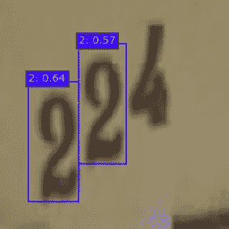

SSD_Keras repo 在几乎每个时期后处理保存模型，因此您可以稍后加载模型，只需更改 *weights_destination_path* 行使其等于路径

```
weights_destination_path = <path>
```

如果你按照我的指示做，你应该能训练出这个模型。ssd_keras 提供了更多的特性，例如数据扩充、不同的加载器和评估器。经过短暂的训练，我已经达到了> 80 地图。

你达到了多高？

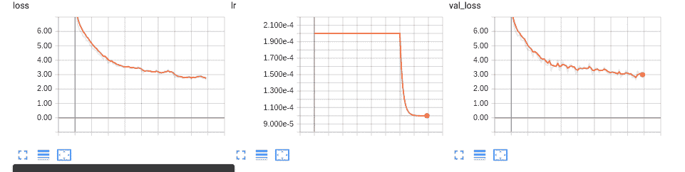

Training for 4X100X60 samples, from tensorboard

# 摘要

在这篇文章中，我们讨论了 OCR 领域的不同挑战和方法。正如深度学习/计算机视觉中的许多问题一样，它比乍看起来要复杂得多。我们已经看到了它的许多子任务，以及解决它的一些不同的方法，目前没有一个是银弹。另一方面，我们已经看到，没有太多的争论，达成初步结果并不困难。

希望你喜欢！