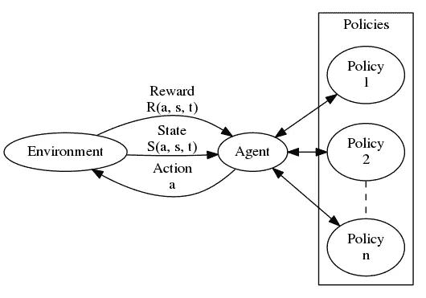
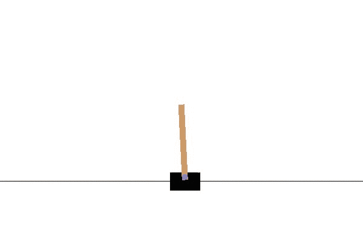
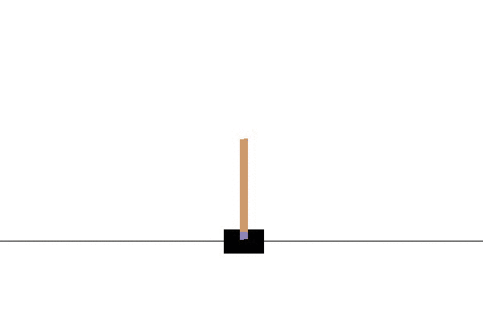
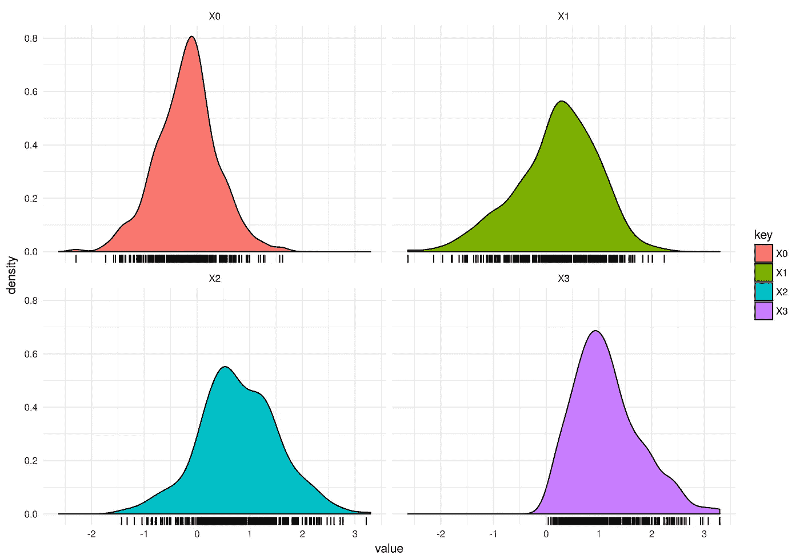

# 对强化学习或当你不知道该做什么时该做什么的温和介绍

> 原文：<https://towardsdatascience.com/a-gentle-introduction-to-reinforcement-learning-or-what-to-do-when-you-dont-know-what-to-do-31faf5acd60b?source=collection_archive---------8----------------------->

今天我们要看一组有趣的学习算法，它不需要你在学习的时候知道真相。因此，这是无监督学习和有监督学习的混合。受监督的部分来自于这样一个事实，即你在采取行动后看着后视镜，然后根据你做得有多好来调整自己。这是惊人的强大，因为它可以学习知识表示允许它学习的任何东西。不过有一点需要注意的是，它慢得令人难以忍受。这自然源于没有正确解决方案的概念。无论是在你做决定的时候，还是在你评估决定的时候。你只能说“嘿，考虑到我之前的尝试，这还不算太糟”，但你不能说这是最好的选择。这降低了学习速度。好处是，只要我们能观察到我们在所处环境中行动的后果，我们就能了解任何事情。



如上所述，强化学习可以被认为是一个代理人在一个环境中行动，并作为这些行动的结果接收奖励。原则上，这是一个马尔可夫决策过程(MDP ),它基本上捕捉了你可能想在一个环境中学习的任何东西。从形式上看，MDP 包括

*   一组状态
*   一系列动作
*   一套奖励
*   一组转移概率

这看起来惊人的简单，但实际上是我们所需要的。任务是学习最佳转移概率，使预期的未来总回报最大化。因此，为了继续，我们需要引入一点数学符号。首先，我们需要一个奖励函数 R( **s** ， **a** )，它给我们奖励 **r** ，这来自于在时间 **t** 在状态 **s** 采取行动 **a** 。我们还需要一个转换函数 S( **s** ， **a** )，它将给出下一个状态**S’**。动作**和**由代理按照一个或多个策略生成。因此，政策函数 P( **s** )生成一个动作 **a** ，据其所知，该动作将在未来给出最大回报。

# 我们要解决的问题——车杆

我们将利用 [OpenAI 体育馆](https://gym.openai.com/)中的一个环境，叫做[手推车杆子](https://gym.openai.com/envs/CartPole-v0)问题。这项任务基本上是学习如何通过控制手推车来平衡杆子。每次我们在环境中行动时，环境都会给我们一个新的状态。这种状态由对应于位置和运动的四个可观测量组成。这个问题之前已经由[亚瑟·朱利安尼](https://gist.github.com/awjuliani/86ae316a231bceb96a3e2ab3ac8e646a)用[张量流](https://www.tensorflow.org/)说明过。在向您展示实现之前，我们先来看看一个训练有素的代理是如何执行的。



正如你所看到的，它表现得很好，实际上通过实时控制手推车来平衡杆子。你可能会想，嘿，这听起来很容易，我只是生成随机动作，它应该会抵消。嗯，放心吧。下面你可以看到这种方法失败的例子。



所以对于眼前的问题。我们如何对此建模？我们需要制造一个智能体来学习一个能最大化未来回报的策略，对吗？对，所以在任何给定的时间，我们的政策可以选择两个可能的行动之一，即

1.  向左移动
2.  向右移动

如果你以前做过任何建模工作，这听起来应该很熟悉。这基本上是一个伯努利模型，其中概率分布看起来像这样 P(**y**；**p**)=**p**^**y**(1-**p**)^{1-**y**)。一旦我们知道了这一点，接下来的任务就是将 p 建模为当前状态 s 的函数。这可以通过做一个由 s 形包裹的线性模型来实现。更多数学细节请看看我的[原帖](http://doktormike.github.io/blog/A-gentle-introduction-to-reinforcement-learning-or-what-to-do-when-you-dont-know-what-to-do/)。

# 履行

由于人工智能健身房大部分是用 Python 编写的，我们选择了用那种语言。这绝不是我对数据科学的首选语言，我可以给你 10 个有力的论据来说明为什么它不应该是你的，但因为这篇文章是关于机器学习而不是数据科学的，所以我不会扩展我的想法。无论如何，Python 对于机器学习来说是很棒的，这就是我们今天所看到的。所以让我们继续导入 Python3 中我们将需要的库。

```
import numpy as np
import math
import gym
```

在此之后，让我们看看初始化我们的环境，并设置一些变量和占位符，我们将需要。

```
env = gym.make('CartPole-v0')
# Configuration
state = env.reset()
max_episodes = 2000
batch_size = 5
learning_rate = 1
episodes = 0
reward_sum = 0
params = np.random.normal([0,0,0,0], [1,1,1,1])
render = False
# Define place holders for the problem
p, action, reward, dreward = 0, 0, 0, 0 ys, ps, actions, rewards, drewards, gradients = [],[],[],[],[],[]
states = state
```

除此之外，我们将使用一些需要定义的函数。我确信多种机器学习框架已经实现了它，但是它很容易做到，也很有指导性，所以为什么不去做呢。；)

# 您将需要的 python 函数

因为我们是在 Python3 中实现的，而 Python3 和 Python2 并不总是简单明了的，所以我与你分享我创建的函数定义，因为它们确实与 Python3 库兼容。尤其是 Numpy，它是 Python 中计算不可或缺的一部分。这些功能大部分都很容易实现和理解。确保你通读了它们并掌握了它们的全部内容。

```
def discount_rewards(r, gamma=1-0.99):
  df = np.zeros_like(r)
  for t in range(len(r)):
    df[t] = np.npv(gamma, r[t:len(r)])
    return df
def sigmoid(x):
  return 1.0/(1.0+np.exp(-x))
def dsigmoid(x): 
  a=sigmoid(x) return a*(1-a)
def decide(b, x):
  return sigmoid(np.vdot(b, x))
def loglikelihood(y, p):
  return y*np.log(p)+(1-y)*np.log(1-p)
def weighted_loglikelihood(y, p, dr):
  return (y*np.log(p)+(1-y)*np.log(1-p))*dr
def loss(y, p, dr):
  return -weighted_loglikelihood(y, p, dr)
def dloss(y, p, dr, x):
  return np.reshape(dr*( (1-np.array(y))*p - y*(1-np.array(p))),[len(y),1])*x
```

有了这些功能，我们就可以开始主要的学习循环，这是代理和培训的逻辑发生的地方。这将是最难的部分，所以要慢慢来。

# 学习循环

```
while episodes < max_episodes:
  if reward_sum > 190 or render==True: 
    env.render()
    render = True
  p = decide(params, state)
  action = 1 if p > np.random.uniform() else 0
  state, reward, done, _ = env.step(action) reward_sum += reward
  # Add to place holders
  ps.append(p)
  actions.append(action)
  ys.append(action)
  rewards.append(reward)
  # Check if the episode is over and calculate gradients
  if done:
    episodes += 1
    drewards = discount_rewards(rewards)
    drewards -= np.mean(drewards)
    drewards /= np.std(drewards)
    if len(gradients)==0:
      gradients = dloss(ys, ps, drewards, states).mean(axis=0)
    else:
      gradients = np.vstack((gradients, dloss(ys, ps, drewards, states).mean(axis=0)))
    if episodes % batch_size == 0:
      params = params - learning_rate*gradients.mean(axis=0)
      gradients = []
      print("Average reward for episode", reward_sum/batch_size)
      if reward_sum/batch_size >= 200:
        print("Problem solved!")
      reward_sum = 0
    # Reset all
    state = env.reset()
    y, p, action, reward, dreward, g = 0, 0, 0, 0, 0, 0
    ys, ps, actions, rewards, drewards = [],[],[],[],[]
    states = state
  else: 
    states=np.vstack((states, state))env.close()
```

唷！就在那里，还不算太糟，是吧？我们现在有一个完全工作的强化学习代理，它通过策略梯度学习来学习横竿问题。现在，对于那些了解我的人来说，你知道我总是宣扬考虑所有可能的解决方案，并且与你的数据一致。所以，也许横翻筋斗的问题有不止一种解决方法？确实有。下一节将向您展示这些解决方案在四个参数中的分布。

# 多重解决方案

因此，我们已经使用我们的学习代理解决了 CartPole 问题，如果您运行它多次，您将看到它收敛到不同的解决方案。我们可以在所有这些不同的解决方案上创建一个分布，这将告知我们由我们的参数化所支持的所有可能模型的解决方案空间。下面给出了曲线图，其中 x 轴是参数值，y 轴是概率密度。



你可以看到 X0 和 X1 应该在 0 左右，而 X2 和 X3 应该在 1 左右。但是如图所示，存在几种其他的解决方案。因此，学习代理自然会考虑到参数应该是什么的不确定性。

# 结论

我们实现了一个强化学习代理，它在一个以最大化未来回报为目的的环境中工作。我们还在代码中贴现了未来的回报，但在数学中没有包括它。尽管这很简单。能够从自己的错误中学习的概念是非常酷的，它代表了一种学习范式，这种范式既不是有人监督的，也不是无人监督的，而是两者的结合。这种方法的另一个吸引人的地方是，它非常类似于生物从与环境的互动中学习的方式。今天我们解决了翻筋斗，但是这种方法可以用来解决更有趣的问题。

我希望你在阅读这篇文章的时候觉得有趣，并且学到了一些东西。

推理快乐！

*原载于*[*doktormike . github . io*](http://doktormike.github.io/blog/A-gentle-introduction-to-reinforcement-learning-or-what-to-do-when-you-dont-know-what-to-do/)*。*