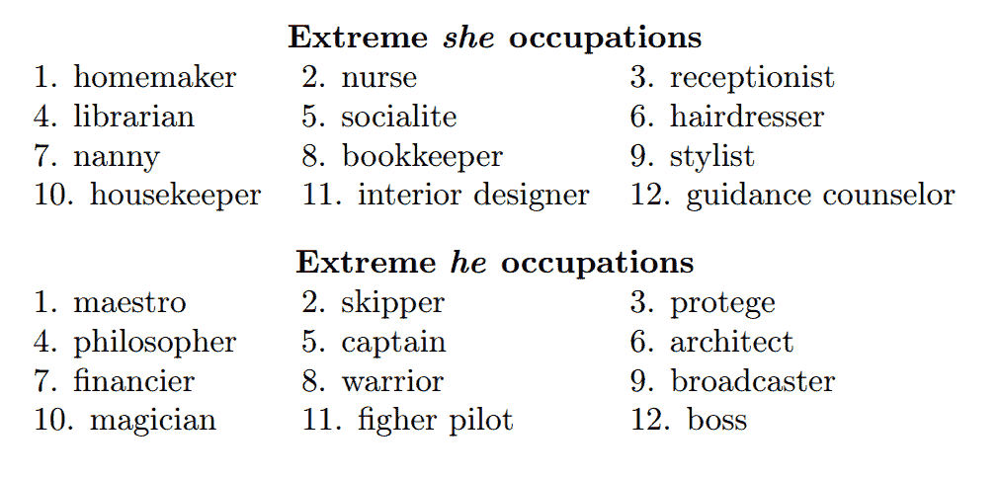
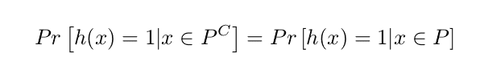
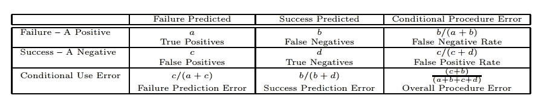

# 算法公平性讨论的温和介绍

> 原文：<https://towardsdatascience.com/a-gentle-introduction-to-the-discussion-on-algorithmic-fairness-740bbb469b6?source=collection_archive---------1----------------------->

近年来，机器学习算法已经兴起:在打破了几乎所有可以想象的计算机视觉相关任务的基准之后，机器学习算法现在一直在我们的家里和口袋里。一个不太为人知的事实是，它们最近开始在一些更敏感的领域取代人类决策者，如刑事司法系统和医学测试领域。

当机器学习算法应用于人类时，一个直接的观察结果是，这些算法并不总是表现得“公平”。事实证明，以标准效用最大化目标(例如，最大化训练数据的预测准确性)训练机器学习算法有时会导致算法的行为方式让人类观察者认为不公平，尤其是对某个少数群体。

这种行为有许多潜在的原因。一个自然的怀疑是训练数据本身:机器学习算法本质上是大型计算机器，经过训练可以识别和利用数据中的统计模式。如果作为“基本事实”提供给它们的数据包含一些偏见或历史歧视，机器将会发现这种偏见，并将其纳入未来预测。一个很好的例子是[1]中的工作，其中作者证明了著名的单词嵌入模型 word2vec 实际上包含了隐含的性别偏见。我发现这很麻烦，因为许多应用程序现在使用经过训练的 word2vec 嵌入作为其机器学习管道中的第一个预处理阶段；这意味着这种偏见每天都在传播。

[1] gives a **quantitative** demonstration that word-embeddings contain **gender biases** in their geometry

克服这个问题的一种方法是，在假设历史偏差处于自我纠正过程的情况下，不断用“新鲜”数据重新训练机器学习模型。我不知道这是否是完美的解决办法，但有理由抱有希望。我喜欢的一个最近的例子是通过考虑 Getty Image 的库存摄影库中搜索词“女人”的最畅销图像在过去十年中的变化:2007 年最受欢迎的图像是一个躺在床上的裸体女人，而 2017 年最受欢迎的图像是一个独自在岩石小道上徒步旅行的女人。见[7]的整个演变和其他一些很酷的例子。如果你认为库存照片——出现在广告、广告牌、杂志和博客等地方的普通图片——反映了我们社会的任何事情，那么我们显然走在一条积极的道路上。

然而，一个不太令人期待的结果是，即使有完美标记的训练数据，偏见和歧视也可能以多种方式出现。[6]是一篇很棒的博文，讲述了机器学习算法即使有完全无偏的训练数据也可能不公平的各种原因。

最近一个著名的例子是谷歌照片错误地将两个黑人标记为“大猩猩”。显然，这并不是说谷歌用于这项任务的训练数据包含了被标记为“大猩猩”的黑人的例子。但是机器学习算法仍然会出错，在这种情况下，这是一个代价高昂且不公平的错误，因为它只发生在黑人身上，而不是白人。

研究分类中的*公平性*意味着不仅从准确性的角度，而且从公平性的角度来研究机器学习算法。听起来很简单，对吧？令人惊讶的是，大部分的困难实际上都围绕着**如何定义公平**的含义。在过去的几年里，许多研究人员定义了不同的算法公平概念。在许多情况下，这些定义在准确性方面有所取舍(也就是说，实现它们意味着必然要在模型的准确性方面付出代价)，但更意想不到的是，这些定义中有许多本身也有取舍。

在本帖中，我们将围绕一个具体的例子来逐步引入不同的算法公平概念:**为科技行业过滤简历**。具体来说，我们将认为我们的特征空间 X 是一些可以从一个人的简历中计算出来的观察到的特征(例如:姓名、出生年份、地址、性别、编程语言、大学学位和学分等)，如果这个人应该被带去面试，那么输出将是 Y=1，否则是 Y=0。出于这个例子的目的，我们的**受保护属性**(我们希望保证公平的属性)是性别，我们假设它是可观察的并且是二进制的。

# 第一站:过程的公平与结果的公平

我们介绍的第一个区别是“有意识的”和“无意识的”方法。“aware”算法将在学习过程中使用关于受保护属性的信息；“无意识”算法不会。

无意识方法背后的动机是，对于受保护的属性来说，公平本质上意味着不考虑它。在简历示例中，这意味着同等对待男性和女性的最佳方式就是不要让算法访问这些信息。

第一个观察结果是，仅仅删除受保护的属性通常是不够的。在大多数实际情况下，受保护的属性实际上被冗余地编码在其余的观察到的特征中；大多数最大似然算法都是复杂的计算机器，能够利用这一事实。例如，我们可能会删除性别特征，却发现我们的分类器非常重视一个人的军龄。为什么？在以色列，女性通常服刑两年，男性服刑三年。这意味着“服役年限”的特征几乎与性别完全相关；使用这个特性的分类器本质上不符合无意识方法。

实践中经常使用的一种快速修复方法是，也删除与受保护属性高度相关(例如，高于某个阈值)的所有其他属性。一个更严谨的方法(本身也是一个非常有趣的工作)是“学习公平表征”(Zemel et al，2013 [2])。它使用机器学习来代替手动设计不传达关于受保护属性的信息的特征列表的过程。

让我们假设我们成功了。完全无视性别的学习方式是我们真正想要的吗？受保护属性所定义的种群之间可能存在固有的差异，这实际上将使这成为不期望的。

在我们的例子中，假设高中主修物理高度预示着申请人未来在科技行业的成功，即使这并不是所需的实际物理知识。因此，这将是我们的分类器在简历中寻找的一个特征。然而，可以说，由于社会学的原因，以色列的年轻女孩比同龄的男孩更不愿意学习物理。这将意味着，通过完全无视性别信息，一种有利于具有物理学背景的申请人的算法给了男性申请人看似不公平的优势。这种现象通常被称为恢复“多数解”(这里的解是指理想候选人的原型)，它自然会伤害少数。在我们的例子中，一名女性候选人可能同样合格，但被算法“遗漏”。

另一方面,“aware”方法——确实使用了性别信息——可以克服这一点，因为它实际上发现了这样一个事实，即学习物理对于男性未来的成功来说是一个比女性更强的信号。

另一种看待意识到和没有意识到的问题的方式是区分*过程的公平性*和*结果的公平性*。无意识方法确保了过程的公平性:它强调了这样一个事实，即在学习阶段，算法不会以任何方式根据受保护的属性对个体进行不同的处理。然而，这样做的最终结果，几乎是矛盾的，实际上对受保护和不受保护的子群体不太公平。另一方面，aware 方法使用一个不公平的过程(明确使用性别信息，并为人口中不同部分的人学习不同的分类规则)，但实际上可以达到对少数群体更公平的结果。

# 第二站:统计平价

为算法公平提出定义的一个自然方法是看看在计算机科学社区之外公平是如何被定义的，并把这些想法公式化为数学定义，我们的算法将遵循这些标准。

美国**法律** **理论**使用了“不同影响”原则:如果一种行为对受保护群体的成员产生了“不成比例的不利”影响，那么这种行为就被认为是非法歧视。“不成比例的不利”通常使用 80%规则来定义。

用于二进制分类任务的不同影响原理的最极端版本(不允许对保护组的成员产生不利影响)的数学等价是统计奇偶校验条件:它本质上均衡了保护组和非保护组的结果。

Statistical Parity: equalize outcomes across the protected and non-protected groups

对统计均等概念及其变体的主要批评(例如允许两个群体之间的某种均等，例如高达 20%)是非常自然的:我们真的想让受保护群体和不受保护群体之间的结果均等吗？

在我们的简历示例中，这将迫使我们接受相同数量的女性和男性。鉴于一名计算机工程师因暗示女性不太适合科技和领导领域的某些角色而被谷歌解雇，最近关于这个问题有了非常公开的辩论。在不深入我对这一具体主张的想法的情况下，很明显，在许多其他任务中，实施统计均等没有什么意义。例如，考虑任何分类任务，其中受保护的属性和输出变量之间存在明确的因果关系，例如:预测某个人在未来十年内是否会生育。自然，在这里实施统计上的平等是可笑的。

# 步骤 3:扩展到跨组校准的其他概念

我们仍然希望在受保护群体和不受保护群体之间实现某种程度的平等。我们可以均衡算法性能的一些统计数据，而不是均衡结果本身:例如，均衡各组之间的错误率。在这种观点看来，筛选简历的公平算法是让男性求职者和女性求职者犯同样多的错误。

一个有用的分析工具是[混淆矩阵](https://www.wikiwand.com/en/Confusion_matrix):

> 一个**混淆矩阵**，也被称为误差矩阵，是一个特定的表格布局，允许可视化监督学习算法的性能

Confusion Table: A cross-tabulation of the actual outcome by the predicted outcome

这就是公平文献可能有点可怕的地方，因为许多定义之间有非常微妙的差异，很容易忘记它们的共同点。[5]做了大量工作，给出了详细的例子，说明如何通过比较受保护和不受保护的矩阵来定义公平性。一些例子:

*   *处理平等*通过一个分类器实现，该分类器产生两个保护组类别相同的假阴性和假阳性比率(在表中，c/b 或 b/c)。
*   *当以已知结果为条件时，实现了条件程序准确性相等*，分类器在保护组类别中同样准确。这相当于男女的假阴性率和假阳性率是一样的。

关于混淆矩阵的不可否认的数学事实是，细胞计数之间存在关系——例如，它们必须与观察的总数相加。这意味着不同种类的公平性——所有共享混淆矩阵中的细胞计数——也是相关的。事实上，已经表明有许多权衡。

顾名思义，权衡意味着没有单一的赢家:这是一个零和游戏。治疗平等性的一个小改进和条件使用准确性平等性的一个小改进哪个更好？[5]声称，虽然科学家有责任提出关于权衡的讨论，并可能设计算法，其中权衡被明确表示，并可作为易于调整的转向参数，但最终还是要由利益相关者来确定权衡。

# 参考

1.  男人对于电脑程序员就像女人对于家庭主妇一样？去偏置单词嵌入
2.  [学习公平陈述](https://www.cs.toronto.edu/~toni/Papers/icml-final.pdf)

3.[谷歌员工因多元化争议被解雇考虑采取法律行动](https://www.theguardian.com/technology/2017/aug/08/google-employee-fired-diversity-row-considers-legal-action-james-damore)

4.[通过意识实现公平](https://arxiv.org/pdf/1104.3913.pdf)

5.[刑事司法风险评估中的公平性:最新水平](https://arxiv.org/pdf/1703.09207.pdf)

6.[大数据有多不公平](https://medium.com/@mrtz/how-big-data-is-unfair-9aa544d739de)

7.[从性对象到坚韧不拔的女人:库存照片中女人的演变](https://www.nytimes.com/2017/09/07/upshot/from-sex-object-to-gritty-woman-the-evolution-of-women-in-stock-photos.html)