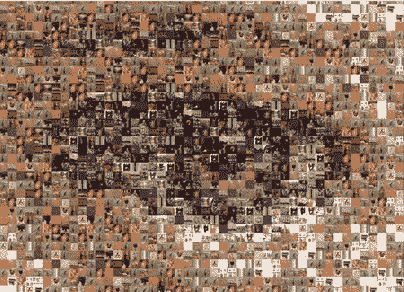

# 神经网络里有鬼？

> 原文：<https://towardsdatascience.com/a-ghost-in-the-neural-network-b2fa4ce6f219?source=collection_archive---------6----------------------->

An image emerges from images: [http://artwerker.tripod.com/digital-mosaic.html](http://artwerker.tripod.com/digital-mosaic.html)

## 吉尔伯特·赖尔(Gilbert Ryle)创造了一个著名的比喻，即“[机器中的幽灵](https://en.wikipedia.org/wiki/The_Concept_of_Mind)”，以反驳人类大脑或其相关智能有任何“怪异”之处的观点。他认为笛卡尔的身心二元论是一个简单的分类错误——忽略了精神和心理活动是如何基于大脑的物理工作的——因此，精神的属性可以通过研究大脑来研究。自从赖尔写作以来，[神经网络已经成为机器学习的支柱](http://neuralnetworksanddeeplearning.com/)，并在从[图像识别到视频游戏](https://www.microsoft.com/en-us/research/publication/achievements-and-challenges-of-deep-learning/)的复杂任务中展现出巨大的能力。但是，对于所有的进步，问题仍然是神经网络是否是人脑工作的足够准确的复制，正如人们经常暗示或声称的那样，具有“机器中的幽灵”的外观。由于缺乏简单性，未能理解人类智能的真正复杂程度，整个人工智能领域在过去遭受了巨大的停滞。最近关于人工智能进步的说法有根据吗？或者我们会期待人工智能发展的又一次停滞吗？在这里，我向人工智能领域的行业领导者(Google) [DeepMind](https://deepmind.com/) 寻求帮助，并询问开创性的 [AlphaGo](https://deepmind.com/research/alphago/) 机器背后的算法是否能够提供一条通向普通或类人智能的道路。

哲学家吉尔伯特·赖尔强烈反对笛卡尔的身心二元论。根据 20 世纪早期的科学唯物主义，赖尔认为，假设大脑“不能被分解，它所遵循的规律不是普通工程师所知道的规律”是荒谬的(1949 年，第 21 页)。他指责笛卡尔的二元论是一个简单的“类别错误”，在概念上框定“心灵”的属性是混乱的，好像它们独立于“身体/大脑”的属性。听起来很合理，对吧？

虽然赖尔在他的论点中非常小心，但博学的亚瑟·库斯勒警告说，从笛卡尔的二元论到任何形式的一元论的匆忙。危险在于，头脑可能被认为仅仅是“大脑工作”的隐喻。这种“除此之外什么都没有”的观点否认了鬼魂是需要解释的东西这一隐喻。科斯勒诙谐地说:“*当知识精英、思想家和领袖们认为人类只不过是一只发育过度的老鼠时，那么就该感到震惊了*”(1967，第 353 页)。

作为两种观点的适度平衡，许多科学家都倾向于“突现唯物主义”。显然，思维根植于大脑的机制中，但是[正如哲学家大卫·查默斯所说](http://www.ditext.com/chalmers/chalm.html)，想象一个没有思维的大脑是可能的。事实上，是否将思维归因于动物和其他生物一直是实验心理学和动物行为学的一个主要问题，这个问题仍然有些神秘。尽管如此，赖尔的洞察力是广为接受的，头脑被广泛认为是从一些大脑过程的特殊活动中产生的。明确地说，头脑实质上是大脑不可约化的，但却依赖于某种大脑过程。

突现唯物主义的危险在于，许多科学家认为这一解决方案合乎逻辑且令人满意，但它实际上并没有解释任何事情。正如心理学家理查德·格雷戈里(Richard Gregory)所指出的，任何基于某种涌现的理论都必须被视为不完整的:“*好理论的作用是消除涌现的表象*”(1981，第 87 页)。格雷戈里认为，只有当解释性叙述被混淆时，涌现才会出现。特别是，突现唯物主义混淆了功能性和机械性的解释:“*对于理解功能来说，机器是如何组装的，或者如何方便地将其拆开，都是无关紧要的。机器零件和功能单元之间的混淆会产生神秘的幽灵般的出现*(1981 年，第 87 页)。

格雷戈里承认精神和大脑/身体之间的功能差异，但要求一种涌现机制。他甚至提出了一条前进的道路:“*我认为我们可以通过这样的说法来消除机器和化学中幽灵般的出现:当部分被组合成更复杂的……结构时，这些结构彼此之间以及与它们的局部环境有不同的界面，因此当组合时，它们显示出与孤立部分不同的属性，以及与以不同方式组合的部分不同的属性*(1981，第 87 页)。在澄清中，格雷戈里并没有把他的协同作用原理作为一种解释本身提出来，而是作为一种方法来帮助在特定系统中发展真正的解释。

目前，对于[从大脑/身体](https://plato.stanford.edu/entries/dualism/)中产生精神背后的机制还没有被广泛接受的理论，但是，总的来说，格雷戈里对涌现的批判被用作一个描述性的术语(而不是解释性的术语)仍然非常正确。许多跨科学的系统以数学方式描述，依赖于突现:[整体传导性，人群运动，经济市场](https://en.wikipedia.org/wiki/Emergence)等等。所有这些系统都有一个经常被忽视的共同点:这些“部分”按照自身利益行事，但却带来一种集体行为，就好像这个群体也有自身利益一样。在经济学中，这种现象被描述为由一只“看不见的手”引导。([看这里伟大的解释和背景](https://plus.maths.org/content/adam-smith-and-invisible-hand)；而[这里换个角度](https://hbr.org/2012/04/there-is-no-invisible-hand)怀疑经济学中看不见的手的存在——*即*集体现象的不出现。有趣的是，你可以怀疑集体现象的存在，这加强了看不见的手的解释的无形性的想法。)再说一遍，给它起个名字并不意味着问题解决了，因为通常情况下，引导个体走向集体财产的机制仍然难以捉摸，但也许在未来格雷戈里的挑战会得到解答。(其实作为一个不要脸的塞，这也是我博士希望贡献的一部分。)

所以，我们认为心灵是基于大脑的一些物理机制，但我们也迫切需要一个清晰而具体的解释，来解释一些物理行为是如何导致心灵从大脑/身体中出现的。

最近，我一直在思考人工神经网络是否能够“幽灵般出现”，拥有我们与思维相关的开放式创造力([第一部分](https://medium.com/towards-data-science/is-machine-learning-open-ended-75128deaf6af)；[第二部分回应](https://medium.com/towards-data-science/open-ended-learning-relies-on-nonphysical-phenomena-cb1c596d81b6)。一个主要的问题是，大脑不是“设计”来容纳思想的，而是可以在特殊情况下容纳思想，这种特殊情况通常被描述为仅限于人类。当前的动物行为学认为，非人类动物的[大脑是“反射共和国”](https://becominghuman.ai/from-instinct-to-intelligence-has-ai-taken-a-wrong-turning-e84582dc4600)，充满了“指导性”过程，详细说明了动物应该如何对环境做出反应。因此，动物行为在很大程度上是一个由基因决定的本能、可塑性和特定底物学习的故事。然而，人类心理学似乎更具创造性，通常被认为具有“选择性”属性，使大脑成为一种新的遗传信息的宿主——迷因。选择被广泛认为是进化理论中创造力起源的唯一已知机制，而[普遍达尔文主义(或进化认识论)](https://medium.com/@philmadgwick/the-biology-of-problem-solving-a-universal-darwinism-or-lamarckism-d3bba8b84aa4)认为它的逻辑属性延伸到所有形式的问题解决，包括大脑/思维的问题解决。但是在这种区别之下，指导和选择并不代表一种明确的二分法，因为两种系统都可以用来描述另一种系统:指导可以产生于选择，而选择可以产生于指导。因此，仅从程序的方法*来看*很难确定计算机是否符合一种解决问题的机制，因此[也很难确定一台机器是否能够进行开放式的创造性学习](https://medium.com/towards-data-science/open-ended-learning-relies-on-nonphysical-phenomena-cb1c596d81b6)，这是普通或人类智能所需要的。

在缺乏人工智能的明确理论基础的情况下，我被吸引去挖掘并仔细研究机器学习中正在使用的精确方法。在近年来报道的最大成功中，(Google) [DeepMind](https://deepmind.com/) 在深度学习与无监督强化技术的结合方面吸引了最大的关注和兴趣。特别是，在这里，我将快速浏览一下 [AlphaGo 的内幕——这台机器现在主宰着古代围棋](https://deepmind.com/research/alphago/)。正如 [DeepMind 在他们的谷歌博客](https://research.googleblog.com/2016/01/alphago-mastering-ancient-game-of-go.html):*上发布的那样，AlphaGo 的关键是将巨大的搜索空间缩小到更易于管理的程度。为此，它将最先进的树搜索与两个深度神经网络相结合，每个深度神经网络都包含许多层，这些层具有数百万个类似神经元的连接。一个名为“策略网络”的神经网络预测下一步棋，用于缩小搜索范围，只考虑最有可能获胜的棋。然后，另一个神经网络“价值网络”被用来降低搜索树的深度——估计每个位置的获胜者，以取代一直搜索到游戏结束。*”

从这个对架构的简单描述中，让我们问一问，AlphaGo 的机制有多聪明？DeepMind 已经证明，类似的计算架构在一系列性质不同的游戏中具有有效的性能，从射击游戏到赛车游戏。我认为很容易批评这种架构“不太像大脑”，因为它是不同类型的网络和树搜索算法的模块化组合，但如果仿生是 AlphaGo 架构的目标，这只是一种批评。虽然 DeepMind 像其他最近的人工智能初创公司一样，依靠人工智能炒作和生物类比建立起来([例如这里的](https://www.theguardian.com/global/2017/mar/14/googles-deepmind-makes-ai-program-that-can-learn-like-a-human))，但我不认为复制人脑( *sensu* [Searle 1980](http://cogprints.org/7150/1/10.1.1.83.5248.pdf) )真的在他们的议程上。我曾在别处论证过，人类类型的智力依赖于感觉，这似乎不是超人能力的目标或要求。在这方面，我认为将人类类型的智能和 AlphaGo 这样的机器可以获得的一般智能的概念分开是合适的。

但是，即使将一般智力作为一个单独的问题来关注，为特定问题定制一个像 AlphaGo ( [见](https://www.theguardian.com/science/2016/mar/15/the-nhs-is-a-much-bigger-challenge-for-deepmind-than-go))这样的[机器学习“黑匣子”](https://www.technologyreview.com/s/604087/the-dark-secret-at-the-heart-of-ai/)所需的人类专业知识的数量往往被大大低估。有一整套[常数定义了网络架构](https://en.wikipedia.org/wiki/Q-learning)中的修改规则，估计合适的这些常数可能非常棘手。例如，通常有一个[折扣因子](https://en.wikipedia.org/wiki/Q-learning)来衡量未来奖励对当前奖励的重要性，当前奖励需要根据所讨论的特定游戏进行校准，以反映游戏特定的策略要求。有一些[渐进神经网络](https://arxiv.org/abs/1606.04671)的例子似乎具有一般属性，但这些算法对它们的效用进行实质性评估还为时过早。特别是，还不清楚同一台机器是否可以应用于非常不同种类的游戏。

无论如何，尽管机器学习技术可以说是使机器能够自己学习，但即使是进步的神经网络也不能说是有能力自己“学习如何学习”。这个概念听起来有点拗口，但是这经常被报道为人类教育系统的主要目标，在这种教育系统中，随着学生知识面的扩大，学习的责任逐渐增加，直到他们成为一个有能力的自学成人。这不是一项容易的任务，通常掌握的程度或多或少，并且个体之间的特异性(相对于普遍性)不同。但这种学习需要高度的自我意识，以意识到什么时候某个特定的学习策略值得修改或放弃，以支持另一种选择。没有知觉，我无法想象一台机器如何能达到这种类似人类的一般智能。

也就是说，几乎肯定有方法可以令人满意地复制“学会如何学习”的过程。我的感觉是，这将需要给一个计算机代理附加更多的网络。为了避免策略和价值网络中的进程之间的干扰，A [lphaGo 通过在系统架构中将每个网络创建为单独的模块，将这两个网络视为解决不同的问题(还要注意，动作不是由神经网络选择的，而是由树搜索选择的)](https://storage.googleapis.com/deepmind-media/alphago/AlphaGoNaturePaper.pdf)。如果机器学习的人类艺术可以简化为一组原则，那么很可能将“学习如何学习模块”附加到系统架构中，该架构可以管理如何更新控制学习规则的常数。即使这种艺术不能以一种有意识的方式被还原，神经网络仍然能够以“黑盒”的形式复制这一过程。

但是，同样，随着计算架构变得更加复杂，与生物智能的直接类比将变得越来越弱。作为一名生物学家，我认为[智能来自大脑功能完全不同且经常被重新设定用途的机制的结果，而不管代理人是否有知觉](https://medium.com/@philmadgwick/lets-be-honest-about-the-achievements-of-ai-755d316f73fb) ( [参见](https://becominghuman.ai/from-instinct-to-intelligence-has-ai-taken-a-wrong-turning-e84582dc4600))。从这个意义上来说，人工智能的行为导向方法似乎与盲目且不完美的自然选择过程没有根本区别，后者只根据设计的能力来评估设计。从这个意义上来说，我完全相信，对于没有知觉的机器来说，普遍智能是一种真正的可能性。我所说的“一般”是指非特定的任务能力([不是通常定义的类似人类的智能](https://en.wikipedia.org/wiki/Artificial_general_intelligence))——就像在渐进神经网络中开始展示的那种智能。当然，一个系统架构对于不同任务的通用性是由程度(而不是种类)决定的，有些架构比其他架构有更广泛的权限。但是，我看不出有什么理由，通过扩展模块化架构来增加跨游戏类型的灵活性，非常通用的能力/智力形式不能成为现实的可能性。

为了捍卫这一立场，我经常遇到关于自然智能和人工智能之间不可逾越的差异的说法，这种差异往往基于以人类为中心的假设(参见我以前关于这一主题的帖子，例如 [1](https://becominghuman.ai/is-ai-really-intelligent-80038536200f) 和 [2](https://medium.com/@philmadgwick/lets-be-honest-about-the-achievements-of-ai-755d316f73fb) )。最常见的是，人们从[训练数据的规模](http://www.turingfinance.com/misconceptions-about-neural-networks/)中听说自然智能和人工智能之间的区别。因为我们人类，事实上还有其他一些动物，能够从低质量和低数量的数据中学习。我认为，这是一个被误解的因素，因为代理人快速学习的能力是在大量非特定背景数据的背景下设定的。虽然机器是在完全无知的情况下接受任务训练的，但生物制剂不会在大脑一片空白的情况下解决问题。年幼的动物通常是天真的，表现出低水平的直觉行为，事实上，人类可能要用一生的时间来获得、发展和磨练他们在特定知识领域的直觉。也许随着进步神经网络的发展，这种普遍智能的壮举可以被复制(因为，毕竟，非人类动物通常被认为是没有知觉的，或者至少具有非常有限的自我意识)。

那么，这给我们留下了什么？正如[我在其他地方论证过的](https://medium.com/towards-data-science/open-ended-learning-relies-on-nonphysical-phenomena-cb1c596d81b6)，我怀疑随着人工智能体环境的复杂性和与环境的相互作用的增加，基于(必然是渐进式的)基于神经网络的技术的智能体出现一般智能机器的可能性会更大。我认为像感觉这样的生物智能特征似乎不太可能。就我而言，目前[对感知(或意识)](http://www.iep.utm.edu/hard-con/)的生物学基础了解得太少，以至于无法明确感知的精确设计要求(尽管像每个人一样，我也有自己喜欢的理论)。有许多基于感觉的想法，但没有一个达成任何重大共识。因此，类似人类的智能很快出现的可能性似乎很小，因为这将是一个盲目猜测的结果(*即*超出了目前的非决定性证据)。另一方面，似乎很有可能出现(无意识的)“普通”智能。我的意思是，同一台机器同时获得多种任务能力的可能性几乎是确定的。普遍性的程度还有待观察，但人工和自然代理人的能力之间没有质的区别。因此，我可以很好地想象一些非常通用的解决问题的人工智能确实是非常可能的——尽管我不想猜测时间框架(！)因为现在还为时尚早。

考虑到这一点，对当前技术被扩展以产生通用人工智能是否有乐观的空间？还是我们将面临另一个人工智能的冬天？我认为有合理的乐观空间。围绕像(谷歌)DeepMind 和其他公司的成就的炒作在某种程度上是当之无愧的，因为他们收集了一些令人惊叹的奖杯成就。此外，未来的研究似乎有一些明确的方向，特别是在进步的神经网络中，这增加了当前的兴奋可能会持续到不久的将来，并有更多成功的强烈承诺的想法。但是，我认为，对类人智能的类比可能(也应该！)以避免混乱，并专注于可解决的问题，从而取得可控制的进展。因此，尽管有乐观的空间，但那些将取得巨大进步的领域/方向并不是那些经常向公众报道的领域/方向。这使得公众对人工智能的理解对研究人员来说是一个真正的挑战，并产生了对清晰展示工作的真正需求，而不是用错误的类比来“降低水平”。我对这一点深信不疑，因为人们对人工智能的发展充满了恐惧；如果这些想法能够被公平地交流，那么关于“机器人伦理”的蓬勃发展的猜测将被证明与阿西莫夫的故事一样远离现实。正如[(deep mind 的)戴密斯·哈萨比斯所说](https://www.technologyreview.com/s/601139/how-google-plans-to-solve-artificial-intelligence/):“我们离我们担心的事情还远着呢……这更多的是让每个人都跟上速度”。我们应该庆祝一般人工智能的进步，而不是警告或谴责研究人员。而且，如果[对监管](https://www.theverge.com/2017/7/17/15980954/elon-musk-ai-regulation-existential-threat)的呼声被忽视，像渐进式神经网络这样的技术被给予喘息的空间，谁知道也许一些幸运的研究人员甚至会发现潜伏在他们机器中的精神品质的‘幽灵般出现’！

感谢阅读！