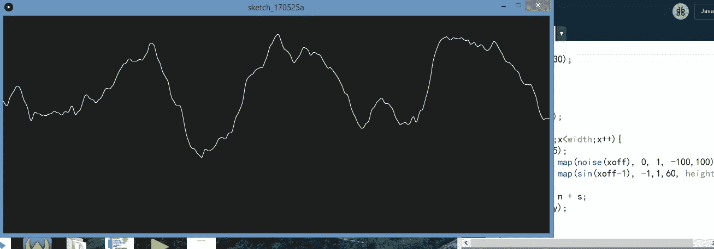
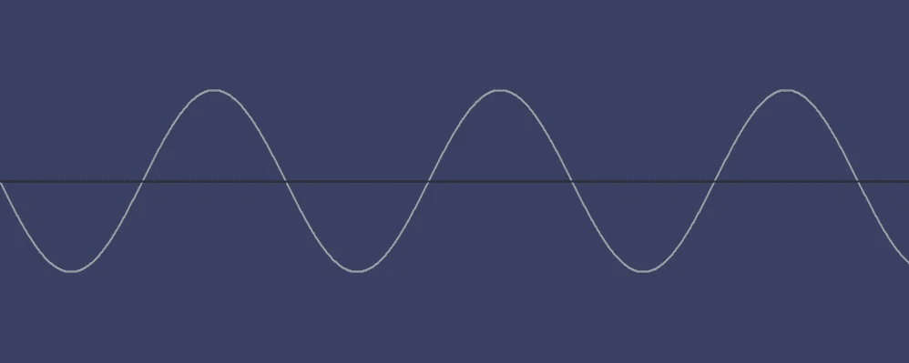
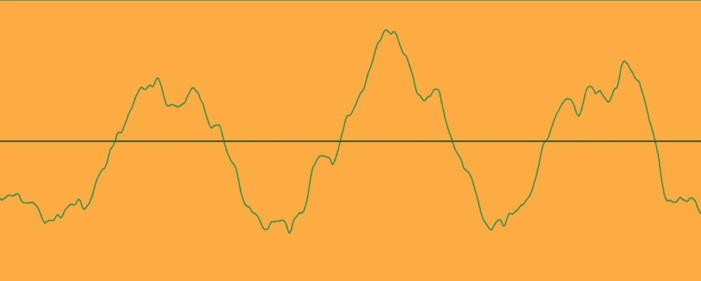
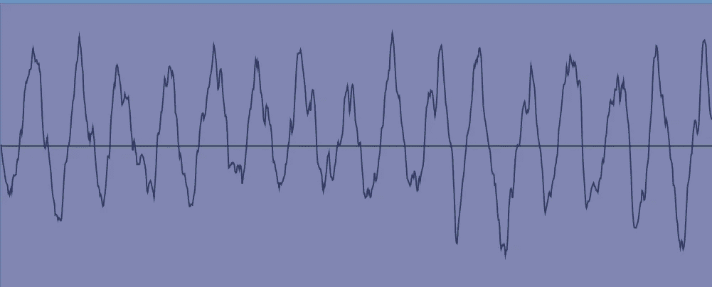
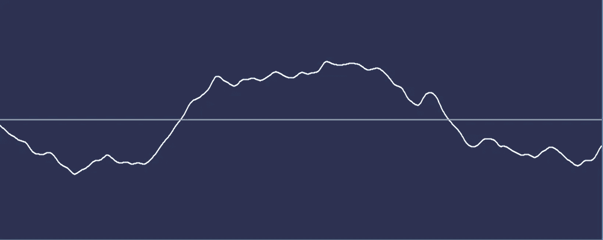

# 生活的图示

> 原文：<https://towardsdatascience.com/a-graphical-representation-of-life-f2dd6a7f9c8b?source=collection_archive---------10----------------------->

Graphs Plotted with Processing

对我来说，生活由一系列的起起落落、好时光和坏时光，或者快乐和悲伤组成，保持着周期性。除了周期性的波峰和波谷，还有一丝混乱和不确定性。

## 解释图表

一个周期波或信号本质上是那些每当一个恒定的时间过去时循环回到一个相似的模式的波或信号，该“时间”正式地被称为信号的“周期”。余弦波是一种常见的周期信号，让我们从它开始。

A Cosine Wave

看着余弦波，一个非常普遍的生活模型出现了——线上的驼峰代表生活中的好时光，而下面的驼峰代表不好的时光。

现在，这种模式还有改进的空间。基本上，一个“快乐”的时间框架仍然会有微小的起伏。“悲伤”的时间框架也是如此。这就是生活不可预测性的来源。这可以通过在余弦图上添加一点噪声来实现。

A Cosine with noise added

最后，我们中的一些人往往会在生活的“好”和“坏”部分之间经历快速的转变或变化。

Rapid transitions

而另一些则倾向于具有较慢的过渡。

Slower Transitions

无论一个人对生活的描述是什么，这里要记住的关键一点是，坏时光结束了，好时光几乎马上就来了。暴风雨总是会放晴，为晴朗的天空腾出空间。

*本文中的所有图表都是使用* [*处理*](https://processing.org/) *编程语言绘制的。向丹尼尔·希夫曼喊出他关于柏林噪声和图形绘制的精彩教程***。**