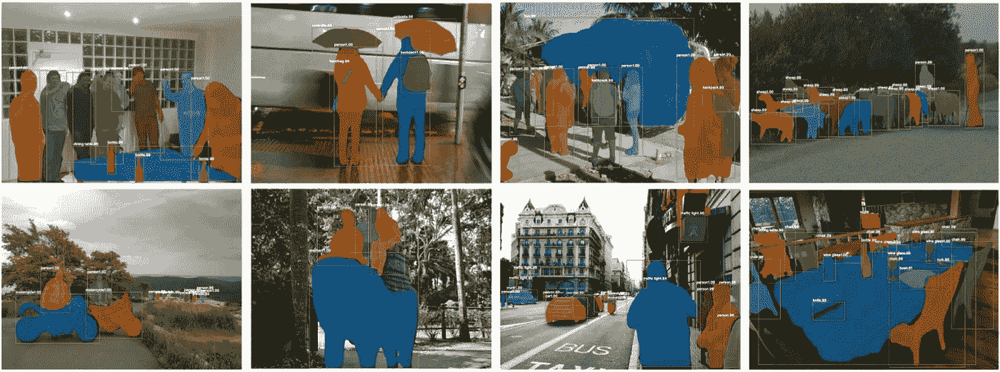
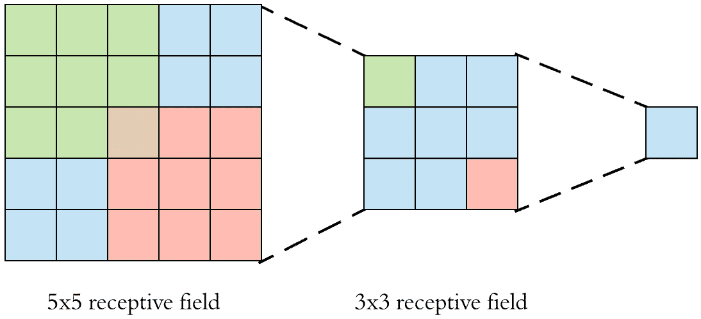
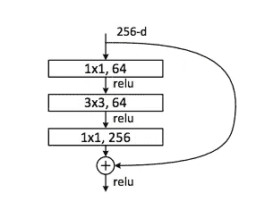
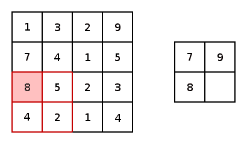
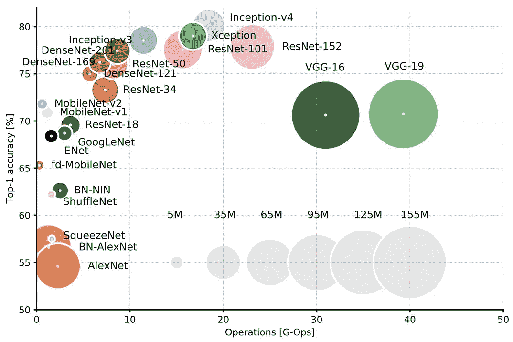
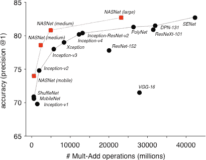
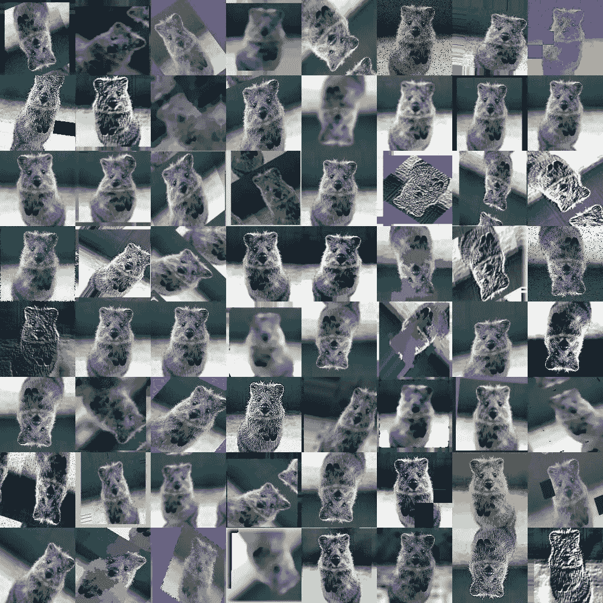

# 构建卷积神经网络指南

> 原文：<https://towardsdatascience.com/a-guide-for-building-convolutional-neural-networks-e4eefd17f4fd?source=collection_archive---------5----------------------->

## 为计算机视觉构建深度网络

> 想获得灵感？快来加入我的 [**超级行情快讯**](https://www.superquotes.co/?utm_source=mediumtech&utm_medium=web&utm_campaign=sharing) 。😎

计算机视觉处于人工智能(AI)进步的最前沿。每天都有新的研究出来，这让我们可以做以前用计算机和人工智能做不到的真正令人惊叹的事情。下图显示了 Mask-RCNN 的结果，这是有史以来为计算机视觉设计的最灵活、最强大的深度网络之一。它能够产生你在下面看到的惊人的分段。

From Mask-RCNN, a state-of-the-art Instance Segmentation network

卷积神经网络(CNN)是我们今天看到的计算机视觉研究中每一个进步背后的驱动力。大多数人从一般意义上知道他们是如何工作的。只需将一堆卷积的东西堆叠成许多层，也许加入一些池，在最后加上一个 softmax，瞧，这就是计算机视觉！

对于一些人来说，有了这种高层次的理解就足以了解正在发生的事情。但是如果你真的想为现实世界的计算机视觉设计一个 CNN，你将需要更多。

你使用哪种预先训练好的网络？你如何修改它来满足你的需求？你的网络应该有 20 层还是 100 层？哪些是最快的？最准确？这些都是在尝试为您的计算机视觉任务选择最佳 CNN 时出现的问题。

让我们来看看你可以用来构建 CNN 的所有构件，不同的权衡，以及如何实际应用它们！

# 盘旋

卷积运算是 CNN 的核心，如何使用它将是网络性能的一个重要决定因素。在你的 CNN 中使用任何大于 3x3 大小的东西都没有多大意义，例如，避免在你的网络中使用 5x5、7x7 等。已经可重复地表明，最显著的是利用 [VGGNet](https://arxiv.org/pdf/1409.1556.pdf) 和 [ResNet](https://arxiv.org/pdf/1512.03385.pdf) ，顺序堆叠 3×3 卷积将有效地实现与更大尺寸卷积相同的*感受域*，同时计算效率更高。

Illustration of how stacking two 3x3 Convolutions will get you a receptive field of 5x5 with 18 parameters (3x3 + 3x3 = 18), while a regular 5x5 Convolution would require 25 parameters to achieve the same thing

1x1 卷积也可用于网络中的某些点，以在用 3x3 进行处理之前降低特征图的维数。ResNets 用下图所示的瓶颈块实现了这一点。我们首先将所有信息压缩到 64 个特征地图中，而不是处理一个巨大的 256 深度的特征地图。一旦它被压缩，我们应用我们的 3×3 卷积；当应用于 64 个要素地图而不是 256 个要素地图时，它的速度要快得多，并且这种处理已经被证明可以获得与常规的 3x3 堆栈相同或更好的结果。最后，在最后，我们使用另一个 1x1 映射回我们原来的 256 大小。

A ResNet bottleneck layer, utilising 1x1 convolutions to reduce feature map dimensionality

至于激活，通常与代码中的卷积相关，一个很好的经验法则是从 ReLU 开始。使用 ReLU 通常会立即得到一些好的结果，而不需要像 eLU、PReLU 或 LeakyReLU 那样进行繁琐的调整。关于哪种激活是最好的，研究界仍有很多争论。但是在实际操作中，差别往往很小，除非你真的需要那额外的 1%,否则用它们做很多实验是不值得的。一旦您确定您的设计与 ReLU 配合得很好，那么如果需要的话，您可以与其他人一起玩，调整他们的参数，尝试并提高最后一点精度。

## **吸取的教训**

*   对于大量的处理，使用 3x3 的堆栈
*   使用 1x1s 来压缩和扩展特征地图，以降低计算成本

# 联营

CNN 中的池用于特征汇总，而当我们深入网络时进行下采样。当我们到达每个“阶段”的末尾并希望进行下采样时，我们保留空间信息的能力将由于下采样而降低。因此，为了保留我们的信息，我们进行了一些汇总来总结我们所拥有的。最常见的两种池类型是最大值和平均值。

关于最大池还是平均池更好，在研究界仍有很多争论。坦率地说，根据我的经验，这种差别可以忽略不计。也就是说，一个常用的范例是在整个网络中使用最大池来保留最佳要素，并在最后使用平均池来在最后一个密集图层之前获得要素的最终矢量表示，然后将数据传递给 softmax。

An illustration of max pooling

## 经验教训

*   作为默认选项，在整个网络中使用最大池，在密集层+ softmax 之前的最末端使用全局平均池
*   您可以尝试其他配置/风格，尽管在大多数情况下收益可能很小。

# 网络深度和结构

网络深度、准确性和速度之间的权衡相当简单。图层越多，总体精度越高，但由于计算量增加，网络运行速度会越慢。总的来说，你可以尝试一下深度，找到最适合你的最佳点。经过一点练习，你可能也能做出一个不错的猜测。需要注意的是，精确度和速度之间的权衡是由收益递减规律决定的，也就是说，我们增加的层数越多，每层给我们的精确度增加的就越少。

至于网络结构，像 ImageNet 这样的标准基准和上面两个漂亮的可视化让我们的工作变得容易多了！对于速度， [MobileNet-v2](https://arxiv.org/pdf/1801.04381.pdf) 和[深度可分离卷积块](https://arxiv.org/pdf/1704.04861.pdf)应该是默认选项。MobileNets 还有一个额外的优势，那就是它们设计得很好，可以在 CPU 上运行，在某些情况下甚至可以达到实时性！其他网络在 GPU 上的性能看起来与 MobileNets 相似，但在 CPU 上却远远不够。这是一个很大的优势，因为 CPU 计算比 GPU 便宜得多($)。

世界上最精确网络的头衔是不分胜负的: [SENet](https://arxiv.org/pdf/1709.01507.pdf) 和 [NASNet](https://arxiv.org/pdf/1707.07012.pdf) 在精确度上相差百分之几。如果你只是想进行迁移学习，那就用 NASNet，因为它有一些深度学习库的内置实现，比如 Keras。然而，当从头开始构建时，SENet 和挤压激励模块在实践中更容易编码。对于快速原型，或者在速度和准确性之间取得平衡的东西，一个常规的 ResNet 和剩余块就足够了。

你可能想玩的最后一件事是图像分辨率。越小越快。越大通常以内存消耗和运行时间的平方增加为代价获得更高的精度。

## 经验教训

*   MobileNet-v2 /深度方向可分离卷积和低速度分辨率
*   SENet / Squeeze-Excitation 或 NASNet 和高精度分辨率
*   余额的常规 ResNet / Residual 块

# 数据预处理和扩充

一个经常被遗忘但需要考虑的关键问题是数据准备、预处理和扩充。你并不总是*有*去做这件事。在对数据进行任何处理之前，您应该首先评估您的应用程序是否会从中受益。

例如，在图像分类中，标准协议是基于训练数据的平均值对图像进行均值归一化。研究文献已经多次证明，均值归一化是一种很好的默认做法。

另一方面，如果你正在进行图像增强，均值归一化实际上会对网络和结果造成相当大的伤害。任何真正与纹理、颜色或外观等非常细微的差异有关的任务，而不是高层次的形状和语义差异，可能会从*而不是*做任何均值归一化中受益。

另一方面，数据扩充已经被强有力地证明能够持续地提高网络性能，无论是在绝对准确性还是普遍性方面。它在从高级分类到低级增强的所有任务范围内都是如此。

话虽如此，你还是应该考虑应用哪些增强的*。例如，如果您正在为自动驾驶汽车进行图像分割，您并不真的希望汽车颠倒行驶！因此，您可以应用水平翻转，但避免垂直翻转。当您实际训练您的最终网络，或者只是快速查看增强有多大帮助时，使用数据增强是最合适的。在此之前，你只是在试验和原型制作，所以没有必要通过更多的数据来延长你的训练时间。*

## 经验教训

*   仅在需要时进行预处理，基于您的任务，并使用经过验证的研究作为指导
*   增强几乎总是增加准确性，只要确保您在反射中使用它，并且数据是您实际期望在应用程序中看到的

# 规范化

当你觉得你过度适应你的训练数据而在测试中表现不佳时，可以使用正则化。当您看到您的训练和测试精度之间的差异非常大时，您可以知道您是否过度拟合，因为您的训练精度比测试精度好得多。

有几个选项可供选择:失落，空间失落，剪切，L1，L2，添加高斯噪声…在研究论文的海洋中还有更多！实际上，dropout 是最容易使用的，因为你通常只需要把它放在几个地方，并调整一个参数。您可以将它放在网络中最后几个密集层之前。如果你觉得自己仍然过度适应，你可以在网络中更早地添加更多，或者调整退出概率。这将缩小你的训练和测试准确性之间的差距。

如果常规辍学失败，你可以和其他人一起玩。像 L1 和 L2，你有更多的调谐选择，所以也许可以校准他们，做一个比辍学更好的正规化工作。在绝大多数情况下，你不需要结合一个以上的正则化技术，即在你的整个网络中只使用一个。

## 吸取的教训

*   出于实用性和易用性的考虑，默认使用 dropout
*   如果辍学失败，探索一些其他可以定制的课程，如 L1 / L2
*   如果所有的技术都失败了，你的训练和测试数据可能会不匹配

# 培养

当你最终想要训练你的网络时，有几种优化算法可供选择。许多人说 SGD 在准确性方面给你带来了最好的结果，这在我的经验中是真实的。然而，调整学习率时间表和参数可能是具有挑战性和乏味的。另一方面，使用 Adam、Adagrad 或 Adadelta 之类的自适应学习速率既快速又简单，但您可能无法获得 SGD 的最佳精度。

这里要做的最好的事情是遵循与激活函数相同的“风格”:首先从简单的开始，看看你的设计是否工作良好，然后使用更复杂的东西进行调整和优化。我建议从 Adam 开始，因为根据我的经验，它非常容易使用:只需设置一个不太高的学习率，通常默认为 0.0001，你通常会得到一些非常好的结果！以后你可以从头开始使用 SGD，甚至从 Adam 开始，然后用 SGD 进行微调。事实上，[本文](https://arxiv.org/pdf/1712.07628.pdf)发现，从 Adam 切换到 SGD 中训，以最简单的方式达到了最好的准确率！看看报纸上的下图:

至于你的数据，越多越好。唯一要考虑的是你从哪里开始得到收益递减。例如，如果您已经达到 95%的准确率，并且您估计如果您将训练数据翻倍，您可以达到 96%，那么可能是时候真正考虑您是否真的需要这 1%，因为达到这一水平所需的努力和资源相当高。当然，要确保您收集的数据反映了您将在实际应用中看到的情况。否则，无论你使用什么算法，选择不当的数据都不能解决问题。

# 喜欢学习？

在[推特](https://twitter.com/GeorgeSeif94)上关注我，我会在那里发布所有最新最棒的人工智能、技术和科学！也在 [LinkedIn](https://www.linkedin.com/in/georgeseif/) 上和我联系吧！