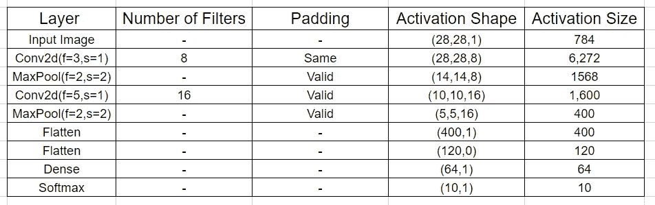
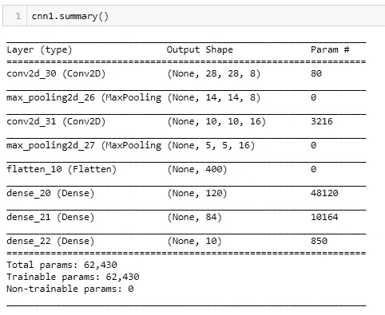
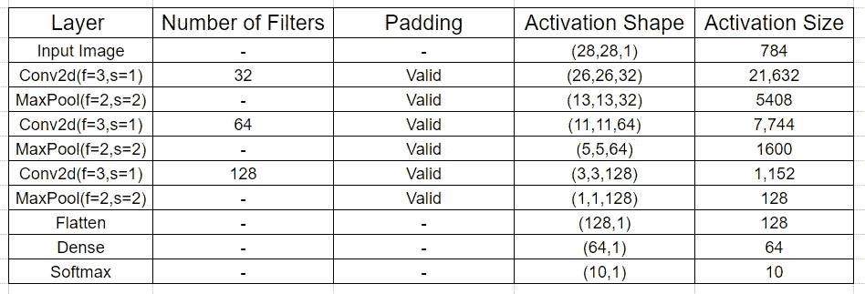
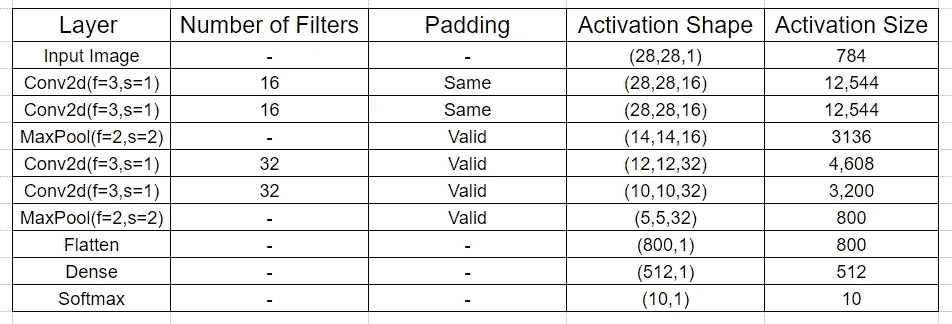

# 建立神经网络体系结构的有效方法指南——第二部分:用 Hyperas 对卷积神经网络进行超参数选择和调整——时尚 MNIST

> 原文：<https://towardsdatascience.com/a-guide-to-an-efficient-way-to-build-neural-network-architectures-part-ii-hyper-parameter-42efca01e5d7?source=collection_archive---------0----------------------->


# 介绍

本文是下面链接的文章的延续，该文章涉及超参数优化的需要以及如何使用 Hyperas 对密集神经网络(多层感知器)进行超参数选择和优化

[](https://medium.com/@shashank.ramesh2396/a-guide-to-an-efficient-way-to-build-neural-network-architectures-part-i-hyper-parameter-8129009f131b) [## 建立神经网络结构的有效方法指南-第一部分:超参数…

### 介绍

medium.com](https://medium.com/@shashank.ramesh2396/a-guide-to-an-efficient-way-to-build-neural-network-architectures-part-i-hyper-parameter-8129009f131b) 

在当前的文章中，我们将从第一部分停止的地方继续，并尝试解决相同的问题，即使用卷积神经网络(CNN)的时尚 MNIST 数据集的图像分类任务。

# 为什么是 CNN？

CNN 有几个不同的滤波器/内核，由可训练的参数组成，这些参数可以在给定的图像上进行空间卷积，以检测像边缘和形状这样的特征。这些高数量的滤波器本质上学习通过反向传播基于所学习的权重从图像中捕捉空间特征，并且滤波器的堆叠层可用于从每个后续级别的空间特征中检测复杂的空间形状。因此，他们可以成功地将一个给定的图像浓缩成一个高度抽象的、易于预测的表示。

在密集网络中，我们试图在作为输入给出的像素值中找到模式，例如，如果像素号 25 和 26 大于某个值，则它可能属于某个类以及该类的一些复杂变体。如果我们在图像中的任何地方都可以有对象，而不一定像在 MNIST 或在某种程度上在时尚 MNIST 数据中那样居中，这可能很容易失败。

另一方面，rnn 在数据中寻找序列，并且边缘或形状也可以被认为是像素值的序列，但是问题在于它们只有一个单一的权重矩阵，该矩阵被所有的循环单元使用，这无助于寻找许多空间特征和形状。而 CNN 可以在一层中具有多个内核/过滤器，使它们能够找到许多特征，并在此基础上形成每个后续层的形状。RNNs 将需要很多层和大量的时间来模拟，因为它们只能在一层找到很少的序列。

因此，让我们继续研究卷积网络，看看更深层次的超参数优化版本能有多好，但在此之前，让我们看看卷积神经网络中的额外超参数。

# 超级参数:CNN

这里我们将讨论 CNN 中的附加参数，请参考第一部分(开头的链接)了解密集层中的超参数，因为它们也是 CNN 架构的一部分。

1.  内核/过滤器大小:过滤器是一个权重矩阵，我们用它对输入进行卷积。卷积上的过滤器可用于测量输入面片与要素的相似程度。特征可以是垂直边缘或拱形，或者任何形状。滤波器矩阵中的权重是在训练数据时导出的。较小的过滤器收集尽可能多的局部信息，较大的过滤器代表更多的全局、高级和代表性信息。如果你认为大量的像素对于网络识别物体是必要的，你将使用大的过滤器(如 11x11 或 9x9)。如果你认为区分物体的是一些小的和局部的特征，你应该使用小的过滤器(3x3 或 5x5)。**注意，通常我们使用奇数尺寸的过滤器。**
2.  填充:填充通常用于添加零的列和行，以在卷积后保持空间大小不变，这样做可能会提高性能，因为它保留了边界处的信息。Keras 中填充函数的参数为 ***Same*** -通过左右均匀填充，输出大小与输入大小相同，但如果要添加的列数为奇数，它会将额外的列添加到右侧。 ***有效*** -输出大小缩小到 **ceil((n+f-1)/s)，其中“n”是输入尺寸，“f”是滤波器大小，“s”是步长。ceil 将小数四舍五入为最接近的整数，**不进行填充。
3.  跨距:通常是在输入权重与过滤器中的权重按元素相乘后，卷积期间水平和垂直遍历输入时希望跳过的像素数。它用于显著减小输入图像尺寸，因为卷积运算后尺寸**缩小到 ceil((n+f-1)/s)，其中“n”是输入尺寸，“f”是滤波器尺寸，“s”是步长。ceil 将小数四舍五入为最接近的整数。**
4.  通道数:它等于输入的颜色通道数，但在后面的阶段等于我们用于卷积运算的滤波器数。通道数量越多，使用的过滤器数量越多，学习的特征就越多，过拟合的机会就越多，反之亦然。
5.  汇集层参数:汇集层也具有与卷积层相同的参数。最大池通常在所有池选项中使用。目标是对输入表示(图像、隐藏层输出矩阵等)进行下采样。)，通过保持子区域中的最大值(激活的特征)入库来减少其维数。

> **引入批量标准化:-** 通常，在深度神经网络架构中，标准化输入在经过中间层的各种调整后变得过大或过小，同时到达较远的层，这导致影响学习的内部同变量偏移问题。为了解决这一问题，我们添加了批量标准化层，以标准化(均值居中和方差缩放)给予后面层的输入。这一层通常必须在通过包含激活功能的层之后、在脱落层(如果有)之前放置在架构中。sigmoid 激活函数是一个例外，其中您需要在激活前放置批处理规范化图层，以确保在应用函数前值位于 sigmoid 的线性区域内。

# 构建 CNN 架构的原则/惯例

> 构建卷积神经网络所遵循的基本原则是在网络的初始阶段保持特征空间的宽和浅，并在接近结束时使其变得更窄和更深

谨记上述原则，我们制定了一些在构建 CNN 架构时需要遵循的惯例来指导您

1.总是从使用更小的过滤器开始是为了收集尽可能多的局部信息，然后逐渐增加过滤器宽度以减少生成的特征空间宽度来表示更全局、更高级和更有代表性的信息

2.遵循该原则，通道的数量在开始时应该是低的，以便它检测低级别特征，这些低级别特征被组合以形成许多复杂的形状(通过增加通道的数量)，这有助于在类别之间进行区分。

增加过滤器的数量以增加特征空间的深度，从而帮助学习更多层次的全局抽象结构。使特征空间变得更深更窄的另一个用途是缩小输入到密集网络的特征空间。

***按照惯例，当我们在卷积神经网络架构中逐层前进时，通道数量通常会增加或保持不变***

3.对于中等或小尺寸图像的卷积层，使用的一般滤波器大小为 3×3、5×5 和 7×7，对于最大池参数，我们使用步长为 2 的 2×2 或 3×3 滤波器大小。较大的过滤器尺寸和跨度可用于将大图像缩小到中等尺寸，然后进一步遵循所述的惯例。

4.当您觉得图像的边界可能很重要或只是为了帮助延长您的网络架构时，请尝试使用 padding = same，因为即使在卷积操作之后，padding 也会保持尺寸不变，因此您可以执行更多的卷积而不会缩小尺寸。

5.不断添加层，直到你超适合。一旦我们在验证集中达到相当高的准确度，我们就可以使用正则化组件，如 l1/l2 正则化、剔除、批量规范、数据扩充等。为了减少过度拟合

5.始终使用经典网络，如 LeNet、AlexNet、VGG-16、VGG-19 等。作为构建模型架构的灵感。我所说的灵感是指遵循架构中使用的趋势，例如 conv-池-conv-池或 conv-conv-池-conv-conv-池层中的趋势，或通道数量 32–64–128 或 32–32–64–64 的趋势，或过滤器尺寸、最大池参数等的趋势。

# 构建 CNN 架构

由于上述惯例，CNN 的超参数调谐比密集网络的调谐稍微困难一些。这是因为 Hyperas 使用随机搜索来寻找可能的最佳模型，这反过来可能导致违反一些惯例，为了防止这种情况发生 ***我们需要设计 CNN 架构，然后在 Hyperas 中微调超参数，以获得我们的最佳模型。***

在调谐密集网络时与 Hyperas 一起使用的方法，其中我们为所有超参数给出一个集合 a 值，并让模块决定哪一个是最佳的，对于调谐 CNN 不起作用。这是因为在每一层，由于卷积和最大池化等操作，输入维度减少，因此，如果我们给定步幅、滤波器大小等超参数的值范围。Hyperas 总是有可能选择一个以负维异常结束并在完成前停止的模块。

那么如何构建你问的架构呢？我们开始吧。但在此之前，我想回顾一下，在使用卷积或池层时，我们将输入图像的维数 N 降低到(N-f+1)/s，其中“f”是滤波器大小,“s”是步长，这在处理过程中对我们非常有帮助。

关于如何构建 CNN 架构的第一个示例如下所示，该示例从 LeNet-5 架构中获得灵感

> 第一步是制作一张包含建筑尺寸、激活形状和大小的表格，如下所示

更多参考请参考 AndrewNg 的视频-【https://www.youtube.com/watch?v=w2sRcGha9nM】T4&t = 485s



这里，我们计算每个卷积或池化操作之后的激活形状为 **(ceil(N+f-1)/s，ceil(N+f-1)/s，滤波器的数量)，其中填充值为“有效”**并且**维度为(N，N，滤波器的数量)，其中使用的填充为“相同”**，这里“N”是输入维度，“f”是滤波器大小，“s”是步长。激活值通过将激活形状的维度中的所有值相乘来计算。

对于第二阶段，N=28，f=3，s=1，滤波器数量=8，填充有效，因此我们得到激活形状为(28，28，8)。激活值= 28x28x8=6272

对于第三阶段最大池层，我们得到 ceil((28–2+1)/2)= ceil(13.5)= 14，因此维度为(14，14，8)。最后一个维度在使用池层时不会改变。激活值= 14x14x8=1568

对于第四级，N=14，f=5，s=1，滤波器数量=8，填充有效，因此我们得到激活形状为((14–5+1)/2，(14–5+1)/2，16)= (10，10，16)

Flatten 使输入成为一维列表，以便输入到密集层，因此激活形状是(400，1)。激活值= 400x1=400

密集激活形状(64，1)表示在密集层中使用了 64 个隐藏单元。激活值= 64x1=64

> 这一计算告诉我们，在构建 CNN 架构时，我们是否选择了正确的参数，因为架构**绝不能因过度使用高值的步长和滤波器尺寸而以负维度**结束
> 
> 确保您选择的值在激活值中有一个**总体下降趋势**，并且在激活值中没有任何非常突然的变化，这一点非常重要

接下来，我们将模型架构转换成 keras 代码。

```
cnn1 = Sequential([
    Conv2D(8, kernel_size=(3, 3), activation='relu',padding='same',input_shape=input_shape),
    MaxPooling2D(pool_size=(2, 2),strides=2),
    Conv2D(16, kernel_size=(5, 5), activation='relu'),
    MaxPooling2D(pool_size=(2, 2),strides=2),
    Flatten(),
    Dense(120, activation='relu'),
    Dense(84, activation='relu'),
    Dense(10, activation='softmax')
])
```

转换成 keras 代码后，检查转换是否正确，尺寸是否符合您的要求，您可以使用<model name="">。摘要“输出形状”列为您提供了输出尺寸</model>



使用学习率为 0.001 的 Adam 优化器通常可以很好地处理 CNN，因此我们使用它来训练架构，以获得如下所示的精度值

```
Train loss: 0.18204240553701917
Train accuracy: 0.932125
-------------------------------
Validation loss: 0.24995902764300507
Validation accuracy: 0.9090833333333334
-------------------------------
```

我们对更多的 CNN 架构重复相同的过程

接下来，我们使用 Conv 池-Conv 池式架构，每一级的滤波器数量增加一倍。该架构如下所示



转换为 Keras

```
cnn1 = Sequential([
    Conv2D(32, kernel_size=(3, 3), activation='relu',input_shape=input_shape),
    MaxPooling2D(pool_size=(2, 2),strides=2),
    Conv2D(64, kernel_size=(3, 3), activation='relu'),
    MaxPooling2D(pool_size=(2, 2),strides=2),
    Conv2D(128, kernel_size=(3, 3), activation='relu'),
    MaxPooling2D(pool_size=(2, 2),strides=2),
    Flatten(),
    Dense(64, activation='relu'),
    Dense(10, activation='softmax')
])
```

使用学习率为 0.001 的 Adam 优化器，我们训练该架构以获得如下所示的精度值

```
Train loss: 0.18507329044366877
Train accuracy: 0.9320625
-------------------------------
Validation loss: 0.287726696540912
Validation accuracy: 0.8989166666666667
-------------------------------
```

最后，我们还训练了一个类似 vgg 的模型，其趋势为 conv-conv-普尔-conv-conv-普尔



转换为 keras

```
cnn1 = Sequential([
    Conv2D(16, kernel_size=(3, 3), activation='relu',padding='same',input_shape=input_shape),
    Conv2D(16, kernel_size=(3, 3), activation='relu',padding='same'),
    MaxPooling2D(pool_size=(2, 2),strides=2),
    Conv2D(32, kernel_size=(3, 3), activation='relu'),
    Conv2D(32, kernel_size=(3, 3), activation='relu'),
    MaxPooling2D(pool_size=(2, 2),strides=2),
    Flatten(),
    Dense(512, activation='relu'),
    Dense(10, activation='softmax')
])
```

获取精度值

```
Train loss: 0.05137992699308476
Train accuracy: 0.9810625
-------------------------------
Validation loss: 0.30437974256711703
Validation accuracy: 0.923
-------------------------------
```

> 步骤 2-选择您希望进行超参数优化的架构

在所有模型中，找出具有最高验证集分数的模型，将其用作基础架构

在我们的模型中，vgg 类模型在验证集上具有最高的准确性值，因此我们选择如下所示的基础架构

```
cnn1 = Sequential([
    Conv2D(16, kernel_size=(3, 3), activation='relu',padding='same',input_shape=input_shape),
    Conv2D(16, kernel_size=(3, 3), activation='relu',padding='same'),
    MaxPooling2D(pool_size=(2, 2),strides=2),
    Conv2D(32, kernel_size=(3, 3), activation='relu'),
    Conv2D(32, kernel_size=(3, 3), activation='relu'),
    MaxPooling2D(pool_size=(2, 2),strides=2),
    Flatten(),
    Dense(512, activation='relu'),
    Dense(10, activation='softmax')
])
```

> 步骤 3-超参数优化

与验证集损失相比，模型中的训练损失非常低，这告诉我们模型过度拟合。因此，我们需要调整超参数，使我们获得低损耗，但不会过度适应这一点，我们将使用 Hyperas。

# 使用 Hyperas: CNN

我们现在使用 Hyperas 优化超参数，类似于我们在第一部分中所做的。更多详情请参考第一部分

为了优化，我们需要 3 个代码块

1.  数据功能

直接从源加载训练和验证数据的函数，或者如果进行了预处理，建议将预处理后的数据存储在 pickle/numpy/hdf5/csv 文件中，并在数据函数中编写代码以从该文件中访问数据。

```
def data():
    (X_train, y_train), (X_test, y_test) = fashion_mnist.load_data()
    X_train, X_val, y_train, y_val = train_test_split(X_train, y_train, test_size=0.2, random_state=12345)
    X_train = X_train.astype('float32')
    X_val = X_val.astype('float32')
    X_train /= 255
    X_val /= 255
    nb_classes = 10
    Y_train = np_utils.to_categorical(y_train, nb_classes)
    Y_val = np_utils.to_categorical(y_val, nb_classes)
    return X_train, Y_train, X_val, Y_val
```

> 调试提示:-如果您遇到任何与数据函数相关的错误，请尝试重新运行代码块，或者在函数的开头再次添加函数或数据函数中使用的包的导入语句

2.模型函数

```
***def model(X_train, Y_train, X_val, Y_val):***

    model = Sequential()
    ***model_choice = {{choice(['one', 'two'])}}
    if model_choice == 'one':***
        model.add(Conv2D(16, kernel_size=3, activation='relu',padding='same', input_shape=(1,28,28), data_format='channels_first'))
        model.add(Conv2D(16, kernel_size=3, activation='relu',padding='same'))
        model.add(MaxPooling2D(pool_size=2,strides=2))
        model.add(Dropout({{uniform(0, 1)}})) model.add(Conv2D(32, kernel_size=3, activation='relu'))
        model.add(Conv2D(32, kernel_size=3, activation='relu'))
        model.add(BatchNormalization())
        model.add(MaxPooling2D(pool_size=2,strides=2))
        model.add(Dropout({{uniform(0, 1)}}))
    ***elif model_choice == 'two':***
        model.add(Conv2D(32, kernel_size=3, activation='relu',padding='same', input_shape=(1,28,28), data_format='channels_first'))
        model.add(Conv2D(32, kernel_size=3, activation='relu',padding='same'))
        model.add(MaxPooling2D(pool_size=2,strides=2))
        model.add(Dropout({{uniform(0, 1)}})) model.add(Conv2D(64, kernel_size=3, activation='relu'))
        model.add(Conv2D(64, kernel_size=3, activation='relu'))
        model.add(BatchNormalization())
        model.add(MaxPooling2D(pool_size=2,strides=2))
        model.add(Dropout({{uniform(0, 1)}}))

    model.add(Flatten())
    model.add(Dense({{choice([256, 512,1024])}}, activation='relu'))
    model.add(BatchNormalization())
    model.add(Dropout({{uniform(0, 1)}}))
    choiceval = {{choice(['one', 'two'])}}
    if choiceval == 'two':
        model.add(Dense({{choice([256, 512,1024])}}, activation='relu'))
        model.add(BatchNormalization())
        model.add(Dropout({{uniform(0, 1)}}))

    model.add(Dense(10, activation='softmax'))

    adam = keras.optimizers.Adam(lr=0.001)

    model.compile(loss='categorical_crossentropy', metrics=['accuracy'],
                  optimizer=adam) model.fit(X_train, Y_train,
              batch_size=256,
              nb_epoch=15,
              verbose=2,
              validation_data=(X_val, Y_val))
    score, acc = model.evaluate(X_val, Y_val, verbose=0)
    print('Val accuracy:', acc)
    return {'loss': -acc, 'status': STATUS_OK, 'model': model}
```

> **注意 Dropout 层的位置，它位于 Max-Pool 层之后。**以这种方式完成布局，支持在学习时消除对小特征集的高度依赖的丢失定义。如果放置在 Max-Pool 图层之前，则由 Dropout 移除的值可能不会影响 Max-Pool 图层的输出，因为它会从一组值中选取最大值，因此只有在移除最大值后，才能考虑移除要素依赖关系。如上所述的批量标准化层被放置在激活功能被应用之后。

在模型函数中，我们可以选择需要优化的超参数。在上面的代码块中，我们针对

1.  密集网络的隐藏单元数和层数(一层或两层)

```
 model.add(Dense({{choice([256, 512,1024])}}, activation='relu'))
    model.add(BatchNormalization())
    model.add(Dropout({{uniform(0, 1)}}))
    ***choiceval = {{choice(['one', 'two'])}}
    if choiceval == 'two':***
        model.add(Dense({{choice([256, 512,1024])}}, activation='relu'))
        model.add(BatchNormalization())
        model.add(Dropout({{uniform(0, 1)}}))
```

“choiceval”的值决定了我们使用双层密集网络还是单层

2.辍学值

```
model.add(Dropout({{uniform(0, 1)}}))
```

3.架构中的通道数量

```
***if model_choice == 'one':***
        model.add(**Conv2D(16**, kernel_size=3, activation='relu',padding='same', input_shape=(1,28,28), data_format='channels_first'))
        model.add(**Conv2D(16**, kernel_size=3, activation='relu',padding='same'))
        model.add(MaxPooling2D(pool_size=2,strides=2))
        model.add(Dropout({{uniform(0, 1)}}))
        model.add(**Conv2D(32**, kernel_size=3, activation='relu'))
        model.add(**Conv2D(32**, kernel_size=3, activation='relu'))
        model.add(BatchNormalization())
        model.add(MaxPooling2D(pool_size=2,strides=2))
        model.add(Dropout({{uniform(0, 1)}}))

***elif model_choice == 'two':***
        model.add(**Conv2D(32**, kernel_size=3, activation='relu',padding='same', input_shape=(1,28,28), data_format='channels_first'))
        model.add(**Conv2D(32**, kernel_size=3, activation='relu',padding='same'))
        model.add(MaxPooling2D(pool_size=2,strides=2))
        model.add(Dropout({{uniform(0, 1)}}))
        model.add(**Conv2D(64**, kernel_size=3, activation='relu'))
        model.add(**Conv2D(64**, kernel_size=3, activation='relu'))
        model.add(BatchNormalization())
        model.add(MaxPooling2D(pool_size=2,strides=2))
        model.add(Dropout({{uniform(0, 1)}}))
```

‘***model _ choice***的值决定了我们选择初始层为 conv(16)-conv(16)-Pool-conv(32)-conv(32)-Pool 还是 conv(32)-conv(32)-Pool-Conv(64)-Conv(64)-Pool 的架构。(括号中的数字代表该层中过滤器的数量。)

3.执行和解释

我们使用上述数据和模型函数开始优化

```
X_train, Y_train, X_val, Y_val = data()best_run, best_model = optim.minimize(model=model,
                                      data=data,
                                      algo=tpe.suggest,
                                      max_evals=30,
                                      trials=Trials(),
                                      notebook_name='Fashion_MNIST')
```

在执行上面的代码片段时，我们在输出中得到下面的框架。我们用这个来匹配调整的超参数值。

```
model = Sequential()
model_choice = space[***'model_choice'***]
if model_choice == 'one'**:**
   model.add(Conv2D(16, kernel_size=3, activation='relu',padding='same', input_shape=(1,28,28), data_format='channels_first'))
   model.add(Conv2D(16, kernel_size=3, activation='relu',padding='same'))
   model.add(MaxPooling2D(pool_size=2,strides=2))
   model.add(Dropout(space[***'Dropout'***]))
   model.add(Conv2D(32, kernel_size=3, activation='relu'))
   model.add(Conv2D(32, kernel_size=3, activation='relu'))
   model.add(BatchNormalization())
   model.add(MaxPooling2D(pool_size=2,strides=2))
   model.add(Dropout(space[***'Dropout_1'***]))
elif model_choice == 'two'**:**
   model.add(Conv2D(32, kernel_size=3, activation='relu',padding='same', input_shape=(1,28,28), data_format='channels_first'))
   model.add(Conv2D(32, kernel_size=3, activation='relu',padding='same'))
   model.add(MaxPooling2D(pool_size=2,strides=2))
   model.add(Dropout(space[***'Dropout_2'***]))
   model.add(Conv2D(64, kernel_size=3, activation='relu'))
   model.add(Conv2D(64, kernel_size=3, activation='relu'))
   model.add(BatchNormalization())
   model.add(MaxPooling2D(pool_size=2,strides=2))
   model.add(Dropout(space[**'Dropout_3'**]))

 model.add(Flatten())
 model.add(Dense(space[***'Dense'***], activation='relu'))
 model.add(BatchNormalization())
 model.add(Dropout(space[***'Dropout_4'***]))
 choiceval = space[**'model_choice_1'**]
 if choiceval == 'two':
   model.add(Dense(space[***'Dense_1'***], activation='relu'))
   model.add(BatchNormalization())
   model.add(Dropout(space[***'Dropout_5'***]))
   model.add(Dense(10, activation='softmax'))
adam = keras.optimizers.Adam(lr=0.001)
```

现在我们需要从 print(best_run)输出中的参数索引中获取我们的值

```
{'Dense': 1, 'Dense_1': 2, 'Dropout': 0.2799579955710103, 'Dropout_1': 0.8593089514091055, 'Dropout_2': 0.17434082481320767, 'Dropout_3': 0.2839296185815494, 'Dropout_4': 0.7087321230411557, 'Dropout_5': 0.3273210014856124, 'model_choice': 1, 'model_choice_1': 0}
```

通过将价值与它们在框架中的位置相匹配来解释上述内容，我们得到了最佳的架构

```
cnn1 = Sequential([
    Conv2D(32, kernel_size=(3, 3), activation='relu',padding='same',input_shape=input_shape),
    Conv2D(32, kernel_size=(3, 3), activation='relu',padding='same'),
    MaxPooling2D(pool_size=(2, 2),strides=2),
    Dropout(0.2),
    Conv2D(64, kernel_size=(3, 3), activation='relu'),
    Conv2D(64, kernel_size=(3, 3), activation='relu'),
    BatchNormalization(),
    MaxPooling2D(pool_size=(2, 2),strides=2),
    Dropout(0.3),
    Flatten(),
    Dense(256, activation='relu'),
    BatchNormalization(),
    Dropout(0.7),
    Dense(10, activation='softmax')
])
```

上述架构的精度和损耗值为

```
Train loss: 0.14321659112690638
Train accuracy: 0.9463333333333334
-------------------------------
Validation loss: 0.17808779059847196
Validation accuracy: 0.93525
-------------------------------
Test loss: 0.20868439328074456
Test accuracy: 0.9227
```

因此，我们最终在测试集上获得了 92.27%的准确率，这优于我们优化的密集网络架构，后者在测试集上获得了 88%的准确率。但最重要的是，我们的模型不是过拟合的，因此将很好地推广到看不见的点，不像其他架构可以实现更高的精度，但对训练集过拟合。

我们可以通过使用数据增强技术来进一步提高这种准确性，但我将把它留给您进行实验。

希望这篇文章对您有所帮助，并且您通过这篇文章学会了如何构建一个高效的 CNN 架构。

更多信息请查看 https://neptune.ai/blog/optuna-vs-hyperopt 的博客文章

感谢您的阅读！

**Connect with the Raven team on** [**Telegram**](https://t.me/ravenprotocol)