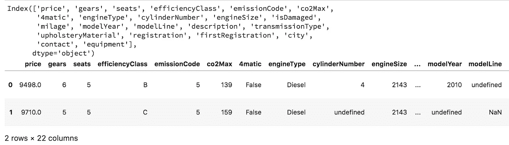
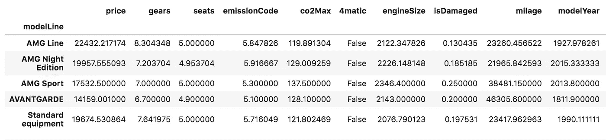
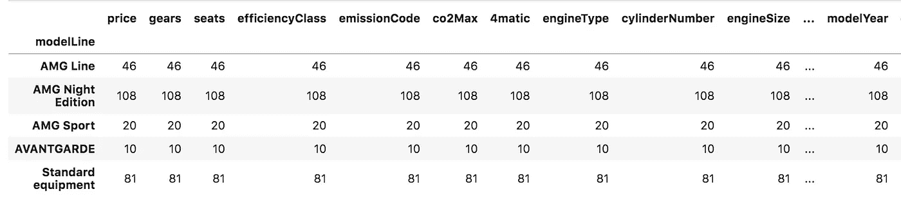
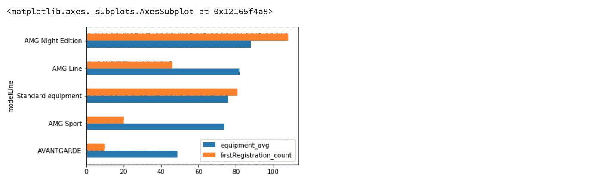
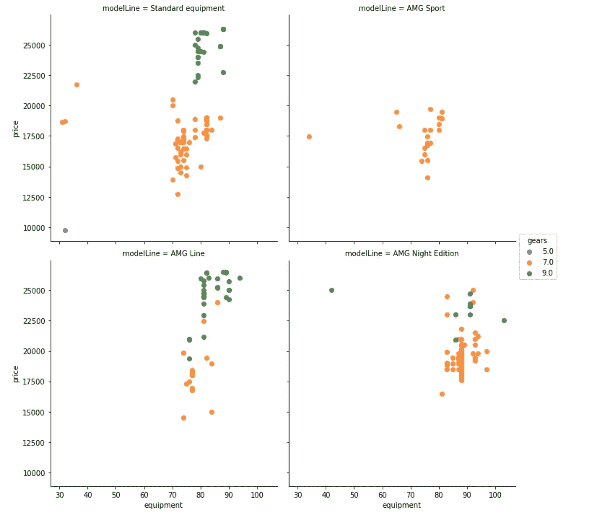
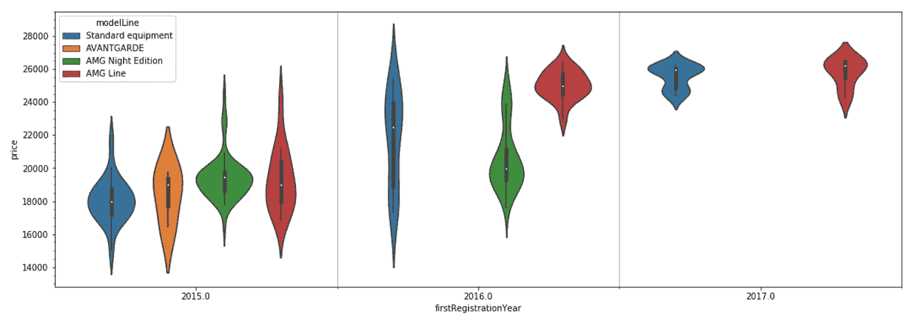
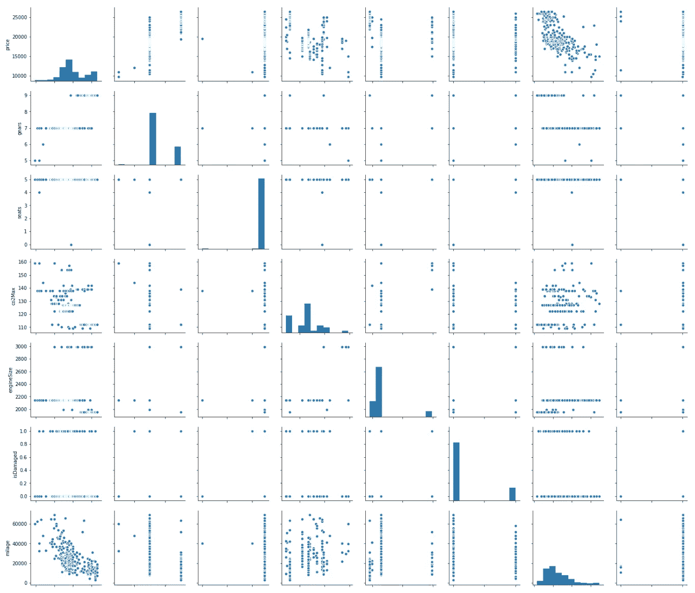
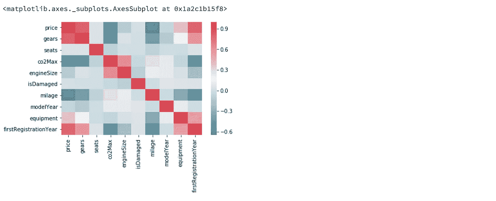
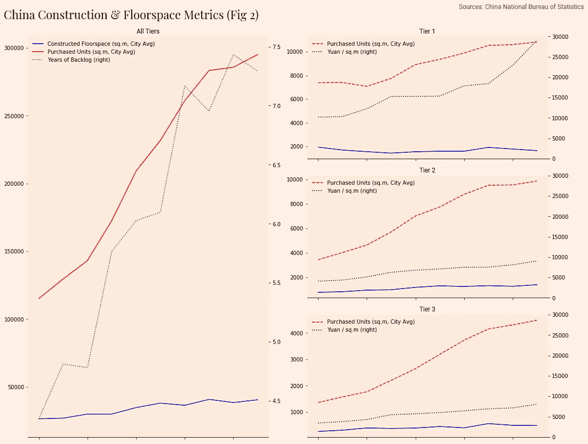
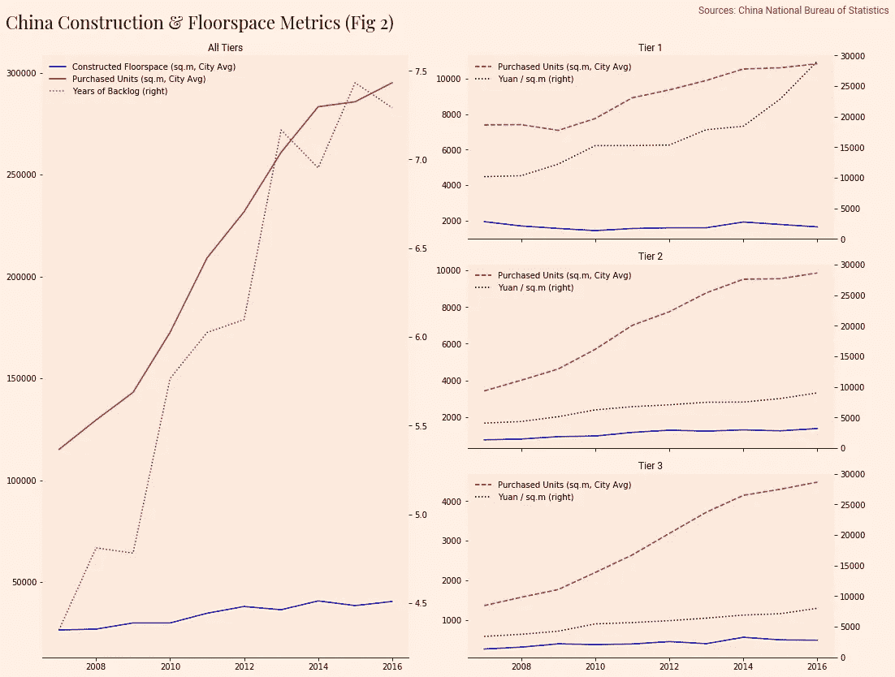

# 熊猫和 Matplotlib 数据探索指南

> 原文：<https://towardsdatascience.com/a-guide-to-pandas-and-matplotlib-for-data-exploration-56fad95f951c?source=collection_archive---------0----------------------->


Photo by [Clint McKoy](https://unsplash.com/photos/ZAlgGuRj0B0?utm_source=unsplash&utm_medium=referral&utm_content=creditCopyText) on [Unsplash](https://unsplash.com/?utm_source=unsplash&utm_medium=referral&utm_content=creditCopyText)

> 在最近使用 Pandas 和 Matplotlib 为我正在写的这篇文章制作图表/分析之后。我决定将这本实用指南放在一起，希望它足以让您使用 Pandas 和 MPL 开始并运行自己的数据探索！
> 
> 本文分为以下几个部分:

**基本要求**

*   从 CSV 读取数据
*   格式化、清理和过滤数据框
*   分组依据和合并

**可视化您的数据**

*   绘图功能基础
*   Seaborn 小提琴和 lm-plots
*   配对图和热图

**身材美学**

*   多轴绘图
*   让你的图表看起来不那么科学

# 基本要求

## 读取 CSV/Matplotlib 和 Pandas 所需的导入

```
import matplotlib.pyplot as plt
import pandas as pd
import numpy as np
%matplotlib inlinecar_data = pd.read_csv('inbox/CarData-E-class-Tue Jul 03 2018.csv')
```

Inline 表示将图形显示为单元格输出， *read_csv* 返回一个数据帧，*文件路径*相对于您笔记本的文件路径。

## 格式化、清理和过滤数据帧

通常在处理大量特性时，使用 *columns* 属性和 *head(nRows)* 函数查看第一行或所有列的名称会更好。但是，如果我们对分类的值的类型感兴趣，例如模型线，我们可以使用方括号语法访问该列，并使用*。unique()* 检查选项。

```
print(car_data.columns)
car_data.head(2)
```



```
car_data['modelLine'].unique()
```


很明显，在“特殊设备”的不同变体下输入了同一型号系列的多个版本，因此我们将使用*正则表达式*将任何包含 se 的内容替换为特殊设备。同样，有些列带有 *Nans(不是数字)*，所以我们将只删除这些带有*dropna(subset =[' model line '])的列。*

```
car_data = car_data.dropna(subset=['modelLine'])
car_data['modelLine'] = car_data['modelLine'].replace(to_replace={'.*SE.*': 'Standard equipment'}, regex=True)
```

我们还可以通过将模型线的行与一些布尔问题进行比较来过滤掉不需要的值，如“未定义”,这将返回一个与 DataFrame 行具有相同维数的布尔数组，可以再次使用方括号语法进行过滤。

```
car_data = car_data[(car_data['modelLine'] != 'undefined')]car_data['modelLine'].unique()
```


This is looking much better!

> 请注意，pandas 从不改变任何现有数据，因此当我们执行任何改变/过滤时，我们必须手动覆盖我们的旧数据。虽然这看起来有些多余，但这是减少代码中不必要的副作用和错误的非常有效的方法。

接下来，我们还需要更改 firstRegistration 字段(通常应该将其视为 python 日期格式),但是为了方便在以后的文章中对数据执行回归，我们将把它视为数值字段。

考虑到该数据与汽车注册相关，年份确实是我们需要保留的重要组成部分。因此，将它视为数值字段意味着我们可以应用数值舍入、乘法/除法来创建如下所示的注册年份特征列。

```
car_data['firstRegistration'].head(5)car_data[‘firstRegistrationYear’] = round((car_data[‘firstRegistration’] / 10000),0)
car_data[‘firstRegistrationYear’] .head(5)
```


Looks like the output we were looking for.

## 使用分组和合并

分组依据可用于根据数据集中的特定要素构建行组，例如“模型线”分类列。然后，我们可以对各个组执行均值、最小值、最大值、标准差等操作，以帮助描述样本数据。

```
group_by_modelLine = car_data.groupby(by=['modelLine'])
car_data_avg = group_by_modelLine.mean()
car_data_count = group_by_modelLine.count()
```



Averages Data



Count Data: Note that this is simply a count of the records for each model Line

如您所见，已经为每条模型线计算了每个数字特征的平均值。Group by 非常通用，也接受 lambda 函数用于更复杂的行/组标记。

接下来，我们将组装一个仅包含相关特征的数据框架，以绘制可用性(或车辆数量)和每辆车平均设备的图表。这个数据框架可以通过传入一个键字典来创建，这些键表示来自现有数据的单列或系列的列和值。这在这里是可行的，因为两个数据框具有相同的行数。或者，我们可以通过索引(模型线)合并两个数据框，并适当地重命名重复列的后缀。

然后，我们将把这两个变量按设备和可用性分类绘制成一个水平条形图。

```
# Since all the columns in car_data_count are the same, we will use just the first column as the rest yield the same result. iloc allows us to take all the rows and the zeroth column.car_data_count_series = car_data_count.iloc[:,0]features_of_interest = pd.DataFrame({'equipment': car_data_avg['equipment'], 'availability': car_data_count_series})alternative_method = car_data_avg.merge(car_data_count, left_index=True, right_index=True, suffixes=['_avg','_count'])alternative_method[['equipment_avg', 'firstRegistration_count']].sort_values(by=['equipment_avg', 'firstRegistration_count'], ascending=True).plot(kind='barh')
```



# 可视化您的数据

## 熊猫情节功能

熊猫有一个内置的。plot()函数作为 DataFrame 类的一部分。它有几个关键参数:

**种类**—‘条形’，‘barh’，‘馅饼’，‘散点’，‘kde’等，可以在文档中找到。
**颜色** —接受与每个数据系列/列顺序对应的十六进制码数组。
**line style**—‘实线’，‘虚线’，‘虚线’(仅适用于线图)
**xlim，ylim** —指定将要绘制图形的元组(下限，上限)
**legend** —显示或隐藏 legend
**标签的布尔值** —对应于数据帧中列数的列表，此处可为 legend
**提供描述性名称**

这些很容易使用，我们将使用。plot()在文章的后面。

## eaborn lmplots

Seaborn 构建在 matplotlib 之上，以提供更丰富的开箱即用环境。它包括一个简洁的 lmplot 绘图功能，用于快速探索多个变量。使用我们的汽车数据示例，我们希望了解汽车的装备套件和销售价格之间的关联。显然，我们也希望这些数据按模型线进行分段，以便进行同类比较。

```
import seaborn as sns
```

传入设备和价格的列标签(x 和 y 轴),后跟实际的数据帧源。使用 col 关键字为每条模型线生成一个单独的地块，并设置 col_wrap 2 以生成一个漂亮的网格。

```
filtered_class = car_data[car_data['modelLine'] != 'AVANTGARDE']sns.lmplot("equipment", "price", data=filtered_class, hue="gears", fit_reg=False, col='modelLine', col_wrap=2)
```



正如你所看到的，在图表上添加一个颜色来表示齿轮的数量是非常有意义的，因为这些类型的车往往没有更好的装备，但是更贵。如您所见，我们可以用 3 行代码对数据集进行重要的探索。

## Seaborn 小提琴情节

这些图非常适合处理大型连续数据集，同样可以通过索引进行分割。使用我们的汽车数据集，我们可以更好地了解二手车的价格分布。由于车龄会显著影响价格，我们将把第一个登记年份作为 x 轴变量，价格作为 y 轴变量，然后我们可以设置色调来区分不同的车型变量。

```
from matplotlib.ticker import AutoMinorLocatorfig = plt.figure(figsize=(18,6))LOOKBACK_YEARS = 3
REGISTRATION_YEAR = 2017filtered_years = car_data[car_data['firstRegistrationYear'] > REGISTRATION_YEAR - LOOKBACK_YEARS]ax1 = sns.violinplot('firstRegistrationYear', "price", data=filtered_years, hue='modelLine')ax1.minorticks_on()
ax1.xaxis.set_minor_locator(AutoMinorLocator(2))
ax1.grid(which='minor', axis='x', linewidth=1)
```



请注意，violin plot 函数返回显示绘图的轴。这允许我们编辑轴的属性。在本例中，我们设置了次要刻度，并使用 AutoMinorLocator 在每个主要间隔之间放置 1 个次要刻度。然后，我用线宽 1 使小网格可见。这是一个巧妙的方法，在每个注册年度都加上一个框。

## 配对图和关联热图

在具有少量要素(10-15 个)的数据集中，Seaborn Pairplots 可以快速实现对变量之间任何关系的可视化检查。沿着左对角线的图形表示每个特征的分布，而在非对角线上的图形显示变量之间的关系。

```
sns.pairplot(car_data.loc[:,car_data.dtypes == 'float64'])
```



(This is only a section, I couldn’t fit all the variables in, but you get the concept.)

同样，我们可以利用 pandas Corr()找到矩阵中每个变量之间的相关性，并使用 Seaborn 的热图函数绘制，指定标签和热图颜色范围。

```
corr = car_data.loc[:,car_data.dtypes == 'float64'].corr()sns.heatmap(corr, xticklabels=corr.columns, yticklabels=corr.columns, cmap=sns.diverging_palette(220, 10, as_cmap=True))
```



这两个工具结合起来对于快速识别模型的重要特征非常有用。例如，使用热图，我们可以从顶行看到，档位数量和首次注册与价格正相关，而与此同时，milage 可能与价格负相关。到目前为止，这是一个完美的分析工具，但在基础层面上很有用。

# 图形美学

## 多轴绘图

以下是我之前关于中国房地产泡沫的文章中的一些数据。我想显示所有城市的建设数据，然后在一个图中按城市层级提供后续细分。



*让我们来分解如何创建这样一个数字:*

首先，我们定义图形的大小，以提供足够的绘图空间。当用多轴绘图时，我们定义一个网格，轴可以放置在网格上。然后，我们使用 subplot2grid 函数返回位于所需位置(从左上角指定)的轴，该轴具有正确的行/列跨度。

```
fig = plt.figure(figsize = (15,12))
grid_size = (3,2)
hosts_to_fmt = []# Place A Title On The Figurefig.text(x=0.8, y=0.95, s='Sources: China National Bureau of Statistics',fontproperties=subtitle_font, horizontalalignment='left',color='#524939')# Overlay multiple plots onto the same axis, which spans 1 entire column of the figurelarge_left_ax = plt.subplot2grid(grid_size, (0,0), colspan=1, rowspan=3)
```

然后，我们可以通过指定绘图函数的 ax 属性，在这个轴上绘图。请注意，尽管绘制到特定的轴上，但使用 secondary_y 参数意味着将创建一个新的轴实例。这对于以后存储格式非常重要。

```
# Aggregating to series into single data frame for ease of plottingconstruction_statistics = pd.DataFrame({
    'Constructed Floorspace (sq.m, City Avg)':
     china_constructed_units_total,
    'Purchased Units (sq.m, City Avg)':     
     china_under_construction_units_total,
})construction_statistics.plot(ax=large_left_ax,
    legend=True, color=['b', 'r'], title='All Tiers')# Second graph overlayed on the secondary y axislarge_left_ax_secondary = china_years_to_construct_existing_pipeline.plot(
    ax=large_left_ax, label='Years of Backlog', linestyle='dotted',
    legend=True, secondary_y=True, color='g')# Adds the axis for formatting laterhosts_to_fmt.extend([large_left_ax, large_left_ax_secondary])
```

为了生成城市层级的细分数据，我们再次使用了 subplot2grid，但这一次改变了每个循环的指数，这样三个层级的图表一个在另一个之下。

```
# For each City Tier overlay a series of graphs on an axis on the right hand column
# Its row position determined by its indexfor index, tier in enumerate(draw_tiers[0:3]):
    tier_axis = plt.subplot2grid(grid_size, (index,1))

    china_constructed_units_tiered[tier].plot(ax=tier_axis,     
     title=tier, color='b', legend=False)

    ax1 = china_under_construction_units_tiered[tier].plot(
     ax=tier_axis,linestyle='dashed', label='Purchased Units 
     (sq.m,City Avg)', title=tier, legend=True, color='r')  

    ax2 =china_property_price_sqmetre_cities_tiered[tier].plot(
     ax=tier_axis, linestyle='dotted', label='Yuan / sq.m', 
     secondary_y=True, legend=True, color='black')

    ax2.set_ylim(0,30000)hosts_to_fmt.extend([ax1,ax2])
```

*好了，现在我们已经生成了正确的布局和绘图数据:*


## 让你的图表看起来不那么科学

在上图的例子中，我选择了类似 ft.com 的造型。首先，我们需要通过 Matplotlib 字体管理器导入字体，并为每个类别创建一个字体属性对象。

```
import matplotlib.font_manager as fm# Font Importsheading_font = fm.FontProperties(fname='/Users/hugo/Desktop/Playfair_Display/PlayfairDisplay-Regular.ttf', size=22)subtitle_font = fm.FontProperties(
fname='/Users/hugo/Library/Fonts/Roboto-Regular.ttf', size=12)# Color Themescolor_bg = '#FEF1E5'
lighter_highlight = '#FAE6E1'
darker_highlight = '#FBEADC'
```

接下来，我们将定义一个函数，它将:

*   设置图形背景(使用 set_facecolor)
*   使用指定的标题字体将标题应用于插图。
*   调用*紧凑布局*功能，更紧凑地利用绘图空间。

接下来，我们将遍历图中的每个轴，并调用一个函数来:

*   禁用除底部脊椎(轴边界)之外的所有脊椎
*   将轴的背景颜色设置得稍暗一些。
*   如果图例存在，禁用图例周围的白色框。
*   将每个轴的标题设置为使用副标题字体。

最后，我们只需要调用我们创建的格式化函数，并传入我们之前收集的图形和轴。



# 结论

感谢您阅读本教程，希望这有助于您开始使用 Pandas 和 Matplotlib。