# 差分隐私的高级介绍

> 原文：<https://towardsdatascience.com/a-high-level-introduction-to-differential-privacy-edd20e6adc3b?source=collection_archive---------8----------------------->

## 在隐私和实用性之间取得平衡

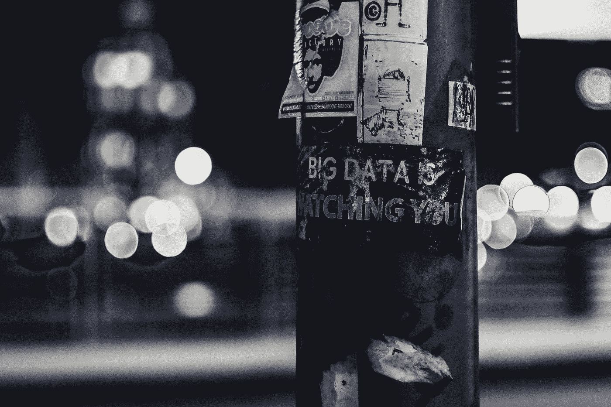

Photo by [ev](https://unsplash.com/photos/gpjvRZyavZc) on [Unsplash](https://unsplash.com/)

在一个数据科学家眼里，你生命中的每一刻都是一个数据点。从你的牙膏品牌到你挥手的次数，我们经常认为理所当然的细节是可以用来推断我们行为和意图的关键因素。这些由跨国组织挖掘的见解可以用来使我们集体生活的各个方面更加方便和有趣，但代价是我们的私人信息被暴露甚至被利用。

以美国第二大百货零售商 Target 为例，该公司在 2012 年决定实施一种看似直观的方法，根据客户的特定需求定制他们的购物体验。目标是找出哪些客户最有可能怀孕，然后根据计算出的可能性向这些客户发送与怀孕相关的广告。我们可以将 Target 的想法解释为双管齐下的方法:1 .存储或合并数据以分析怀孕买家的趋势。2.应用技术或算法将新客户的数据点与以前客户的购买模式相关联，以确定一个人想要孩子的可能性。当 Target 在一名少女的家人知道她怀孕之前向她发送了与孕产相关的广告(混合了来自不同部门的广告)时，Target 的倡议成为了隐私和机器学习算法交汇处的许多讨论的中心(来源:福布斯关于[的文章“Target 如何在她的父亲之前发现一名少女怀孕了”](https://www.google.com/amp/s/www.forbes.com/sites/kashmirhill/2012/02/16/how-target-figured-out-a-teen-girl-was-pregnant-before-her-father-did/amp/))。这些隐私问题不仅适用于出于营销目的的数据收集和存储，也适用于从人口普查数据到社交媒体的各种应用。

因此，**大数据、机器学习和数据科学的出现使得重新考虑隐私成为必要，这是有道理的。**

差分隐私被认为是可以帮助我们实现这一目标的最先进的概念之一，并且已经被苹果、优步、美国人口普查局和其他组织所使用。

在这篇文章中，我将概括介绍什么是差分隐私，为什么它是相关的，它是如何实现的，以及如何使用它。

# 什么是差分隐私？

差分隐私(DP)的主要前提包括确保数据主体不受其进入或参与数据库的影响(例如，不受伤害)，同时最大化查询的效用/数据准确性(与随机/空输出相对)。

DP 保证:

*   原始数据不会被查看(也不需要修改)。
*   维护受试者的隐私将比从数据中挖掘重要的洞察力更有价值。
*   对后处理的弹性；对差分私有算法的输出进行后处理不会影响算法的差分私有性。换句话说，对数据库没有额外知识的数据分析师不能简单地通过考虑 DP 算法的输出来增加隐私损失(**来源:**[*【differential 隐私的算法基础】*](https://www.cis.upenn.edu/~aaroth/Papers/privacybook.pdf) )。

基于概述的保证，这意味着如果数据分析师/对手依赖于仅相差一个数据条目的数据库，最终结果改变的概率将不会受到该数据条目的存在/不存在/修改的影响(结果最多改变一个倍数)。换句话说，当使用 DP 时，分析师或对手不能根据查询的输出来区分数据库。

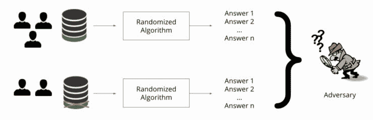

Taken from Ian Goodfellow and Nicholas Papernot’s blog post [“Privacy and machine learning: two unexpected allies”](http://www.cleverhans.io/privacy/2018/04/29/privacy-and-machine-learning.html)

然而，与他/她对从数据中挖掘出的结论的感知相关的个人的伤害或收益不受 DP 概念的保护。DP 的正式(数学)定义如下:

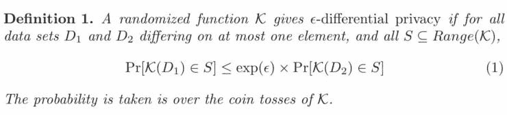

Taken from [*Differential Privacy: A Survey of Results*](http://web.cs.ucdavis.edu/~franklin/ecs289/2010/dwork_2008.pdf)

Cynthia Dwork 在论文 [*“差分隐私的承诺算法技术教程”*](https://ieeexplore.ieee.org/document/6108143) 中用一个简单的例子演示了 DP:

正在为一项研究向个人收集数据(玛丽是一名吸烟者，是研究参与者之一)。这项研究得出的结论是，吸烟极有可能致癌。差异隐私保证:

*   分析趋势的数据科学家或数据库经理不能直接访问原始数据。
*   诸如 Mary 的保险费之类的服务不会基于她在数据集中的参与而改变。

然而，这项研究的结论性分析(“吸烟可能导致癌症”)对伤害/好处的效用留给了玛丽的感知；玛丽可以选择相信“基于这项研究的发现，我可以通过戒烟来预防潜在的癌症”，与这种说法完全相反，或者别的什么。

# 为什么这很重要？

> *“数据是信息时代的污染问题，保护隐私是环境挑战。”—* 布鲁斯·施奈尔

确保隐私对于许多应用至关重要，包括维护敏感信息的完整性，消除对手根据个人身份信息跟踪用户的机会(PII)等。DP 对各种应用都有吸引力，因为它保证了以下隐私“需求”:

DP 消除了数据分析师可能不得不使用的任何潜在方法来区分特定个人与其他参与者，或将特定行为与之前识别的个人相关联，以便相应地定制内容/服务；因此，DP 确保与参与研究相关的隐私风险不会显著增加( [*【辛西娅·德沃克的“差分隐私”*](https://www.utdallas.edu/~muratk/courses/privacy08f_files/differential-privacy.pdf) *)* )。

这是因为无法直接访问原始数据，并且使用个人独有的发现来专门针对或影响特定个人违反了个人在数据集中的存在不应影响其接受服务的机会的规则。此外，使用 DP 不需要成为隐私或 DP 专家(即深入了解 DP 的内部机制),而且如上所述，DP 对后处理具有弹性。DP 还延伸到群体隐私，尽管增加群体的规模会削弱 DP 界限( [*“差异隐私:结果调查”*作者 Cynthia Dwork](http://web.cs.ucdavis.edu/~franklin/ecs289/2010/dwork_2008.pdf) )。

我们现在可以看到，上面呈现的 Target 从购买行为中预测母性的例子可能是对差分隐私概念的违反。在预测一名少女怀孕的案例中(如这里的[所述](https://www.google.com/amp/s/www.forbes.com/sites/kashmirhill/2012/02/16/how-target-figured-out-a-teen-girl-was-pregnant-before-her-father-did/amp/)，Target 应该将个人的购买趋势与其他期待孩子的客户的其他模式相关联，并开始根据她在数据集中的参与情况专门为她量身定制广告。如果她被从数据集中删除，Target 将不会向她发送与生育相关的广告，这违反了差异隐私的概念。

作为一个题外话，重要的是要注意到**思考这样的道德场景并不是这么简单**。销售的目标是通过说服顾客他/她需要某件商品来激励顾客购买该商品。Target 向购买了与其他顾客相似的商品的个人提供有针对性的广告，这可能侵犯了差分隐私，因为 Target 使用从组织收集的数据来帮助顾客了解公司可能提供的潜在好处，并根据他们的个人需求定制购物体验。

此外，也有反对我提到的立场的论点。一种观点强调，如果目标确实使用了该算法，它也不会是完全准确的(没有算法是完全准确的)，因此会犯许多错误(即误报)。另一个角度(在《金融时报》的文章《大数据:我们正在犯一个大错误吗？》中解释))声明 Target 邮件列表上的每个人都会收到与孕产相关的广告和其他类型的广告。不仅仅是期待的顾客。

# 这是如何工作的？

虽然 DP 本身不是一个算法，但将 DP 的应用程序想象成位于数据分析师和数据库之间的一个软件会有助于理解它是如何工作的:

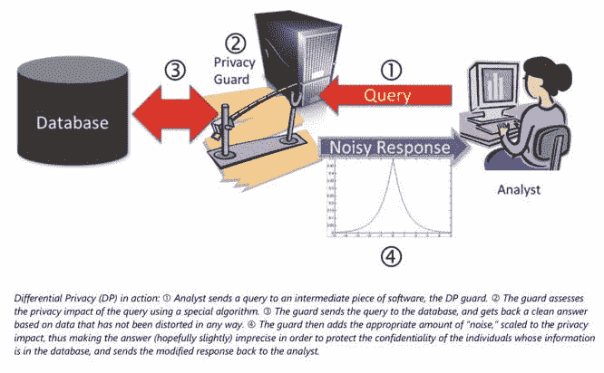

Taken from Microsoft’s [“Differential Privacy for Everyone”](http://download.microsoft.com/download/D/1/F/D1F0DFF5-8BA9-4BDF-8924-7816932F6825/Differential_Privacy_for_Everyone.pdf), page 4

查询是由用户传递给 DP 警卫的输入；一个示例查询可能是“计算数据库中的行数”。差分隐私有许多变体——本节讨论ε-差分隐私，它不同于(ε，δ)-差分隐私和 DP 的其他(较弱)版本(如果您想了解 DP 的其他版本，请参见[“我们的数据，我们自己:通过分布式噪声生成的隐私”](https://www.iacr.org/archive/eurocrypt2006/40040493/40040493.pdf))。

DP 的主要目标之一是在*隐私损失*(由ε测量，为此需要选择一个值，例如 0.01)和*效用最大化*(可以通过数据精度等许多参数测量)之间进行平衡。ε = 0 的值导致完全的私密性，但缺乏实用性，而较高的ε值导致私密性缺乏，但具有良好的实用性。(摘自 [*《差分隐私的承诺:算法技术教程》*](https://ieeexplore.ieee.org/document/6108143) )。

如微软白皮书[“每个人的差分隐私”中所述，](http://download.microsoft.com/download/D/1/F/D1F0DFF5-8BA9-4BDF-8924-7816932F6825/Differential_Privacy_for_Everyone.pdf)DP 技术将原始数据作为输入，从原始输入数据中找到答案，然后基于各种因素(例如，数据库的大小、查询的类型等)引入失真。)

> 在查询函数 f 上，隐私机制 k 用 f(X)+(lap(δf/ε))^k 以分布 lap(δf/ε)添加噪声)独立地响应 f(x)的 k 个分量中的每一个。
> 
> *——摘自辛西娅·德沃克的《Differential 隐私:调查结果》*

*换句话说，DP“守卫”的作用是为查询(定义为函数 *f* )的真实答案(定义为*f(x)】+*(lap(δf/ε))^k*)中的每个 *k* 输出项添加噪声；DP 防护的输出或最终结果称为响应。**

*让我们把它分解一下。*

*噪声是通过拉普拉斯分布(在上式中表示为 *Lap* )添加的，这类似于正态分布/钟形曲线——正态分布和拉普拉斯分布都是单一模型(具有一个峰值)和对称的概率分布类型(分布的左侧和右侧同等平衡)。然而，主要的区别是拉普拉斯分布有一个更尖锐的峰值，正如 [Statistics How To](https://www.statisticshowto.datasciencecentral.com/laplace-distribution-double-exponential/) 在他们的文章中解释的那样。*

*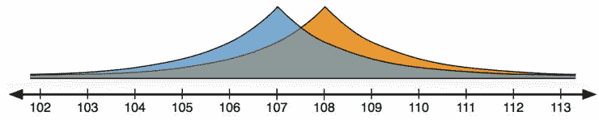*

*A picture of the Laplace Distribution from Frank McSherry’s blog post [“Differential Privacy for Dummies”](https://github.com/frankmcsherry/blog/blob/master/posts/2016-02-03.md)*

*值得注意的是，也可以使用其他机制来代替拉普拉斯分布。例如，虽然拉普拉斯机制对于任何具有实数作为输出的函数都有效，但是指数机制可以用于相反的情况(没有实数作为输出的函数)并且是添加噪声不实际的情况；类似于*的指数机制函数给定一个数据集，使用测量输出质量的效用函数产生一个输出/对象*(来源:摘自[*“differential 隐私:结果调查”*](http://web.cs.ucdavis.edu/~franklin/ecs289/2010/dwork_2008.pdf) 和 [*“野外差分隐私当前实践和公开挑战教程”*](http://sigmod2017.org/wp-content/uploads/2017/03/04-Differential-Privacy-in-the-wild-1.pdf) )。*

*使用 DP 时，我们需要计算查询的敏感度(敏感度表示为*δf，*查询表示为函数 *f**

*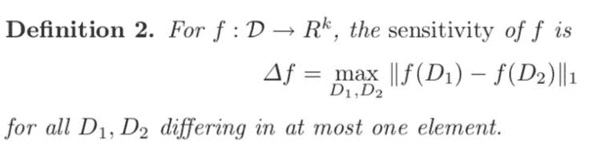*

*Taken from [*Differential Privacy: A Survey of Results*](http://web.cs.ucdavis.edu/~franklin/ecs289/2010/dwork_2008.pdf)*

*查询的敏感性有助于我们了解个人数据对计算的影响程度，从而了解需要添加的噪声量。 *f* 的灵敏度通常较小，因此，在大多数情况下，DP 算法不需要添加太多噪声；当ε(隐私损失)的值固定时，较大的敏感度用作需要添加更多噪声来掩盖数据的警告(来源: [*“隐私的构建块:差分隐私机制”*](http://dimacs.rutgers.edu/~graham/pubs/slides/privdb-tutorial.pdf) ，作者:Graham Cormode)。*

*需要注意的重要一点是，随着更多的问题被问及，DP 的隐私保证会减弱。这将我们带到顺序和并行合成的正式定义:*

> ***“顺序合成:**如果你执行两个(或更多)差分隐私计算，它们共同提供差分隐私，其参数由你使用的参数的总和限定” *(* [*《差分隐私:图解入门》*](https://github.com/frankmcsherry/blog/blob/master/posts/2016-02-06.md) *)。**

*根据顺序合成的定义，如果您有两个差分私有计算，这意味着结果将是ε1 + ε2 差分私有(摘自 Graham Cormode 的“[隐私的构建块:差分私有机制”](http://dimacs.rutgers.edu/~graham/pubs/slides/privdb-tutorial.pdf))。并行组合涉及“释放每个具有ε-差分隐私的单元”，而不是顺序组合提出的总和(如 Graham Cormode 的“[隐私的构建块:差分私有机制](http://dimacs.rutgers.edu/~graham/pubs/slides/privdb-tutorial.pdf)”中所述)。如“ [*差分隐私:结果调查*](http://web.cs.ucdavis.edu/~franklin/ecs289/2010/dwork_2008.pdf) *，*中所述，“通过在每个查询上运行具有拉普拉斯噪声分布的差分隐私算法，可以为任何查询序列确保差分隐私。另外要补充的一点是调查中提到的，敏感性和隐私损失(这是添加噪声所需的参数)与数据库的大小和数据库本身无关；较大的数据库导致对普通查询的差分私有算法具有较高的准确性。除了关于如何最大化 DP 在不敏感查询上的潜力的细节以及产生差分隐私的数学证明/定理之外，关于这一点的进一步讨论可以在[调查](http://web.cs.ucdavis.edu/~franklin/ecs289/2010/dwork_2008.pdf)中找到。*

*这一节可以用这个定理来概括:*

*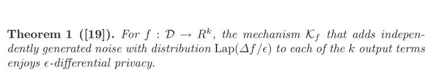*

*[*Taken from Differential Privacy: A Survey of Results*](http://web.cs.ucdavis.edu/~franklin/ecs289/2010/dwork_2008.pdf)*

# *这是如何使用的？*

*   *美国人口普查局在 2008 年的 OnTheMap 应用程序中实现了 DP，以确保居住人口数据的隐私性。阅读这篇文章中的更多细节:" [*保护美国统计数据的保密性:在人口普查局采用现代披露避免方法*](https://www.census.gov/newsroom/blogs/research-matters/2018/08/protecting_the_confi.html) *"* 由约翰·m·阿伯德博士撰写。*
*   *苹果在苹果机器学习杂志的文章 [*“大规模隐私学习”*](https://machinelearning.apple.com/2017/12/06/learning-with-privacy-at-scale.html) 中描述了利用 DP 的三种用例:发现流行的表情符号，识别使用 Safari 访问的资源密集型网站，以及发现新词的使用。苹果实现的一个新颖方面是他们使用了三种不同的私有算法——私有计数均值草图算法、私有哈达玛计数均值草图和私有序列片段拼图。*

*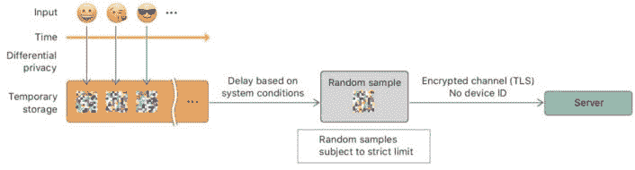*

*Taken from the article [“Learning with Privacy at Scale” from Apple’s Machine Learning Journal](https://machinelearning.apple.com/2017/12/06/learning-with-privacy-at-scale.html)*

*   *微软应用 DP 来掩盖个人在其地理位置数据库中的位置；这种方法包括随机删除、添加和打乱单个数据点。其实现的一个新颖方面是创建了 [PrivTree](https://www.microsoft.com/en-us/research/blog/project-privtree-blurring-location-privacy/) ，在给定原始数据和一些其他参数(要使用的拉普拉斯噪声的比例、用于决定是否应该发生节点分裂的阈值等)的情况下。)，可以实现差分私有算法，并为几乎任何种类的位置数据输出噪声数据。*

*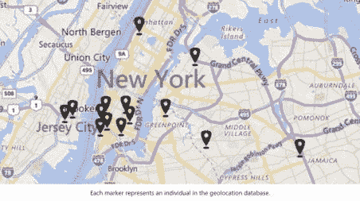**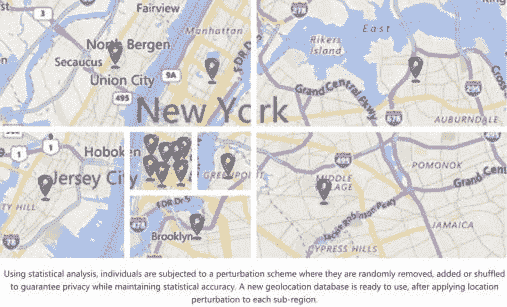*

*Pictures taken from Microsoft’s blog post [“Project PrivTree: Blurring your “where” for location privacy”](https://www.microsoft.com/en-us/research/blog/project-privtree-blurring-location-privacy/)*

*   *优步将差分隐私作为其数据分析管道和其他开发工作流程的一部分。他们的[实现](http://uber/%20releases%20open%20source%20project%20for%20differential%20privacy/)的一个新颖方面是使用弹性敏感度，这种技术允许您计算查询的敏感度，并满足优步苛刻的性能和可伸缩性要求。*

*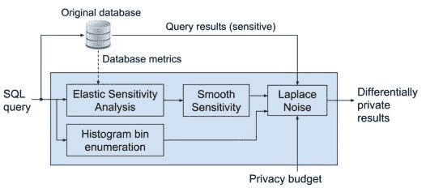*

*Taken from Uber Security’s Medium article [“Uber Releases Open Source Project for Differential Privacy”](http://uber/%20Releases%20Open%20Source%20Project%20for%20Differential%20Privacy)*

*   *谷歌实施了 DP 作为其[随机可聚合隐私保护顺序响应(RAPPOR)技术](https://static.googleusercontent.com/media/research.google.com/en//pubs/archive/42852.pdf)的一部分，该技术允许数据分析师研究客户的数据，而无需查看单个数据点。他们实现的一个新颖方面是，DP 的实现是为了在 RAPPOR 执行的两个重要步骤中保证客户端隐私:*永久随机响应*确保隐私不受生成的噪声的影响，而*瞬时随机响应*防止攻击者使用永久随机响应。*

*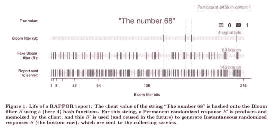*

*Taken from the paper [“RAPPOR: Randomized Aggregatable Privacy-Preserving Ordinal Response”](https://static.googleusercontent.com/media/research.google.com/en//pubs/archive/42852.pdf) by Úlfar Erlingsson, Vasyl Pihur, and Aleksandra Korolova*

# *额外资源*

*这篇文章仅仅触及了不同隐私的表面。如果你想进一步探索动态规划的内部机制和应用，有很多很好的资源；其中一些包括:*

*   *在微软的研究网站[这里](https://www.microsoft.com/en-us/research/search/?q=differential+privacy&content-type=publications&sort_by=most-relevant)可以找到关于 DP 的出版物概要。*
*   *[Georgian Impact 的媒介文章《差分隐私简介》](https://medium.com/georgian-impact-blog/a-brief-introduction-to-differential-privacy-eacf8722283b)除了对拉普拉斯噪声计数机制的模拟。*
*   *[《差分隐私小教程》](https://borjaballe.github.io/slides/dp-tutorial-long.pdf)Borja Balle 著。*
*   *《科学美国人》文章[“数字隐私:保护数据的新方法”](https://www.scientificamerican.com/article/privacy-by-the-numbers-a-new-approach-to-safeguarding-data/)*
*   *Frank McSherry 关于差分隐私的博客帖子(其中一些包含用于演示目的的代码)，比如[这篇帖子](https://github.com/frankmcsherry/blog/blob/master/posts/2016-02-06.md)。*
*   *宾夕法尼亚州立大学课程 [*的课堂讲稿和课程材料数据隐私中的算法挑战*](http://www.cse.psu.edu/~ads22/privacy598/lec-notes/)*
*   *演讲幻灯片:[“野外的不同隐私:当前实践和公开挑战指南”。](http://sigmod2017.org/wp-content/uploads/2017/03/04-Differential-Privacy-in-the-wild-1.pdf)*
*   *如果你想了解我们如何将 DP 应用于机器学习，我推荐你阅读尼古拉斯·帕伯诺特和伊恩·古德菲勒的博客文章[“隐私和机器学习:两个意想不到的盟友？”](http://www.cleverhans.io/privacy/2018/04/29/privacy-and-machine-learning.html)和马丁·阿巴迪及其同事的论文[“具有差异隐私的深度学习”](https://arxiv.org/pdf/1607.00133.pdf)。*
*   *如果你对机器学习和隐私之间的交集感兴趣，请查看 [NeurIPS 2018 " *隐私保护机器学习*研讨会](https://ppml-workshop.github.io/ppml/)。*

*感谢您的阅读！*

**原载于 2018 年 11 月 20 日*[*demystifymachinelearning.wordpress.com*](https://demystifymachinelearning.wordpress.com/2018/11/20/intro-to-differential-privacy/)*。**