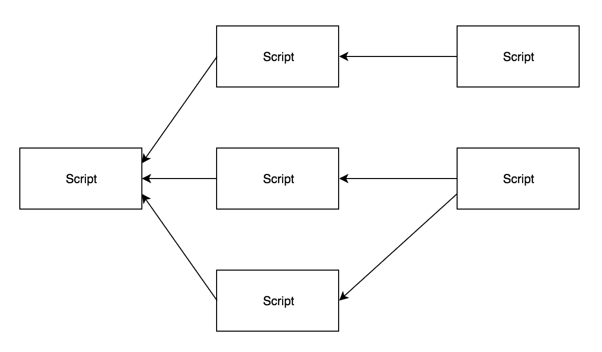

# 基于后见之明的数据科学博士学位方法

> 原文：<https://towardsdatascience.com/a-hindsight-based-approach-to-a-phd-in-data-science-9a272cf65394?source=collection_archive---------7----------------------->

最近刚完成计算机科学(更具体地说是数据科学)的博士学位，事后回想起来，我发现有些事情我会采取不同的做法。我的目标是这篇文章对那些刚刚开始或考虑攻读数据科学博士学位的人有用。

Photo by [Glen Noble](https://unsplash.com/photos/o4-YyGi5JBc?utm_source=unsplash&utm_medium=referral&utm_content=creditCopyText) on [Unsplash](https://unsplash.com/search/photos/academia?utm_source=unsplash&utm_medium=referral&utm_content=creditCopyText)

# r 与 Python

我博士的开始日期是 2014 年 9 月，我最初在 [KNIME](https://www.knime.com/) (一个基于可视化节点的数据挖掘工具)中做了一些初步的研究。然而，我发现用 KNIME 编写任何相当复杂的东西都需要创建一个定制的 KNIME 节点。节点创建需要大量样板代码，通常会导致 Eclipse 出现问题(在我看来，Eclipse 是一个糟糕的编辑器——希望事情已经发生了变化，因为我自 2014 年以来就没有接触过它)。

有人可能会问，“你为什么首先使用 KNIME？”这是一个合理的问题。答案是，我的主管参与的以前的研究有一个为它开发的自定义 KNIME 插件，所以从这个开始似乎是个好主意。

因为我要停止使用 KNIME，所以我需要用一个新的工具来替换它，这个选择我缩小到了 R 或 Python。当时，在 2014 年，R 和 Python 似乎在可用的机器学习库中拥有平等的地位。出于几个原因，我最终选择了 R:

1.  Python 的缩进:我**真的**不喜欢 Python 的强制缩进。我目前的看法是，我仍然不喜欢它，我只是咬紧牙关，遵守它的规则。
2.  统计计算:R 是为统计和分析而设计的语言，而 Python 是为通用计算而设计的。我的想法是，R 将允许更容易地调查数据，因为语言本身就是为这项任务设计的。

至于为什么我希望选择 Python: Python 是迄今为止最受欢迎的编程语言，根据 2018 年 8 月 [TIOBE 指数](https://www.tiobe.com/tiobe-index/) Python 排名第 4，R 排名第 18。2014 年[9 月](https://www.immagic.com/eLibrary/ARCHIVES/GENERAL/TIOBE_NL/T140901I.pdf)，Python 是#8，R 是#21。也许我当时就应该看看这个榜单，看到这两种语言流行的趋势。

此时，Python 已经开发了大量的库和资源。另一个问题是 R 的古怪之处，dplyr 试图通过使代码看起来更合理来解决它——我希望我在开始时就知道这一点，而不是在结束时发现这一点。

在我的研究过程中，我确实为 R 写了一个包，我认为如果这个包是为 Python 开发的，它实际上可能不仅仅是我一个人在使用。事实上，一名硕士生正在开发我研究的未来工作部分。我最后一次和他交谈时，他告诉我他将从事 Python 的工作，而我的回答是“我希望我已经那样做了”。我相信他可能要做的第一件事是用 Python 重写 R 包的许多功能，因为这些功能非常常见——几乎是基本的——来操作我在博士学位期间分析的数据。

# 制作更多互动作品

这一点不是为了研究方面的事情，我可以说这是可选的，因为它不会影响最终结果，也不会提高生产率。在我读博士期间，我根据我正在分析的数据制作了几个互动项目:

*   允许用户输入特征的用户界面和经过训练的分类器将做出预测。
*   用过滤器列表更改下拉列表，图形将根据下拉列表中的项目更新—数据将应用不同的过滤器。

这些都是非常基本的东西，但是对于向我的主管解释概念有很大的帮助，而且交互性远比静态图表更令人愉快。我希望我能开发出更多这样的东西。这也可以包括动画图表——这很容易用 [D3.js](https://d3js.org/) 来完成，并且可以为演示制作一些引人注目的幻灯片。

第一个项目使用了[gWidgetstcltk](https://cran.r-project.org/web/packages/gWidgetstcltk/index.html)——一个交互式 GUI 生成器——它就像这个包的名字一样有趣。第二个项目使用了[闪亮的](https://shiny.rstudio.com/)——一个交互式网络应用构建器——实际上使用起来很有趣，尤其是与 gWidgetstcltk 相比。

# 减少脚本依赖性

我绝大多数的工作都是由原型组成的，这些原型从未产生任何有意义的结果。其中一些原型是独立的，但随着我继续攻读博士学位，这些原型变得越来越相互依赖:

每个脚本的结构如下:

*   导入库
*   函数定义
*   执行函数的耗时代码

当脚本#2 需要使用脚本#1 中定义的函数时，就会产生脚本依赖性，因此它会运行整个脚本#1 来将定义的函数加载到 R 工作空间中。

每当运行脚本#2 时，运行脚本#1 的第一个问题是，这会导致每次都运行耗时的代码。为了解决这个问题，我不得不返回到脚本#1 并编写一些额外的代码，这样耗时的代码只有在脚本#1 直接运行时才会被执行(而不是从另一个脚本)。

第二个问题是这变成了一团乱麻。一种解决方案是将函数定义与执行代码完全分离，将它们放在各自的文件中。

第三个问题是，脚本#1 中的重构函数会对每个使用重构函数的依赖脚本产生连锁反应。这个问题的潜在解决方案让我想到:

# (非常小的)持续集成

一个持续的集成环境，它只是运行所有的脚本(或子集)来检查它们是否还在工作。

# 数据的版本控制

随着我收集和处理的数据越来越多，我在博士期间使用的数据量也在增加。我最终通过将数据复制并粘贴到存储每个原型的文件夹中来复制每个项目的数据，所以在某种程度上，这是对数据版本化的一种粗略尝试。数据量不是很大，所以在这方面这不是很大的问题。但是将它放在一个包含最终原型的代码库中(在那里已经分析了结果),并链接到提交，会是一个简单得多的解决方案。

# 结论

我不认为我会再去读一个博士，但希望这对潜在的博士生或刚开始读博士的人有用。很明显，这不是一份详尽的清单，而是一份我应该做却没有做的清单。

*免责声明:我提到的软件/技术在我读博士时可能已经改变，我的观点是基于我使用它们时的状态*