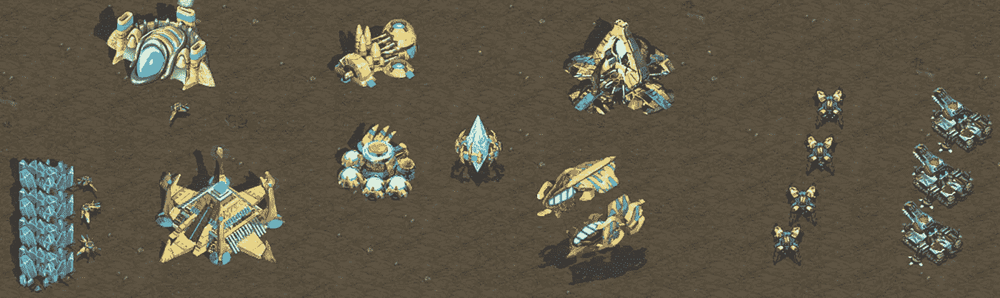
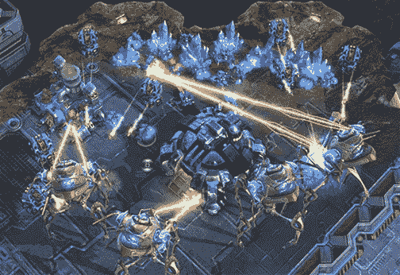
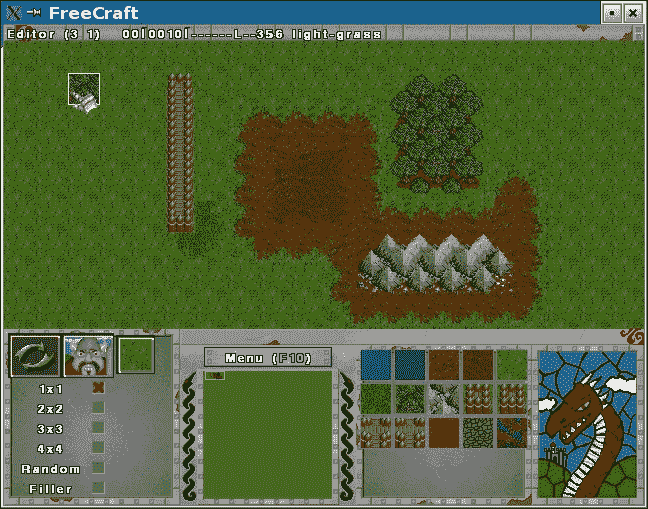
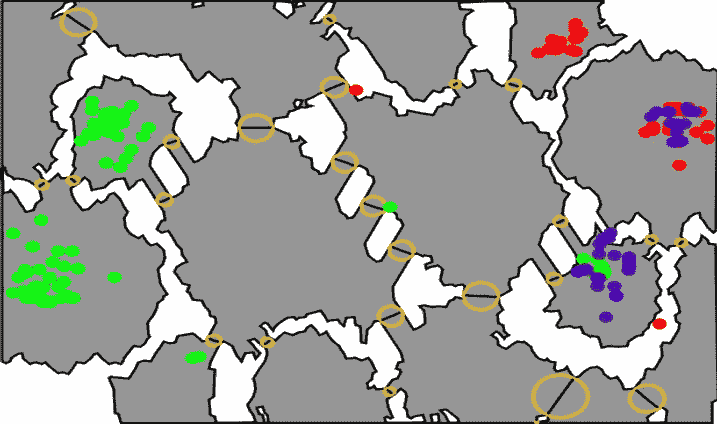
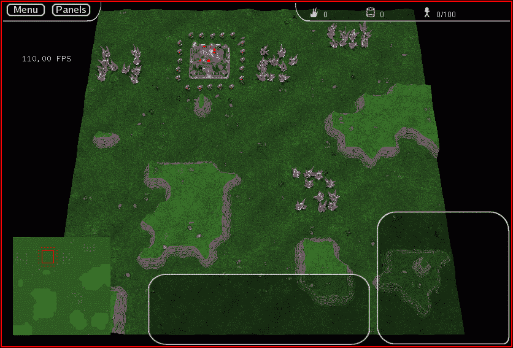
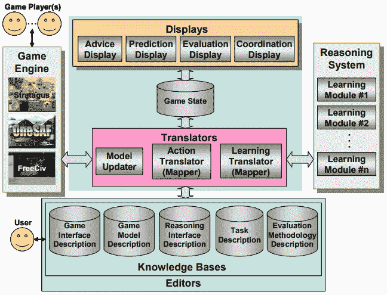
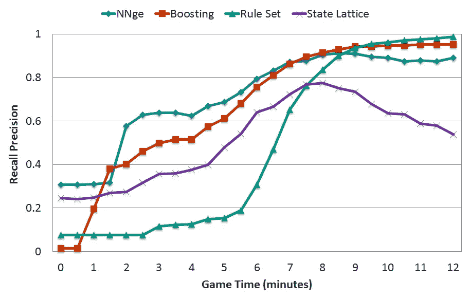
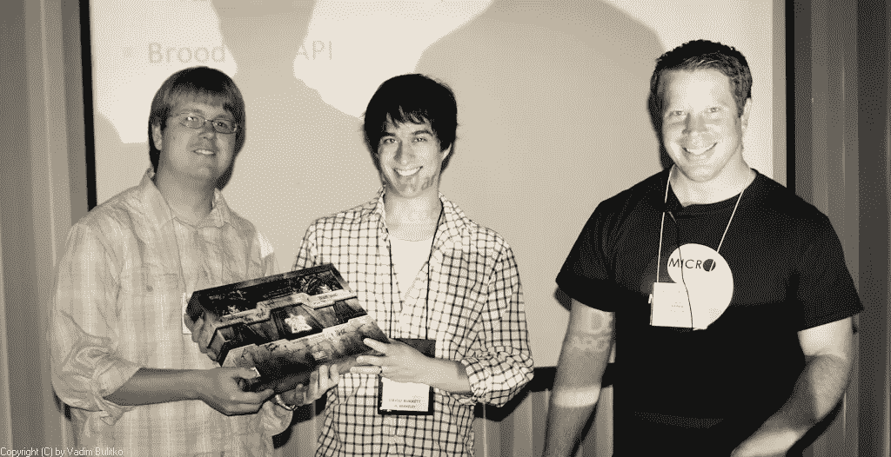
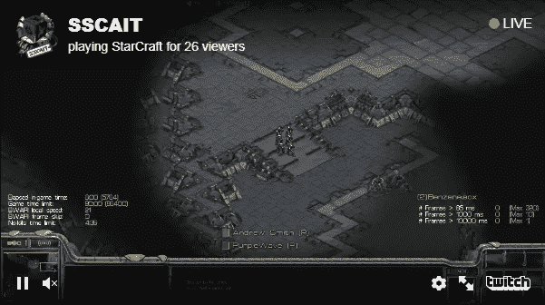

# RTS 人工智能研究的历史

> 原文：<https://towardsdatascience.com/a-history-of-rts-ai-research-72339bcaa3ee?source=collection_archive---------1----------------------->

RTS 游戏中的 AI 研究有着丰富的历史。十多年来，研究人员一直致力于构建能够击败最佳人类选手的机器人，但仍有很长的路要走。在 BlizzCon 2016 上，DeepMind 和暴雪宣布了一项[合作](http://www.gamasutra.com/view/news/284951/DeepMind_and_Blizzard_team_up_to_release_API_aimed_at_AI_enhancement.php)，这导致了星际争霸 2 人工智能研究的开放 API。

这篇文章的目标是涵盖 RTS 游戏和人工智能研究的一些发展，这些发展可能有助于这一结果。要更全面地了解 RTS 游戏的研究，请查看由[翁塔诺](https://hal.archives-ouvertes.fr/hal-00871001/document)等人和[罗伯逊和沃森](https://www.cs.auckland.ac.nz/research/gameai/publications/Robertson_Watson_AIMag14.pdf)撰写的调查文章

StarCraft II, Blizzard Entertainment

在过去的十年里，研究人员已经从孤立地研究 RTS 游戏中的不同人工智能技术，过渡到在更复杂的游戏中合作和竞争，在这些游戏中，不同的技术面对面地进行匹配。为了使这项工作取得成功，下列条件是必要的:

*   开放 API 供研究人员构建和评估机器人
*   **竞赛**让研究人员能够比较不同的技术
*   **回放**学习算法用于训练
*   **人类对手**评估机器人的性能

随着 2009 年 Brood War API 的发布，这些条件中的大部分都得到了满足，但该平台的封闭性使得研究人员难以自动化训练 AI 系统的过程。随着开放的星际争霸 2 环境的宣布，研究人员将有很大的机会开发能够在 RTS 游戏中实现专家级性能的系统。以下是我认为对实现这一目标具有重要意义的一些事件。如果有我应该包括的其他重要事件，请在评论区留言。

# **1998 年**

《星际争霸 1》发行
原版《星际争霸》于 1998 年 3 月发行，资料片《育雏战争》于同年 11 月发行。《星际争霸》风靡全球，并在韩国引发了一场职业游戏热潮。

在有星际争霸之前，有 1995 年发行的魔兽争霸 2。魔兽争霸 2 的一个克隆版本在 1998 年以 Freecraft 的名字首次发布，后来被重新命名为 Wargus。这个克隆体是建立在 [Stratagus](https://en.wikipedia.org/wiki/Stratagus) 游戏引擎上的。Freecraft 是 RTS AI 研究的一个重要项目，因为最初的大部分工作都是使用 Wargus 作为测试平台。

# **2001 年**

对游戏人工智能的学术兴趣一篇关于游戏人工智能的开创性文章是约翰·莱尔德和迈克尔·范·伦特的文章，发表在 2001 年的《人工智能杂志》上。这是一篇意义重大的文章，因为它是 AAAI 最早承认实时游戏是人工智能研究的优秀环境的出版物之一。它还帮助改变了学术研究人员的心态，从试图将现有的方法应用于游戏，转而考虑为游戏建立新的和专门的方法。

# **2002 年**

**魔兽争霸 III 发布**
魔兽争霸 III 附带的一个很棒的特性是一个高度可扩展的地图编辑器，它被用来创建像 DOTA 初始版本一样的独特内容。地图编辑器也有一些脚本功能，可以用来创作自定义的人工智能。然而，以这种方式创作的 AI 仅限于单个地图，并且脚本语言仅向作者提供命令的子集。一些研究人员能够在这个框架内实现他们的人工智能技术，但不可能测试不同的机器人。

# **2003 年**

**RTS 游戏被提议作为人工智能试验台**
Michael Buro 和 Timothy Furtak 在 2003 年发表了一篇[文章](https://skatgame.net/mburo/ps/ORTS-JCIS03.pdf)声称 RTS 游戏提出了许多需要解决的新问题，以便构建人类级别的人工智能。他们还提议开发一个开源的 RTS 游戏引擎，供人工智能研究社区使用。

State Estimation in StarCraft

# **2004 年**

第二年，Michael Buro 发布了第一个开源 RTS 引擎版本， [ORTS](https://skatgame.net/mburo/orts/) 。该游戏能够在图形和非图形模式下运行，这使得机器人能够在数千个游戏会话中快速训练。使用 ORTS 的一个主要挑战是，虽然有人类玩家的界面，但没有专家玩家可以评估机器人。

ORTS Game Engine

**第一个沃格斯研究**
Freecraft 更名为[沃格斯](https://wargus.github.io/)，使用了 Stratagus 游戏引擎。Wargus 的主要优势之一是它是开源的，这为研究人员使用他们想探索的任何技术开放了平台。Wargus 面临的一些挑战是缺乏用于分析的回放，缺乏活跃的玩家基础，以及用于测试机器人相互之间的网络代码有限。马克·庞森是第一批发表关于使用沃格斯作为人工智能测试平台的文章的研究人员之一。

**TIELT 提出**
2004 年提出的 AI 项目之一是 [TIELT 系统](http://www.aaai.org/Papers/Workshops/2004/WS-04-04/WS04-04-011.pdf)，这是一个为多个游戏标题提供一致 API 的 AI 框架。该系统的目标之一是使研究人员能够为一个游戏构建人工智能，并将学到的知识转移到新的游戏中。例如，在 Wargus 中学到的领域知识可能适用于其他 RTS 游戏。我将 TIELT 包括在这个讨论中，因为 DeepMind 和暴雪合作的成果之一将是一个 API 和潜在的示例数据集。对于这个 API 来说，重要的是不要对人工智能如何运行做出假设。TIELT 的挑战之一是它不提供对游戏状态的直接访问，这限制了可以利用它的人工智能技术的数量。这个系统的许多目标现在在脸书的 [ELF 平台](https://code.facebook.com/posts/132985767285406/introducing-elf-an-extensive-lightweight-and-flexible-platform-for-game-research/)上实现了。

TIELT Architecture [Aha and Molineaux, 2004]

# **2005 年**

沃格斯的强化学习
沃格斯很快成为研究人员构建 RTS AI 的环境。2005 年，研究人员开始探索诸如[强化学习](https://people.eecs.berkeley.edu/~russell/papers/ijcai05-rrlcg.pdf)的技术，这是 AlphaGo 使用的策略之一。Wargus 的工作最终开始停滞不前，因为不同的研究人员无法相互评估工作，而是依赖于性能而不是硬编码脚本的小集合。

# **2006 年**

**第一届 ORTS 竞赛**
2005 年，第一届 ORTS AI 竞赛公布，赛事在斯坦福的 AIIDE 2006 大会上举行。第一届[比赛](https://skatgame.net/mburo/orts/AIIDE06/index.html)有 4 个参赛项目，比赛规模逐年增长，直到 2009 年结束。

# **2007 年**

**ICCup 推出**
[国际赛博杯](http://wiki.teamliquid.net/starcraft/ICCup)是星际争霸的第三方托管天梯服务器。这个服务器对人工智能研究很重要，因为你可以在这个服务器上运行机器人，但不能在官方的暴雪服务器上运行。这个服务器的另一个好处是，它为玩家提供了一个字母分数，他们可以使用它来轻松地交流他们的技能。比如我 2010 年认真打球的时候顶多是个 D+玩家。

# **2008 年**

**首次星际争霸人工智能研究**
虽然之前有关于星际争霸的出版物，但我所知道的第一篇专注于星际争霸人工智能构建的文章发表于 2008 年。谢和孙建立了一个模型，通过挖掘成千上万的录像来预测玩家正在制造哪些建筑和单位。

Build-Order prediction in StarCraft

# **2009 年**

**育雏战争 API 发布**
2009 年，我发现了一个名为 BWAPI(育雏战争 API)的 Google 代码项目，它提供了对星际争霸的编程访问。该库通过使用第三方 DDL 工具将 API 注入星际争霸运行时来工作，并暴露了一组用于调用游戏内函数的钩子。从那以后，这个项目的贡献者规模不断扩大，并被移植到多种语言。它现在托管在 [GitHub](https://github.com/bwapi/bwapi) 上，有一个 [Java 版本](https://github.com/JNIBWAPI/JNIBWAPI)。

# **2010 年**

**星际争霸 2 发售**
2010 年，星际争霸 2 自由之翼发售，竞技育雏大战场面持续活跃了几年。资料片《虫群之心》发布于 2013 年，《虚空的遗产》发布于 2015 年。

**首届星际争霸赛**
首届星际争霸赛 [AI 赛](https://eis-blog.soe.ucsc.edu/2010/10/starcraft-ai-competition-results/)在 AIIDE 2010 举行。主赛事由伯克利 Overmind 团队赢得。比赛还包括一场人机表演赛，人类选手轻松击败了人工智能对手。

UC Berkeley Overmind Team

# **2011 年**

**第二届 AIIDE 星际争霸赛**
阿尔伯塔大学的 Dave Churchill 接手了第二届以及随后几届的 AIIDE 星际争霸赛。他编写了一个自动运行锦标赛的锦标赛框架，并改变了一些规则以促进合作，例如要求提交的内容是开源的。

**学生星际 AI 锦标赛**
第二届星际 AI 锦标赛开始了，重点是[学生提交](http://sscaitournament.com/)。该锦标赛与年度会议无关，每年举办几次锦标赛。

[https://sscaitournament.com/](https://sscaitournament.com/)

# 2013 年

**星际争霸 BroodWar 机器人天梯**
Krasi0 为星际争霸机器人开发了一个[天梯系统](http://bots-stats.krasi0.com/)，现在 24/7 运行。这为研究人员评估不同的人工智能方法提供了一个环境。

# **2014 年**

**星际争霸 2 自动化玩家**
[Matt web corner](https://graphics.stanford.edu/~mdfisher/GameAIs.html)演示了可以通过拦截 DirectX 命令来构建星际争霸 2 机器人，以便推断游戏状态。这种方法的一个主要限制是机器人只能访问当前显示在屏幕上的游戏状态。

# **2016**

**AlphaGo 击败 Lee Sedol**
2016 年 3 月，DeepMind 的 AlphaGo 系统[击败](http://www.gamasutra.com/view/news/267636/Worlds_best_Go_player_beaten_by_Googles_AlphaGo_AI.php)围棋世界冠军 Lee Sedol。胜利之后，很多人预计《星际争霸》将是 DeepMind 尝试的下一个挑战。

**脸书加入**
2016 年，来自脸书的人工智能研究人员开始使用《星际争霸》作为强化学习试验台。他们发表了一篇关于星际争霸中微观管理的文章。该机器人参加了 AIIDE 2017 竞赛，但它的学习方法被更关注脚本的机器人[胜过](https://www.wired.com/story/facebook-quietly-enters-starcraft-war-for-ai-bots-and-loses/)。

在 BlizzCon 2016 上，DeepMind [宣布](http://www.gamasutra.com/view/news/284951/DeepMind_and_Blizzard_team_up_to_release_API_aimed_at_AI_enhancement.php)他们正在与暴雪合作开发一个开放的人工智能框架。随着谷歌和脸书竞相打造一个能够胜任职业星际争霸游戏的机器人，竞争开始升温。

# 2017

**星际争霸 2 API 发布** 暴雪在 8 月 9 日发布了用于编写 bot 的[星际争霸 2 API](http://us.battle.net/sc2/en/blog/20944009/the-starcraft-ii-api-has-arrived-8-9-2017)。还宣布了一个用于编写机器人的[研讨会](http://us.battle.net/sc2/en/blog/21048078/announcing-the-starcraft-ii-ai-workshop-10-4-2017)。