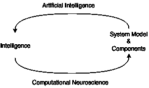
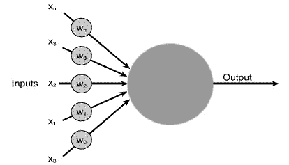
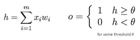
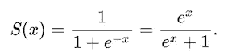
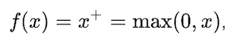

# 触发人工神经元的历史

> 原文：<https://towardsdatascience.com/a-history-of-triggering-artificial-neuron-d1d9853d9fdc?source=collection_archive---------14----------------------->

这一切都是从四年前我了解到[深度信念网](https://medium.com/@muhammadabduh/deep-learning-phenomena-it-just-happened-bebdd1dab9b2)开始的。当时，人们说“这是由生物神经网络启发的”，我只是接受了这一点。在我深入研究之后，我的脑海中涌现出许多问题，尤其是当我看到 [*乙状结肠函数*](https://en.wikipedia.org/wiki/Sigmoid_function) 时。起初，这对我来说似乎很荒谬，因为这个 sigmoid 函数只是将任何给定的数字映射到范围-1 到 1。那么，我们为什么需要这个？。我的第一个猜测是，也许它只是使输出正常化，所以在某些时候它不会爆炸。这个问题一直留在我的脑海角落里，静静地坐着，等待着有一天被回忆起来。

几年过去了，我一直在质疑很多其他的东西。直到几周前，我才接触到一本关于计算神经科学的书。我读了这本书，我在那本书的第三章找到了答案。它描述了神经元如何表现的几种计算模型，我发现了人们最近使用的深度学习模型的联系，以及人们更喜欢使用当前模型的原因。在本文中，我将总结我所知道的人们用来模拟神经元的一些神经元模型，并试图将计算神经科学与应用人工智能联系起来。由于我既不是计算神经科学家也不是生物学家，可能会有一些不准确的信息，如果有的话，我会很乐意纠正它们。

# 计算神经科学和人工智能

在我看来，这两个主题虽然关注的方向不同，但仍然紧密相关。我称之为习得智力的因果关系。这篇文章是从两个角度写的。

The causality of learned intelligence

在模拟模型时，计算神经科学的重点是了解大脑如何工作，以及如何才能接近真实的大脑。反过来，人工智能试图基于提出的理论、观察结果和近似模型来构建智能系统。

# 基本人工神经元结构

神经元是一种细胞。与我们身体中的其他细胞相同(如红细胞)。它的主要任务是传输和处理信息(编码为电脉冲)。据我所知，对于所有不同的人工神经元模型，人工神经元的结构是相同的。它有许多输入(x)和一个输出(y)。就发送电脉冲(信息)而言，一个神经元与其他所有神经元之间的连接能力可以不同，这种能力称为*连接强度*。

Basic structure of artificial neuron

# 计算神经科学中的神经元模型

## 漏整合和发射神经元(1907)

这个模型通常缩写为 IF-model。它来源于当两个连接神经元在两个膜中都有电势差时产生的尖峰(由化学反应、转移的离子等引起)。正如[基尔霍夫定律](https://en.wikipedia.org/wiki/Kirchhoff%27s_circuit_laws)所说，两个端点之间的电位差导致电流从一端流向另一端。

该模型对每个输入的电流进行积分(求和),并改变神经元膜中的电位值。如果神经元膜上的电位值达到一定的电位阈值，神经元就会发出一个尖峰信号。出现尖峰后，神经元膜将其值重置为静息电位。然而，在膜中存在渗漏(阻力因子),并且该渗漏因子将在膜复位后重新启动(抵消)静息电位。

在这种模式下，有两种产生尖峰的独特情况:

1.  当输入电流恒定并且低于膜的电位阈值，并且它们的总和仍然低于膜的电位阈值(非激发尖峰)时
2.  当输入电流恒定且低于膜的电位阈值，并且它们的总和高于膜的电位阈值(激发尖峰)时

这两种情况都被称为*亚阈值*，在亚阈值中，神经元表现为线性。在第一种情况下，不会产生尖峰。在后者中，由于神经元膜的电容性行为，它产生周期性的尖峰。

但是，这种模式有一些限制:

*   该模型的亚阈值条件没有给出实际发生在真实神经元中的各种产生的尖峰。
*   真正的大脑由大量相互连接的神经元组成。如果将该模型集成到大规模网络中，它将变得不容易处理。

## 麦卡洛克-皮茨神经元(1943 年)

麦卡洛克-皮茨神经元模型没有考虑神经元如何工作的所有细节，而是忽略了所有细节，例如微分方程、重置膜电位等，并且仅考虑神经元模型的主要特征。甚至使其离散。

The McCulloch-Pitts Neuron model, o for output, h for threshold

这个想法是，给定一些输入值，如果输入值的总和超过阈值，神经元将输出 1，否则神经元将输出 0。这种神经元模型适用于较大的网络。

## [伊兹基科维奇神经元(2003)](https://www.izhikevich.org/publications/spikes.pdf)

与 IF-neuron 相比，该模型的计算效率相对更高，并且产生尖峰的可能性更大。该模型引入了两个微分方程，一个用于更新膜电位，另一个用于更新“恢复变量”。它还引入了简单的复位条件。

# 神经元如何学习？

如果我们再看一下上一节中的基本人工神经元结构，我们可以得出结论，最影响神经元输出的是神经元之间的*连接强度*。我们可以简单地说，当我们学到一些东西时，连接强度会根据我们学到的东西以某种方式形成。我们获得了一个新的信息(如图像、新闻、歌曲等)，我们是通过感官从体外环境中获得的。信息会从输出神经元到输入神经元反向传播到网络，并影响神经元之间的连接强度。比如我们现在的知识是“树上的叶子都是绿的”。但是，当我们看到一片棕色的叶子时，新的信息“有一片棕色的叶子”将与我们当前的知识进行比较，并且我们当前的知识将被更新为“不是树上所有的叶子都是绿色的”。以前存储信息“树中的所有叶子都是绿色的”的连接强度，现在存储“树中的所有叶子都不是绿色的”。

# 人工智能中的桥接神经元模型和人工神经元——激活函数

在计算神经科学中，神经科学家尽可能接近真实的神经元，并或多或少地考虑神经元的细节。为了使模型在大型网络中可计算，需要一个可计算但有代表性的模型，并且在计算和精度之间总是有一个折衷。

从之前描述的所有模型中，有一个主要的相似特征在神经元模型中非常重要，即触发的尖峰。简而言之，神经元的基本任务是在给定一些输入的情况下产生一个尖峰。这个主要特性可以用数学的方式表示为一个函数，称之为 ***激活函数*** 。

# 人工智能中的人工神经元

模拟真实神经网络的人工神经元网络是人工神经网络。对于每个人工神经元，都有一个数学函数。人工神经网络应该具有学习新信息的能力。神经元模型中的*连接强度*在人工神经网络中称为参数。为了形成参数，我们需要像大脑那样通过将新信息从输出传播到输入来训练神经网络。它被称为*反向传播*。在反向传播过程中，可以使用[微分](https://en.wikipedia.org/wiki/Differential_calculus)计算比较当前知识和新知识。从数学的角度来看，并不是所有的函数都是可微的。因此，找到一个既可微分又具有良好性能(近似真实神经元)的激活函数有点棘手。

除此之外，一个好的模型是更一般化的模型。想象一个孩子正在学习动物的名字。老师教他“狗、马、鸡”是动物。如果在那之后，孩子可以知道老师以前从未教过他的动物种类，例如“一头牛，一只山羊”也是动物，因为它们与马有相似的解剖结构，即使有时孩子说“一只鸡”不是动物，这是错误的，这意味着他可以概括他所学的东西。

但如果孩子只知道“狗、马、鸡”是动物，其他的不是动物，即使他回答得很完美，也不是一个概括的问题。这就是所谓的过度拟合。下面是几种激活功能。它们都有自己的优点和局限性。人们可以根据需要使用任何激活功能。

## [乙状结肠功能](https://en.wikipedia.org/wiki/Sigmoid_function)

Sigmoid 函数具有与 logistic 函数相似的曲线(“S”形曲线)。如果输入是相对较大的负值，则输出为零，如果输入是相对较大的正值，则输出为一，否则输出值介于 0 和 1 之间。

Sigmoid function

优势:

*   因为输出在 0 到 1 的范围内，如果我们想表示某件事情发生的概率，这个激活函数是有用的。

## [校正线性单位(ReLU) (2010)](https://www.cs.toronto.edu/~hinton/absps/reluICML.pdf)

如果输入小于零，ReLU 使输出为 0。如果输入大于 0，则输出与输入相同的值。

ReLU function

优势:

*   与具有指数常数的 sigmoid 函数不同，计算导数(梯度/微分)ReLU 在训练中相对更快。如果输入小于 0，消除(产生零)输出会使整个网络更加稀疏。
*   产生与输入值相同的输出值(恒等式)使得导数更容易计算(相同值的导数将总是 1)，因此网络不会遭受 [*消失梯度*](https://en.wikipedia.org/wiki/Vanishing_gradient_problem) 的问题。

还有 ReLU 的其他变体，[、漏 ReLUs (LReLUs)](http://ai.stanford.edu/~amaas/papers/relu_hybrid_icml2013_final.pdf) 、[参数化 ReLUs (PReLUs)](https://arxiv.org/pdf/1502.01852.pdf) 。

## [指数线性单位(ELU) (2016)](https://arxiv.org/pdf/1511.07289.pdf)

ELU 的功能与瑞路相似。而不是在输入小于零时产生输出 0。如果输入小于零，它用特定的函数计算，否则它输出与输入相同的值。因此，如果输入小于零，输出将为负。

优势:

*   尽管仍然像 ReLU 一样解决消失梯度问题，但如果输入小于零，eLU 通过使用负输出使平均激活值(类似于将数据集归一化为平均零)趋向于零。这使得学习速度更快。

## [高斯误差线性单位(GELU) (2016)](https://arxiv.org/pdf/1606.08415.pdf)

这个激活单元根据输入比其他输入大多少来随机缩放输入。高斯的累积分布函数用于确定比例因子。该单元具有与[自适应退出类似的功能。](https://papers.nips.cc/paper/5032-adaptive-dropout-for-training-deep-neural-networks.pdf)

优势:

*   一个非凸的非线性函数使它比 ELU 和 ReLU 具有更大的灵活性。它还具有更好的通用性，有助于获得更高的精度。

# 综上

这篇文章只是我对发生的事情和我之前发现的事情的看法，对一些人来说可能非常肤浅。另外，我刚才描述的话题只是神经元的一小部分，一个 ***激活功能*** ，一件小事却影响巨大。

无论如何，知道人类能在多大程度上推动自己去了解自己真的很令人兴奋。计算、推断和建立智能系统的新方法的发明一直在迅速增加。计算神经科学家和人工智能科学家都在尽最大努力改善目前的状况。每个月都有新的方法、理论、模型被发明出来。我打算把这篇文章写得尽可能简单，让每个有兴趣的人都能理解。所以，如果有一点复杂的语言或术语，或者无法解释的词，请原谅我。