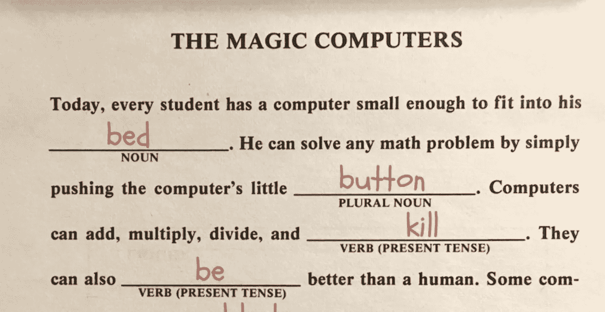
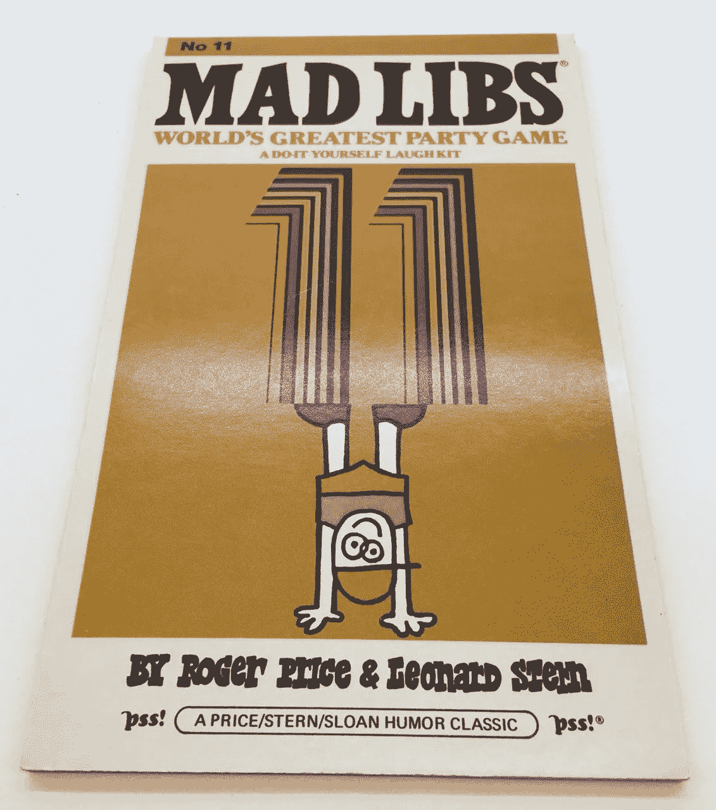
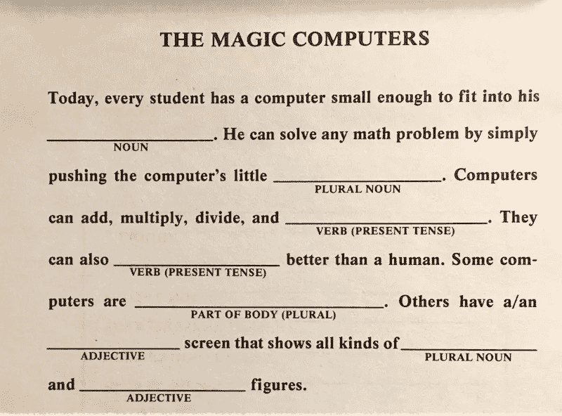
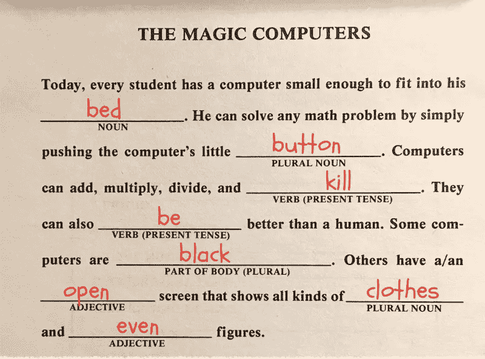
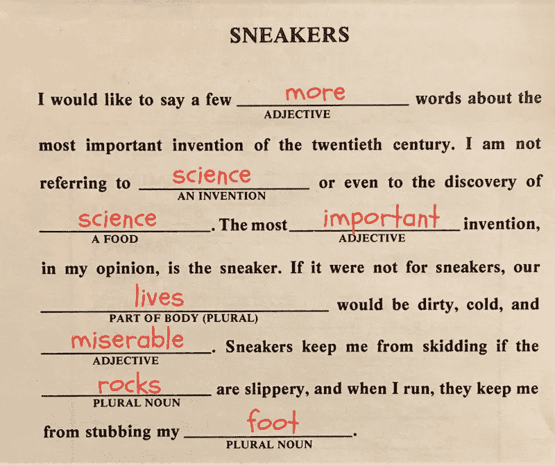

# 人工智能玩疯狂图书馆，结果是可怕的

> 原文：<https://towardsdatascience.com/a-i-plays-mad-libs-and-the-results-are-terrifying-78fa44e7f04e?source=collection_archive---------10----------------------->

这是 1982 年。迈克尔·杰克逊的《T2》惊悚片《T3》是世界上最畅销的专辑。外科医生最近植入了世界上第一颗人造心脏。时代杂志刚刚选择了“计算机”作为年度风云人物。但是现在这些都不重要了，因为你已经在 8 小时的家庭汽车旅行中呆了 30 分钟，你已经厌倦了。

你会在 iPhone XS 上打开 Instagram 自娱自乐吗？没有，苹果还在为大家翘首以待的 Apple IIe 的发布做准备。你有没有看最新的哈利波特书？没那么快，J. K .罗琳才高中毕业。取而代之的是，你拿起新削好的 2 号铅笔，画出这个:

疯狂图书馆？你指的是那种简单而巧妙的游戏吗？一个玩家向另一个玩家要一系列单词，然后用这些单词填充一个故事模板，接着就是欢乐。是的，*那个*疯 Libs。

回到我们的故事…你和你的弟弟设法通过 30 分钟玩游戏。最终，你的兄弟厌倦了这个游戏，出于你新的厌倦，你开始自己玩。因为你没有耐心，你就直接跳到故事，然后开始以你认为合适的方式填写空白。这是我们在本文中关注的 Mad Libs 的退化单机版。

自 1982 年以来，世界发生了巨大的变化。首先，伯特被释放了。*伯特？*“你问吧。"*你是指最近达到最新技术水平的*[***B****I direction****E****n coder****R****代表从* ***T*** *变压器*](https://www.nytimes.com/2018/11/18/technology/artificial-intelligence-language.html) *是的，*那个*伯特。你可能会问，伯特和疯狂图书馆有什么关系？嗯，就像 X 一代一样，从某种意义上说，伯特是在疯狂图书馆长大的。请允许我澄清…*

BERT 是一种语言表示模型——一种将人类语言翻译成计算机可以理解的数学形式的模型，实现了从自动问答到情感分析的各种应用。但是为了表现语言，伯特首先得理解它。那么伯特是如何学习人类语言的呢？正如[论文](https://arxiv.org/abs/1810.04805)所解释的:

> 为了训练深度双向表示，我们采用了一种简单的方法，即随机屏蔽一定比例的输入标记，然后只预测那些被屏蔽的标记

**BERT learned by reading 11,000 books and all of English Wikipedia**

换句话说，伯特通过猜测文本中缺失的单词(“记号”)来学习语言。本质上，伯特玩的是疯狂图书馆，或者至少是前面描述的单人游戏，骗子版本。然而，BERT 也有一个答案(被删除的单词)，因此它可以学习预测“正确”的答案。BERT 非常擅长这个练习，因为它重复了数百万次，涵盖了英语维基百科中的所有文本以及 11，000 本书。通过这样做，伯特学会了语言的基本结构，然后可以应用于更有用的任务。

# 实验

我用一些真实的疯狂库测试了伯特，从*神奇的计算机*开始，这是一首歌颂大约 1982 年个人计算机最新进展的颂歌:

**From Mad Libs #11 (1982)**

为了运行 BERT，我们求助于来自 HuggingFace 的优秀的 [Python 实现，它构建在深度学习框架 PyTorch 之上。这个库使得我们完成填空任务变得非常容易:](https://github.com/huggingface/pytorch-pretrained-BERT)

**注意，我们严格专注于填空，以及诸如*复数名词*、*身体的一部分*等标签。被忽略。**

# 结果

伯特令人惊讶且有些令人不安的解决方案如下所示:

**BERT’s solution**

看起来 BERT 已经利用了它所有的关于现代计算机的知识:移动设备，亚马逊购物门户，人类替代品，甚至更糟。(注意，用于训练伯特的文本包括 786 部科幻小说，这可能解释了反乌托邦倾向)。

这里有一个更好的例子，表明 BERT 也可以给出更可预测的结果，尽管有时有些夸张:

**BERT has strong feelings about sneakers**

**免责声明**:预测一个句子中缺失的单词并不是 BERT 的最终目标；这是伯特利用现有数据学习语言的第一步。通常情况下，BERT 随后会针对特定任务进行[微调](http://wiki.fast.ai/index.php/Fine_tuning)，例如自动问答。BERT 已经在许多这些最终任务上取得了[最先进的成果](https://arxiv.org/abs/1810.04805)，所以不要根据它疯狂的库实力来判断 BERT:)

*在这里* *了解更多关于我的可视化和可解释性工作* [*。你可以在 Twitter 上找到我@*](https://jessevig.com)[*Jesse _ vig*](https://twitter.com/jesse_vig)*。*