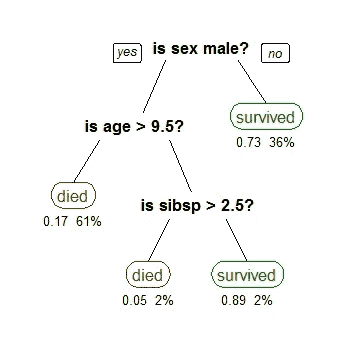
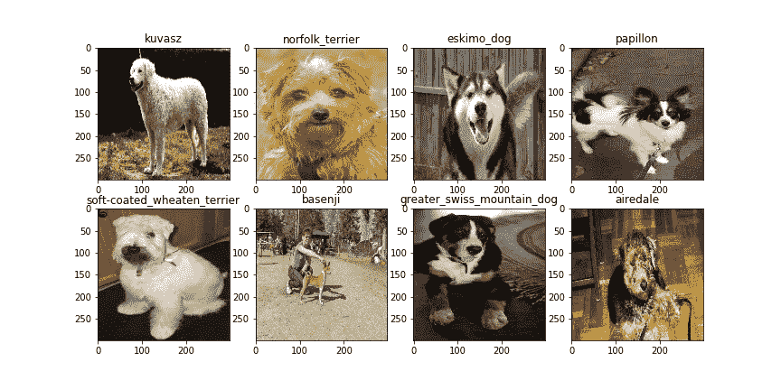

# 外行人的算法丛林指南

> 原文：<https://towardsdatascience.com/a-lay-persons-guide-to-the-algorithm-jungle-2bc77dc30faf?source=collection_archive---------16----------------------->

这是一系列文章中的第三篇，旨在使机器学习对那些没有受过技术培训的人来说更容易理解。以前的文章介绍了机器学习的概念，并讨论了学习过程的一般工作方式。你可以在这里开始**系列。**

*这一期描述了许多常用的机器学习算法家族。这个列表并不详尽，主要集中在两类分类算法上(我最熟悉的)。描述旨在简洁而直观，面向不熟练或没有经验的读者。提供了每个算法家族的简要描述和说明，以及每个家族的一些算法示例。为这些算法的更详细的数学处理和发现更多，提供了进一步的阅读清单。*

## *朴素贝叶斯分类器*

*朴素贝叶斯分类器是基于相当简单的原理的分类算法家族。这些算法学习哪些输入属性具有与感兴趣的类相关联的高概率和低概率，然后基于这些属性概率计算实例是否属于某个类。例如，如果机动车辆有两个轮子，长度在 1900 毫米和 2500 毫米之间，宽度在 700 毫米和 1000 毫米之间，则可以归类为摩托车。*

*朴素贝叶斯分类器之所以被称为朴素贝叶斯分类器，是因为统计假设每个变量相互独立，尽管在实践中很少出现这种情况，例如车轮的数量通常与宽度相关。*

*通常，这些算法需要相对少量的数据来估计参数，这被认为是一个优点。然而，由于底层数学模型的简单性，这些算法通常优于其他算法。*

*这类算法最早也是最常见的用途之一是文本过滤。在垃圾邮件过滤中，可以基于在电子邮件中发现的某个单词、单词组合或随机文本串将电子邮件分类为垃圾邮件。以类似的方式，这些算法可以用于将文档分类到不同的主题类别中。*

*有许多替代算法试图克服朴素贝叶斯分类器的独立性假设。最有力的例子之一是平均一相依估计量(AODE)，它通常可以产生比朴素贝叶斯更低的误差水平，而只需要适度的额外计算能力。*

## *决策树算法*

*这是一个使用决策树原理运行的大算法家族，并且已知在许多情况下非常成功。这些算法根据基于实例属性做出的一系列决策(分支)将实例分类到某个类(叶)中。*

*例如，下图是一个简单的决策树算法，用于根据三个输入(性别、年龄和船上兄弟姐妹和配偶的数量)确定*泰坦尼克号*上的乘客发生了什么。每片叶子下面的数字代表存活的概率和属于该类的实例的百分比:*

**

*Example decision tree for survival of Titanic passengers*

*决策树算法使用自上而下的归纳学习，通常被称为*贪婪算法*(因为它总是决定获取最大份额)。从每个类(叶)开始，根据输入数据是否与该类相关联，将输入数据分成子集。然后，在称为递归划分的过程中，在每个子集(或决策节点)上重复这一过程。当算法到达对分割数据没有进一步价值的决策节点时，学习停止。在我们的*泰坦尼克号*的例子中，算法将在男性和女性之间分割数据，然后它将确定分割女性数据没有进一步的价值。然后，它将确定首先根据年龄，然后根据 sibsp，拆分男性数据是有价值的。*

*决策树算法是健壮的，易于解释，并且可以很好地处理大型数据集。然而，有许多问题它们无法解决，因为底层数据太复杂了。这些算法还可能倾向于从训练数据中创建过于复杂的树，这些树不能很好地概括，最终会过度拟合数据。在某些情况下，可以回过头来简化树。这就是所谓的*修剪*。*

*基于决策树方法的算法示例包括*装袋树*、*随机森林*和*提升树*。*

## *支持向量机*

*支持向量机是基于多维线性代数原理的非概率算法。这些算法非常适合将样本分为两类的二元问题，并且在输入数据的结构有限时特别有用。*

*SVM 算法获取数据集中实例的属性，并将这些属性转换成 n 维空间中的向量，其形式为 *X = (x1，x2，x3，…，xn)* 。*

*然后，该算法将尝试计算 n 维空间中的超平面或“线”,该超平面或“线”以可能的最大距离分隔两个类别。*

*下面是一个简单的二维例子。在本例中，位于虚线边缘的向量称为支持向量，用于计算最大分离线，用实线标记。*

**

*现代 SVM 算法能够通过挖掘文本串并识别可用于对样本进行分类的文本子集和家族来确定维度和属性的数量。维度，也就是向量长度，可以是数百甚至数千。对这种数据执行计算的复杂性可以非常容易且快速地超越可用计算能力的极限。然而，现代 SVM 算法利用了一个核函数，可以大大降低问题的复杂性。*

*当训练集不容易线性分离(即，不可能识别分离的超平面)时，线性 SVM 的多种发展已经导致了许多可选方案。例如，*软边界*可用于某些数据可能被错误分类的情况。最近也有一些算法发展了 SVM 原理，使其适用于两个以上的类，以及非线性和回归问题。*

## *感知器*

*与 SVM 类似，感知器算法通过将输入属性转换成形式为 *X = (x1，x2，x3，…，xn)* 的向量来运行。对于训练集中的每个实例，该算法计算权重向量 *W = (w1，w2，w3，…，wn)* 以形成线性预测函数 W.X，该函数正确预测所有先前的训练集实例。*

*与大多数其他算法不同，感知器执行*在线学习*，这意味着它逐个分析每个训练实例，并在处理每个实例后更新权重向量 W，而不是必须先处理所有实例。与其他算法相比，这可以更加高效和精简。*

*然而，如果训练集是线性可分的，感知器算法将仅收敛于权重向量 W。如果不存在将训练数据中的正样本与负样本分开的超平面，则该算法将不能收敛到将正确分类所有训练集样本的 W 上。*

*感知器的变体可以用来处理多类问题，甚至非线性问题。*袖珍算法*是一个潜在有用的变体，它处理非线性可分离的训练数据。在处理每个训练实例时，该算法会将迄今为止看到的最佳解决方案保存在“口袋”中。在每个实例中，算法返回“口袋”解，而不是最后一个解，这允许它迭代到训练集上误差最小的解。*

## *神经网络*

*神经网络算法是目前使用的最复杂的算法之一。它们模仿大脑中神经元的结构，并且它们被设计成以与大脑相似的方式学习。它们通常没有预先设定任何规则，而是通过处理示例来学习。*

*图像识别是经常使用神经网络的一个常见例子。例如，可以向网络提供狗的图像集合，并告知每只狗的品种。然后，它可以学习狗图像的特征，这允许它预测给它的新图像的品种。*

**

*Hey computer — here’s some nice doggy pictures!*

*人们很自然会问计算机如何模拟神经元网络。实际上,“神经元”之间的信号通常是某种形式的数字，而“神经元”本身是某种数学函数，它处理它接收的信号并吐出新的数字——所以实际上这些算法在数学上模拟了神经元网络的信号到节点的行为。*

## *进一步阅读*

*我在这里仅仅触及了表面，但是我已经涵盖了你可能听说过的分类算法的主要类别。如果你想真正进入令人愉快的算法世界，比如 *BLAST* 、 *nauty* 、 *Saucy* 或 *Mersenne Twister* (是的，它们都是算法名称)，这里有几个地方你可以看看。请自担风险，尤其是如果你不是数学家、统计学家或计算机科学家。*

1.  **机器学习介绍*，Ethem Alpaydin，ISBN 0262028182。这是一本非常好的关于机器学习的宽泛的文本，涵盖了广泛的主题。它是大学课程中非常常见的教材。*
2.  **机器学习:使数据有意义的算法的艺术和科学*，彼得·弗拉克，ISBN 1107422221。这是一个非常实际的话题，用具体的例子来说明算法是如何运作的。*
3.  **机器学习基础*，Mehryar Mohri 等人，ISBN 026201825X。这本书理论性很强，重点是关键概念的证明。它还涵盖了几种常见的 ML 算法的数学基础。*
4.  **机器学习，概率视角*，凯文·P·墨菲，ISBN 0262018020。这本书很好地融合了理论(尤其是概率和统计)和实践，有算法代码的例子和大量插图。*
5.  **信息论、推理和学习算法*，大卫·麦凯，ISBN 0521642981。这本书的重点是科学和工程目的的编码。然而，在填字游戏和生物进化的算法上有一些有趣的消遣。*
6.  **统计学习、数据挖掘、推理和预测的要素*，特雷弗·哈斯蒂，ISBN 0387848576。一个学术文本，侧重于将与机器学习相关的各种概念结合到一个统计框架中。*
7.  **信息检索简介*，克里斯托弗·D·曼宁等，ISBN 0521865719。这本书集中在与文本分类和聚类相关的应用。*

**下一篇文章将关注如何衡量预测算法的有效性。这里读一下***。***

**最初我是一名纯粹的数学家，后来我成为了一名心理计量学家和数据科学家。我热衷于将所有这些学科的严谨性应用到复杂的人的问题上。我也是一个编码极客和日本 RPG 的超级粉丝。在[*LinkedIn*](https://www.linkedin.com/in/keith-mcnulty/)*或*[*Twitter*](https://twitter.com/dr_keithmcnulty)*上找我。***