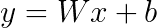
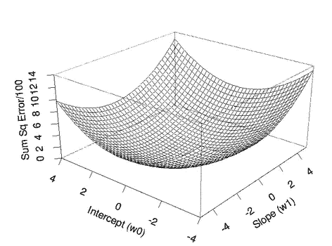
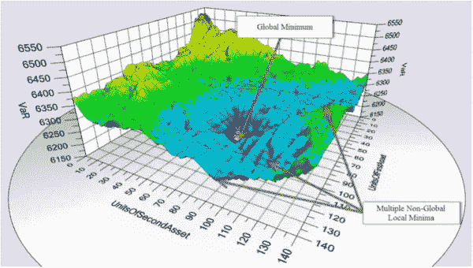
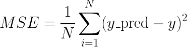
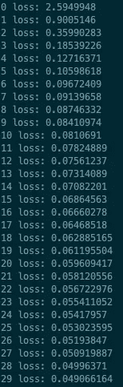
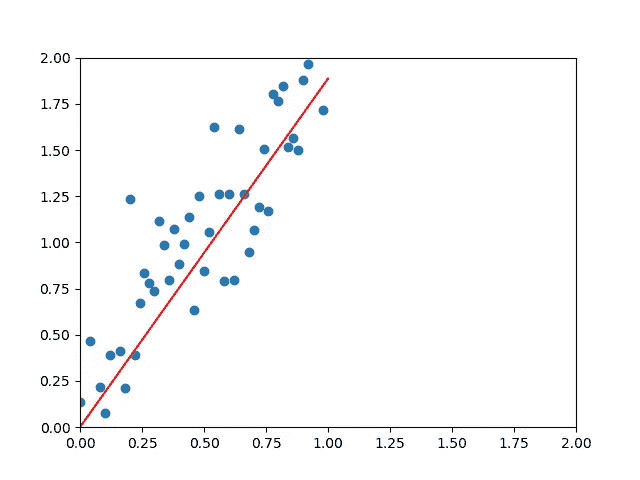

# 使用 TensorFlow 进行线性回归的逐行外行指南

> 原文：<https://towardsdatascience.com/a-line-by-line-laymans-guide-to-linear-regression-using-tensorflow-3c0392aa9e1f?source=collection_archive---------2----------------------->

本文是使用 TensorFlow 进行线性回归的逐行外行指南。如果你读这篇文章有困难，考虑在这里订阅[中级会员](https://derekchia.medium.com/membership)！

线性回归是机器学习之旅的一个良好开端，因为它是一个非常简单的问题，可以通过流行的模块来解决，如 [scikit-learn 包](http://scikit-learn.org/stable/auto_examples/linear_model/plot_ols.html)。在本文中，我们将讨论使用 TensorFlow 实现线性回归的逐行方法。



linear regression equation

查看上面的线性回归方程，我们首先构建一个图形，通过多次迭代学习斜率( **W** )和偏差( **b** )的梯度。在每次迭代中，我们的目标是通过比较输入 **y** 和预测的**y**来缩小差距(损失)。也就是说，我们想要修改 **W** 和 **b** ，这样 **x** 的输入就会给我们想要的 **y** 。求解线性回归也称为寻找最佳拟合线或趋势线。

# 生成数据集

[第 1、2、3 行]

```
import numpy as np
import tensorflow as tf
import matplotlib.pyplot as plt
```

在本文中，我们将使用一些流行的模块，如 [numpy](http://www.numpy.org/) 、 [tensorflow](https://www.tensorflow.org/) 和 [matplotlib.pyplot](https://matplotlib.org/tutorials/introductory/pyplot.html) 。让我们导入它们。

[第 6、7 行]

```
x_batch = [np.linspace](https://docs.scipy.org/doc/numpy-1.15.0/reference/generated/numpy.linspace.html)(0, 2, 100)
y_batch = 1.5 * x_batch + np.random.randn(*x_batch.shape) * 0.2 + 0.5
```

首先，我们从生成数据集开始，即 **x** 和 **y** 。你可以把 **x** 和 **y** 中的每个值想象成图上的点。在第 6 行中，我们希望 numpy 生成 100 个值在 0 和 2 之间的点，均匀分布。结果是一个存储在`x_batch`中的 numpy 数组。类似地，我们还想随机生成 **y** ，这样它的梯度为 1.5 ( **W** )并且使用`np.random.randn()`具有某种形式的随机性。为了让事情变得有趣，我们将 y 轴截距 **b** 设置为 0.5。

【第八行】`return x_batch, y_batch`

我们返回 numpy 数组`x_batch`和`y_batch`。


plt.scatter(x_batch, y_batch) — this is our starting point

这就是`generate_dataset()`的剧情样子。请注意，从视觉上看，这些点形成了一条从左下方到右上方的趋势线，但没有穿过原点(0，0)。

# 构建图表

[第 2 行和第 3 行]

```
x = tf.placeholder(tf.float32, shape=(None, ), name='x')  
y = tf.placeholder(tf.float32, shape=(None, ), name='y')
```

接下来，我们构建张量流图，帮助我们计算 **W** 和 **b** 。这在函数`linear_regression()`中完成。在我们的公式`y = Wx + b`中， **x** 和 **y** 是表示为 TensorFlow 的[占位符](https://www.tensorflow.org/api_docs/python/tf/placeholder)的节点。将 **x** 和 **y** 声明为占位符意味着我们需要在以后传入值——我们将在下一节重新讨论这个问题。请注意，我们现在仅仅是构建图形，而不是运行它(TensorFlow 有[惰性评估](https://medium.com/coinmonks/tensorflow-graphs-and-sessions-c7fa116209db))。

在`tf.placeholder`的第一个参数中，我们将数据类型定义为 float 32——占位符中常见的数据类型。第二个参数是设置为`None`的占位符的形状，因为我们希望它在训练期间确定。第三个参数让我们设置占位符的名称。

> 占位符仅仅是一个变量，我们将在以后的某一天把数据赋给它。它允许我们创建我们的操作和构建我们的计算图，而不需要数据。在 TensorFlow 术语中，我们通过这些占位符将数据输入图表。
> 
> 参考:[https://learningtensorflow.com/lesson4/](https://learningtensorflow.com/lesson4/)

【第 5 行】`with tf.variable_scope(‘lreg’) as scope:`

这一行为第 6 行和第 7 行中的变量定义了变量范围。简而言之，[变量作用域](https://jasdeep06.github.io/posts/variable-sharing-in-tensorflow/)允许以层次方式命名变量，以避免名称冲突。详细地说，它是 TensorFlow 中的一种机制，允许在图形的不同部分共享变量，而无需四处传递对变量的引用。请注意，尽管我们在这里没有重用变量，但是恰当地命名它们是一个很好的做法。

```
with tf.name_scope("foo"):
    with tf.variable_scope("var_scope"):
        v = tf.get_variable("**var**", [1])
with tf.name_scope("bar"):
    with tf.variable_scope("var_scope", reuse=True):
        v1 = tf.get_variable("**var**", [1])
assert v1 == v
**print(v.name)   # var_scope/var:0
print(v1.name)  # var_scope/var:0**
```

在上面的代码中，我们看到变量(" **var** ")被重用并被断言为真。要使用同一个变量，只需调用`[tf.get_variable](https://www.tensorflow.org/api_docs/python/tf/variable_scope)(“var”, [1])`。

【第六行】`w = tf.Variable(np.random.normal(), name=’W’)`

与占位符不同， **W** 被定义为一个`[tf.Variable](https://www.tensorflow.org/api_docs/python/tf/Variable)`，其值随着我们训练模型而变化，每次都以较低的损失结束。在第 10 行，我们将解释“损失”是什么意思。现在，我们使用`[np.random.normal()](https://docs.scipy.org/doc/numpy-1.15.0/reference/generated/numpy.random.normal.html)`设置变量，以便它从正态(高斯)分布中抽取一个样本。

> tf。变量—一个变量在调用`*run()*`时维护图中的状态。您通过构造类`*Variable*`的实例向图中添加一个变量。
> 
> `*Variable()*`构造函数需要变量的初始值，可以是任何类型和形状的`*Tensor*`。初始值定义了变量的类型和形状。构造后，变量的类型和形状是固定的。可以使用赋值方法之一来更改该值。
> 
> 参考:[https://www.tensorflow.org/api_docs/python/tf/Variable](https://www.tensorflow.org/api_docs/python/tf/Variable)

请注意，即使现在定义了变量，也必须在使用该值运行操作之前显式初始化它。这是惰性求值的一个特性，我们将在后面进行实际的初始化。

这里 **W** 真正做的是找到我们最佳拟合线的梯度。之前，我们使用 1.5 的梯度生成数据集，因此我们应该期望经过训练的 **W** 接近这个数字。为 **W** 选择起始数字有些重要——想象一下，如果我们可以“随机”选择 1.5，工作就完成了，不是吗？差不多吧…

因为我们的主题是寻找线性回归中的最佳梯度，我需要指出的是，无论我们在哪里初始化 **W** ，我们的损失函数将总是产生一个最小损失值。这是由于我们的损失函数, **W** 和 **b** 的凸性，当我们在这样的图表中绘制它们时。换句话说，这个碗形图形让我们可以确定最低点，不管我们从哪里开始。



One global minimum

然而，对于更复杂的问题，情况并非如此，在这些问题中存在多个局部最小值，如下所示。选择一个不好的数字来初始化你的变量会导致你的梯度搜索陷入局部极小值。这阻止了你达到具有较低损失的全局最小值。



Multiple local minima with one global minimum

研究人员想出了替代的初始化方法，例如 [Xavier 初始化](https://www.quora.com/What-is-an-intuitive-explanation-of-the-Xavier-Initialization-for-Deep-Neural-Networks)，试图避免这个问题。如果您想使用它，请随意使用:

`tf.get_variable(…, initializer=[tf.contrib.layers.xavier_initializer()](https://www.tensorflow.org/api_docs/python/tf/contrib/layers/xavier_initializer))`。

【第 7 行】`b = tf.Variable(np.random.normal(), name=’b’)`

除了 **W** 之外，我们还要训练我们的 bias **b** 。如果没有 **b** ，我们的最佳拟合线将总是穿过原点，而不会学习 y 轴截距。还记得 0.5 吗？我们也需要了解这一点。

【第九行】`y_pred = tf.add(tf.multiply(w, x), b)`

在分别定义了 **x** 、 **y** 和**W****、**之后，我们现在准备将它们放在一起。为了实现公式`y = Wx + b`，我们首先使用`[tf.multipl](https://www.tensorflow.org/api_docs/python/tf/multiply)y`将`w`和`x`相乘，然后使用`[tf.add](https://www.tensorflow.org/api_docs/python/tf/math/add)`将变量`b`相加。这将执行逐元素的乘法和加法，从而产生张量`y_pred`。`y_pred`代表预测的 **y** 值，正如您可能会怀疑的那样，**预测的 y** 一开始会很糟糕，并且与**生成的 y**相差甚远，类似于占位符或变量，您可以随意为其命名。

【第 11 行】`loss = tf.reduce_mean(tf.square(y_pred — y))`



Mean Squared Error (MSE)

计算完`y_pred`，我们想知道**预测的 y** 与我们**生成的 y** 有多远。为此，我们需要设计一种方法来计算“差距”。这种设计被称为[损失函数](https://blog.algorithmia.com/introduction-to-loss-functions/)。这里，我们选择了[均方误差(MSE)](https://en.wikipedia.org/wiki/Mean_squared_error) 又名 L2 损失函数作为我们的“评分机制”。还有其他流行的损失函数，但我们不包括它们。

为了理解我们的 MSE 实现，我们首先使用`y_pred — y`找到`y_pred`和`y`的 100 个点之间的差异。接下来，我们通过对它们求平方(`[tf.square](https://www.tensorflow.org/api_docs/python/tf/square)`)来放大它们的差异，从而使差异变大(很多)。哎哟！😝

向量大小为 100，我们现在有一个问题—我们如何知道这 100 个值是否代表一个好的分数？通常分数是决定你表现如何的一个数字(就像你的考试一样)。因此，为了得到一个单一的值，我们利用`[tf.reduce_mean](https://www.tensorflow.org/api_docs/python/tf/reduce_mean)`找到所有 100 个值的平均值，并将其设置为我们的`loss`。

【第 13 行】`return x, y, y_pred, loss`

最后但同样重要的是，我们在构造它们之后返回所有的 4 个值。

# 计算图表

有了`generate_dataset()`和`linear_regression()`，我们现在准备运行程序，并开始寻找我们的最佳梯度 **W** 和偏差 **b** ！

[第 2、3 行]

```
x_batch, y_batch = generate_dataset()
x, y, y_pred, loss = linear_regression()
```

在这个`run()`函数中，我们首先调用`generate_dataset()`和`linear_regression()`来得到`x_batch`、`y_batch`、`x`、`y`、`y_pred`和`loss`。向上滚动查看这两个功能的解释。

[第 5、6 行]

```
optimizer = tf.train.GradientDescentOptimizer(0.1)
train_op = optimizer.minimize(loss)
```

然后，我们定义[优化器](https://www.tensorflow.org/api_docs/python/tf/train/Optimizer)并要求它最小化图中的损失。有几个优化器可供选择，我们方便地选择了[梯度下降算法](https://www.tensorflow.org/api_docs/python/tf/train/GradientDescentOptimizer)并将[学习率](https://medium.com/octavian-ai/which-optimizer-and-learning-rate-should-i-use-for-deep-learning-5acb418f9b2)设置为 0.1。

我们不会深入优化算法的世界，但简而言之，优化者的工作是最小化(或最大化)你的损失(目标)函数。它通过在每次运行时向最优解的方向更新可训练变量( **W** 和 **b** )来实现这一点。

调用[最小化](https://www.tensorflow.org/api_docs/python/tf/train/GradientDescentOptimizer#minimize)函数计算梯度并将它们应用于变量——这是默认行为，您可以使用参数`var_list`随意更改。

【第八行】`with tf.Session() as session:`

在我们构建图形的前面部分，我们说过张量流使用惰性求值。这实际上意味着只有在会话开始时才计算图形。这里，我们将会话对象命名为`session`。

【第 9 行】`session.run([tf.global_variables_initializer()](https://www.tensorflow.org/api_docs/python/tf/initializers/global_variables))`

然后我们通过初始化我们要求变量保存的所有值来启动我们的第一个会话。由于惰性求值，在第一次构建图形时，变量如 **W** ( `w = tf.Variable(np.random.normal(), name=’W’)`)没有初始化，直到我们运行这一行。更多解释见[本](https://stackoverflow.com/questions/44433438/understanding-tf-global-variables-initializer)。

【第 10 行】`feed_dict = {x: x_batch, y: y_batch}`

接下来，我们需要提出 [feed_dict](https://www.tensorflow.org/api_docs/python/tf/Session#run) ，它本质上是`session.run()`的一个参数。`feed_dict`是一个字典，其关键字为`tf.Tensor`、`tf.placeholder`或`tf.SparseTensor`。`feed_dict`参数允许调用者覆盖图中张量(标量、字符串、列表、numpy 数组或 tf.placeholder，例如 **x** 和 **y** )的值。

在这一行中， **x** 和 **y** 是占位符， **x_batch** 和 **y_batch** 是生成的值，准备在`session.run()`期间填充占位符。

【第 12 行】`for i in range(30):`

在初始化变量并使用`feed_dict`为占位符准备值之后，我们现在进入脚本的核心，定义我们想要“调整”/“训练”权重( **W** )和偏差( **b** )的次数。我们在一个完整周期中遍历训练数据的次数( **x** 和 **y** )也称为**时期/训练步骤**。一个完整的循环也被定义为一个[前馈](https://en.wikipedia.org/wiki/Feedforward_neural_network)和一个[反向传播](https://en.wikipedia.org/wiki/Backpropagation)。

前馈时，我们传入 **x** 、 **w** 和 **b** 的值，得到**预测的 y** 。这将计算用数字表示的损失。由于该图的目标是最小化损耗，优化器将执行反向传播以“调整”可训练变量( **W** 和 **b** )，以便下一次我们执行前馈(在另一个时期)时，损耗将会降低。

我们这样向前向后循环 30 次。请注意，30 是一个超参数，您可以自由更改它。还要注意，更多的纪元=更长的训练时间。

[第 13 行]

```
session.run(train_op, feed_dict)
```

现在，我们准备通过调用获取的`session.run()`和`feed_dict`来运行我们的第一个纪元。在这里，`session.run()`评估提取的每个张量(`train_op`)并用`feed_dict`中的值替换相应的输入值。

> `**fetches**`:单个图形元素、图形元素列表或其值为图形元素或图形元素列表的字典(参见`run`的文档)。

当`session`对象调用`run()`方法时，在幕后发生的事情是，您的代码将运行图的必要部分(节点),以计算提取中的每个张量。由于`train_op`指的是`optimizer`调用方法`minimize(loss)`，那么将通过调用损失函数来计算`loss`，损失函数又触发`y_pred`、`y`、`W`、`x`和`b`进行计算。

下面是来自 [TensorFlow 文档](https://www.tensorflow.org/api_docs/python/tf/Session#run)的代码。你可以看到提取可以是单例、列表、元组、命名元组或字典。在我们的例子中，我们使用 feed_dict 作为 dictionary 类型的参数。

fetches in session.run()



print(i, “loss:”, loss.eval(feed_dict))

【第 14 行】`print(i, “loss:”, loss.eval(feed_dict))`

这一行打印出每个时期的损失。在左侧，您可以看到每个时期的损失值都在减少。

使用`loss.eval()`和`feed_dict`作为参数计算损失值。

[第 16、17 行]

```
print('Predicting')
y_pred_batch = session.run(y_pred, {x : x_batch})
```

30 个纪元后，我们现在有一个训练有素的 **W** 和 **b** 供我们执行[推理](https://blogs.nvidia.com/blog/2016/08/22/difference-deep-learning-training-inference-ai/)。与训练类似，可以使用`session.run()`对相同的图进行推理，但这一次，获取将是 **y_pred** 而不是 **train_op** ，我们只需要输入 **x** 。我们这样做是因为 **W** 和 **b** 已经被训练过，并且**预测的 y** 可以仅用 **x** 来计算。注意在`tf.add(tf.multiply(w, x), b)`中，没有 **y** 。

到目前为止，我们已经声明了 3 个`session.run()`，所以让我们回顾一下它们的用法，因为`session.run()`是我们运行操作和评估图中凸榫的命令。第一次我们做的是初始化我们的变量，第二次在训练期间传递我们的 feed_dict，第三次运行预测。

[第 19–23 行]

```
plt.scatter(x_batch, y_batch)
plt.plot(x_batch, y_pred_batch, color='red')
plt.xlim(0, 2)
plt.ylim(0, 2)
plt.savefig('plot.png')
```

我们用生成的`x_batch`和`y_batch`以及我们预测的线(用`x_batch`和`y_pred_batch`)绘制图表。最后，我们有我们的预测线很好地画在下面。花点时间回顾一下我们的第一个神经网络如何计算出梯度和 y 截距，并欣赏机器学习的魔力！



plt.plot(x_batch, y_pred_batch) — we drew the line of best fit

[第 25、56 行]

```
if __name__ == "__main__":
 run()
```

不需要解释——你可以做得更好。😉

# 最后

投身机器学习并不容易。有人从理论开始，有人从代码开始。我写这篇文章是为了让自己理解基本概念，并帮助那些正在接触机器学习或 TensorFlow 的人入门。

你可以在这里找到最终代码。如果您发现任何错误，并希望提出建议或改进，请随时发表评论或发 [tweet me](https://twitter.com/derekchia) 。🙏

特别感谢[莱米](https://twitter.com/remykarem)、[任杰](https://github.com/notha99y)和[羽心](http://seowyuxin.com/)阅读本文初稿。你是最棒的！💪