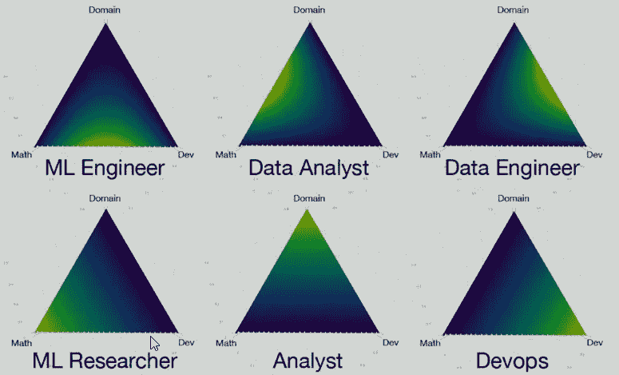

# 一个长期的数据科学路线图不会帮助你在几个月内成为专家

> 原文：<https://towardsdatascience.com/a-long-term-data-science-roadmap-which-wont-help-you-become-an-expert-in-only-several-months-4436733e63ff?source=collection_archive---------0----------------------->

## 成为数据科学家的几点思考？这既不容易也不快速，需要很多努力，但如果你对数据科学感兴趣，这是值得的。

不时有人问我:如何成为一名数据科学家？有哪些课程是必须的？需要多长时间？你是怎么成为 DS 的？我已经回答过这个问题几次了，所以在我看来，写一篇文章可能是一个帮助有抱负的数据科学家的好主意。

## 关于我

我在 MSU 经济学院获得了硕士学位，并在 ERP 系统实施领域做了大约 4 年的分析师/顾问。它包括与客户交谈，讨论他们的需求并使之形式化，编写文档，向程序员解释任务，测试结果，组织项目和许多其他事情。

但这是一份压力很大的工作，有很多问题。更重要的是，我并不真的喜欢它。尽管我喜欢和数据打交道，但大多数事情并不鼓舞人心。因此，在 2016 春夏，我开始寻找其他东西。我在精益六适马拿到了[绿带，但是附近没有机会。有一天我发现了大数据。经过几周的谷歌搜索和阅读大量文章，我意识到这可能是我梦想的职业。](https://en.wikipedia.org/wiki/Lean_Six_Sigma)

我辞职了，8 个月后，我在一家银行获得了第一份数据科学家的工作。从那以后，我在几家公司工作过，但我对数据科学的热情仍然很高。我已经完成了 ML 和 DL 的几门课程，做了几个项目(如一个[聊天机器人](https://github.com/Erlemar/Simple_chat_bot)或一个[数字识别 app](https://digits-draw-recognize.herokuapp.com/) )，参加了许多 ML 比赛和活动，在 Kaggle 上获得了三枚银牌等等。因此，我有一些学习数据科学和作为数据科学家工作的经验。当然，我还有很多东西要学，还有很多技能要掌握。

## 放弃

这篇文章包含了我的观点。有些人可能不同意他们的观点，我想指出，我不想冒犯任何人。我认为任何希望成为数据科学家的人都必须投入大量的时间和精力，否则他们会失败。声称你可以在几周或几个月内成为 ML/DL/DS 专家的课程或 MOOCs 并不完全真实。你可以在几周/几个月内获得一些知识和技能。但是如果没有大量的练习(这不是大多数课程的一部分)，你就不会成功。

你确实需要内在的动力，但是，更重要的是，你需要自律，这样你才能在动力消失后继续工作。

让我再重复一遍——你需要自己做事情。如果你问最基本的问题，甚至没有尝试使用 Google/StackOverflow 或思考几分钟，你将永远无法赶上专业人士。

在我参加的大多数课程中，只有大约 10-20%的人完成了课程。大多数辍学者没有奉献精神或耐心。

## 谁是数据科学家？

有很多图片展示了数据科学家的核心技能。就本文的目的而言，它们都是好的，所以让我们看看这一个。这表明你需要数学和统计，编程和开发，领域知识和软技能。

太多了！怎么可能知道这一切？嗯，真的要花很多时间。但是这里有一个好消息:没有必要什么都知道。

2018 年 10 月 21 日在 [Yandex](https://en.wikipedia.org/wiki/Yandex) 有一场[有趣的讲座](https://events.yandex.ru/lib/talks/6451/)。据说有许多类型的专家，他们拥有上述技能的不同组合。

数据科学家应该在中间，但事实上他们可以在三角形的任何部分，在三个领域中的任何一个都有不同的层次。

在本文中，我将谈论通常被认为的数据科学家，即那些能够与客户交流、执行分析、构建模型并交付模型的人。

## 转行？这意味着你已经有了！

有人说转行很难。虽然这是真的，有一个职业可以转换，意味着你已经知道一些东西。也许你有编程和开发的经验，也许你在数学/统计领域工作过，或者你每天都在磨练你的软技能。最起码你在你的领域有专业知识。所以总是试着利用你的优势。

## 来自 Reddit 的路线图

事实上将会有两个路线图:)

第一个来自 Reddit，来自这个[话题](https://www.reddit.com/r/MachineLearning/comments/5z8110/d_a_super_harsh_guide_to_machine_learning/):

> 首先，读他妈的哈斯提，提白拉尼，还有谁。第 1-4 章和第 7-8 章。如果你不明白，继续读，直到你明白。
> 
> 如果你愿意，你可以读这本书的其余部分。你可能应该知道，但我会假设你都知道。
> 
> 以吴恩达的 Coursera 为例。用 python 和 r 做所有的练习，确保所有的答案都是一样的。
> 
> 现在忘掉这些，去读深度学习的书吧。将 tensorflow 和 pytorch 放在一个 Linux 盒子上，运行示例，直到得到它。做 CNN 和 rnn 的事情，只是前馈神经网络。
> 
> 一旦你完成了所有这些，就可以上 arXiv，阅读最新的有用文章。文献每隔几个月就有变化，所以要跟上。
> 
> 那里。现在你可能在大多数地方都能被雇佣。如果你需要简历填充，那么一些 Kaggle 比赛。如果有调试问题，请使用 StackOverflow。有数学题，多读。如果你有人生问题，我不知道。

从其中一条[评论](https://www.reddit.com/r/MachineLearning/comments/5z8110/d_a_super_harsh_guide_to_machine_learning/dewb8ty)来看:

> 直到不够为止。。想出一个没有训练数据的新问题，并想出如何收集一些数据。学会写一个刮刀，然后做一些标注和特征提取。在 EC2 上安装所有东西并自动化它。编写代码，随着新数据的出现，在生产中不断地重新训练和重新部署您的模型。

虽然简短、苛刻且非常困难，但这份指南非常棒，它会让你达到一个可雇佣的水平。

当然，数据科学还有许多其他方法，所以我将提供我的方法。它并不完美，但它是基于我的经验。

## 我的路线图

有一项技能会让你走得很远。如果你还没有，我敦促你开发它。这个技能是…形成思想，搜索信息，找到它并理解它。说真的！有些人无法表达思想，有些人无法找到最基本问题的解决方案，有些人不知道如何正确创建谷歌查询。这是一个基本的、必须的技能，你必须完善它！

1.  选择一门编程语言，学习它。通常会是 Python 或者 r，我强烈推荐选择 Python。我不会列出原因，因为已经有很多关于 R/Python 的争论，我个人认为 Python 更加通用和有用。花 2-4 周时间学习语言，这样你就可以做一些基本的事情。对所使用的库有一个大致的了解，比如 pandas/matplotlib 或者 tydiverse/ggplot2。
2.  通过安德鲁·吴的 ML 课程。它是旧的，但它给了一个伟大的基础。在 Python/R 中完成任务可能是有用的，但不是必需的。
3.  现在再选一门好的 ML 课程(或几门)。对于 R 用户我推荐 [Analytics Edge](https://www.edx.org/course/the-analytics-edge) ，对于 Python 用户— [mlcourse.ai](http://mlcourse.ai) 。如果你懂俄语，[Coursera 上的这个课程](https://www.coursera.org/specializations/machine-learning-data-analysis)也很棒。在我看来 mlcourse.ai 是这三个里面最好的。为什么？它提供了很好的理论和一些艰难的任务，这可能已经足够了。然而，它也教人们参加 Kaggle 比赛，并制作独立的项目。这对于练习来说非常有用。
4.  学习 SQL。在大多数公司中，数据都保存在关系数据库中，所以你需要能够得到它。让自己习惯使用选择，分组，CTE，连接和其他东西。
5.  尝试处理原始数据，以获得处理脏数据集的经验。
6.  虽然前一点可能不是必要的，这一点是强制性的:完成至少 1 或 2 个完整的项目。例如，对某些数据集进行详细的分析和建模，或者创建一个应用程序。要学习的主要内容是如何创造一个想法，计划其实施，获得数据，使用它并完成项目。
7.  去 Kaggle，学习内核，参加比赛。
8.  加入一个好的社区。我加入了 [ods.ai](http://ods.ai) —一个由 15k+活跃的俄罗斯数据科学家组成的社区(顺便说一下，这个社区对任何国家的数据科学家开放)，它给了我很大的帮助。

研究深度学习是一个完全不同的话题。

这仅仅是开始。遵循这个路线图(或做类似的事情)将帮助你开始成为数据科学家的旅程。剩下的就看你自己了！

现在你也可以在我的网站[这里](https://andlukyane.com/blog/data-science-roadmap)阅读这篇博文。